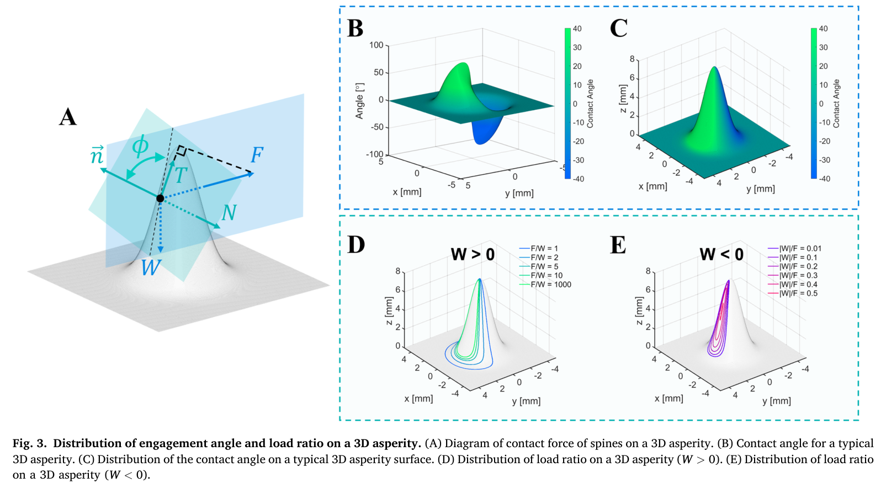
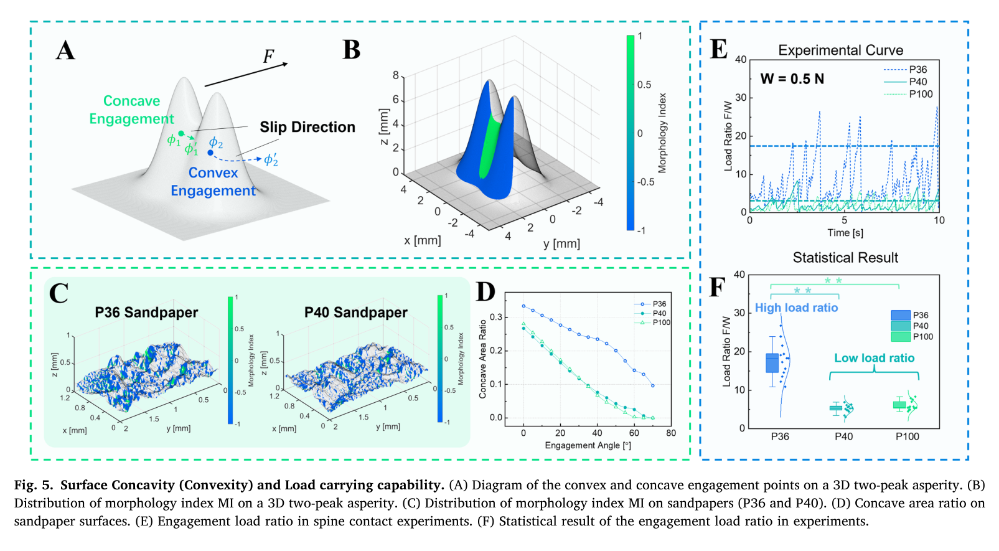
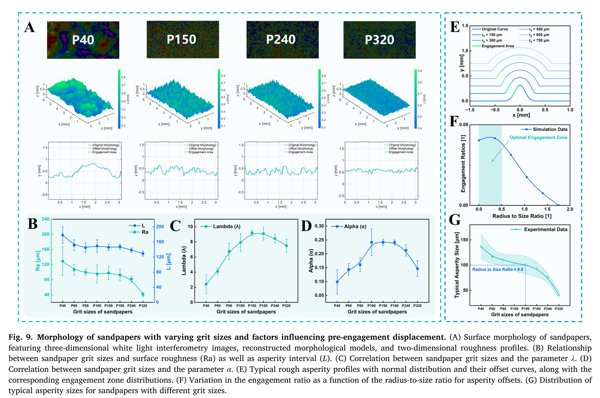

# 论文极简机理证据卡

- 题目：Capability and probability of frictional engagement of spines on rough surfaces
- 作者：Zhonghuan Xiang, Xue Zhou, Wenqing Chen, Xinxin Li, Pengpeng Bai, Yonggang Meng, Liran Ma, Yu Tian
- 年份：2025
- DOI：10.1016/j.triboint.2025.110533
- 论文类型：理论 + 仿真 + 实验
- 研究对象：球形有限半径单刺在三维硬质粗糙表面上的无显著损伤摩擦啮合
- 相关性等级：A
- 相关性说明：直接给出三维几何—摩擦承载判据、预啮合位移概率模型，并用蒙特卡洛与单刺拖曳实验验证。
- 长度说明：论文含“承载能力”和“首次啮合位移概率”两个独立核心模型，并含有限刺尖可达性子模型，故按模板规则放宽至 3500 个中文字符以内。

## 1. 论文实际解决的问题

论文用真实三维形貌回答两件事：给定载荷与摩擦时，表面哪些位置可啮合及能承受多大载荷；随机落点后，单刺需移动多远才首次啮合。输出为接触角/临界角判据、凹凸形貌指标、修正位移分布及实验标定量。

## 2. 核心机理

### M1 三维定向接触角决定局部可啮合性

- 证据类型：[直接证据]
- 机理内容：局部法向与水平运动方向共同确定接触角 $\phi$；满足 $\phi\ge\phi_c$ 的位置才阻止刺尖沿表面继续滑动。该能力随搜索方向改变，不能只由标量粗糙度表示。
- 输入因素：三维单位法向、搜索方向、$F/W$、静摩擦系数 $f_s$。
- 输出或影响：方向相关啮合区域、载荷比地图与自锁区域。
- 成立条件：刚性球形刺尖、准静态库仑静摩擦、无显著穿透或材料损伤。
- 失效或不适用条件：软表面穿刺、冲击、塑性压碎及未建模的真实接触斑。
- 来源：PDF p.4，Section 2.2，Eq. (4)–(5)，Fig. 3。
- 对当前模型的用途：作为三维地形逐点啮合判据和能力热图的直接接口。

### M2 水平自锁区包络竖向拉脱承载区

- 证据类型：[原文结论]
- 机理内容：$W>0$ 时增大 $F/W$ 会提高临界角并最终水平脱附；若局部角度超过 $90^\circ-\tan^{-1}f_s$，在该模型内形成水平摩擦自锁。非凹曲面在 $W<0$ 时无对应的绝对自锁，能承受竖向拉力的位置先须属于水平自锁区。
- 输入因素：载荷正负、拉力、$f_s$、局部 $\phi$。
- 输出或影响：最大载荷比、脱附方式、自锁条件。
- 成立条件：原文符号规定为 $W$ 向下为正、$F$ 沿刺尖前进方向为正。
- 失效或不适用条件：凹陷包络接触、多接触、刺尖/基材破坏。
- 来源：PDF p.3–4，Section 2.1–2.2，Eq. (1)–(5)，Fig. 2–3。
- 对当前模型的用途：建立单刺“滑移—稳定—水平脱附/竖向拉脱”状态判定。

### M3 凹形啮合区比单一粗糙度更能解释承载

- 证据类型：[直接证据]
- 机理内容：扰动后若滑动使接触角增大，接触趋向更稳定；相反则趋向脱附。P36 的凹形啮合区比例与峰值 $F/W$ 均显著高于 P40/P100，而粗糙度差异较大的 P40/P100 承载相近，说明 $S_a/R_a$ 不能单独预测承载。
- 输入因素：滑移方向上的角度演化、临界角、三维形貌。
- 输出或影响：MI 分区、凹形面积比 $S_{concave}/S_{total}$、承载趋势。
- 成立条件：同一运动方向、同一临界角与单刺拖曳工况。
- 失效或不适用条件：原文对 MI 的大小号判定自相矛盾，编码前必须回查或重算，不能直接照录符号规则。
- 来源：PDF p.4–6，Section 2.3，Fig. 5。
- 对当前模型的用途：提供超越高度粗糙度的地形稳定性特征，但 MI 实现暂列“需澄清”。

### M4 预啮合位移是“零位移质量 + 指数尾部”混合分布

- 证据类型：[直接证据]
- 机理内容：在均一啮合区宽度、粗糙峰独立泊松分布假设下，随机落点以概率 $\alpha$ 直接进入啮合区；否则首次啮合距离服从指数尾部。修正式用首个统计区间概率 $p_1$ 和区间宽度 $d$ 修正离散分箱造成的初始条件。
- 输入因素：$\alpha$、$\lambda$、$p_1$、分箱宽度 $d$。
- 输出或影响：单刺首次啮合位移分布；$1/\lambda$ 表示理论平均间距。
- 成立条件：峰位置独立、泊松过程、均一啮合区、给定搜索方向。
- 失效或不适用条件：相关/周期形貌、跳跃越过、小区域承载不足、路径竞争。
- 来源：PDF p.6–8，Section 3.1–3.2，Eq. (6)–(13)，Fig. 6–7。
- 对当前模型的用途：作为单刺随机搜索距离模型；进入阵列前须重新检验刺间独立性。

### M5 有限刺尖半径通过偏置轨迹删除小尺度啮合区

- 证据类型：[直接证据]
- 机理内容：球形刺尖中心沿表面外偏置曲线运动，不能到达原始形貌全部凹部。半径/粗糙峰宽度比不超过约 0.5 时啮合区比例保持较高，继续增大后快速下降，并在比值约 1.6 时趋近零。
- 输入因素：刺尖半径、粗糙峰宽度、$f_s$ 与临界角。
- 输出或影响：可达形貌、啮合区比例、$\alpha$ 与 $\lambda$ 的非单调趋势。
- 成立条件：二维偏置示例、理想正态峰及原文峰宽定义（高度超过峰值 10% 的横向跨度）。
- 失效或不适用条件：不得把比值阈值当作任意三维表面的普适常数。
- 来源：PDF p.7、9–11，Section 3.2、3.4，Fig. 7、9。
- 对当前模型的用途：在形貌预处理时先做有限半径可达性过滤。

### M6 啮合后弹性加载位移决定峰值力

- 证据类型：[归纳]
- 机理内容：搜索位移 $d_1$ 与峰值力 $F$ 无显著相关，而啮合后的弹性加载位移 $d_2$ 与 $F$ 呈强线性相关；作者归因于刺根/试验连接的系统弹性，而不是表面本身。
- 输入因素：连接柔顺、啮合后位移 $d_2$。
- 输出或影响：峰值啮合力。
- 成立条件：高碳钢刺、P40/P100、试验系统处于主要弹性变形范围。
- 失效或不适用条件：斜率含试验系统等效刚度，未做独立标定，不能直接迁移。
- 来源：PDF p.8–9，Section 3.3，Fig. 8(B–C)。
- 对当前模型的用途：提示将搜索位移与啮合后弹性储能分开建模。

## 3. 核心公式

### E1 三维接触角

$$
\phi=\cos^{-1}\!\left(\frac{\mathbf n\cdot\mathbf F}{\lVert\mathbf n\rVert\lVert\mathbf F\rVert}\right)-90^\circ
$$

- 证据类型：定义式；原公式号：Eq. (4)
- 变量与单位：$\mathbf n$ 为局部法向，$\mathbf F$ 为水平运动/拉力方向；$\phi$ 为度。
- 正方向或角度定义：面向运动方向的上升侧为正；论文讨论 $-90^\circ\le\phi\le90^\circ$ 的非凹接触。
- 成立条件与假设：三维表面、给定搜索方向；刺尖/表面视为局部刚性。
- 是否可直接进入当前模型：需要修正；应使用归一化向量并显式处理反余弦数值截断。
- 来源：PDF p.4，Section 2.2。

### E2 摩擦啮合载荷比上限

$$
\frac{F}{W}\le\frac{\tan\phi+f_s}{1-f_s\tan\phi}
=\tan\!\left(\phi+\tan^{-1}f_s\right)
$$

- 证据类型：理论式；原公式号：Eq. (1)
- 变量与单位：$F,W$ 为 N，载荷比与 $f_s$ 无量纲，$\phi$ 为角度。
- 正方向或角度定义：$W>0$ 向下，$F>0$ 沿前进方向。
- 成立条件与假设：$N=F\sin\phi+W\cos\phi$，$T=F\cos\phi-W\sin\phi$，静摩擦 $T\le f_sN$。
- 是否可直接进入当前模型：是，但需单独处理分母趋零、接触法向力非正及 $W\le0$ 分支。
- 来源：PDF p.2–3，Section 2.1。

### E3 三维临界啮合角

$$
\phi_c=
\begin{cases}
\tan^{-1}(F/W)-\tan^{-1}f_s, & W>0,\\
180^\circ-\tan^{-1}(F/|W|)-\tan^{-1}f_s, & W<0.
\end{cases}
$$

- 证据类型：判据；原公式号：Eq. (5)
- 输出含义：局部满足 $\phi\ge\phi_c$ 时判为摩擦啮合。
- 成立条件与假设：同 E2；$W=0$ 取极限而非代入。
- 是否可直接进入当前模型：需要修正；实现时建议用 `atan2` 保持象限并统一角度单位。
- 来源：PDF p.4，Section 2.2。

### E4 首区间约束

$$
\alpha=1-(1-p_1)e^{\lambda d}
$$

- 证据类型：定义/离散分箱修正式；原公式号：Eq. (11)
- 变量与单位：$p_1,\alpha$ 无量纲；$\lambda$ 为 mm$^{-1}$；$d$ 为 mm（此处是分箱宽度）。
- 成立条件与假设：Eq. (10) 的点质量—指数混合模型按宽度 $d$ 分箱。
- 是否可直接进入当前模型：需要修正；必须约束 $0\le\alpha\le1$ 并避免与后文“平均距离 $d=1/\lambda$”的同符号混用。
- 来源：PDF p.7，Section 3.1。

### E5 修正的预啮合位移分布

$$
p(x,\alpha,\lambda)=\alpha\,\delta(x)+(1-p_1)\lambda e^{-\lambda(x-d)}
$$

- 证据类型：概率模型；原公式号：Eq. (12)
- 变量与单位：$x,d$ 为 mm，$\lambda$ 为 mm$^{-1}$，$p$ 为含 $x=0$ 点质量的混合分布。
- 成立条件与假设：泊松粗糙峰、独立区间、均一啮合区，连续尾部对应首区间之后的位移。
- 是否可直接进入当前模型：需要修正；实现时应显式写成离散点质量与条件连续密度，并明确尾部定义域/归一化。
- 来源：PDF p.7，Section 3.1。

## 4. 关键参数表

| 参数 | 符号 | 数值或范围 | 单位 | 材料/工况 | 获得方式 | PDF 来源 | 当前用途 | 注意事项 |
|---|---|---:|---|---|---|---|---|---|
| 静摩擦系数 | $f_s$ | 0.8 | 1 | Fig. 3/7/9 示例 | 仿真假设 | p.4, 7, 10 | 能力图示例 | 非实测材料参数 |
| 刺尖半径 | $r$ | 约 50 | μm | 淬火高碳钢单刺 | 实物/仿真输入 | p.6–7 | 可达性与试验复现 | 未给测量不确定度 |
| 预载 | $W$ | 0.5 | N | P36/P40/P100 拖曳 | 试验设定 | p.6 | 载荷比换算 | 仅单一预载 |
| 拖曳速度 | $v$ | 5 | mm/s | 单刺拖曳 | 试验设定 | p.6 | 准静态验证工况 | 未扫描速度效应 |
| 重复组数 | — | 60 | 组 | Fig. 5(F) | 实验 | p.6 | 承载趋势统计 | 未给完整原始数据 |
| 临界角示例 | $\phi_c$ | 50 | ° | Fig. 5/7 | 仿真设定 | p.5, 7 | 啮合区分割 | 非通用阈值 |
| 蒙特卡洛样本 | $N$ | $10^6$ | 次 | P36/P40/P100 | 仿真 | p.8, Fig. 7 | 概率模型验证 | 依赖实测形貌 |
| 理论 $\lambda$ | $\lambda$ | 2.06 / 2.23 / 3.67 | mm$^{-1}$ | P36/P40/P100 | 蒙特卡洛拟合 | p.7–8 | 理论搜索尺度 | 对应 $1/\lambda=0.485/0.448/0.298$ mm |
| 实验 $\lambda$ | $\lambda$ | 0.296 / 0.493 | mm$^{-1}$ | P40/P100 | 实验拟合 | p.9 | 实际搜索尺度 | 对应 $1/\lambda=3.38/2.03$ mm |
| 有效啮合率 | Rate | 0.1325 / 0.1468 | 1 | P40/P100 | 理论距离/实验距离 | p.9 | 理论候选点折减 | 仅该系列砂纸与工况 |
| 弹性段斜率 | $k$ | 1.0139 / 1.0897 | N/mm | P40/P100 | 线性拟合 | p.9, Fig. 8(C) | 等效刚度参考 | 含试验连接柔顺 |
| 半径—尺度比 | $r/$width | 高能力约 0–0.5；约 1.6 时趋零 | 1 | 理想正态峰 | 数值偏置 | p.10, Fig. 9(F) | 几何筛选 | 阈值需对目标表面复核 |

## 5. 最小实验或仿真证据

### V1 凹形面积与承载趋势一致

- 类型：实验 + 形貌计算
- 关键工况：$W=0.5$ N、$v=5$ mm/s、$r\approx50$ μm；P36/P40/P100；60 组重复。
- 观测量：凹形啮合区比例与峰值 $F/W$。
- 结果：P36 两项均显著较高；P40/P100 两项均相近，支持“凹形比例优于单一粗糙度解释承载”的趋势。
- 来源：PDF p.5–6，Fig. 5(D–F)。

### V2 修正位移模型的蒙特卡洛验证

- 类型：仿真
- 关键工况：三种砂纸实测形貌、$N=10^6$、分箱数 10/50/100、$r\approx50$ μm、$\phi_c=50^\circ$。
- 观测量：预测 $p_0$ 与真实啮合区比例 $p_{0r}$ 的相对误差。
- 结果：各分箱数下修正式误差均低于未修正式，且分箱数增加时两者误差下降。
- 来源：PDF p.7–8，Fig. 7。

### V3 实际搜索距离大于几何候选间距

- 类型：实验/理论对比
- 关键工况：P40/P100 单刺拖曳。
- 观测量：$1/\lambda$。
- 结果：实验为 3.38/2.03 mm，理论候选间距为 0.448/0.298 mm；仅约 13%–15% 的理论候选表现为实际啮合，粒子更密的 P100 仍保持更短搜索距离趋势。
- 来源：PDF p.8–9，Section 3.3。

### V4 啮合后位移—力线性关系

- 类型：实验
- 观测量：$d_2$ 与峰值 $F$。
- 结果：P40/P100 的 $R^2=0.9515/0.9598$，斜率 1.0139/1.0897 N/mm；两拟合差异 6.96%。
- 来源：PDF p.8–9，Fig. 8(B–C)。

### V5 粒度效应非单调

- 类型：仿真
- 关键工况：P40–P320，固定 $r=50$ μm。
- 观测量：$\alpha$、$\lambda$、峰间距及有限半径可达区。
- 结果：随粒度号增加，$\lambda$ 在 P150–P180 附近达峰，$\alpha$ 在 P100–P180 达峰；之后小尺度峰被有限半径过滤，二者下降。
- 来源：PDF p.9–11，Fig. 9。

## 6. 关键图片

- 原图号：Fig. 3；PDF 页码：4；保留原因：同时定义三维受力、方向角和正/负载荷能力区；支撑 E1–E3。

- 原图号：Fig. 5；PDF 页码：6；保留原因：MI、凹形面积比和载荷比实验的最短证据链；支撑 M3/V1。

- 原图号：Fig. 9；PDF 页码：10；保留原因：包含偏置轨迹、半径—尺度比及 $\alpha/\lambda$ 非单调结果；支撑 M5/V5。

## 7. 可迁移关系

- [可直接采用] Eq. (4) 的方向接触角与 $\phi\ge\phi_c$ 的局部几何筛选框架。
- [需要标定] $f_s$、系统等效刚度、$\lambda$、$\alpha$ 和理论候选到实际啮合的折减率。
- [需要重算] 有限刺尖半径的偏置可达形貌；目标红砖应以实测三维表面和实际刺尖半径计算。
- [仅作趋势验证] “粗糙度不单调决定承载”和粒度存在中间最优区。
- [不能直接采用] MI 的原文大小号规则，因同页描述互相矛盾。
- [不能直接采用] 将单刺泊松搜索直接乘算为阵列成功率，因刺间轨迹、载荷共享和候选点竞争均未验证。

## 8. 局限与风险

- 库仑摩擦、刚性几何与准静态假设排除了红砖局部压碎、划伤和断裂。
- 承载实验只有一个预载与一个速度，且砂纸不能代表红砖强度和三维统计。
- MI 定义段先以“角度增大趋稳”解释凹区，随后却写“$\phi'<\phi$ 时 MI=1”，实现符号不可靠。
- p.9 把实验 $\lambda=0.296/0.493$ 写成显著大于理论 $2.23/3.67$；数值实际相反，较大的是 $1/\lambda$。
- Eq. (12) 的连续尾部定义域与归一化需在代码中显式化，且原文重复用 $d$ 表示分箱宽度和 $1/\lambda$。
- p.10 的“约 $r_0=1.6$”应结合 Fig. 9(F) 视为无量纲半径—尺度比约 1.6，而非半径数值。

## 9. 对当前研究的最小贡献

该文可建立“三维形貌/有限刺尖—单刺摩擦稳定—随机搜索距离”的核心子模型，并提供砂纸趋势验证；不能解决红砖损伤、阵列载荷共享、对爪平衡，后续需材料失效和多刺耦合证据补足。
