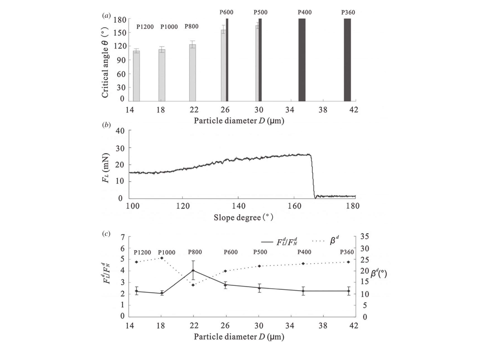
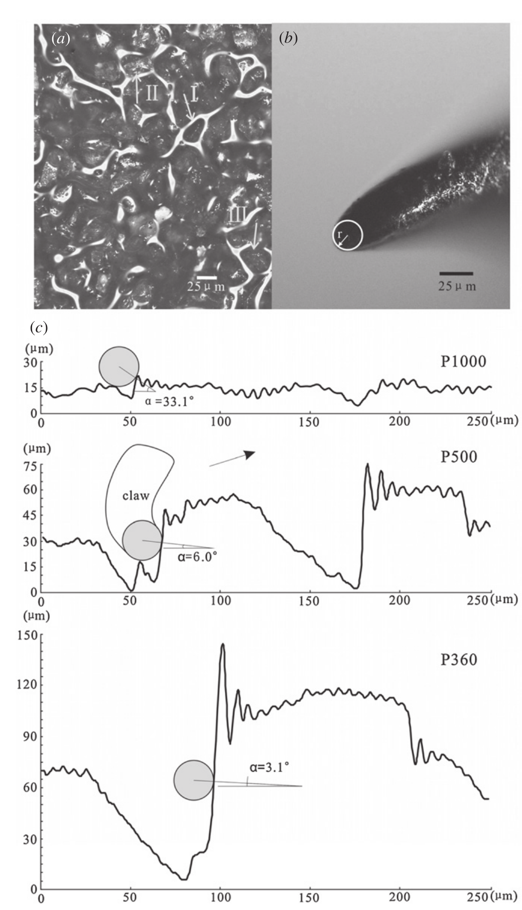
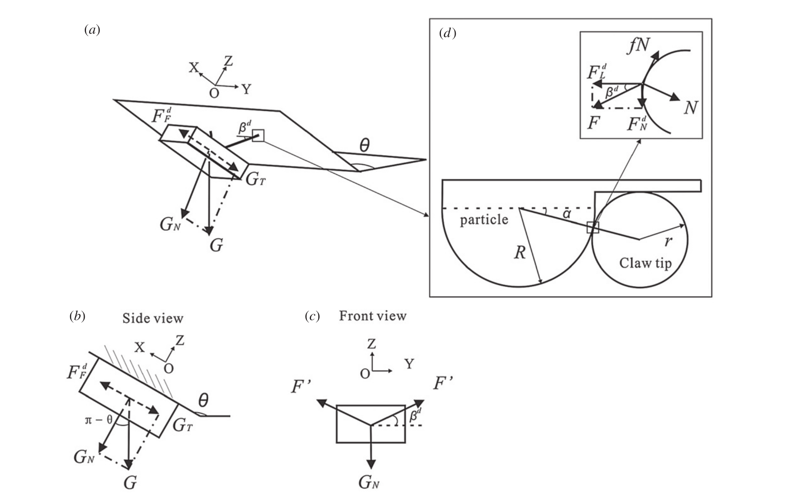

# 论文极简机理证据卡

- 题目：Grip and detachment of locusts on inverted sandpaper substrates
- 作者：Longbao Han, Zhouyi Wang, Aihong Ji, Zhendong Dai
- 年份：2011
- DOI：10.1088/1748-3182/6/4/046005
- 论文类型：理论 + 生物实验 + 表面测量
- 研究对象：蝗虫足端爪尖/柔性足垫在倒置砂纸上的抓持、滑移和脱附
- 相关性等级：A
- 相关性说明：给出爪尖-颗粒相对尺度、局部摩擦平衡和脱附力比模型，并以七级砂纸上的临界角与三向力验证。
- 页码说明：源文件第 1 页是下载封面；下文同时标注文件 PDF 页码和论文正文页码。
- 长度说明：论文同时包含局部爪尖接触模型和六足整体脱附验证，故按模板规则放宽至 3500 个中文字符以内。

## 1. 论文实际解决的问题

论文测量七级砂纸上蝗虫的临界脱附角、三向抓持力、爪尖尺寸和接触姿态，并建立从爪尖/颗粒相对尺度与摩擦系数到脱附力比的模型，用于解释稳定倒挂、滑移及足垫的辅助作用。

## 2. 核心机理

### M1 爪尖-颗粒相对尺度控制互锁可达性

- 证据类型：[直接证据]
- 机理内容：颗粒直径大于爪尖直径时，爪尖更易卡入表面起伏并形成较小接触角；颗粒小于爪尖时，接触角增大、所需切向/法向力比升高，较低斜率即可能滑移。
- 输入因素：爪尖半径 $r$、颗粒半径 $R$、局部接触角 $\alpha$、摩擦系数 $f$。
- 输出或影响：机械互锁能力、临界脱附角、滑移阈值。
- 成立条件：近似球形爪尖和颗粒、硬质砂纸、准静态接触。
- 失效或不适用条件：不规则三维地形不能只用平均粒径表示；局部压碎、穿刺和多点接触未建模。
- 来源：文件 PDF p.6（正文 p.5），Section 3.2/4，Fig. 3；文件 PDF p.9（正文 p.8），Section 4.4。
- 对当前模型的用途：提供有限刺尖与局部地形尺度匹配的几何筛选和脱附趋势。

### M2 局部接触角与摩擦共同给出稳定抓持阈值

- 证据类型：[直接证据]
- 机理内容：滑移起始时，接触点的法向反力与极限静摩擦平衡切向/法向外载。稳定条件要求 $f>\tan\alpha$，且实际 $F_L/F_N$ 不低于 Eq. (6) 给出的临界比；减小 $\alpha$ 或增大 $f$ 会降低所需临界力比。
- 输入因素：$F_L,F_N,\alpha,f$。
- 输出或影响：稳定、临界滑移和脱附判定。
- 成立条件：单个球形接触、库仑静摩擦、给定论文力方向，处于准静态滑移边界。
- 失效或不适用条件：$f\le\tan\alpha$、法向反力非正、足垫承载、冲击或材料破坏。
- 来源：文件 PDF p.8-9（正文 p.7-8），Section 4.4，Eq. (4)-(6)，Fig. 5(d)。
- 对当前模型的用途：可改写为单刺“稳定-滑移-脱附”边界；必须先统一本项目正方向。

### M3 坡度增大触发主动姿态调整和切向增载

- 证据类型：[直接证据]
- 机理内容：接近脱附时，蝗虫外展前/后足、使质心靠近基底，并寻找较大颗粒或更深的抓取位置；P600 上坡度由 $100^\circ$ 增至 $166^\circ$ 时，侧向力由约 15 mN 增至 26 mN 后骤降脱附。
- 输入因素：坡度、腿部姿态、可用表面颗粒。
- 输出或影响：法向保持、侧向承载和临界脱附角。
- 成立条件：活体多足主动调节；至少五足保持接触才计为稳定。
- 失效或不适用条件：不能把主动搜索/姿态控制直接等同于被动工程单刺或阵列。
- 来源：文件 PDF p.3、5-7（正文 p.2、4-6），Sections 2.1, 3.1, 4.1-4.2，Figs. 2(b), 4。
- 对当前模型的用途：仅作搜索方向、载荷路径和脱附过程的生物趋势证据。

### M4 爪负责主要互锁，足垫提供接触稳定性补偿

- 证据类型：[归纳]
- 机理内容：临界坡度附近观察到爪尖和部分柔性足垫同时接触；作者将可靠附着主要归因于爪-颗粒互锁，将足垫视为降低接触刚度、增大接触面积及提供摩擦/黏附的辅助路径。
- 输入因素：粗糙尺度、爪尖几何、足垫柔顺和分泌物。
- 输出或影响：接触稳定性和粗糙度适用窗口。
- 成立条件：蝗虫完整足端；Fig. 4 的接触观察样本为 13 条腿。
- 失效或不适用条件：P1000/P1200 既不利于爪互锁、又不够光滑供足垫稳定黏附，原单爪模型无法解释其全部结果。
- 来源：文件 PDF p.7、9-10（正文 p.6、8-9），Sections 4.2, 4.4, 5，Fig. 4。
- 对当前模型的用途：提示工程模型应把“刺互锁”和“柔顺接触”分支分开，不应把整体数据全部归因于爪尖。

### M5 侧向力是倒挂脱附前的主导分量

- 证据类型：[直接证据]
- 机理内容：七级砂纸脱附时 $F_L^d/F_N^d=2.09$ 至 4.05，对应支撑角约 $25.6^\circ$ 至 $13.9^\circ$；切向力显著高于法向力，说明稳定倒挂依赖沿表面的定向承载。
- 输入因素：表面粒径、坡度、接触角和摩擦。
- 输出或影响：三向力比例、支撑角和脱附模式。
- 成立条件：左右足分别位于两块传感器，取两侧平均，慢速旋转至脱附。
- 失效或不适用条件：力为多足整体反力，不是单根爪刺的独立承载上限。
- 来源：文件 PDF p.4-5（正文 p.3-4），Section 2.2/3.1，Fig. 2，Table 2。
- 对当前模型的用途：作为定向抓附和脱附验证指标，而非单刺参数。

## 3. 核心公式

### E1 脱附合力与支撑角

$$
F=\sqrt{(F_L^d)^2+(F_N^d)^2+(F_F^d)^2},\qquad
\beta^d=\arctan\!\left(\frac{F_N^d}{F_L^d}\right)
$$

- 证据类型：定义式；原公式号：无编号
- 变量与单位：三向力及合力为 mN；$\beta^d$ 为度，定义域 $(-90^\circ,90^\circ)$。
- 正方向：按 Fig. 1(f) 的侧向、法向和前后向传感器坐标。
- 是否可直接进入当前模型：需要修正；建议用 `atan2(F_N,F_L)` 并明确反力/肌力符号。
- 来源：文件 PDF p.4（正文 p.3），Section 2.2。

### E2 爪尖接触点平衡

$$
N=F_L^d\cos\alpha-F_N^d\sin\alpha
$$

$$
fN=F_L^d\sin\alpha+F_N^d\cos\alpha
$$

- 证据类型：理论式；原公式号：Eq. (4)-(5)
- 变量与单位：$N,F_L^d,F_N^d$ 为力；$f$ 无量纲；$\alpha$ 为角度。
- 正方向或角度定义：$\alpha$ 为水平线与“爪尖圆心-接触点”连线夹角，力方向见 Fig. 5(d)。
- 成立条件与假设：滑移边界取最大静摩擦；单一球形爪尖-球形颗粒接触。
- 是否可直接进入当前模型：需要修正；先检查 $N>0$，并转换到项目局部切向/法向坐标。
- 来源：文件 PDF p.9（正文 p.8），Section 4.4。

### E3 临界侧向/法向力比

$$
\frac{F_L^d}{F_N^d}=\frac{f\tan\alpha+1}{f-\tan\alpha}
$$

- 证据类型：判据；原公式号：Eq. (6)
- 输出含义：等号为滑移起始边界；原文说明稳定抓持取 $F_L/F_N\ge$ 右端。
- 成立条件：$f>\tan\alpha$，且采用 E2 的符号、单接触和准静态假设。
- 是否可直接进入当前模型：需要修正；需处理分母趋零、法向反力非正和实际载荷方向分支。
- 来源：文件 PDF p.9（正文 p.8），Section 4.4。

### E4 两个等效支点的整体法向平衡

$$
G_N=G\cos(\pi-\theta),\qquad
F=\frac{G\cos(\pi-\theta)}{2\sin\beta},\qquad
F_N=\frac{G\cos(\pi-\theta)}{2}
$$

- 证据类型：理论式；原公式号：Eq. (1)-(3)
- 变量与单位：$G,G_N,F,F_N$ 为力；$\theta,\beta$ 为角度。
- 成立条件与假设：刚体贴近基底、左右对称、两个等效接触代表六足、忽略力矩和接触不均。
- 是否可直接进入当前模型：否；只能作为整体验证的最简基线。
- 来源：文件 PDF p.8（正文 p.7），Section 4.3，Fig. 5(a-c)。

## 4. 关键参数表

| 参数 | 符号 | 数值或范围 | 单位 | 材料/工况 | 获得方式 | PDF 来源 | 当前用途 | 注意事项 |
|---|---|---:|---|---|---|---|---|---|
| 蝗虫质量 | $m$ | $2.01\pm0.05$ | g | 11 只成虫 | 称量 | p.3 | 整体力平衡 | 非工程参数 |
| 爪尖直径 | $2r$ | $22.0\pm2.8/23.3\pm4.5/26.7\pm4.5$ | $\mu$m | 前/中/后足，各 $n=6$ | 显微测量 | p.6 | 相对尺度参考 | 不是半径 |
| 砂纸平均粒径 | $D$ | 15.3 至 40.5 | $\mu$m | P1200 至 P360 | 厂级/测量 | p.4, Table 1 | 表面尺度扫描 | 不能代表自然三维地形 |
| 砂纸粗糙度 | $R_a$ | 4.7 至 9.5 | $\mu$m | P1200 至 P360 | 轮廓仪 | p.4, Table 1 | 辅助表征 | 原文称“surface profile 的 square root value”，定义不充分 |
| 互锁转变粒径 | $D_c$ | 25.8 至 30.2 | $\mu$m | P600-P500 | 实验归纳 | p.6 | 尺度比趋势 | 仅对应本组爪尖和砂纸 |
| 脱附力比 | $F_L^d/F_N^d$ | 2.09 至 4.05 | 1 | 七级砂纸 | 三向力测量 | p.5, Table 2 | 趋势验证 | 多足整体量 |
| P600 侧向力 | $F_L$ | 约 15 至 26 | mN | 坡度 $100^\circ$ 至 $166^\circ$ | 传感器曲线 | p.5, Fig. 2(b) | 脱附过程验证 | 单条典型曲线 |
| P500 临界角 | $\theta$ | $165.1\pm6.6$ | $^\circ$ | P500，顶面脱附概率 0.5 | 视频 | p.5, Fig. 2(a) | 结果标定 | 活体统计 |
| P600 临界角 | $\theta$ | $155.3\pm9.5$ | $^\circ$ | P600，顶面脱附概率 0.75 | 视频 | p.5, Fig. 2(a) | 结果标定 | 活体统计 |
| P600 模型示例 | $f,\alpha$ | 0.4, $3.4^\circ$ | 1, $^\circ$ | $D=25.8\,\mu$m | 假设/几何 | p.9 | 公式核验 | $f$ 非实测 |

## 5. 最小实验或仿真证据

### V1 相对尺度与倒挂能力

- 类型：实验 + 表面/爪尖测量
- 关键工况：七级 Al$_2$O$_3$ 砂纸；爪尖直径约 22 至 27 $\mu$m。
- 观测量：临界脱附角、顶面脱附概率。
- 结果：转变集中在粒径 25.8 至 30.2 $\mu$m；P360 可稳定到 $180^\circ$，P500/P600 顶面脱附概率分别为 0.5/0.75。
- 支撑的机理或公式：M1。
- 来源：文件 PDF p.5-6（正文 p.4-5），Fig. 2(a), Fig. 3。

### V2 切向力随坡度增大并在脱附时骤降

- 类型：实验
- 关键工况：P600，坡度缓慢增加。
- 观测量：$F_L$。
- 结果：$100^\circ$ 至 $166^\circ$ 约由 15 mN 增至 26 mN，脱附后接近零；七级砂纸脱附力比为 2.09 至 4.05。
- 支撑的机理或公式：M3/M5、E1/E3。
- 来源：文件 PDF p.5（正文 p.4），Fig. 2(b-c)，Table 2。

### V3 局部模型的单点数值对照

- 类型：理论/实验对比
- 关键工况：P600，$D=25.8\,\mu$m，$\alpha=3.4^\circ$，$f=0.4$。
- 观测量：临界侧向力。
- 结果：Eq. (6) 预测 27.21 mN，实验为 26.7 mN。
- 支撑的机理或公式：E2-E3。
- 来源：文件 PDF p.9（正文 p.8），Section 4.4。

### V4 爪尖与足垫共同接触

- 类型：形态观察
- 关键工况：P600，接近临界坡度，13 条腿。
- 观测量：足端接触部位。
- 结果：仅爪尖和部分足垫接触；支持“爪互锁为主、足垫稳定为辅”，也说明整体数据存在足垫混杂。
- 支撑的机理或公式：M4。
- 来源：文件 PDF p.7（正文 p.6），Fig. 4(c-d)。

### V5 模型在细砂纸上的失效

- 类型：模型-实验反例
- 关键工况：P1000/P1200，粒径 18.3/15.3 $\mu$m。
- 观测量：临界角和 $F_L^d/F_N^d$。
- 结果：局部模型不能解释两组结果；作者归因于其重力切向分量假设失效，并推测表面处于“爪难互锁、垫又难黏附”的粗糙度窗口。
- 支撑的机理或公式：E3 的适用边界、NEGATIVE_EVIDENCE。
- 来源：文件 PDF p.9-10（正文 p.8-9），Section 4.4/5。

## 6. 关键图片

- 原图号：Fig. 2；文件 PDF 页码：5（正文 p.4）；保留原因：把表面尺度、临界角、坡度加载曲线和力比分布连成最短实验链；支撑 V1-V2。

- 原图号：Fig. 3；文件 PDF 页码：6（正文 p.5）；保留原因：直接显示有限爪尖与三种尺度表面的几何匹配；支撑 M1。

- 原图号：Fig. 5；文件 PDF 页码：8（正文 p.7）；保留原因：同时定义整体坐标、支撑角和局部 $r/R/\alpha$ 受力；支撑 E2-E4。

## 7. 可迁移关系

- [可直接改写] Eq. (4)-(6) 的局部接触分解与静摩擦滑移边界，但须转换坐标并检查 $N>0$、$f>\tan\alpha$。
- [需要重算] 以实际刺尖曲率和红砖局部可达特征计算 $\alpha$；平均砂粒直径不能替代三维地形。
- [需要标定] 目标材料的摩擦系数、局部特征尺度和脱附力比。
- [仅作趋势验证] 刺尖小于可抓取特征时互锁增强，且接近脱附时切向载荷占主导。
- [不能直接采用] 25.8 至 30.2 $\mu$m 的粒径阈值、活体力值和顶面脱附概率。
- [不能直接采用] “两个等效接触代表六足”的整体模型或把完整足端数据全部归因于爪尖。

## 8. 局限与风险

- 实验测得的是主动调节的多足整体反力，不是隔离单刺的力-位移曲线。
- 局部模型假设球形爪尖、等尺寸球形颗粒和单接触，忽略真实形貌、足垫、材料损伤和接触柔顺。
- Eq. (6) 仅在 $f>\tan\alpha$ 且法向反力为正时有稳定阈值意义。
- Fig. 3 的典型 $\alpha$ 与 p.8 的模型示例并非一一对应，不能把平均粒径映射为唯一接触角。
- P1000/P1200 结果不被模型解释，足垫作用也未通过消融实验在本文中独立定量。
- Fig. 2 标注 $n=112,N=11$，但方法写 11 只蝗虫、七次重复，计数关系和 Table 2 相邻 t 检验映射未说明。

## 9. 对当前研究的最小贡献

该文补足“有限刺尖/地形尺度-局部摩擦阈值-滑移脱附-整体力比”的生物证据链；可服务单刺脱附判据和趋势验证，不能解决红砖损伤、被动阵列载荷共享及对爪平衡。
