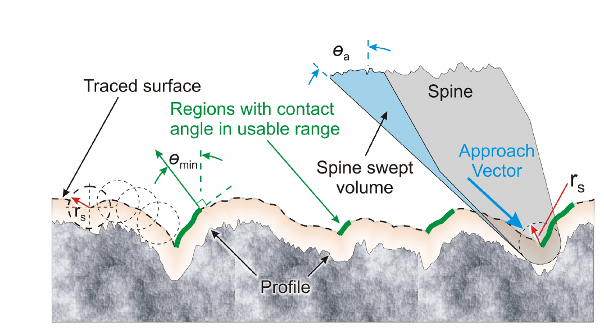
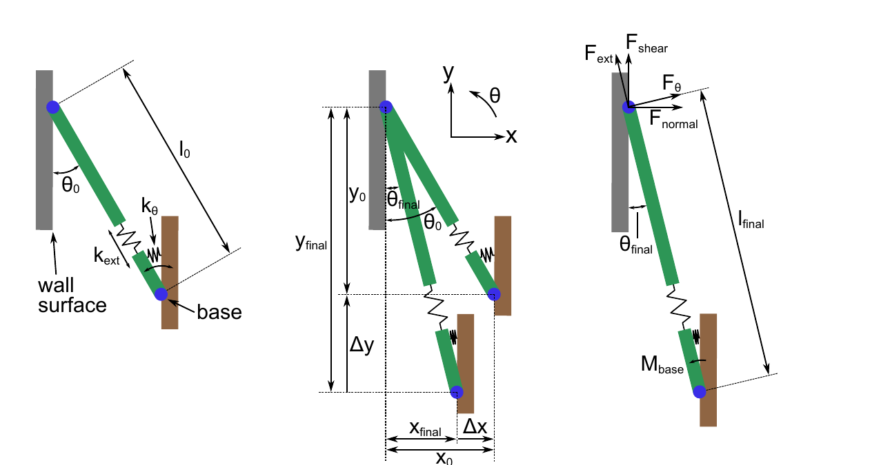
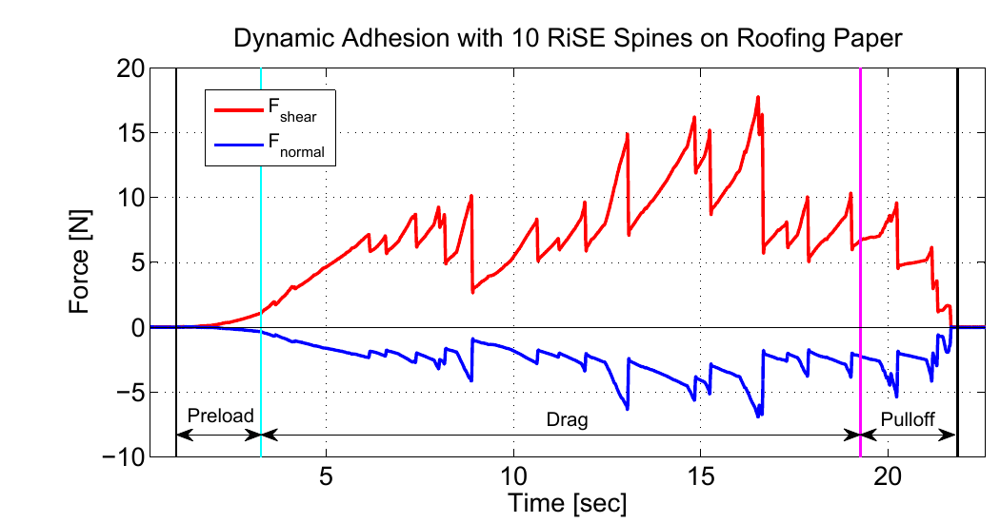

# 论文极简机理证据卡

- 题目：Compliant directional suspensions for climbing with spines and adhesives
- 作者：Alan T. Asbeck
- 年份：2010
- DOI：无（Stanford University 博士论文）
- 论文类型：理论 + 数值仿真 + 实验 + 机构设计
- 研究对象：有限半径微刺的搜索/挂接、方向承载、悬架均载、再挂接及附着补丁力矩平衡
- 相关性等级：A
- 相关性说明：贯通表面几何、单接触极限、悬架状态、多刺均载和动态再挂接，并有实物证据。
- 长度说明：含五类独立模型，按模板放宽至 3500 个中文字符以内。

## 1. 论文实际解决的问题

论文建立从粗糙轮廓挂接、单接触承载到悬架多状态均载/再挂接的模型，并讨论附着补丁的偏载力矩稳定性。

## 2. 核心机理

### M1 有限刺尖扫掠体把原轮廓变为可达接触轨迹

- 证据类型：[直接证据]
- 机理内容：半径 (r_s) 的圆形刺尖按接近角 (\theta_a) 扫掠轮廓；刺尖圆心沿 traced surface 运动，仅局部法向角达到 (\theta_{min}) 的连续“台阶区”可停止准静态下滑。
- 输入因素：二维轮廓、(r_s,\theta_a,mu,\theta_{load})。
- 输出或影响：可用凸体位置、单位长度凸体数及凸体间距分布。
- 成立条件：二维剖面、准静态下滑、刚性几何；未计跳跃、侧滑和材料破坏。
- 失效或不适用条件：三维侧向滑脱、仪器低通滤波、深凹/反入角及动态弹跳。
- 来源：PDF p.26-34（论文页 11-19），Section 2.2，Eq. (2.1)-(2.3)，Fig. 2.2-2.6。
- 对当前模型的用途：用作三维有限半径过滤的二维前身和搜索距离先验。

### M2 单接触安全域由加载角、摩擦和强度上限共同截断

- 证据类型：[直接证据]
- 机理内容：局部几何/摩擦给出最大离壁加载角 (\theta_{max})，刺体弯曲、转角滑脱或凸体脱落给出幅值上限 (F^*)；二者形成方向性安全域。
- 输入因素：局部法向、(mu,\theta_{load})、刺/凸体尺度与强度。
- 输出或影响：保持接触、角度滑脱、刺体失效或基材凸体失效。
- 成立条件：单刺-单凸体、平面受力、接触可近似为刺尖铰支。
- 失效或不适用条件：多点接触、三维摩擦锥、红砖压碎/断裂参数未标定。
- 来源：PDF p.38-45、143-145（论文页 23-30、128-130），Section 2.3-2.4，Eq. (2.4)，Appendix A.1。
- 对当前模型的用途：作为单刺局部承载域；Hertz 式有量纲疑点，仅保留 (F^*\propto r^2) 趋势。

### M3 悬架必须随状态改变等效刚度

- 证据类型：[原文结论]
- 机理内容：未挂接时法向刚度既要小到允许跨高度贴合，又要大/轻到使跳离刺尖及时回壁；承载时要求非线性耦合刚度形成近径向加载线；再挂接时 (k_{xy}<0) 使基座在正剪切载荷下靠墙；脱附时需限制刺体转动并把力平滑降至零。
- 输入因素：刚度矩阵 (K)、质量、行程、预载、基座轨迹。
- 输出或影响：贴合刺数、加载方向一致性、回壁时间、再挂接与脱附扰动。
- 成立条件：各刺仅经刚性基座耦合、悬架本身独立、瞬时保守刚度矩阵对称。
- 失效或不适用条件：背板/腿部柔度不可忽略时须串联合成；原文 (k_{xy}) 再挂接近似式漏写负号。
- 来源：PDF p.46-74（论文页 31-59），Section 3.1-3.9，Table 3.1。
- 对当前模型的用途：定义“未挂接-承载-再挂接-脱附”状态及每态悬架约束。

### M4 近径向、先硬后软的加载线抑制载荷集中与级联脱附

- 证据类型：[直接证据]
- 机理内容：同组刺在同一基座位姿下处于同一加载线；理想加载线从力空间原点径向发散，使各刺加载方向平行。加载线向剪切轴轻微上弯时，增大离壁载荷先淘汰低载刺；若下弯则最重载刺先脱落，载荷转移可能触发级联失效。伸向刚度快速上升后趋缓可降低最大/平均载荷比。
- 输入因素：(k_{xx},k_{yy},k_{xy})、非线性伸向力律、接触位置离散。
- 输出或影响：最大单刺力、载荷角离散、阵列极限曲线折减及级联风险。
- 成立条件：接触点法向高度差小于沿搜索方向间距，单刺极限域形式相近。
- 失效或不适用条件：接触强度、最大加载角高度离散及三维背板转动会改变顺序。
- 来源：PDF p.58-65、88-107（论文页 43-50、73-92），Section 3.5.1、4.3-4.5，Eq. (4.1)，Fig. 3.7-3.11、4.20-4.24。
- 对当前模型的用途：作为阵列均载目标函数与渐进失效判据。

### M5 失效后回壁再挂接使阵列保持动态附着

- 证据类型：[直接证据]
- 机理内容：某刺滑脱后载荷转给其余刺；足够回弹预载使其回墙并重新挂接。各刺交替脱落/再挂接，可在总滑移远大于单刺行程时保持非零附着。
- 输入因素：(k_{xy}<0)、(k_{xx})、回弹预载、搜索速度、凸体间距和剩余接触数。
- 输出或影响：再挂接时间、载荷重分配、连续滑移下的最小总承载。
- 成立条件：至少部分刺持续承载且卸载刺能重新接触表面。
- 失效或不适用条件：基座离墙过远、回弹预载不足或剩余刺在重分配中同步超限。
- 来源：PDF p.71-72、95-98、108-113（论文页 56-57、80-83、93-98），Section 3.6、4.3.2、4.6-4.7，Fig. 3.14、4.17、4.26-4.28。
- 对当前模型的用途：为阵列局部失效后的“卸载-回位-再搜索-再承载”转移提供直接证据。

### M6 大面积补丁的偏载力矩会放大局部脱附

- 证据类型：[归纳]
- 机理内容：非均匀法向力等效为偏心合力 (F_{n,patch})；单元层差动伸长、球铰扭簧与支点偏置抵抗力矩。边缘先超限会使剩余单元增载并增大偏心，形成剥离正反馈。
- 输入因素：补丁宽度 (w_z)、单元层线刚度 (kappa)、球铰刚度 (k_\psi)、偏心 (d_z)、支点距 (x_j)。
- 输出或影响：补丁转角、边缘峰值载荷和整体脱附。
- 成立条件：刚性背板、平面表面、小转角、线性连续单元层；本章主要以干式黏附补丁推导。
- 失效或不适用条件：离散微刺、非线性刚度、粗糙墙面和柔性背板需重建。
- 来源：PDF p.123-140（论文页 108-125），Section 5.1-5.4，Eq. (5.3)-(5.12)。
- 对当前模型的用途：仅作为多排单爪/整体背板力矩耦合模板，不是对爪模型。

## 3. 核心公式

### E1 几何-摩擦可挂接角

$$
\theta_{max}=\theta_{min}-\arctan(1/\mu),\qquad
\theta_{load}\le\theta_{max}.
$$

- 证据类型：几何/摩擦判据；原公式号：Eq. (2.1)-(2.2)
- 变量与单位：各角为度或弧度但须统一；(mu) 无量纲。
- 成立条件：二维 traced surface、准静态滑动、库仑摩擦。
- 是否可直接进入当前模型：需要修正；三维实现应改为局部法向-加载向量和摩擦锥判据。
- 来源：PDF p.28（论文页 13）。

### E2 可用凸体间距分布

$$
f_X(x;k,\vartheta)=\frac{x^{k-1}e^{-x/\vartheta}}{\Gamma(k)\vartheta^k},\quad x\ge0,
\qquad E[X]=k\vartheta,\quad \mathrm{Var}[X]=k\vartheta^2.
$$

- 证据类型：经验分布；原公式号：Eq. (2.3)
- 变量与单位：(x,\vartheta) 为长度，(k) 无量纲；此处用 (\vartheta) 避免与角度符号混淆。
- 成立条件：论文测得二维剖面和指定 (r_s,\theta_{min},\theta_a)。
- 是否可直接进入当前模型：需要标定；红砖三维搜索路径须重新拟合并检验相关性。
- 来源：PDF p.33-35（论文页 18-20）。

### E3 单接触力空间安全域

$$
\frac{F_{normal}}{F_{shear}}\le\tan\theta_{max},\qquad
\sqrt{F_{normal}^2+F_{shear}^2}=|F_{load}|\le F^*.
$$

- 证据类型：判据；原公式号：Eq. (2.4)
- 正方向：(F_{shear}) 沿首选承载方向；(F_{normal}) 离壁为附着方向，反向刮擦另受 (1/\mu) 边界。
- 成立条件：平面单接触，(F^*) 把刺弯曲、转角滑脱和凸体破坏合并为平均幅值上限。
- 是否可直接进入当前模型：可作初始安全域，但须把各失效机制拆分并标定。
- 来源：PDF p.41-45（论文页 26-30）。

### E4 贴合、搜索与回壁约束

$$
\Delta x_{max}\ge h,\qquad \Delta y_{max}\ge\lambda,
$$

$$
f_n=\frac{1}{2\pi}\sqrt{\frac{k_{xx}}{m}},\quad
\tau\lesssim\frac{1}{2f_n},\quad |v_y|\tau<\lambda,
$$

$$
k_{xx}\le\frac{2F_{x,max}}{\Delta x_{max}},\qquad
k_{xy}<0,\quad |k_{xy}|\approx\frac{F^*}{\Delta x_{max}}.
$$

- 证据类型：设计约束；原公式号：未编号。
- 变量与单位：行程/间距为 m，刚度为 N/m，质量 kg，频率 Hz。
- 关键假设：约一半刺位于高凸体、另一半进入深凹；回接触按半个固有周期估计。
- 是否可直接进入当前模型：需要修正；原文 (k_{xy}\approx F^*/\Delta x_{max}) 漏负号，以上按正文与 Table 3.1 写成“负号+幅值”。
- 来源：PDF p.49、57-58、71-73（论文页 34、42-43、56-58）。

### E5 理想径向均载条件

$$
K=\frac{\partial\mathbf F}{\partial\mathbf X}=K^T,\qquad
\frac{k_{xy}}{k_{yy}}=\tan\theta_{const}.
$$

- 证据类型：理论式；原公式号：未编号。
- 输出含义：给定基座法向位置时，沿墙位移使各刺力矢量保持同一角度；(K) 可随构型非线性变化。
- 成立条件：保守悬架、(dx=0)、刺间仅经刚性基座耦合。
- 是否可直接进入当前模型：是，作为局部目标约束；真实机构不可能达到零刚度的理想边界。
- 来源：PDF p.47、62-65（论文页 32、47-50）。

### E6 Stalk 悬架模型

$$
\begin{aligned}
l_f&=\sqrt{(x_0+\Delta x)^2+(y_0-\Delta y)^2},\\
\theta_f&=\arctan\!\frac{x_0+\Delta x}{y_0-\Delta y},\\
M_b&=k_\theta(\theta_0+\theta_{preload}-\theta_f),\\
F_{ext}&=k_{ext}(l_f-l_0),\qquad F_\theta=M_b/l_f,\\
F_{shear}&=F_{ext}\cos\theta_f+F_\theta\sin\theta_f,\\
F_{normal}&=-F_{ext}\sin\theta_f+F_\theta\cos\theta_f.
\end{aligned}
$$

- 证据类型：解析机构模型；原公式号：未编号。
- 单位：长度 m，角度 rad，(k_{ext}) N/m，(k_\theta) N·m/rad，力 N。
- 是否可直接进入当前模型：是；数值实现应以 `atan2` 保持象限并加入行程/过载止挡、滞回和非线性伸向力律。
- 来源：PDF p.84-87（论文页 69-72），Fig. 4.5-4.7。

### E7 阵列均载评价

$$
L=\frac{\max_{i\in\mathcal A}|\mathbf F_i|}{|\mathcal A|^{-1}\sum_{i\in\mathcal A}|\mathbf F_i|},\qquad
\Delta\theta=\theta_{max}-\theta_{nonideal}.
$$

- 证据类型：定义式；原公式号：(L) 为 Eq. (4.1)，角度折减未编号。
- 输出含义：(L=1) 为幅值均载；(\Delta\theta) 表示悬架非理想导致的群体安全域角度损失。
- 是否可直接进入当前模型：是，适合作为参数扫描输出；只统计当前挂接集合 (mathcal A)。
- 来源：PDF p.101-105（论文页 86-90）。

### E8 补丁偏载静力平衡

$$
(d_z-\Delta\psi x_j)F_{n,patch}
=k_\psi\Delta\psi+\frac{w_z^3\kappa\Delta\psi}{12},
$$

$$
\frac{\kappa\Delta\psi w_z}{2}+\frac{F_{n,patch}}{w_z}\le\gamma_{max}.
$$

- 证据类型：理论式；原公式号：Eq. (5.9)、(5.11)
- 单位：(d_z,x_j,w_z) 为 m，(Delta\psi) rad，(k_\psi) N·m/rad，(kappa) 为单位宽度线性刚度，(gamma) N/m。
- 成立条件：刚性背板、连续线性单元层、小转角、平面表面。
- 是否可直接进入当前模型：需要改写；对离散多排微刺应直接求和各刺力矩，且需加入粗糙面高度差。
- 来源：PDF p.129-134（论文页 114-119）。

## 4. 关键参数表

| 参数 | 数值或范围 | 单位 | 工况/获得方式 | PDF 来源 | 当前用途 | 注意事项 |
|---|---:|---|---|---|---|---|
| 触针轮廓仪尖端 | 2（15°锥） | μm | 石材/砂纸二维轮廓 | p.26 | 形貌测量分辨率参考 | 会漏掉反入角 |
| 轮廓仪采样/竖向分辨率 | 1 / 0.426 | μm | 5 cm 剖面 | p.26 | 网格尺度参考 | 二维数据 |
| 激光点径/采样/竖向分辨率 | 64 / 2.4 / 0.977 | μm | 粗混凝土 | p.26 | 粗表面测量参考 | 64 μm 点径导致低通 |
| 钢刺-岩石摩擦系数 | 0.15-0.25 | 1 | SpinybotII 经验 | p.35 | 角度判据量级 | 红砖需实测 |
| 加载角 / 对应 (\theta_{min}) | 3.5-8 / 81-86.5 | ° | SpinybotII | p.34-35 | 角度范围参考 | 坐标定义需统一 |
| 接近角 | 45-65 | ° | SpinybotII | p.35 | 搜索轨迹参考 | 80°时凸体数明显下降 |
| 刺尖半径 | 10-25（常用）；25-53（磨钝） | μm | SpinybotII/RiSE/显微图 | p.35, 41, 77, 82 | 尺度与磨损扫描 | 不同段落对应不同样件 |
| 单接触最大力 | 1-2 | N | SpinybotII | p.41 | (F^*) 初始量级 | 表面/刺特定 |
| 实际挂接比例 | 30-40 | % | 可攀表面上的 SpinybotII | p.41 | 有效刺数验证 | 非红砖统计 |
| RiSE 伸向/法向刚度 | 184 / 16 | N/m | 实物简化模型 | p.79 | 悬架量级 | Table 4.1 的 184 单位漏“/” |
| RiSE 阻尼 | 0.42 | N·s/m | 实物简化模型 | p.79 | 动态扩展参考 | stalk 静态式未显式使用 |
| stalk 参数 | (l_0=3.0) cm, (k_\theta=0.0025) N·m/rad, (\theta_0=30°), (\theta_{preload}=3°) | — | 拟合 RiSE toe | p.85 | 模型复现 | (k_{ext}=184) N/m 依 Fig. 4.2/量纲解释 |
| 法向/伸向工作行程 | 8 / 约10-11 | mm | RiSE toe/过载止挡 | p.43, 83, 108 | 行程饱和判据 | 止挡后力律改变 |
| 10 刺预载 | 约0.04（斜向）或0.2（法向） | N | tarpaper 台架 | p.109 | 低预载趋势 | 依路径与摩擦 |
| 动态附着试验 | 4 mm 预载、4 cm 拖曳、最低附着1/剪切2.5 | mm, cm, N | 10 RiSE 刺 | p.112 | 再挂接验证 | 单刺行程约1 cm；tarpaper |

## 5. 最小实验或仿真证据

### V1 形貌模型与机器人可攀性排序一致

- 类型：二维形貌仿真 + 机器人观察
- 关键工况：(r_s=10-40\,\mu m,\theta_{min}=82°-85°,\theta_a=45°/65°)。
- 结果：仿真单位长度可用凸体数对砂纸、混凝土和花岗岩的排序与 SpinybotII 实际附着难易大体一致；激光点径和高角度测量不足造成低估。
- 支撑内容：M1/E1-E2；来源：PDF p.35-38（论文页 20-23）。

### V2 强化凸体只提高幅值，不明显改变角度边界

- 类型：实验
- 关键工况：10 刺、tarpaper；对比原表面与薄层氰基丙烯酸加固表面。
- 结果：加固后最大力提高，而失效点仍落在相近角度范围，支持把几何/摩擦角限制与材料强度幅值 (F^*) 分开。
- 支撑内容：M2/E3；来源：PDF p.43-45，Fig. 2.10-2.11。

### V3 stalk 模型复现实物加载线

- 类型：实验-模型对比
- 关键工况：10 个 RiSE toes、多个预载深度、刚性挂杆。
- 结果：剪切/法向力时间历程总体吻合；主要差异来自实物滞回及试验中刺尖可退滑而模型采用铰接固定。
- 支撑内容：M3/E6；来源：PDF p.85-87，Fig. 4.6-4.7。

### V4 非线性伸向刚度改善均载

- 类型：仿真
- 关键工况：5 刺依次挂接 5 个间距 1.25 mm 的凸体；线性与平方根型伸向力律对比。
- 结果：第二刺刚接触时 (L=2)；快速上升后趋缓的非线性力律在中等伸长下显著降低最大/平均载荷比。
- 支撑内容：M4/E7；来源：PDF p.105-107，Fig. 4.23-4.24。

### V5 交替脱落/再挂接维持动态附着

- 类型：实验
- 关键工况：10 刺、4 mm 预载、恒定离墙高度拖曳 4 cm；单刺伸向行程约1 cm。
- 结果：多次刺脱落和再挂接期间总附着不归零，该次试验最低约1 N附着/2.5 N剪切；6 cm 的4次试验也未完全归零，通常2-5刺挂接。
- 支撑内容：M5/E4；来源：PDF p.112-113，Fig. 4.27-4.28。

## 6. 关键图片

- 原图号：Fig. 2.2；PDF 页码：28（论文页 13）；保留原因：定义 (r_s,\theta_a,\theta_{min})、traced surface 与可用区；支撑 M1/E1。

- 原图号：Fig. 4.5；PDF 页码：84（论文页 69）；保留原因：不可由短文字替代的位移、角度、弹簧与力分解关系；支撑 M3/E6。

- 原图号：Fig. 4.27；PDF 页码：112（论文页 97）；保留原因：直接展示交替失效/再挂接时总力保持非零；支撑 M5/V5。

## 7. 可迁移关系

- [可直接采用] 单接触“方向角边界 + 幅值上限”的安全域结构、四状态悬架框架、stalk 几何力学与 (L) 均载指标。
- [需要三维化] 二维 traced surface、法向角和凸体间距模型；目标求解器须使用三维局部法向、侧向滑移与有限球尖偏置。
- [需要标定] 红砖的 (mu,F^*)、凸体间距分布、有效挂接比例、损伤模式和悬架滞回。
- [仅作趋势验证] 小刺提高候选凸体密度、近径向/先硬后软力律改善均载、交替再挂接提高连续滑移鲁棒性。
- [不能直接采用] 附录 Hertz 破坏精确系数、原文 (R_q) 公式、(k_{xy}) 无符号近似式及写反的角度区间。
- [不能直接采用] Chapter 5 的连续干式黏附补丁公式作为离散多排微刺或对爪平衡方程。

## 8. 局限与风险

- 核心形貌算法是单方向二维剖面；作者明确指出三维侧滑会使实际凸体数更少。
- 形貌仪器无法测反入角，64 μm 激光点径和触针锥角会漏掉高坡度/小尺度凸体。
- 大部分定量结果来自砂纸、tarpaper、石材和混凝土；未提供烧结红砖局部损伤参数。
- 再挂接段正文要求 (k_{xy}<0)，却写 (k_{xy}\approx F^*/\Delta x_{max})；实现应保留负号并重新推导坐标。
- PDF p.70（论文页55）写出不可能的 (50°<\theta_{max}<20°)，只能保留“中间角区”定性结论。
- Table 4.1 把 (k_{ext}) 单位印为 N·m；依定义、Fig. 4.2 与量纲应为 N/m。
- Appendix A.1 的 Hertz 等效模量写法/系数存在量纲疑点，不能用于红砖破坏阈值；仅保留 (F_{max}\propto R^2) 尺度论断。
- Appendix A.3 的 (R_q) 式漏写 (1/N)，不得按原式实现。
- Chapter 5 主要推导干式黏附连续补丁，且假设刚性背板、平面表面、小转角和线性单元层。

## 9. 对当前研究的最小贡献

论文提供“二维可达性-单接触极限-非线性悬架-阵列均载/再挂接”主干及动态附着证据；红砖三维形貌、材料损伤和对爪平衡仍待其他文献补足。
