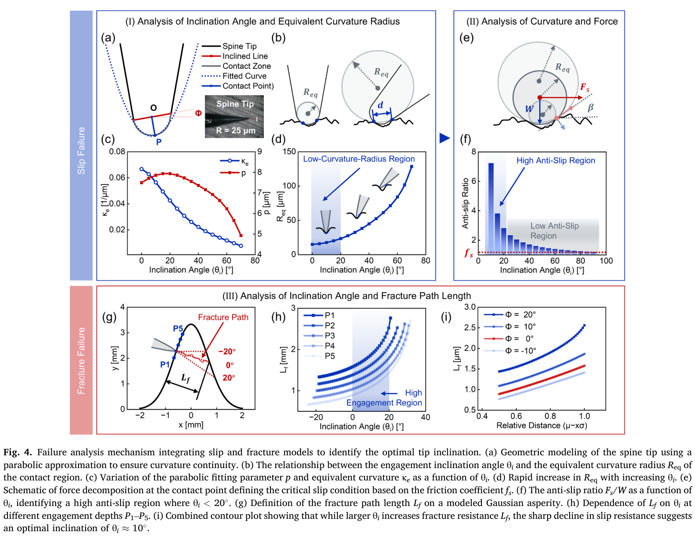
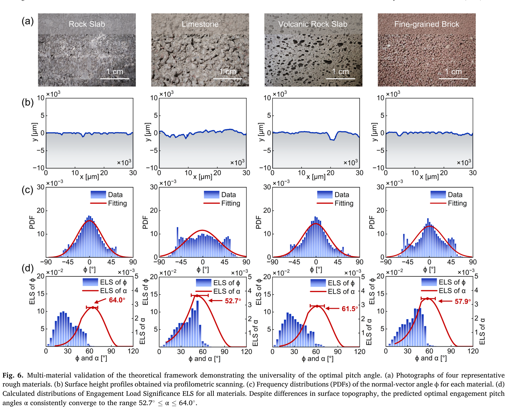
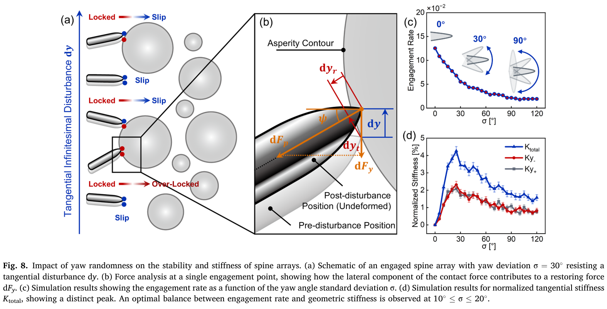

# 论文极简机理证据卡

## 1. 基本信息

- 题目：Orientation-dependent bio-inspired spine engagement mechanics
- 作者：Zhonghuan Xiang, Xue Zhou, Wenqing Chen, Peng Wei, Zhaoyang Sun, Hui Zhao, Hui Cao, Pengpeng Bai, Yonggang Meng, Liran Ma, Yu Tian
- 年份：2026
- DOI：10.1016/j.ijmecsci.2026.111532
- 论文类型：理论 + 单刺实验 + 蒙特卡洛仿真
- 研究对象：粗糙表面上爪刺俯仰角与阵列偏航角对啮合、滑移和扰动刚度的影响
- 相关性等级：A
- 相关性说明：直接给出单刺俯仰角预测、偏航啮合判据与阵列横向刚度公式，并含砂纸实验和细粒砖形貌预测。

## 2. 论文实际解决的问题

论文把爪刺姿态拆成俯仰角 $\alpha$ 与偏航角 $\psi$：以尖端曲率、滑移和表面断裂路径解释单刺最优俯仰角，再用表面坡度概率与啮合强度预测不同材料的 $\alpha$；另以蒙特卡洛量化偏航离散度对阵列啮合率和微扰刚度的权衡。

## 3. 核心机理

### M1 单刺啮合力对俯仰角呈单峰响应

- 证据类型：[直接证据]
- 机理内容：P60 砂纸往复拖曳中，切向啮合力 $F_e$ 在 $\alpha\approx60^\circ$ 达峰；偏离该角度后下降，且钝角侧下降更快。
- 输入因素：俯仰角、P60 形貌、法向载荷、刺尖几何。
- 输出或影响：峰值啮合力及方向不对称性。
- 成立条件：高碳钢鱼钩、$W=0.1$ N、准静态拖曳、轻载无可见尖端磨损。
- 失效或不适用条件：高载导致基底塑性/磨损，或表面尺度与刺尖不相称。
- 来源：PDF p.3–5，Section 2.1–2.2，Fig. 2–3。
- 对当前模型的用途：作为俯仰角扫描的直接实验趋势与标定目标。

### M2 尖端倾斜造成抗滑与断裂路径相反变化

- 证据类型：[归纳]
- 机理内容：尖端相对竖直接触位置的倾角 $\theta_i$ 增大时，抛物线等效曲率半径 $R_{eq}$ 快速增大，嵌入变浅并降低抗滑比；同时几何断裂路径 $L_f$ 增长。作者据此把 $0^\circ$–$20^\circ$ 视为折中区，并在后续取 $10^\circ$。
- 输入因素：刺尖半径/锥角、$\theta_i$、接触切线角 $\beta$、摩擦系数、啮合深度。
- 输出或影响：抗滑上限、断裂路径代理量和推荐倾角。
- 成立条件：25 μm 球冠与 20° 锥面用抛物线近似；断裂以高斯凸体上的路径长度代理。
- 失效或不适用条件：$L_f$ 不是含材料强度或断裂能的破坏载荷判据，且 Fig. 4(h)/(i) 单位不一致。
- 来源：PDF p.5–6，Section 2.3，Eq. (1)–(2)，Fig. 4。
- 对当前模型的用途：提供姿态—曲率—滑移分支；材料破坏上限必须另建。

### M3 ELS 把坡度出现概率与单点互锁质量合成

- 证据类型：[直接证据]
- 机理内容：局部法向角 $\phi$ 先经 $\kappa$ 和有界指标 EI 表示互锁质量，再以 $ELS=PDF(\phi)EI^p$ 与坡度出现概率加权；ELS 峰值经几何关系映射为最优 $\alpha$。
- 输入因素：$PDF(\phi)$、$f_s$、指数 $p$、$\theta_{i,optimal}$。
- 输出或影响：表面特定的贡献角与推荐俯仰角。
- 成立条件：剖面坡度分布近高斯、刚体轻载、摩擦—几何互锁主导；本文取 $p=2$。
- 失效或不适用条件：非高斯周期面、强方向性三维形貌、损伤主导接触；ELS 是作者构造的评价指标而非载荷守恒式。
- 来源：PDF p.6–7，Section 2.4，Eq. (3)–(6)，Fig. 5。
- 对当前模型的用途：从目标表面坡度统计反求安装角，并作为形貌能力图的加权指标。

### M4 多材料形貌给出约 60° 的预测带

- 证据类型：[直接证据]
- 机理内容：岩板、石灰岩、火山岩板和细粒砖的坡度分布代入 ELS 后，预测 $\alpha=64.0^\circ/52.7^\circ/61.5^\circ/57.9^\circ$，均落在 $52.7^\circ$–$64.0^\circ$。
- 输入因素：各材料轮廓测量及 $PDF(\phi)$。
- 输出或影响：材料特定最优俯仰角。
- 成立条件：坡度高斯拟合可代表决定峰值的中心位置与有效宽度。
- 失效或不适用条件：这是形貌驱动的计算预测，不是四种材料上的力—角实验验证。
- 来源：PDF p.7–8，Section 2.5–2.6，Fig. 6。
- 对当前模型的用途：给细粒砖初始角度 57.9°，最终仍须用目标红砖实测形貌和承载实验重算/验证。

### M5 偏航角通过摩擦角窗口控制阵列命中率

- 证据类型：[直接证据]
- 机理内容：单点需同时满足刺方向与面内法向投影对齐、以及坡面朝向足够陡两项条件。零均值偏航标准差 $\sigma$ 增大使更多刺离开窗口，阵列啮合率单调下降。
- 输入因素：$\psi$、$\phi_{xy}$、$\phi_s=\arctan f_s$、偏航分布标准差 $\sigma$。
- 输出或影响：单点 locked/slip 状态和阵列啮合率。
- 成立条件：各向同性高斯凸体面、简化面内摩擦锥投影、随机接触抽样。
- 失效或不适用条件：未包含搜索轨迹、候选点竞争、背板不匹配、载荷共享和角度周期处理。
- 来源：PDF p.8–10，Section 3.1，Eq. (7)，Fig. 7–8(c)。
- 对当前模型的用途：作为方向相关候选点过滤器和偏航排布参数扫描判据。

### M6 小偏航离散可牺牲命中率换取横向刚度

- 证据类型：[直接证据]
- 机理内容：微小横向扰动沿部分偏航刺轴线产生压缩，方向相容的已啮合刺变为 over-locked 并提供恢复力；$\sigma=0$ 时无该横向分量，增大 $\sigma$ 后归一化刚度先升后降。
- 输入因素：已啮合集合、$\psi_i$、轴向刚度 $k_r$、无穷小位移 $dy$。
- 输出或影响：双向恢复力与合成横向刚度；啮合率—刚度权衡。
- 成立条件：零均值对称偏航、线弹性轴向变形、无穷小扰动、接触状态按 Eq. (7) 预先确定。
- 失效或不适用条件：大变形弯曲、塑性/磨损、集体滑移、各向异性表面与俯仰—偏航耦合均未求解。
- 来源：PDF p.10–11，Section 3.2，Eq. (8)–(10)，Fig. 8。
- 对当前模型的用途：为阵列横向鲁棒性指标提供解析累加式；论文建议 $\sigma=10^\circ$–$20^\circ$ 作为折中区。

## 4. 核心公式

### E1 临界抗滑力

$$
F_s=W\tan\!\left(\arctan f_s+\beta\right)
$$

- 证据类型：理论式；原公式号：Eq. (2)，由 Eq. (1) 平衡式得到
- 变量与单位：$F_s,W$ 为 N；$f_s$ 无量纲；$\beta$ 为接触切线角。
- 正方向或角度定义：$W$ 沿全局法向压向表面，$F_s$ 沿切向拉动；$\beta$ 见 Fig. 4(e)。
- 成立条件与假设：库仑静摩擦、二维局部切面、正接触法向力。
- 是否可直接进入当前模型：需要修正；须由实际有限半径形貌计算 $\beta$，并处理自锁奇点与损伤上限。
- 来源：PDF p.6，Section 2.3.1。

### E2 几何啮合比

$$
\kappa=\frac{F_e}{W}=\tan\!\left(\phi+\arctan f_s\right)
$$

- 证据类型：理论式；原公式号：Eq. (3)
- 输出含义：摩擦与几何互锁共同提供的切向/法向承载比。
- 成立条件与假设：刚性局部接触、库仑摩擦，且角度尚未跨越自锁奇点。
- 是否可直接进入当前模型：需要修正；限制定义域并另行检查法向力和材料破坏。
- 来源：PDF p.6，Section 2.4。

### E3 有界啮合强度

$$
EI=\max\!\left(0,\frac{\arctan\kappa-\arctan f_s}{\pi/2-\arctan f_s}\right)
$$

- 证据类型：定义式；原公式号：Eq. (4)
- 输出含义：把纯摩擦阈值映射为 0、自锁极限映射为 1。
- 是否可直接进入当前模型：是，限于 E2 的有效角域；EI 是评价指标而非力。
- 来源：PDF p.6，Section 2.4。

### E4 啮合载荷显著性

$$
ELS(\phi)=PDF(\phi)\,[EI(\kappa(\phi))]^p
$$

- 证据类型：定义式；原公式号：Eq. (5)
- 变量与单位：$PDF$ 为角度概率密度，$EI$ 无量纲，本文 $p=2$。
- 输出含义：表面上某法向角对总体啮合的相对贡献。
- 是否可直接进入当前模型：需要标定；目标三维红砖需重算角度分布并检验 $p$。
- 来源：PDF p.7，Section 2.4。

### E5 坡度—俯仰角映射

$$
\alpha=90^\circ-\phi+\theta_{i,optimal}
$$

- 证据类型：几何关系；原公式号：Eq. (6)
- 角度定义：$\alpha$ 相对基底表面，$\phi$ 为局部法向相对全局法向的有符号剖面角，$\theta_i$ 相对竖直接触位置。
- 参数来源：本文后续取 $\theta_{i,optimal}=10^\circ$。
- 是否可直接进入当前模型：需要修正；三维表面必须相对指定搜索方向定义坡度分量。
- 来源：PDF p.7，Section 2.4。

### E6 偏航啮合窗口

$$
\max\!\left(|\psi-\phi_{xy}|,|\phi_{xy}|\right)\le\phi_s,
\qquad \phi_s=\arctan f_s
$$

- 证据类型：判据；原公式号：Eq. (7)
- 输出含义：同时满足方向对齐与坡面朝向条件时为 locked，否则为 slip。
- 成立条件与假设：三维摩擦锥在面内的简化投影、各向同性凸体表面。
- 是否可直接进入当前模型：需要修正；须明确角度主值区间和周期差，并用真实三维接触反力校核。
- 来源：PDF p.9–10，Section 3.1。

### E7 单刺微扰恢复力

$$
dF_{y,i}=dF_{p,i}\sin\psi_i=-k_r\sin^2\!\psi_i\,dy
$$

- 证据类型：线弹性小扰动式；原公式号：Eq. (8)
- 变量与单位：$k_r$ 为 N/mm，$dy$ 为 mm，$dF_y$ 为 N。
- 成立条件与假设：已啮合、轴向线弹性、无穷小位移；只计与扰动方向相容的 over-locked 刺。
- 是否可直接进入当前模型：是，作为局部线性化分支；不能外推至大滑移。
- 来源：PDF p.10，Section 3.2。

### E8 阵列双向恢复力与合成刚度

$$
\begin{aligned}
dF_{y,+}&=\sum_{i\in S,\,\sin\psi_i>0}-k_r\sin^2\!\psi_i\,dy &&(dy>0),\\
dF_{y,-}&=\sum_{i\in S,\,\sin\psi_i<0}-k_r\sin^2\!\psi_i\,dy &&(dy<0),\\
K_y&=\sqrt{\left|\frac{dF_{y,+}}{dy}\right|^2+\left|\frac{dF_{y,-}}{dy}\right|^2}.
\end{aligned}
$$

- 证据类型：阵列累加式；原公式号：Eq. (9)–(10)
- 输出含义：已啮合刺集合 $S$ 的双向横向刚度；物理单位 N/mm，Fig. 8(d) 报告 $K/k_r$ 的百分比。
- 是否可直接进入当前模型：需要修正；须与接触更新、载荷共享、行程和失效重分配耦合。
- 来源：PDF p.10，Section 3.2。

## 5. 关键参数表

| 参数 | 符号 | 数值或范围 | 单位 | 材料/工况 | 获得方式 | PDF 来源 | 当前用途 | 注意事项 |
|---|---|---:|---|---|---|---|---|---|
| 鱼钩直径 / 尖端半径 / 顶角 | — / $R$ / — | 0.9 / 25 / 20 | mm / μm / ° | 高碳钢鱼钩 | 实物几何 | p.3–4 | 尖端模型 | 仅该几何 |
| 法向载荷 | $W$ | 0.1 | N | P60 单刺 | 自重 | p.3 | 轻载验证 | 主动避开损伤 |
| 静摩擦系数 | $f_s$ | $0.8\pm0.04$ | 1 | 碳钢–P60 | 独立滑动试验 | p.6 | Eq. (1)–(7) | 不能迁移到红砖 |
| 速度 / 单程距离 | $v$ / $d$ | 10 / 20 | mm/s / mm | 往复拖曳 | 试验设定 | p.4 | 复现实验 | 未扫描速度效应 |
| 重复数 | — | 50 | 组/角度 | 每个俯仰角 | 实验 | p.4 | 统计趋势 | 每组为一往复周期 |
| 俯仰扫描 | $\alpha$ | 10, 30, 45, 60, 90；互补角至 170 | ° | P60 | 实验设定 | p.4–5 | 角度响应 | 60°显著高于45°/90°，$p<0.001$ |
| 实验最优俯仰角 | $\alpha$ | 约 60 | ° | P60 | 力峰统计 | p.5 | 标定目标 | 顶部10%峰值剔除后仍成立 |
| 推荐尖端倾角 | $\theta_i$ | 0–20；后续取10 | ° | 抛物线尖端 | 滑移/路径折中 | p.6 | 几何子模型 | 0°才是正文抗滑比最大点 |
| ELS 指数 | $p$ | 2；敏感性1–3 | 1 | P60 | 建模选择 | p.6–7 | 平滑权重 | 细节在未附补充材料 |
| 多材料预测 $\alpha$ | — | 64.0 / 52.7 / 61.5 / 57.9 | ° | 岩板/石灰岩/火山岩/细粒砖 | ELS 计算 | p.8 | 初始角度 | 非承载实验 |
| 坡度高斯拟合 $R^2$ | — | 0.98 / 0.89 / 0.96 / 0.97 | 1 | 同上 | 轮廓拟合 | p.7–8 | 分布适用性 | 石灰岩最低 |
| 蒙特卡洛规模 | — | 300 凸体；1000 次/$\sigma$ | — | 各向同性高斯面 | 仿真设定 | p.9–10 | 偏航扫描 | 5000 次时主指标偏差<1.5% |
| 啮合率 | — | 12.5% ($0^\circ$)；5.5% ($30^\circ$)；<2% ($>90^\circ$) | 1 | 偏航仿真 | Eq. (7)统计 | p.10 | 命中率趋势 | 不是实验成功率 |
| 刚度峰与折中区 | $\sigma$ | 峰约25；建议10–20 | ° | 偏航仿真 | Eq. (8)–(10) | p.10–11 | 鲁棒排布 | 峰值刚度与综合折中不同 |

## 6. 最小实验或仿真证据

### V1 P60 俯仰角实验

- 类型：实验
- 关键工况：$W=0.1$ N、$v=10$ mm/s、20 mm 单程、50 组/角度、25 μm 尖端。
- 观测量：每运动区间三个最大 $F_e$ 峰；另剔除最高 10% 极端峰复核。
- 结果：两种处理均在 $\alpha\approx60^\circ$ 达峰；60°显著高于 45°和90°。
- 来源：PDF p.4–5，Fig. 3。

### V2 滑移—断裂路径权衡

- 类型：理论对比
- 结果：$\theta_i>20^\circ$ 时抗滑比仅为初值的32.3%；$\theta_i=20^\circ$ 的 $L_f$ 比0°大61.2%，据此选择约10°折中。
- 支撑的机理或公式：M2，Eq. (1)–(2)。
- 来源：PDF p.5–6，Fig. 4。

### V3 多材料形貌预测

- 类型：形貌测量 + 理论计算
- 结果：四种表面的 ELS 最优 $\alpha$ 均在52.7°–64.0°；细粒砖为57.9°。
- 数据处理定义：坡度 $PDF(\phi)$ 与 $EI^2$ 相乘；每表面独立计算3次给误差条。
- 来源：PDF p.7–8，Fig. 6。

### V4 偏航离散降低啮合率

- 类型：蒙特卡洛仿真
- 结果：$\sigma:0^\circ\rightarrow30^\circ$ 时啮合率由12.5%降至5.5%。
- 来源：PDF p.9–10，Fig. 7、8(c)。

### V5 偏航离散提高微扰刚度

- 类型：蒙特卡洛仿真
- 结果：归一化总刚度在 $\sigma\approx25^\circ$ 达峰，相对5°提高540.8%；综合命中率后建议10°–20°。
- 来源：PDF p.10–11，Fig. 8(d)。

## 7. 关键图片

- 原图号：Fig. 4；PDF 页码：5；保留原因：包含尖端等效曲率、抗滑比和断裂路径的完整证据链；支撑 M2/V2。

- 原图号：Fig. 6；PDF 页码：8；保留原因：目标砖材形貌、坡度分布及 57.9° 预测不可由参数表完整替代；支撑 M4/V3。

- 原图号：Fig. 8；PDF 页码：10；保留原因：同时给出扰动受力、啮合率下降与刚度非单调峰值；支撑 M5–M6/V4–V5。

## 8. 可迁移关系

- [可直接采用] Eq. (7) 的方向窗口作为候选接触点筛选框架，Eq. (8)–(10) 作为已啮合阵列的局部横向刚度指标。
- [需要重算] 目标红砖的方向坡度分布、ELS 峰和推荐 $\alpha$；57.9°只作为初值。
- [需要标定] 红砖–钢刺摩擦系数、实际尖端几何、弹簧/刺体等效 $k_r$ 与偏航分布。
- [仅作趋势验证] 约60°的俯仰单峰趋势，以及偏航离散“降命中率、增小扰动刚度”的权衡。
- [不能直接采用] 以 $L_f$ 直接给红砖破坏载荷；论文没有材料强度、断裂能或一致单位。
- [不能直接采用] 把单点方向命中率当作含搜索、载荷共享和渐进失效的阵列成功率。

## 9. 局限与风险

- 主实验仅为 P60 砂纸；Fig. 6 的岩石/砖材属于形貌测量后的理论预测，并未测量这些材料上的力—角曲线。
- 俯仰模型使用方向剖面坡度分布，不能无条件替代三维方向法向场；对各向异性表面需按搜索方位重建。
- “约10°”是抗滑下降与断裂路径增长的经验折中，主文未给统一目标函数；正文抗滑比最大点实际为0°。
- Fig. 4(h) 与 Fig. 4(i) 对相近 $L_f$ 数值分别标 mm 和 μm，定量单位无法可靠统一。
- 偏航结果完全来自理想高斯面蒙特卡洛和线性无穷小扰动，未做阵列偏航实验。
- 未求解俯仰—偏航耦合、真实搜索、柔顺行程、载荷共享、局部损伤和失效后重分配。

## 10. 对当前研究的最小贡献

该文提供“表面方向坡度—单刺最优俯仰角”和“阵列偏航离散—命中率/横向刚度”两个可编码子模型；不能给出红砖损伤上限或多刺载荷共享，须由材料与阵列文献补足。
