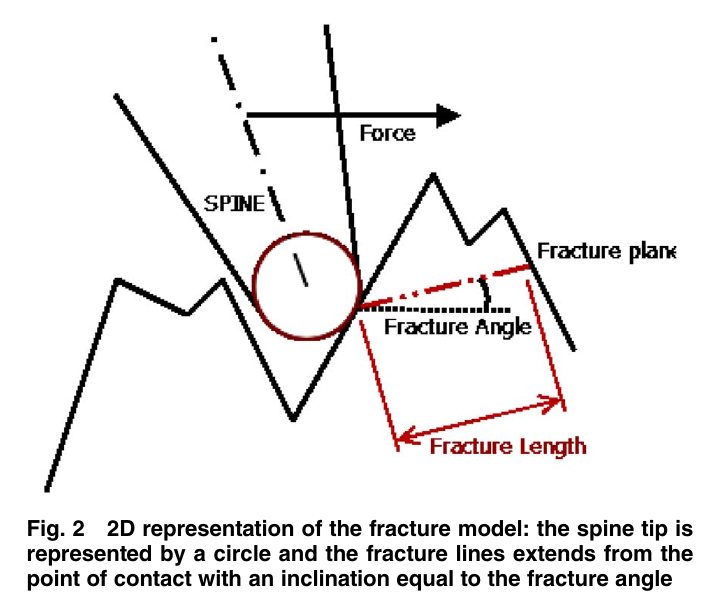
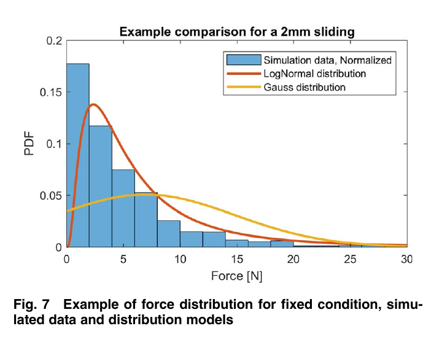
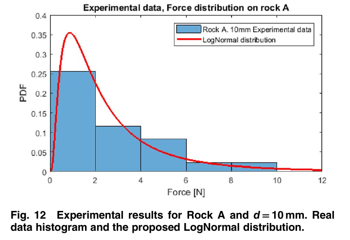

# 论文极简机理证据卡

- 题目：Simulation and Analysis of Microspines Interlocking Behavior on Rocky Surfaces: An In-Depth Study of the Isolated Spine
- 作者：Saverio Iacoponi, Marcello Calisti, Cecilia Laschi
- 年份：2020
- DOI：10.1115/1.4047725
- 论文类型：理论 + 仿真 + 单刺实验
- 研究对象：近切向加载下，有限半径孤立钢刺在岩石/混凝土二维粗糙轮廓上的捕获与局部脆性破坏
- 相关性等级：A
- 相关性说明：直接提出孤立刺—岩石局部断裂模型、捕获概率和承载分布，并用多类真实基底单刺拖曳试验校核。
- 长度说明：论文含“局部断裂”“捕获概率”“承载统计”三个相互关联子模型，按模板放宽至 3500 个中文字符以内。

## 1. 论文实际解决的问题

论文试图由刺尖半径、表面粗糙度、最大搜索行程和基底 Mode-II 断裂韧度，预测孤立刺能否捕获及捕获后的承载分布；输出二维断裂面算法、经验概率/均值函数，并以岩石、混凝土及生物覆盖面试验检验数量级和失效现象。

## 2. 核心机理

### M1 局部赫兹强度越限不等于整个位形解锁

- 证据类型：[直接证据]
- 机理内容：球—平面赫兹估算在低载下已给出远超岩石抗压强度的局部剪应力，但实验仍可保持挂接，说明“接触点首次达到强度”不能作为整个位形失效判据；局部损伤会先改变接触几何。
- 输入因素：刺尖半径、局部法向力、弹性参数、材料强度。
- 输出或影响：排除单纯强度越限模型，转向裂纹控制的整体凸体脱落。
- 成立条件：局部球—平面、法向载荷、硬脆基底。
- 来源：PDF p.2，Section 2.1，Fig. 1。
- 对当前模型的用途：作为 `NEGATIVE_EVIDENCE`，禁止把赫兹峰值应力直接当成单刺脱附阈值。

### M2 接触诱发裂纹控制局部凸体的 Mode-II 脱落

- 证据类型：[归纳]
- 机理内容：接触应力先诱发/利用浅表裂纹，再以 Mode-II 裂纹面控制凸体脱落；二维算法从接触点沿摩擦限定角寻找轮廓再交点，以断裂长度平方近似三维断裂面积，并把切向载荷投影到断裂方向。
- 输入因素：局部轮廓、$\mu_s$、$K_{IIc}$、刺尖半径、赫兹最大剪应力深度。
- 输出或影响：候选挂接点、断裂面和局部承载上限。
- 成立条件：二维轮廓、仅切向外载、基底先于刺体破坏、断裂面两向尺度近似相等。
- 失效或不适用条件：三维非共面裂纹、混合模态、塑性压碎、刺弯曲/断裂占主导。
- 来源：PDF p.2-3，Section 2.2，Eq. (1)-(3)，Fig. 2。
- 对当前模型的用途：保留“裂纹控制 + 几何搜索”结构；原 Eq. (1) 量纲不闭合，不能直接编码。

### M3 有限刺尖、粗糙度与允许行程共同决定捕获概率

- 证据类型：[直接证据]
- 机理内容：对每段长度 $d$，只要存在满足坡度条件的接触点即捕获；$R$ 越大，低于阈值 $t$ 的小尺度形貌越不可见，$R_a$ 或 $d$ 增大时 $p_{lock}$ 在拟合域内趋于饱和。几何筛选使概率与 $K_{IIc}$ 无关。
- 输入因素：$R_a$、最大允许滑动距离 $d$、刺尖半径 $R$、$\mu_s$。
- 输出或影响：单次捕获概率 $p_{lock}$。
- 成立条件：合成二维轮廓、每段取至少一个有效点、准静态连续接触。
- 来源：PDF p.3-5，Sections 3.1-3.3、5.1，Eq. (4)，Table 3，Fig. 5-6。
- 对当前模型的用途：可作搜索成功率的经验先验；目标红砖必须重新生成/测量并标定。

### M4 单刺承载力服从正偏分布而非高斯分布

- 证据类型：[归纳]
- 机理内容：论文分别报告 $p_{lock}$ 与力分布；固定工况下的力样本显著右偏，BIC 比较中 Log-Normal 对多数仿真样本优于正态、指数和 Weibull，Rock A 实验也保持正偏并可由 Log-Normal 描述。
- 输入因素：已捕获状态、$R_a$、$R$、$K_{IIc}$、$d$。
- 输出或影响：单刺承载的概率分布与均值。
- 成立条件：论文未明确说明分布拟合是否剔除未捕获/近零试次；零值处理须回查原始数据或代码。
- 来源：PDF p.5-6、8，Sections 5.2、6.3，Fig. 7、12。
- 对当前模型的用途：可测试“伯努利捕获 + 正偏正值承载”的两级随机输入，但这属于当前研究的建模解释，须先确认原论文零值处理并验证刺间相关性。

### M5 表面控制的平均承载受刺体强度上限截断

- 证据类型：[原文结论]
- 机理内容：拟合域内平均力随 $\sqrt d$、$R_a$ 和 $K_{IIc}$ 增大而提高，随刺尖半径 $R$ 增大而降低；当表面可提供的力很高时，刺体弯曲或断裂转为主导，表面模型不能无限外推。
- 输入因素：$R_a$、$d$、$K_{IIc}$、$R$、刺体强度/几何。
- 输出或影响：论文所报平均承载及主导失效模式切换。
- 来源：PDF p.6-8，Sections 5.3-5.4、7，Eq. (5)-(6)，Fig. 8-10。
- 对当前模型的用途：把表面断裂容量与刺体承载上限取条件分支；Eq. (6) 只作原论文拟合基线。

### M6 跳跃与覆盖层会重定义有效搜索表面

- 证据类型：[直接证据]
- 机理内容：刺失去早期挂接后会“跳过”后续候选点，使实验对 $d$ 的敏感度弱于连续滑动仿真；软黏液层在近零法向预载下阻断刺尖接触岩石而使 $p_{lock}=0$，硬化钙质覆盖层则形成新的有效基底类别。
- 输入因素：法向预载、覆盖层刚度、脱离后的运动、剩余行程。
- 输出或影响：有效搜索长度、捕获概率和平均力。
- 来源：PDF p.7-8，Sections 6.2-6.3，Table 7。
- 对当前模型的用途：增加“失接—跳跃/再接触”和覆盖层可达性分支，不能把名义行程等同于有效搜索行程。

## 3. 核心公式

### E1 原文 Mode-II 临界剪应力式

$$
\tau_{cr}=K_{IIc}\sqrt{\pi c}
$$

- 证据类型：原文理论式；原公式号：Eq. (1)
- 变量与单位：原文称 $\tau_{cr}$ 为临界剪应力，$K_{IIc}$ 为 MPa$\sqrt{\mathrm m}$，$c$ 为 m。
- 成立条件：裂纹受沿裂纹方向的剪切，等效 Mode II。
- 是否可直接进入当前模型：否。
- 所需修正：式子按 PDF 逐符号核对无误，但右端量纲为 MPa·m，并非应力；不得擅自改成标准 LEFM 形式，须回查勘误/原始实现或重新推导。
- 来源：PDF p.2，Section 2.2。

### E2 断裂面承载

$$
F_{\parallel}=\tau_{cr}A
$$

- 证据类型：理论式；原公式号：Eq. (2)
- 变量与单位：$F_{\parallel}$ 为沿断裂面的力分量（N），$A$ 为断裂面积（m$^2$）。
- 成立条件与假设：剪应力在断裂面均匀；二维断裂长度 $L_f$ 外推为 $A\approx L_f^2$；总切向力还需按断裂方向反投影。
- 是否可直接进入当前模型：需要修正；必须与量纲正确的临界应力式及三维断裂面结合。
- 来源：PDF p.2-3，Section 2.2。

### E3 摩擦限定角

$$
\alpha=\tan^{-1}\!\left(\frac{1}{\mu_s}\right)
$$

- 证据类型：判据；原公式号：Eq. (3)
- 变量与单位：$\alpha$ 为度，$\mu_s$ 无量纲；论文取钢—干砂岩 $\mu_s=0.39$。
- 正方向或角度定义：Fig. 2 中从接触点到轮廓再交点的断裂线倾角。
- 成立条件：仅切向载荷的二维简化。
- 是否可直接进入当前模型：需要修正；目标表面需统一角度/坐标定义并检验三维摩擦锥。
- 来源：PDF p.3，Section 2.2。

### E4 单刺捕获概率拟合

$$
p_{lock}=\left(1-e^{-v(R_a-t)}\right)\left(1-e^{-wd}\right)
$$

- 证据类型：经验式；原公式号：Eq. (4)
- 单位：$R_a,t$ 为 μm，$d$ 为 mm；$v,w$ 的单位未在原表显式给出。
- 成立条件：本文合成二维轮廓及 $R=5/10/50$ μm 的标定域。
- 是否可直接进入当前模型：需要修正；$R_a<t$ 时原式为负，作者要求视为 0；$d=0$ 被拟合式强制为 0 也被作者承认为不严格。
- 来源：PDF p.5，Section 5.1，Table 3。

### E5 线性化断裂韧度后的平均力拟合

$$
\bar F=10K_{IIc}e^{-p(R_a)}\left(m+n\sqrt d\right)
$$

- 证据类型：经验式；原公式号：Eq. (6)
- 输出含义：已捕获单刺的平均承载（图表以 N 表示）。
- 成立条件：$R_a=6.73$-34.59 μm、$d=0.1$-10 mm、$R=5/10/50$ μm，且表面先于刺体失效。
- 是否可直接进入当前模型：否；$m,n,p$ 的量纲未报告，$K_{IIc}$ 线性化仅在论文考察范围内近似成立。
- 来源：PDF p.7，Section 5.4，Table 5。

## 4. 关键参数表

| 参数 | 数值或范围 | 单位 | 来源 | 当前用途 | 注意事项 |
|---|---:|---|---|---|---|
| 合成轮廓数/长度 | 145 / 50 | 条 / mm | p.3, Sec. 3.1 | 仿真规模 | 二维；分段长度 $sl$ 未给值 |
| 合成轮廓 $R_a$ | 6.73-34.59 | μm | p.3, Table 1 | 拟合域 | 不能代表三维红砖统计 |
| 刺尖半径 $R$ | 5 / 10 / 50 | μm | p.3, Table 1 | 参数扫描 | 圆形二维截面 |
| $K_{IIc}$ | 4.2 / 8.0 / 16.2 | MPa$\sqrt{\mathrm m}$ | p.3, Table 1 | 参数扫描 | 含围压范围，非红砖实测 |
| 静摩擦系数 $\mu_s$ | 0.39 | 1 | p.3-4, Table 2 | 坡度判据 | 引自钢—干砂岩 |
| 最大行程 $d$ | 0.1, 0.2, 0.5, 1, 2, 5, 10 | mm | p.4, Sec. 3.3 | 搜索窗口 | 不是实际捕获前位移 |
| 轮廓扫描步长 | 1 | μm | p.3, Sec. 3.2 | 数值离散 | 未报告收敛性 |
| $p_{lock}$ 参数 $(v,w,t)$ | (0.3347,4.271,5.884); (0.2184,2.34,8.08); (0.0823,0.1937,17.06) | 见 Eq. (4) | p.5, Table 3 | 5/10/50 μm 刺尖基线 | 经验拟合，$R^2=0.8599$-0.9076 |
| Eq. (6) 参数 $(m,n,p)$ | (4.562e-4,31.95e-4,-0.1297); (2.063e-4,15.45e-4,-0.1409); (13.21e-4,1.381e-4,-0.106) | 未报告 | p.7, Table 5 | 5/10/50 μm 刺尖复核 | 仅用于复现原单位制，禁止无量纲外推 |
| 未使用刺尖半径 | 13.2 | μm | p.7, Table 6 | 磨损初值 | 每组仅 5 根 |
| 使用 12/20 次后半径 | 33.81 / 32.88 | μm | p.7, Table 6 | 磨损平台参考 | 论文比较取 33 μm |
| 实验粗糙度估计 | 30 | μm $R_a$ | p.7, Sec. 6.1 | 数量级比较 | 并非本批样品实测 |
| Rock A/C 捕获阈值 | 0.2 | N | p.7, Sec. 6.2 | $p_{lock}$ 统计 | 低于阈值按失败 |

## 5. 最小实验或仿真证据

### V1 赫兹强度越限模型被反证

- 类型：理论估算 + 既有实验对照
- 结果：Fig. 1 的局部剪应力在最有利工况仍高于 800 MPa，而文中引用的花岗岩抗压强度约 160 MPa；同时既有单刺在细混凝土上可到约 70 N，说明局部强度越限不是整体解锁时刻。
- 来源：PDF p.2，Fig. 1。

### V2 正偏条件力分布

- 类型：仿真 + 实验
- 结果：仿真样本中 Log-Normal 对多数条件的 BIC 优于常见正态/指数/Weibull；Rock A、$d=10$ mm 的实测直方图同样右偏。
- 来源：PDF p.5-6、8，Fig. 7、12。

### V3 模型给出上偏估计

- 类型：实验/仿真对比
- 结果：Rock A 在 $d=10/5$ mm 时实测均值 2.66/2.45 N，仿真 3.97/2.97 N；Rock C 实测 2.68/2.49 N，仿真 7.3/5.5 N。趋势/数量级可参考，绝对值系统性偏高。
- 来源：PDF p.8，Table 7。

### V4 名义行程不等于有效搜索行程

- 类型：实验
- 结果：Rock C 的 $p_{lock}$ 从 $d=5$ mm 的 0.30 增至 10 mm 的 0.50，但整体试验对 $d$ 的敏感度弱于仿真；作者观察到失接后的跳跃会越过剩余候选点。
- 来源：PDF p.8，Section 6.3，Table 7。

### V5 覆盖层改变捕获类别

- 类型：实验
- 结果：软黏液覆盖 Rock B 的 12 次正式试验及预试验均 $p_{lock}=0$；同一基岩上的硬化珊瑚藻使 $p_{lock}$ 由 Rock D 的 0.32 升至 Rock E 的 0.38，但均值由 3.59 N 降至 2.70 N。
- 来源：PDF p.7-8，Sections 6.2-6.3，Table 7。

## 6. 关键图片

- 原图号：Fig. 2；PDF 页码：3；保留原因：不可由公式单独恢复接触点、断裂方向与轮廓再交点的几何关系；支撑 M2/E2-E3。

- 原图号：Fig. 7；PDF 页码：6；保留原因：直接比较仿真直方图、Log-Normal 与 Gaussian；与 Fig. 12 构成仿真—实验最短证据链。

- 原图号：Fig. 12；PDF 页码：8；保留原因：显示真实单刺数据仍为正偏并由 Log-Normal 拟合；支撑 M4/V2。

## 7. 可迁移关系

- [可直接采用] “局部应力越限不等于整体脱附”的否定性约束；捕获事件与正值承载分层是待验证的建模解释。
- [需要重建] 二维断裂长度—面积近似和 Mode-II 判据；目标红砖需三维裂纹面、混合模态与局部压碎校核。
- [需要标定] $\mu_s$、真实三维形貌、有效行程、捕获阈值、条件 Log-Normal 参数及刺体强度上限。
- [仅作趋势验证] 更大 $R$ 降低形貌可达性、更长 $d$ 增加捕获机会、表面模型对绝对力偏高。
- [不能直接采用] 原 Eq. (1) 与 Eq. (6)，前者量纲不闭合，后者为参数量纲未报告的特定合成轮廓拟合。
- [不能直接采用] 将单刺伯努利/Log-Normal 分布独立复制到阵列；论文未验证轨迹竞争、载荷共享或失效相关性。

## 8. 局限与风险

- 表面只有二维分段随机轮廓和单一 $R_a$；没有三维法向、曲率、PSD、相关长度或方向性。
- Eq. (1) 按原 PDF 明确为乘以 $\sqrt{\pi c}$，与所声明的应力量纲冲突，是关键公式风险。
- Eq. (4) 在 $R_a<t$ 时给负值、在 $d=0$ 时强制为零；论文又未说明力分布拟合如何处理未捕获/近零试次。
- Eq. (5)-(6) 是启发式拟合，参数量纲未报告；高力区又受未建模的刺弯曲/断裂截断。
- 实验的 $R_a$ 与 $K_{IIc}$ 多为类比估计而非样品实测，仿真绝对承载系统性高估。
- 实验为近零法向预载、约 30° 刺角、水平近刚性约束的单刺装置，不代表独立柔顺阵列或对爪。

## 9. 对当前研究的最小贡献

该文补上“孤立刺接触诱发损伤—局部脆性脱落—随机捕获/承载”的材料失效层，并给出单刺实验边界；不能解决真实红砖三维裂纹、柔顺阵列载荷共享与对爪平衡，关键断裂式需先重新推导。
