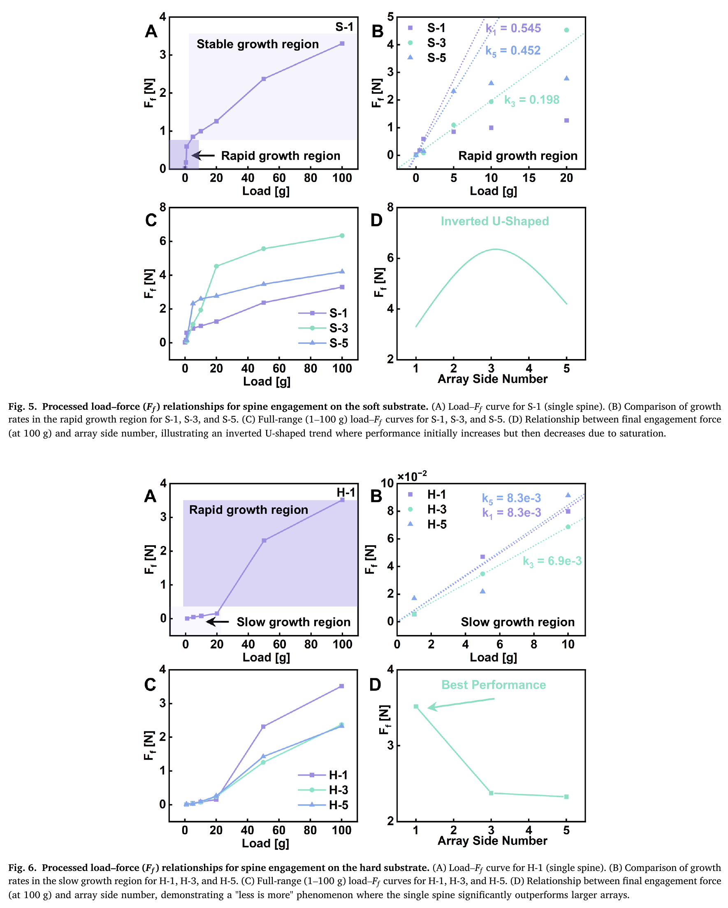
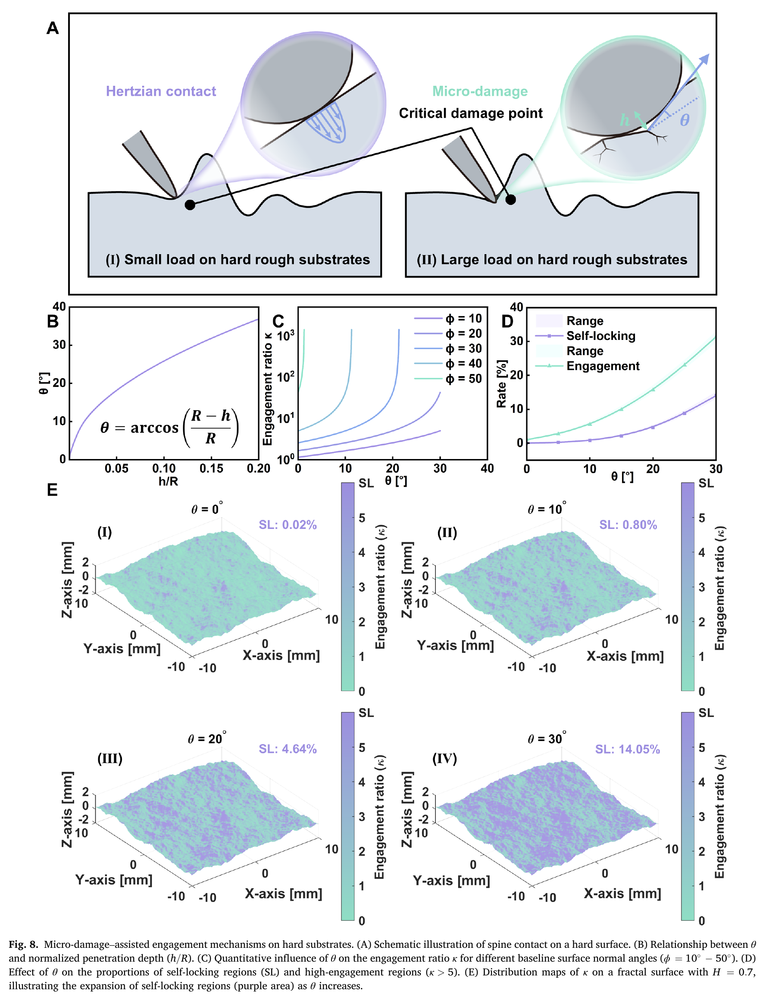
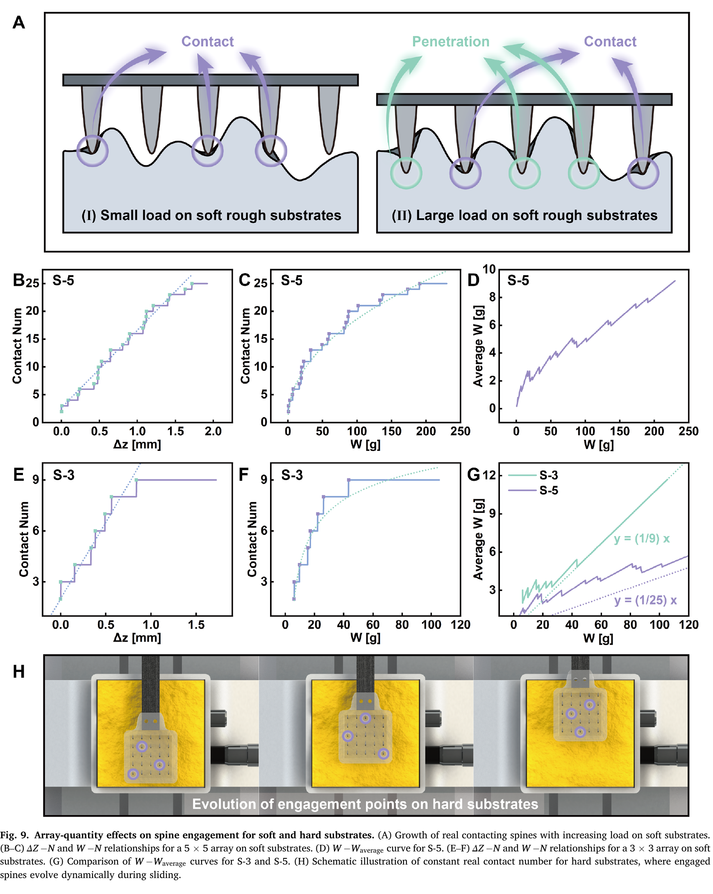

# 论文极简机理证据卡

- 题目：Why "more is better" fails: Contrasting scaling laws of bio-inspired spine arrays on soft and hard substrates
- 作者：Zhonghuan Xiang, Junyi Dai, Xue Zhou, Wenqing Chen, Peng Wei, Zhaoyang Sun, Pengpeng Bai, Yonggang Meng, Liran Ma, Yu Tian
- 年份：2026（在线发表：2025）
- DOI：10.1016/j.triboint.2025.111627
- 论文类型：理论 + 阵列实验 + 机理对比
- 研究对象：同一合成分形形貌上，固定钢刺阵列在环氧树脂硬基底与铂金硫化硅胶软基底上的定法向载荷拖曳啮合
- 相关性等级：A
- 相关性说明：直接给出软/硬基底相反的刺数缩放律、真实接触数模型和微损伤辅助自锁假说，是阵列数量效应的核心冲突证据。
- 长度说明：论文同时包含软基底穿入、硬基底微损伤自锁和阵列真实接触数三个子模型，按模板放宽至 3500 个中文字符以内。

## 1. 论文实际解决的问题

论文在相同名义形貌和固定总法向载荷下比较 1、9、25 根刚性阵列，解释为何软基底存在最优刺数而硬基底单刺反而最强；输出软基底接触数简化模型、硬基底损伤增角自锁式及成组拖曳证据。

## 2. 核心机理

### M1 软基底由弹性滑动转入穿入并逐步破坏

- 证据类型：[直接证据]
- 机理内容：小载荷下刺尖只引起可恢复变形；到达凸体根部曲率突变的临界损伤点并超过表面阈值后发生穿入，随后依次出现局部掉载、大范围撕裂和全部穿入点破坏后的突降失效。
- 输入因素：总法向载荷、局部形貌、单刺分载、刺尖半径、基底损伤阈值。
- 输出或影响：穿入时刻、峰值切向力、局部失效和最终脱开。
- 成立条件：铂金硫化硅胶、固定阵列、沿刺向拖曳；作者未报告材料模量和损伤阈值。
- 来源：PDF p.7-8，Section 4.1，Fig. 7。
- 对当前模型的用途：提供“滑动—穿入—局部损伤—撕裂—失效”状态证据；不能迁移为硬脆红砖机理。

### M2 硬基底微损伤通过增大有效法向角促进自锁

- 证据类型：[原文结论（机理假说）]
- 机理内容：低载时按原始局部法向角和静摩擦计算几何啮合；高载时有限半径刺尖可能造成深度 $h$ 的微损伤，相当于给法向角增加 $\theta$，使更多位置跨越自锁阈值。论文未直接测量损伤深度或成像裂纹。
- 输入因素：局部法向角 $\phi$、静摩擦系数 $f_s$、刺尖半径 $R$、假定损伤深度 $h$。
- 输出或影响：啮合比 $\kappa$、高啮合区和自锁区比例。
- 成立条件：圆弧刺尖、准静态局部几何、损伤等效为法向角增量。
- 失效或不适用条件：压碎/断裂几何不能由单一深度表示、混合模态、刺体弯曲或柔顺重定位占主导。
- 来源：PDF p.8-9，Section 4.2，Eq. (1)-(3)，Fig. 8。
- 对当前模型的用途：保留“表面状态改变有效法向”的条件分支；$f_s$、损伤阈值和 $h(W)$ 均缺失，不能闭合求解。

### M3 名义刺数不等于真实接触刺数

- 证据类型：[原文结论]
- 机理内容：阵列表现由真实接触数而非名义数量控制。软基底随下压逐步把更多刺带入接触；硬基底总位移仅为微米量级，未接触刺不会因增载而补入，滑动时具体接触刺虽变化，数量却约保持 2-3 根。
- 输入因素：形貌高度、阵列平面位置、基底柔度、阵列转动自由度、总载荷。
- 输出或影响：$N_{contact}$、平均单刺载荷和可触发的损伤/穿入点数。
- 来源：PDF p.8、10-11，Sections 4.3-4.4，Eq. (4)-(10)，Fig. 9。
- 对当前模型的用途：强制区分名义刺数、接触刺数和承载刺数；真实红砖阵列需显式求解接触主动集。

### M4 软基底存在“数量—穿入深度”倒 U 形竞争

- 证据类型：[直接证据]
- 机理内容：刺数增加一方面提高潜在穿入点数，另一方面降低平均单刺压力并减小穿入深度；在 100 g 总载荷下，1/9/25 刺最终力为 3.3/6.3/4.2 N，中等阵列达到最大值。
- 输入因素：固定总载荷、名义刺数、真实接触数、穿入深度、基底完整性。
- 输出或影响：阵列总切向峰值及最佳名义数量。
- 成立条件：本文 5 mm 间距、刚性共基板、单一硅胶和单一形貌；改变刺数同时改变阵列覆盖面积。
- 来源：PDF p.4、6、10，Sections 3、4.3，Fig. 5、9。
- 对当前模型的用途：仅作软材料缩放冲突和算法验证，不作为红砖阵列优化律。

### M5 硬基底固定总载荷下“少即是多”

- 证据类型：[直接证据]
- 机理内容：低载阶段三种阵列斜率近似相同；约 20 g 后，单刺承担全部载荷并更易触发微损伤，而 9/25 刺阵列实际仍只有 2-3 根接触且分摊载荷，曲线近重合。100 g 时单刺约 3.5 N，9/25 刺均约 2.3 N。
- 输入因素：固定总法向载荷、真实接触数、单刺接触压力、损伤阈值。
- 输出或影响：高载非线性增益与阵列总峰值。
- 成立条件：环氧树脂、刚性阵列、25 μm 刺尖、60° 安装、相同总载荷而非相同单刺载荷。
- 来源：PDF p.5-6、10，Sections 3、4.4，Fig. 6、9H。
- 对当前模型的用途：作为“冗余会降低阈值触发能力”的核心否定证据；独立柔顺阵列不应直接套用该数量律。

## 3. 核心公式

### E1 未损伤表面的几何啮合比

$$
\kappa=\frac{F_f}{W}=\tan\!\left(\phi+\arctan f_s\right)
$$

- 证据类型：理论式；原公式号：Eq. (1)
- 变量与单位：$F_f,W$ 为切向力和法向力（N）；$\kappa,f_s$ 无量纲；$\phi$ 为局部法向相对竖直方向的角度（°）。
- 成立条件：硬表面、未损伤局部几何；$\phi+\arctan f_s>90°$ 被另判为自锁状态。
- 是否可直接进入当前模型：需要修正。
- 所需修正：该正切式在 90° 奇异且越界后符号失真，必须作为阈值前容量与离散自锁状态使用；论文未给 $f_s$ 数值。
- 来源：PDF p.8，Section 4.2。

### E2 微损伤增角模型

$$
\kappa=\tan\!\left(\phi+\theta+\arctan f_s\right),\qquad
\theta=\arccos\!\left(\frac{R-h}{R}\right)
$$

- 证据类型：机理假说 + 几何式；原公式号：Eq. (2)-(3)
- 变量与单位：$R,h$ 同长度单位；$\theta$ 为损伤导致的等效法向增角（°）。
- 成立条件：圆弧刺尖且损伤轮廓可用深度 $h$ 表示；文中 $R=25$ μm，$h/R=0.15$ 时 $h\approx3.8$ μm、$\theta\approx30°$。
- 是否可直接进入当前模型：否；缺少损伤起始判据和 $h(W)$ 演化，$h$ 也未实测。
- 来源：PDF p.8-9，Section 4.2，Fig. 8B。

### E3 软基底真实接触数与分载模型

$$
\begin{aligned}
h_i&=f(x_i,y_i), & Z_s(0)&=h_3, & Z_s&=h_3-\Delta Z(t),\\
\delta_i&=\max(0,h_i-Z_s), &
N_{contact}&=\sum_i \mathbb I(\delta_i>0),\\
W&=\sum_i K_s\delta_i, &
W_{average}&=\frac{W}{N_{contact}}.
\end{aligned}
$$

- 证据类型：简化模型；原公式号：Eq. (4)-(10)
- 变量与单位：$h_i,Z_s,\Delta Z,\delta_i$ 为长度；$(x_i,y_i)$ 为 5 mm 间距采样位置；$K_s$ 为等效刚度；$W$ 为总载荷；$i=1\ldots9$ 或 $25$。
- 关键假设：刚性水平刺平面仅竖直下移、各点相同线性 $K_s$、只算弹性压缩且明确排除穿入。
- 是否可直接进入当前模型：需要修正；$h_3$ 的排序/几何定义、$K_s$ 数值和单位未给，图中 $W$ 又以质量 g 表示。
- 来源：PDF p.10，Section 4.3。

## 4. 关键参数表

| 参数 | 数值或范围 | 单位 | 来源 | 当前用途 | 注意事项 |
|---|---:|---|---|---|---|
| 阵列 | 1×1 / 3×3 / 5×5 | 根 | p.4 | 数量扫描 | 即 1/9/25 根；覆盖面积同时改变 |
| 阵列间距 | 5 | mm | p.4 | 几何基线 | 方形对齐阵列，未扫间距/错列 |
| 钢刺几何 | 0.63×5 | mm | p.4 | 几何量级 | 原文称“diameter of 0.63×5 mm”，尺寸含义表述不规范 |
| 刺尖半径 $R$ | 25 | μm | p.4 | 接触/损伤几何 | 未报告磨损变化 |
| 俯仰角 | 60 | ° | p.4 | 安装角 | 刺轴相对水平面；引用 P04 的最优角 |
| 总法向加载 | 0.5, 1, 5, 10, 20, 100 | g | p.4 | 阈值扫描 | 是整阵列总载荷，不是每刺载荷 |
| 合成形貌 | $H=0.7$，厚 3 | 1 / mm | p.4 | 受控对照 | 未给幅值、PSD 截止、随机种子或 STL |
| 基底 | 环氧树脂 / 铂金硫化硅胶 | - | p.4 | 硬/软对照 | Young 模量、强度、$f_s$ 均未报告 |
| 主试验 | 10 / 20 / 50 | mm·s$^{-1}$ / mm / 组 | p.4 | 重复拖曳 | Fig. 4 仅显示 20 次序列；原始数据未附 |
| 软基底 100 g 峰值 | 3.3 / 6.3 / 4.2 | N | p.6,10 | 倒 U 趋势 | 对应 1/9/25 刺 |
| 硬基底 100 g 峰值 | 3.5 / ≈2.3 / ≈2.3 | N | p.5-6 | 少即是多 | 对应 1/9/25 刺 |
| 硬基底转折 | ≈20 | g | p.5-6 | 损伤阈值现象 | 仅是本装置总载荷转折，非材料参数 |
| 硬基底真实接触数 | ≈2-3 | 根 | p.10-11 | 主动集约束 | 随滑动更换具体接触刺 |

## 5. 最小实验或仿真证据

### V1 软/硬基底相反数量律

- 类型：阵列实验
- 关键工况：相同 $H=0.7$ 形貌、100 g 总法向载荷、1/9/25 刺。
- 结果：软基底 3.3/6.3/4.2 N 呈倒 U；硬基底 3.5/约2.3/约2.3 N，单刺最高。
- 数据处理定义：软基底取单次最大峰；硬基底舍弃最大局部峰后取次大三峰均值。
- 来源：PDF p.6，Fig. 5-6。

### V2 硬基底存在约 20 g 的非线性转折

- 类型：实验 + 机理解释
- 结果：低于约 20 g 时三阵列增长率接近；更高载荷下单刺曲线显著加速，作者归因于单刺高压力触发微损伤。
- 支撑的机理或公式：M2、M5、Eq. (2)-(3)；实验未直接测得 $h$。
- 来源：PDF p.5-6、8-9，Fig. 6、8。

### V3 微损伤增角显著改变能力图

- 类型：几何计算
- 结果：同一 $H=0.7$ 分形面上，$\theta$ 从 0° 增至 30° 时自锁区域比例由 0.02% 增至 14.05%；$\phi=30°$ 时 $\theta$ 从 0° 到 20° 使 $\kappa$ 约跨三个数量级。
- 来源：PDF p.8-9，Fig. 8C-E。

### V4 软基底穿入—失效时序

- 类型：1 mm/s 准静态实验
- 结果：3×3 阵列在 20 g 下显示稳定摩擦、穿入、局部掉载、大范围损伤和最终失效；5 g 时约 13.7 s 才穿入，50 g 时约 0.04 s 即穿入。
- 来源：PDF p.7-8，Fig. 7。

### V5 真实接触数的饱和与不完全接触

- 类型：简化计算
- 结果：软基底高载下 3×3/5×5 的平均分载斜率趋近 $1/9$/$1/25$；低于 20 g 时明显高于理想均分线，说明大阵列仍未全接触。硬基底则约固定为 2-3 根接触。
- 来源：PDF p.10-11，Fig. 9。

## 6. 关键图片

- 原图号：Fig. 5-6；PDF 页码：6；保留原因：同页给出软基底倒 U 与硬基底单刺最优，是全文核心实验对照；支撑 M4-M5/V1。

- 原图号：Fig. 8；PDF 页码：9；保留原因：同时定义 $h$、$\theta$、自锁阈值和能力图变化，公式无法替代空间分布证据；支撑 M2/E2/V2-V3。

- 原图号：Fig. 9；PDF 页码：11；保留原因：直接区分名义数量、真实接触数和平均分载，并显示硬基底接触主动集随滑动更换；支撑 M3-M5/E3/V5。

## 7. 可迁移关系

- [可直接采用] 名义刺数、真实接触刺数、穿入/自锁刺数必须分开统计。
- [可直接采用] 在固定总载荷下，阵列冗余会降低单刺压力，阈值型损伤/穿入不能按刺数线性叠加。
- [需要重建] 红砖上的损伤起始判据、损伤深度/崩落几何及其对有效法向的更新。
- [需要标定] 红砖三维形貌、$f_s$、刺尖半径/磨损、独立弹簧刚度、预载和总载荷范围。
- [仅作趋势验证] 软材料倒 U、硬材料“少即是多”和硬面高载非线性转折。
- [不能直接采用] 将固定刚性阵列的单刺最优结论外推到独立柔顺微刺阵列；后者可增加真实接触数并重新分配载荷。

## 8. 局限与风险

- 数量试验固定总载荷且保持 5 mm 间距，因此名义刺数、阵列覆盖面积和单刺平均载荷同时改变，不能单独辨识“数量”主效应。
- 只比较一种环氧树脂和一种硅胶，未报告 Young 模量、强度、静摩擦系数或损伤阈值，无法确定软—硬机制切换边界。
- 微损伤是解释高载非线性的机理假说；没有损伤成像、深度测量或 $h(W)$ 演化标定，Eq. (2) 不能预测力。
- Eq. (1)-(2) 在 90° 奇异；Eq. (4)-(10) 又缺 $h_3$ 定义、$K_s$ 数值和单位，只能作为结构化简化模型。
- 合成表面只报告 $H=0.7$，缺少幅值、PSD/截止尺度、随机种子和 STL；环氧面不是红砖，硅胶穿入也不代表硬脆材料。
- 固定共基板没有独立弹簧、行程饱和或失效重分配；软/硬峰值统计口径不同，方法称每工况 50 组而 Fig. 4 只展示 20 次，Fig. 5B 与结果段又互换了 S-3/S-5 的斜率归属。

## 9. 对当前研究的最小贡献

该文建立“基底损伤阈值—单刺压力—真实接触数—阵列数量律”的关键冲突链；可约束红砖阵列不能线性叠加单刺能力，但不能替代独立柔顺、真实砖材损伤和载荷重分配模型。
