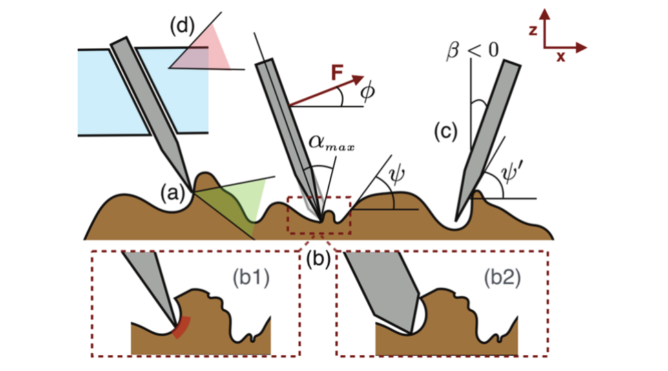
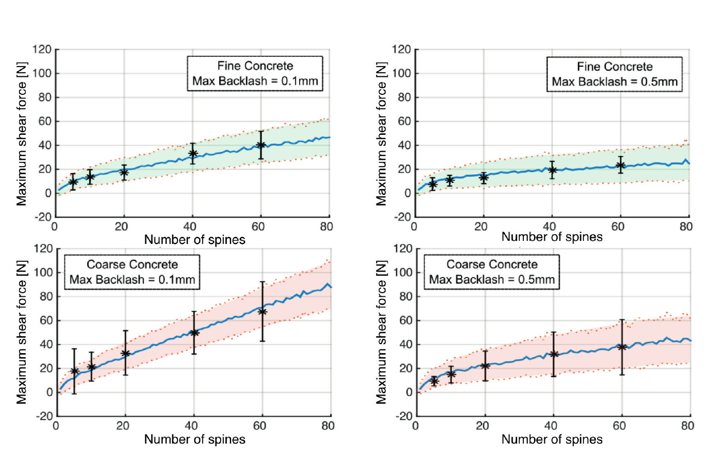
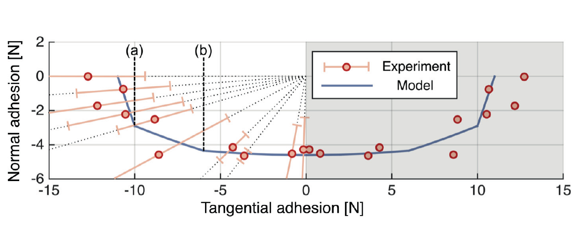

# 论文极简机理证据卡

- 题目：Design and modeling of linearly-constrained compliant spines for human-scale locomotion on rocky surfaces
- 作者：Shiquan Wang, Hao Jiang, Mark R. Cutkosky
- 年份：2017
- DOI：10.1177/0278364917720019
- 论文类型：理论 + 随机建模 + 实验 + 机构应用
- 研究对象：人类尺度岩面运动用线性限位刺、单向刺片及对置刺阵列
- 相关性等级：A
- 相关性说明：直接给出单刺约束、阵列回差均载、三维极限面和对置预载模型，并提供混凝土实验。
- 长度说明：论文同时包含单刺、阵列、三维载荷与对置机构四个独立子模型，按模板放宽至 3500 个中文字符以内。

## 1. 论文实际解决的问题

论文以“法向易伸缩、切向高刚度”的线性限位刺提高刺密度；建立由刺尖/表面/通道约束到回差均载、单片三维极限面和对置预载极限面的模型，并用单刺、阵列及对置阵列试验校验均值与离散性。

## 2. 核心机理

### M1 线性限位以单刺命中率换高密度和大法向行程

- 证据类型：[原文结论]
- 机理内容：刺在倾斜通道中自由伸缩，切向位移和弯曲转动近似被禁止；因而每根刺几乎不搜索，只使用初始遇到的凸体，但更高密度和较大法向行程补偿了较低的单刺接合率。
- 输入因素：通道倾角、法向行程、弹簧力、刺密度、表面凸体占比。
- 输出或影响：初始命中数、贴合能力和单位面积承载。
- 成立条件：刺通道切向刚硬，法向弹簧足以推出刺且压力很小。
- 来源：PDF p.2-3，Section 2.1-2.2，Fig. 2。
- 对当前模型的用途：作为“位置初始命中”与“切向搜索”两类刺单元的分支，不得与独立切向柔顺刺等同。

### M2 单刺承载由表面滑移、凸体/侧面接触和刺体/通道失效竞争

- 证据类型：[归纳]
- 机理内容：局部力超出摩擦锥时滑移；刺尖太钝或倾角不合适时转为刺尖/刺杆侧面接触并降低凸体强度；强凸体上又由刺尖剪切、通道出口弯曲或锥段弯曲限制；通道摩擦过小会产生内滑。
- 输入因素：$α,β,φ,ψ,μ,μ_s,d_s,l_e$、刺尖磨损直径及表面强度。
- 输出或影响：接触类别、单刺承载上限和失效模式。
- 失效或不适用条件：论文将脆性凸体强度压缩为经验常数，未建立真实红砖压碎/划伤/裂纹演化。
- 来源：PDF p.3-5、14，Sections 2.2.1-2.2.4，Eq. (1)-(5), (16)-(20)，Fig. 3-5, 18。
- 对当前模型的用途：可改写为单刺状态分支；材料强度与弯曲式须另行校核。

### M3 回差使“最弱先到限”提前停止阵列行程

- 证据类型：[原文结论]
- 机理内容：同一刺片中，随机回差 $S_i$ 使各刺开始受力的位移不同；首个达到其随机承载上限 $Φ_{M_i}$ 的刺限制整片行程，使一部分刺仍未越过回差。刺数越多，出现早期极限刺的概率越高，承载增长因而非线性衰减。
- 输入因素：单刺刚度 $k$、回差分布、失效模式 $M_i$及对应承载上限分布。
- 输出或影响：有效受力刺数、总力均值/方差和刺数扩展效率。
- 成立条件：共同刚性背板位移、相同 $k$、$S_i$ 均匀假设，且刺片行程由最弱已承载刺限制。
- 来源：PDF p.5-7，Sections 2.4-3.1，Eq. (6)-(8)，Fig. 6-7。
- 对当前模型的用途：可作为主动集/蒙特卡洛均载基线，但须增加候选点竞争、刺间相关与失效后重分配。

### M4 局部坡度窗口与加载方位共同生成单片三维极限面

- 证据类型：[归纳]
- 机理内容：加载离开优选切向后，可用凸体坡度窗口的缩减、刺杆侧触系数和通道滑移系数缩放 $F(0)$；横向加载再通过等效倾角 $β'$展开为三维极限面。
- 输入因素：坡度 PDF、$μ,μ_s,α,β$、两个方向的单刺统计和最大加载角。
- 输出或影响：$F(φ,θ)$ 与非凸三维承载边界。
- 成立条件：表面各向同性，高坡度区的可用凸体密度近似线性，且用两个加载角标定未知系数。
- 来源：PDF p.6-8，Sections 3.1-3.4，Eq. (9)-(14)，Fig. 8-9。
- 对当前模型的用途：作为三维方向能力图的参考基线；真实红砖需直接使用法向/坡度方向场重建。

### M5 对置阵列靠内预载偏置两个单片极限面

- 证据类型：[直接证据]
- 机理内容：对置刺片的单片极限面互为镜像，预载 $f_p$ 使其沿导轨方向反向偏置；法向分量相加、导轨方向分量一增一减。任一侧到零/脱附则整体失效；内外限位改变后续载荷由哪一侧独立承担。
- 输入因素：单片 $F(f_x,f_y)$、内预载、弹簧刚度、内/外硬限位。
- 输出或影响：对置机构三维极限面、优选加载方向和整体失效条件。
- 成立条件：两片对称，机构被约束为与表面平行且不转动，$y$ 向力均分。
- 来源：PDF p.8-10、15，Section 4, Appendix D，Eq. (25)-(28)，Fig. 10-12, 20-21。
- 对当前模型的用途：可直接作对爪平移耗尽基线；自研整爪仍需加入不对称表面、力矩平衡和转动自由度。

### M6 分层浮动刺片与差动均载恢复大尺度承载

- 证据类型：[原文结论]
- 机理内容：不把所有刺刚性并成一块，而是用约 60 根刺的中等尺度刺片保留近线性扩展；多片经低摩擦滑轮—腱索差动平均受力，弱片失接后可滑动重新捕获。
- 输入因素：每片刺数、刺片数、可滑行程、滑轮/腱索几何和平面面积约束。
- 输出或影响：刺利用率、总剪切力、弱接触重捕获可靠性。
- 来源：PDF p.11-12，Section 5.2，Fig. 16-17。
- 对当前模型的用途：作为“刺内部均载 + 刺片间差动均载”的两层阵列架构，不能只用总刺数线性外推。

## 3. 核心公式

### E1 纯剪切下的刺—凸体摩擦失效力

$$
F=\frac{\mu\cos\psi}{\cos\psi-\mu\sin\psi}F_P
$$

- 证据类型：理论式；原公式号：Eq. (1)
- 变量/单位：$F,F_P$ 为 N；$μ$ 无量纲；$ψ$ 为局部接触面坡度。
- 成立条件：Fig. 4(a) 滑移区、$φ=0$ 的切向加载解释；当力向接近摩擦锥时，还会被凸体强度截断。
- 是否可直接进入当前模型：需要修正；统一三维力/角定义并加入材料上限。
- 来源：PDF p.4，Section 2.2.2。

### E2 刺杆侧触和通道滑移系数

$$
C_i(\psi,\beta)=
\begin{cases}
c_i,&\psi\le\beta+\pi/2-\alpha/2\\
1,&\text{else}
\end{cases},\qquad
\psi'=\begin{cases}
\psi,&\psi\le\beta+\pi/2-\alpha/2\\
\beta+\pi/2-\alpha/2,&\text{else}
\end{cases}
$$

$$
C_c(\phi,\beta)=\sin(\beta+\pi/2-\phi-\arctan\mu_s)(1+\mu_s^2)
$$

- 证据类型：分段经验系数/摩擦约束；原公式号：Eq. (2)-(4), (19)-(20)
- 条件：$C_c=1$ 当 $β-\arctanμ_s\leφ\leβ+\arctanμ_s$；上式是原文列出的通道滑移缩放支。
- 是否可直接进入当前模型：需要修正；$c_i$ 未列数值，上/下边界滑移支未完整分别写出。
- 来源：PDF p.4、14，Sections 2.2.2-2.2.3，Appendix C。

### E3 通道间隙投影为刺尖回差

$$
s=\frac{l}{l-l_e}\epsilon
$$

- 证据类型：几何式；原公式号：Eq. (5)
- 变量/单位：$s,ε,l,l_e$ 均为长度；$s$ 是近零载荷下刺尖沿表面的最大游隙。
- 关键假设：小间隙刚体几何；回差导致的倾角改变通常小于 $2^\circ$ 而被忽略。
- 是否可直接进入当前模型：可改写使用；目标机构需按实际铰链/导向间隙重算。
- 来源：PDF p.5，Section 2.2.4。

### E4 最弱接触限制的阵列行程与单刺力

$$
X=\min_{i=1,\ldots,n}\left(\frac{\Phi_{M_i}}{k}+S_i\right),\qquad
F_i=k\max\{X-S_i,0\}
$$

$$
E[F]=\sum_{i=1}^{n}\iiint F_i f_{\Phi_{M_i}}f_{S_i}f_{M_i}\,dM_i\,dS_i\,d\Phi_{M_i}
$$

- 证据类型：随机力学模型；原公式号：Eq. (6)-(8)
- 变量/单位：$X,S_i$ 为 mm，$k$ 为 N/mm，$Φ_{M_i},F_i,F$ 为 N，$M_i$ 为失效模式。
- 成立条件：共同行程、等刚度，$S_i$ 按均匀分布抽样；没有闭式解，论文用蒙特卡洛。
- 是否可直接进入当前模型：需要修正；论文未完整给出 $f_{\Phi_M}$ 和 $f_M$ 参数，也未处理级联重分配。
- 来源：PDF p.5-6，Section 2.4。

### E5 坡度窗口缩放与三维等效倾角

$$
f_{\Psi}(\psi)=\frac{2}{\delta\psi}-\frac{2}{\delta\psi^2}(\psi-\psi_{\min}),\quad
\delta\psi=\psi_{\max}-\psi_{\min}
$$

$$
F(\phi)=
\frac{\int_{\psi_{\min}(\phi)}^{\psi_{\max}(\phi)}C_iC_cf_{\Psi}\,d\psi}
{\int_{\psi_{\min}(0)}^{\psi_{\max}(0)}C_iC_cf_{\Psi}\,d\psi}F(0),\qquad
\beta'(\theta)=\arcsin(\sin\beta\cos\theta)
$$

- 证据类型：概率密度 + 半经验方向外推；原公式号：Eq. (9)-(12)
- 角度定义：$φ=0$ 为优选切向，$θ$ 是横向偏航，$z$ 垂直表面。
- 关键假设：$ψ>60^\circ$ 区的可用坡度密度近似线性；表面各向同性；以 $F(0)$ 及另一角度数据标定 $c_i$。
- 是否可直接进入当前模型：需要修正；目标三维表面应用实测方向坡度分布替代线性 PDF。
- 来源：PDF p.6-7，Sections 3.1-3.2。

### E6 正压下刺力与基底摩擦的扩展极限

$$
F_e(\phi,\theta)=\frac{F(0,\theta)}{\cos|\phi|-\mu_t\sin|\phi|}
$$

- 证据类型：力平衡式；原公式号：Eq. (13)-(14)
- 成立条件：$φ<0$ 为压向表面，$\cos|φ|-μ_t\sin|φ|>0$；忽略推刺小弹簧力，只累加刺片基底摩擦。
- 是否可直接进入当前模型：可改写使用；需用实际基底材料标定 $μ_t$。
- 来源：PDF p.8，Section 3.4。

### E7 原文锥段弯曲应力上限

$$
y^*=\frac{d_m}{4\tan(\alpha/2)},\qquad
\sigma(y^*)=\frac{8F_r}{27\pi\tan(\alpha/2)d_m^2}<\sigma_{\max}
$$

- 证据类型：梁弯曲理论式；原公式号：Eq. (17)-(18)
- 变量/单位：$F_r$ 为 N，$d_m,y^*$ 为长度，$α$ 为刺尖包角，$σ$ 为 Pa。
- 输出含义：给出刺尖包角的下界；论文给出磨损刺承受 40 N 时 $α\ge14^\circ$ 的设计例。
- 是否可直接进入当前模型：否；Eq. (16)-(17) 的圆截面系数与常用实心圆梁公式不一致，须从截面几何重新推导后使用。
- 来源：PDF p.14，Appendix B。

### E8 对置刺片极限面和硬限位分支

$$
f_z=
\begin{cases}
F(f_{x1},f_y/2)+F(f_{x2},f_y/2),&F(f_{x1},f_y/2)\ge0\ \text{and}\ F(f_{x2},f_y/2)\ge0\\
0,&\text{else}
\end{cases}
$$

$$
f_{x1}=f_p+f_x,\qquad f_{x2}=f_p-f_x
$$

- 证据类型：分段极限面；原公式号：Eq. (25)-(28)
- 边界条件：未碰限位时用上式；外限位后 $f_{x2}=f_{hs2}$ if $f_{x1}\ge f_{hs1}$，内限位后 $f_{x1}=f_{hs1}$ if $f_{x2}\le f_{hs2}$。
- 是否可直接进入当前模型：需要修正；原式假设对称、均分 $y$ 向力、机构不转动且平行于表面。
- 来源：PDF p.15，Appendix D。

## 4. 关键参数表

| 参数 | 数值或范围 | 单位 | 来源 | 当前用途 | 注意事项 |
|---|---:|---|---|---|---|
| 初始/磨损刺尖半径 | 约 10 / 50 | μm | p.2, Sec. 2.1, Fig. 2 | 几何范围 | 长期使用后数值，不是通用磨损律 |
| 最大伸出 $l_{e,\max}$ | 5 | mm | p.5, Sec. 2.3 | 法向贴合行程 | 线性限位刺 |
| 刺杆直径 $d_s$ | 1 | mm | p.5, Sec. 2.3 | 弯曲/密度基线 | 高速钢 HRC63 |
| 刺尖包角 $α$ | 15 | deg | p.5, Sec. 2.3 | 接触/强度基线 | 正文称 $α\ge14^\circ$ 可抗 40 N 作为设计例 |
| 通道倾角 $β$ | 约 15 | deg | p.5, Sec. 2.3 | 岩面初值 | 作者称对多种混凝土/岩石/灰泥有效 |
| 法向推刺刚度 $k_n$ | 5 | mN/mm | p.5, Sec. 2.3 | 轻预压 | 只需推出刺，非承载主刚度 |
| 单刺接触刚度 $k$ | 17.5 | N/mm | p.4, Sec. 2.2.4 | 均载基线 | 引自 Wang et al. (2016)；柔度主要来自细锥尖 |
| 轴径/伸出强度例 | 1 / 5 可承约 70 | mm / mm / N | p.3, Sec. 2.2.1 | 刺体上限数量级 | 结合经验陈述，公式系数须复核 |
| 凸体面积占比 | 34 / 42 | % | p.5, Sec. 2.4 | 密度数量级 | 引用的两种混凝土，未给三维原始数据 |
| Fig. 7 回差对比 | 0.1 / 0.5 | mm | p.7, Fig. 7 | 阵列灵敏性 | 仅细/粗混凝土 |
| 单刺统计样本 | 150 | 次 | p.5, Fig. 6 | $Φ_M$ 分布依据 | 细混凝土，凸体失效部分拟合截断高斯 |
| 阵列扩展验证 | 20 | 次/工况 | p.6-7, Fig. 7 | 均值/标准差 | 力传感器分辨率约 0.05 N |
| 单片三维验证 | 300；分箱 3 / 18 | 次；deg | p.7, Sec. 3.3 | 极限面验证 | $φ/θ$ 分箱，每点至少 4 次 |
| 对置预载/外限位 | 16.5 / 19.5 | N | p.9, Sec. 4.3 | 对爪基线 | 100 次极限加载，约 $4^\circ$ 分箱 |
| 手掌演示 | 12 片，100×120，约 70 kgf | 片，mm，原文单位 | p.11-12, Sec. 5.2 | 整体量级 | 摘要称超过 700 N；非统计标定曲线 |

## 5. 最小实验或仿真证据

### V1 三种单刺接触区间

- 类型：放大模型实验 + 理论对比
- 关键工况：2 mm 刺尖半径、$α=β=15^\circ$、$φ=0$、$μ=0.4$，每个凸体坡度 5 次。
- 结果：坡度增大时依次出现摩擦滑移、稳定刺尖接触平台和侧面接触低承载区；实验与 Eq. (1)-(3) 的分段趋势一致。
- 来源：PDF p.4，Fig. 5。

### V2 回差导致刺数收益饱和

- 类型：蒙特卡洛 + 阵列实验
- 关键工况：细/粗混凝土，最大回差 0.1/0.5 mm；每工况 20 次试验。
- 结果：总力随刺数增长但效率降低；减小回差显著提高均值和扩展性，粗面力更高但标准差也更大。
- 来源：PDF p.6-7，Fig. 7。

### V3 单片三维极限面

- 类型：模型—实验对比
- 关键工况：混凝土上 300 个随机加载方向，$φ/θ$ 分别以 $3^\circ/18^\circ$ 分箱。
- 结果：优选加载平面为 $(x,z)$；偏航使等效倾角变差并形成 $x<0$ 的非凸区。模型复现平均边界，大 $φ$ 区离散性很大。
- 来源：PDF p.7-8，Fig. 8。

### V4 对置预载极限面

- 类型：模型—实验对比
- 关键工况：预载 16.5 N，外限位 19.5 N，$(x,z)$ 面 100 次极限加载。
- 结果：模型捕捉了单片先达附着上限与先碰外限位的两个分支；试验标准差约为附着力的 30%。
- 来源：PDF p.9-10，Fig. 12。

### V5 两层均载的人类尺度演示

- 类型：建模 + 整机演示
- 关键工况：12 个可滑 5 mm 刺片，腱索—滑轮差动，100 mm × 120 mm 手掌。
- 结果：论文报告粗混凝土上约 70 kgf 剪切载荷；计算显示分片增益随片数增大而递减，小于约 40 刺/片时才近线性。
- 来源：PDF p.11-12，Fig. 16-17。

## 6. 关键图片

- 原图号：Fig. 4；PDF 页码：3；保留原因：同时定义 $α,β,φ,ψ$ 及 Eq. (1)-(4) 的接触分支，无法由文字无损替代。

- 原图号：Fig. 7；PDF 页码：7；保留原因：在同一图中给出细/粗面、0.1/0.5 mm 回差及仿真—实验均值/方差证据。

- 原图号：Fig. 12；PDF 页码：10；保留原因：直接显示单片到限和外硬限位两个机构分支，并给出对置模型与实验的最短对照。

## 7. 可迁移关系

- [可改写采用] 摩擦滑移—稳定刺尖接触—侧面接触的分段状态，以及由间隙投影得到回差的几何关系。
- [需要标定] 目标红砖的方向坡度 PDF、凸体强度分布、单刺刚度、回差分布、摩擦系数与失效模式混合权重。
- [可作算法基线] Eq. (6)-(8) 的共同位移蒙特卡洛模型，但必须与实际搜索轨迹、空间相关和失效后重分配对照。
- [仅作趋势验证] 回差增大使刺数扩展饱和；分成中等尺度刺片再用差动均载可提高大尺度效率。
- [需要扩展] Eq. (25)-(28) 的对置平移模型；目标对爪需加入左右表面不一致、刚度不一致、转动和整体力矩平衡。
- [不能直接采用] Eq. (16)-(18) 的数值系数，以及论文未列参数的 $c_i,f_{\Phi_M},f_M$；必须重推或回查 Wang et al. (2016)/原始数据。

## 8. 局限与风险

- 表面只以凸体面积占比和高坡度线性 PDF 表示，未提供三维高度场、PSD、相关长度或方向性；Eq. (12) 又假设各向同性。
- 论文应用的线性限位刺几乎没有切向搜索，不能直接代表具有独立切向弹簧和长行程的自研刺单元。
- $Φ_M$ 的详细分布、$c_i$ 数值及失效模式权重未在本文列全，无法只靠本 PDF 完整复现阵列蒙特卡洛模型。
- Eq. (16)-(17) 所印圆截面弯曲系数与常用实心圆梁截面二次矩不一致；本卡保留原式趋势但拒绝直接数值使用。
- Eq. (6)-(8) 使用等刚度、均匀回差和“最弱刺停止全片”假设，未处理候选点竞争、相关强度、行程饱和与局部失效后的动态重分配。
- 对置模型要求对称且转动受约束；实验离散性约 30%，均值极限面不等于可信下限或安全载荷。

## 9. 对当前研究的最小贡献

该文提供从单刺接触分支、回差主导的阵列收益饱和，到单片/对置三维极限面的最完整跨尺度证据链；不能提供红砖三维形貌、局部破坏参数和非对称对爪力矩平衡，且弯曲式须先重推。
