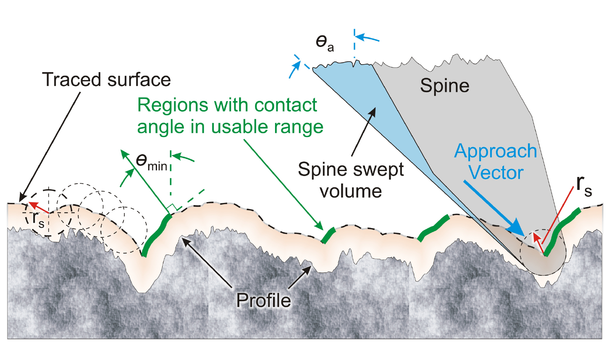
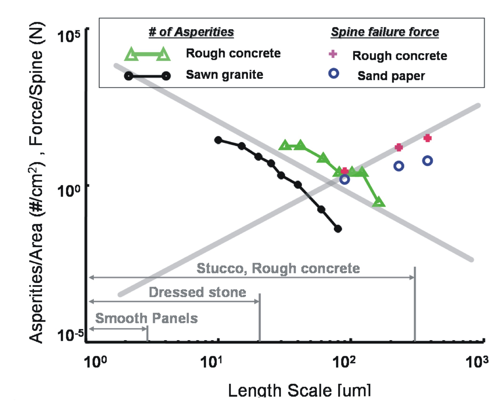
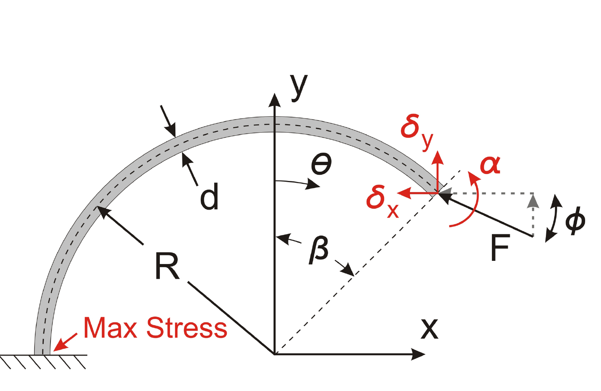

# 论文极简机理证据卡

- 题目：Scaling Hard Vertical Surfaces with Compliant Microspine Arrays
- 作者：Alan T. Asbeck；Sangbae Kim；M. R. Cutkosky；William R. Provancher；Michele Lanzetta
- 年份：所给 PDF 元数据为 2005；正式期刊版为 2006
- DOI：10.1177/0278364906072511（正式期刊版；所给 8 页 PDF 未印 DOI）
- 论文类型：理论 / 二维仿真 / 接触试验 / 机器人机构与系统验证
- 研究对象：硬质粗糙竖直表面上的微刺可达凸体、单点承载、独立柔顺阵列与 SpinyBotII
- 相关性等级：A
- 相关性说明：同时给出有限刺尖表面筛选、摩擦角判据、尺寸效应、三类局部失效及独立柔顺均载设计，是 M1-M3 的经典原始证据。
- 版本边界：本卡页码、公式和图号只对应项目中的 8 页 PDF；不得与 2006 年 15 页期刊版逐页互换。

## 1. 论文实际解决的问题

论文把二维实测轮廓与有限半径微刺的扫掠几何结合，估计可用凸体密度和单点尺度上限；再以接触试验、曲梁/Hertz 近似和 SpinyBotII 说明小刺提高捕获机会但降低单刺承载，必须依靠独立柔顺搜索与均匀分载。

## 2. 核心机理

### M1 有限刺尖把原始形貌变为“可达表面”

- 证据类型：[直接证据]
- 机理内容：将刺体沿接近方向对二维轮廓做扫掠，扫掠体与轮廓的交形成 traced surface；仅保留局部法向角 $\theta>\theta_{min}$ 到其后局部低点之间的区域作为可用凸体。
- 输入因素：轮廓、刺尖半径 $r_s$、接近角 $\theta_a$、最低可用法向角 $\theta_{min}$。
- 输出或影响：每厘米搜索行程内的可用凸体密度、最大可用刺尖半径。
- 成立条件：二维准静态轮廓；无上倾悬垂；搜索方向固定。
- 失效或不适用条件：真实三维绕行、动态跳跃、局部损伤及大于 $90^\circ$ 的悬垂未进入模型。
- 来源：PDF p.2-3，Section III，Fig. 2-4，Table I。
- 对当前模型的用途：可直接改写为有限刺尖几何滤波和候选点搜索基线，但目标模型需三维化。

### M2 稳定候选点由加载方向与摩擦共同筛选

- 证据类型：[直接证据]
- 机理内容：最低可用法向角随足端加载角增加、随摩擦系数降低而增大；$\theta_{min}$ 越高，可用凸体越少。名义 $R_a/R_q$ 不能替代局部法向角分布。
- 输入因素：$\theta_{load}$、$\mu$、局部法向角 $\theta$。
- 输出或影响：候选接触是否稳定及表面排序。
- 成立条件：论文二维角度定义与准静态摩擦近似。
- 来源：PDF p.3-4，Sections III.A-C，Eq. (2)，Fig. 4。
- 对当前模型的用途：作为局部几何-摩擦联合判据；实现前需统一三维局部坐标、力方向和摩擦锥。

### M3 真实搜索包含伪挂接、滑脱、跳跃和横向导向

- 证据类型：[原文结论]
- 机理内容：微刺常先在“伪凸体”短暂挂接，增载后因微小挠曲滑脱；随后可能短暂离面并在静/动摩擦间切换。沟槽会把刺导离凸峰，凹坑则可能导向稳定位置。
- 输入因素：增载过程、刺体挠曲、表面沟槽/凹坑、垂直搜索方向的横向自由度。
- 输出或影响：有效搜索距离、再接触位置和捕获概率。
- 失效或不适用条件：静态 traced-surface 计数不能重现这些路径事件。
- 来源：PDF p.4，Section III.C，锚点“pseudo-asperities”。
- 对当前模型的用途：为接触-滑脱-离面-再接触状态转移提供直接现象证据。

### M4 小刺的“更多接触-更低单点承载”尺度权衡

- 证据类型：[归纳]
- 机理内容：在足够小且近似分形的尺度，单位面积凸体数约随 $1/r^2$ 增长；均匀缩放时单个刺/凸体接触承载约随 $r^2$ 增长。因此更小刺可进入更平滑表面，但必须增加刺数并改善均载；单位面积总承载近似不随尺度变是作者提出的假设，不是普适定律。
- 输入因素：刺尖/凸体特征尺度、局部法向分布、材料强度。
- 输出或影响：有效接触数、单点上限、阵列所需刺数。
- 成立条件：进入近似分形尺度区且几何同比缩放。
- 来源：PDF p.4-5、7，Section IV、VI.A，Fig. 5 与 Appendix。
- 对当前模型的用途：参数扫描和尺度约束；实际加工表面与砂纸明显偏离理想幂律，须用实测形貌复核。

### M5 单点承载由三种失效模式竞争

- 证据类型：[原文结论]
- 机理内容：接触可能因刺根塑性弯曲、刺尖弹性转动后滑脱或凸体脆性剥落而失效；砂纸以凸体破坏为主，强“凹形”浇筑混凝土更易转为刺体失效，其他表面可并发。
- 输入因素：刺径/曲率、载荷方向、弹性模量、刺与凸体强度、局部裂纹和断裂韧度。
- 输出或影响：单刺承载上限和失效类别。
- 来源：PDF p.4-5、7-8，Section IV，Fig. 5，Appendix。
- 对当前模型的用途：建立“几何/摩擦滑脱、刺体强度、基材破坏”三上限竞争；Hertz 链因原文符号问题不可直接照搬。

### M6 独立柔顺使阵列继续搜索并促进均载

- 证据类型：[直接证据]
- 机理内容：早期结构只有少数刺承担大部分载荷；SpinyBotII 每足使用 10 个互相独立的平面 toe，每 toe 两刺。某 toe 挂接后可沿墙面伸长，邻 toe 仍继续下滑搜索；柔性铰链提供弹性/阻尼、法向低刚度和拉向较高刚度，并避免受拉时刺尖上转。
- 输入因素：独立行程、方向刚度、阻尼、两刺联动几何。
- 输出或影响：有效挂接刺数、载荷离散度、滑脱风险。
- 成立条件：每 toe 独立且行程足以覆盖表面起伏。
- 来源：PDF p.5-6，Section V.B，Fig. 7。
- 对当前模型的用途：直接支撑独立弹簧/柔顺单元与阵列均载建模；论文未给刚度、行程或逐刺载荷曲线，需另行标定。

## 3. 核心公式

### E1 凸体间距或长度的指数近似

$$
f_X(x)=\lambda\exp(-\lambda x),\qquad x\ge 0
$$

- 证据类型：经验分布；原公式号：Eq. (1)
- 变量与单位：$x$ 为凸体间距或凸体长度（与轮廓长度同单位）；$\lambda$ 为单位长度内的凸体率。
- 输出含义：$E[X]=1/\lambda$，$\operatorname{Var}(X)=1/\lambda^2$。
- 成立条件：本文二维实测轮廓及其候选点定义。
- 是否可直接进入当前模型：需要验证；不能据此假设三维候选点、不同搜索轨迹或阵列成员独立。
- 来源：PDF p.2，Section III.A。

### E2 最低可用法向角

$$
\theta_{min}=\theta_{load}+\operatorname{arccot}(\mu)
$$

- 证据类型：判据；原公式号：Eq. (2)
- 变量与单位：$\theta_{min},\theta_{load}$ 为度；$\mu$ 无量纲。
- 正方向或角度定义：$\theta$ 为 traced surface 法向角；$\theta_{load}$ 为足端载荷相对墙面的角度。
- 成立条件：二维准静态摩擦；论文角度定义。
- 是否可直接进入当前模型：需要修正为三维局部力平衡/摩擦锥。
- 来源：PDF p.4，Section III.B。

### E3 刺根弯曲应力尺度

$$
\sigma_{max}=\frac{Mc}{I}=\frac{32fld}{\pi d^4}\propto\frac{1}{d^2}
\quad\left(\frac{l}{d}=\mathrm{const},\ f=\mathrm{const}\right)
$$

- 证据类型：理论式；原公式号：未编号。
- 变量与单位：$f$ 为刺尖力（N），$d$ 为截面直径（m），$l$ 为等效梁长（m），$\sigma_{max}$ 为 Pa。
- 关键假设：长曲刺的最大根部应力近似直悬臂；圆截面；几何同比缩放。
- 输出含义：给定许用应力时 $f_{max}\propto d^2$。
- 是否可直接进入当前模型：可作刺体弯曲上限初值；真实曲率、锥度、材料塑性与载荷方向需修正。
- 来源：PDF p.7，Appendix，Fig. 8。

### E4 曲刺端部转角

$$
\alpha=\frac{R^2}{2EI}\left[-2F_y+\left(2F_x+F_y(\pi+2\beta)\right)\cos\beta
+\left(-2F_y+F_x\pi+2F_x\beta\right)\sin\beta\right]\propto\frac{1}{d^2}
$$

- 证据类型：理论式；原公式号：Eq. (3)
- 变量与单位：$\alpha$ 为 rad；$R$ 为曲梁半径；$E$ 为弹性模量；$I$ 为截面二次矩；$F_x,F_y$ 为力分量；$\beta$ 见 Fig. 8。
- 成立条件：Castigliano 线弹性曲梁，$R/d$ 固定且给定 $\beta,F_x,F_y$。
- 输出含义：过大端部转角会使刺尖滑离凸体。
- 是否可直接进入当前模型：需要按实际刺形、边界和坐标重推/校核。
- 来源：PDF p.7，Appendix，Fig. 8。

### E5 原文 Hertz 接触链

$$
p_{max}=\frac{3f}{2\pi a^2}=\left(\frac{6fE^2}{\pi^3R^2}\right)^{1/3},\qquad
a=\left(\frac{3fR}{4E}\right)^{1/3},\qquad
\frac{1}{R}=\frac{1}{r_s}+\frac{1}{r_a}
$$

- 证据类型：理论式；原公式号：未编号。
- 变量与单位：$p_{max}$ 为 Pa，$a$ 为接触半径，$R$ 为等效曲率半径，$r_s/r_a$ 为刺尖/凸体半径。
- 关键警告：同页把 $E$ 印成 $(1-\mu_s^2)/E_s+(1-\mu_a^2)/E_a$，量纲为柔度而上式要求等效模量；随后 $\mu_2$、$\sigma_{max}$ 也未清楚定义。
- 是否可直接进入当前模型：否；只能保留“凸体破坏上限与 $R^2$ 同阶”的论文结论，公式须回到标准 Hertz 定义并结合红砖裂纹/脆性破坏重新推导。
- 来源：PDF p.7-8，Appendix。

## 4. 关键参数表

| 参数 | 数值或范围 | 单位 | 来源 | 当前用途 | 注意事项 |
|---|---:|---|---|---|---|
| 轮廓仪球形针尖半径 | 2 | $\mu$m | p.2, Sec. III | 形貌带宽 | 大角度/细特征受探针卷积限制 |
| 激光测量光斑 | 65 | $\mu$m | p.4, Sec. III.B | 混凝土测量质控 | 对小尺度凸体低通滤波 |
| 12 种表面 $R_a/R_q$ | 6.55-92.96 / 10.26-131.93 | $\mu$m | p.3, Table I | 表面样本域 | 标量粗糙度不能预测可用凸体 |
| 判定搜索长度 | 1 | cm | p.2, Sec. III.A | 候选密度窗口 | 约等于 toe 行程，非捕获前实际位移 |
| $\theta_{load}$ | 3.5-8 | $^\circ$ | p.4, Sec. III.B | 力方向 | 相对墙面 |
| 钢刺-岩石 $\mu$ | 0.15-0.25 | 1 | p.4, Sec. III.B | 摩擦范围 | “generally”，非逐表面实测 |
| $\theta_{min}$ | 81-86.5 | $^\circ$ | p.4, Eq. (2) | 稳定筛选 | 取平均 $\theta_{load}=5^\circ$ |
| $\theta_a$ | 45-65 | $^\circ$ | p.4, Sec. III.B | 接近方向 | 由刺角及尖端轨迹合成 |
| 新/重度磨钝刺尖 | 10-15 / 25-35 | $\mu$m | p.4, Sec. III.B | 磨损边界 | 未给寿命分布 |
| 粗混凝土/光滑面可用特征上限 | 约 300 / 20 | $\mu$m | p.5, Fig. 5 | 刺尺寸上限 | 图示数量级，不是通用阈值 |
| SpinyBotII 单刺上限 | 1-2 | N | p.5, Sec. IV | 单点承载基线 | 未给样本量/统计量 |
| 每足阵列 | 10 toe × 2 spine | 个 | p.6, Sec. V.B | 阵列规模 | 两排布置，未给逐刺载荷 |
| 刺几何 | 长 1.5；杆径 200；尖端 15 | mm；$\mu$m；$\mu$m | p.6, Sec. V.B | 几何初值 | 锥度/曲率未完整参数化 |
| 软/硬聚氨酯 | 20 Shore-A / 75 Shore-D | 硬度 | p.6, Sec. V.B | 柔顺材料参考 | 无弹性模量、黏弹参数 |
| 机器人/额外载荷/速度 | 0.4 / 0.4 / 2.3 | kg / kg / cm·s$^{-1}$ | p.5, Sec. V.A | 系统趋势验证 | 无重复次数和误差条 |

## 5. 最小实验或仿真证据

### V1 形貌模型能定性排序机器人可爬表面

- 类型：二维仿真 / 机器人经验对比
- 关键工况：$\theta_{min}=82^\circ$-$85^\circ$，$\theta_a=45^\circ$ 或 $65^\circ$，$r_s=10$-$40\,\mu$m。
- 结果：多数砂纸和切割花岗岩的可用凸体相对排序与 SpinyBotII 表现一致；混凝土因 65 $\mu$m 光斑低通而失序。
- 支撑的机理：M1-M2；同时构成测量带宽的负证据。
- 来源：PDF p.4，Section III.B。

### V2 标量粗糙度不能代表啮合潜力

- 类型：实测轮廓 + 仿真
- 结果：Painter's 100 的 $R_a/R_q$ 高于 Al-oxide 120/150，却具有更少可用凸体；局部法向角分布比单一粗糙度更关键。
- 来源：PDF p.3-4，Table I，Section III.C。

### V3 尺寸缩小提高捕获但降低单刺承载

- 类型：接触试验 + 机器人对比
- 结果：约 30 $\mu$m 刺尖、每足 4 刺的 SpinyBotI 在粗混凝土/灰泥可用，但约 2 cm 行程难以可靠找到光滑混凝土/饰面石材凸体；SpinyBotII 改为约 15 $\mu$m 刺尖和更多独立单元，单点上限约 1-2 N 且每厘米可用凸体概率高。
- 来源：PDF p.5，Section IV，Fig. 5。

### V4 独立 toe 解决“少数刺承载”

- 类型：机构观察 / 系统验证
- 结果：作者明确将早期设计失效归因于少数刺承担大部分载荷；独立可伸长 toe 使已挂接单元不阻塞邻单元继续搜索，Fig. 7 显示多刺同时挂接。
- 来源：PDF p.6，Section V.B，Fig. 7。

### V5 系统级承载与冗余

- 类型：机器人验证
- 结果：0.4 kg 机器人可携带额外 0.4 kg，在混凝土、灰泥、砖和饰面砂岩上攀爬；单足短暂失效时，接触多边形、向内拉力、尾部和柔顺冗余可避免立即坠落。
- 来源：PDF p.5-7，Sections V.A、VI。

## 6. 关键图片

- 原图号：Fig. 2；PDF 页码：2；保留原因：不可由标量粗糙度或 Eq. (2) 恢复候选区几何；支撑 M1-M3。

- 原图号：Fig. 5；PDF 页码：5；保留原因：同时给出理论趋势、两类表面数据和表面尺度区间；支撑 M4/V3。

- 原图号：Fig. 8；PDF 页码：7；保留原因：E3-E4 的坐标、曲率、力方向和端部转角不能由公式单独可靠恢复。

## 7. 可迁移关系

- [可直接采用] 有限刺尖扫掠/可达表面、局部法向角筛选和“已挂接单元不阻塞邻单元搜索”的机制结构。
- [需要三维化] 二维 traced surface、固定方向搜索和 Eq. (2)；目标求解器需局部法向、摩擦锥、横向绕行及再接触。
- [需要标定] 刺尖磨损、独立单元刚度/阻尼/行程、单刺 1-2 N 上限及实际表面候选点率。
- [仅作趋势验证] $1/r^2$ 候选密度、$r^2$ 单点承载和“单位面积总承载近似不变”；仅适用于作者声明的近似分形/同比缩放条件。
- [不能直接采用] Appendix 的 Hertz 材料链及 $f_{max}$ 系数；原 PDF 有等效模量量纲和未定义符号问题。
- [不能直接采用] 由“更多刺”直接推出阵列线性增益；论文没有逐刺载荷、相关捕获、行程饱和或级联失效统计。

## 8. 局限与风险

- 输入仅为二维轮廓；不能观测大于 $90^\circ$ 的上倾悬垂，近 $90^\circ$ 也受探针锥角影响。
- 混凝土测量的 65 $\mu$m 光斑滤除了细尺度形貌，使仿真低估候选点。
- 静态候选点模型忽略伪挂接、增载滑脱、跳跃、动/静摩擦切换和横向沟槽导向。
- 表面强度试验、1-2 N 单刺上限及整机能力均未报告样本量、误差条或完整加载曲线。
- 柔顺机构未给等效刚度、阻尼、行程及逐刺载荷，不能直接复现均载程度。
- 当前 8 页 PDF 与 2006 年 15 页正式期刊版范围不一致；本卡不能替代对期刊全文的版本复核。

## 9. 对当前研究的最小贡献

该文连接“有限刺尖形貌筛选-摩擦稳定-单点失效-独立柔顺阵列-整机验证”，可作为 M1-M3 的骨架证据；不能给出三维搜索、红砖局部损伤参数、阵列逐步失效或对爪内力模型。
