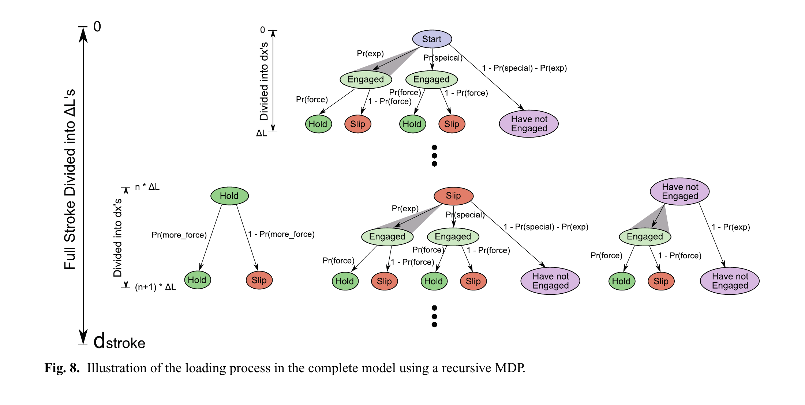
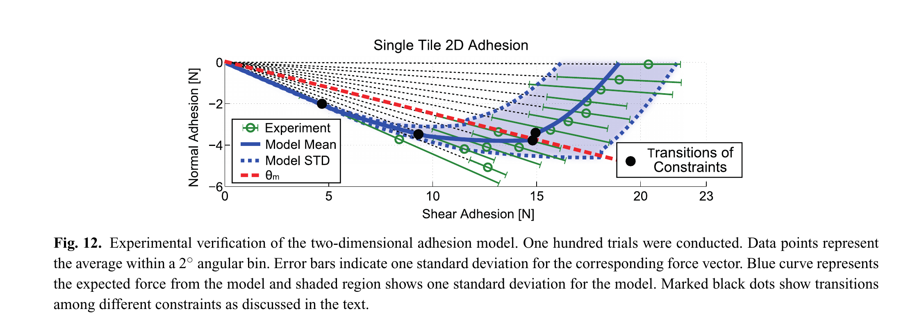
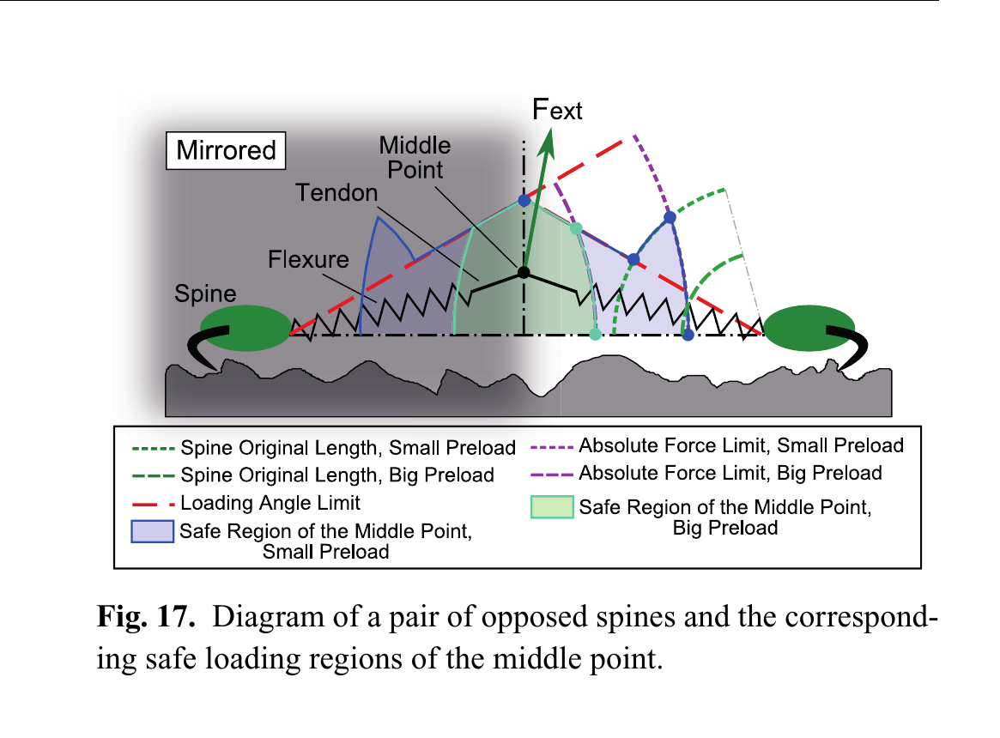

# 论文极简机理证据卡

## 1. 基本信息

- 题目：Stochastic models of compliant spine arrays for rough surface grasping
- 作者：Hao Jiang；Shiquan Wang；Mark R. Cutkosky
- 年份：2018
- DOI：10.1177/0278364918778350
- 论文类型：理论 / 随机模型 / 实验 / 机构
- 研究对象：柔顺微刺单向阵列与对置阵列在粗糙表面上的搜索、承载和拉离
- 相关性等级：A
- 相关性说明：直接给出表面随机输入、阵列期望承载、再挂接、二维拉离和对置预载模型，并有三级实验验证。

## 2. 论文实际解决的问题

论文把凸体空间分布、刺—凸体强度分布与柔顺刺几何连接到阵列承载；先建立单向阵列的简化/递归模型，再扩展至剪切—法向二维加载和对置阵列，输出可用于机构参数选择的期望力及离散性。

## 3. 核心机理

### M1 凸体位置由“立即命中 + 有限搜索”混合分布表示

- 证据类型：[直接证据]
- 机理内容：随机落点以概率 $1-\alpha$ 立即命中有限长度凸体；否则搜索距离服从率参数 $\lambda$ 的指数分布。混凝土、屋面瓦和 80 目砂纸各 150 次拖曳试验支持该两相表示。
- 输入因素：$\alpha$、$\lambda$、搜索行程；另以经验生存函数 $Pr(F)$ 表示接触强度。
- 输出或影响：单刺首次挂接位置和到给定行程时的挂接概率。
- 成立条件：凸体位置视为空间 Poisson 过程；位置与接触强度独立。
- 失效或不适用条件：不含三维方向性、轨迹竞争和真实形貌几何；弱力 $<0.5$ N 被忽略。
- 来源：PDF p.3-5，Sections 2.2.1-2.2.3，Eq. (2)-(3)，Fig. 3-4。
- 对当前模型的用途：可作阵列随机搜索基线，但目标红砖必须重新标定并与三维形貌候选点模型对照。

### M2 短单元以几何力矩约束筛选可拉离凸体

- 证据类型：[原文结论]
- 机理内容：趾—跟双点支承使可保证的拉离角满足 $\tan\theta_m=h_{mis}/d_{unit}$；减小 $d_{unit}$ 会在剪切预载时过滤掉不能承受较大法向分量的缓坡凸体，同时提高单位面积刺密度。
- 输入因素：$h_{mis}$、$d_{unit}$、随机接触极限角 $\theta_{th}$。
- 输出或影响：安全载荷方向、可用凸体比例和阵列面密度。
- 成立条件：后部接触点近似固定，极限状态 $F_c\to0$，且 $F_s\gg F_f$。
- 失效或不适用条件：长单元虽角度范围小，却有更大法向顺应行程；短单元并非所有工况更优。
- 来源：PDF p.2-3，Section 2.1，Eq. (1)，Fig. 2。
- 对当前模型的用途：给安装几何—载荷方向接口；不能替代局部三维摩擦锥或材料失效判据。

### M3 单向阵列承载是挂接位置、剩余弹簧行程与强度生存概率的乘积积分

- 证据类型：[直接证据]
- 机理内容：刺在位移 $x$ 处挂接后，以剩余行程 $d_{stroke}-x$ 线性加载；其贡献乘以该力下凸体仍可承载的概率，再除以单元占地得到期望剪应力。硬止挡前以 $F_{max}$ 限制加载。
- 输入因素：$p(\alpha,\lambda;x)$、$Pr(F)$、$K$、$d_{stroke}$、$d_{unit}$、$d_{flexure}$、宽度 $w$。
- 输出或影响：阵列满行程时的期望剪应力及标准差。
- 成立条件：刺相互独立、位移控制、位置与强度独立、止挡后不继续加载。
- 失效或不适用条件：不处理某刺失效后其载荷转移给其余刺。
- 来源：PDF p.5-6，Section 3.1.1，Eq. (4)-(5)，Fig. 5-7。
- 对当前模型的用途：可直接改写为阵列统计基线；需用显式载荷共享求解器替换独立刺假设。

### M4 早期失效后的再挂接对弱表面不可忽略

- 证据类型：[直接证据]
- 机理内容：递归 MDP 将行程离散为 $\Delta L$，每层区分“保持、滑脱、未挂接”；滑脱后重新进入挂接循环，上一层未命中的刺在下一层不再享有初始 $\delta$ 项。砂纸上递归模型明显优于一次性模型。
- 输入因素：行程分层、空间挂接概率、强度生存概率。
- 输出或影响：全行程力—位移与再挂接贡献。
- 成立条件：各刺仍独立，基座位移受控。
- 失效或不适用条件：层数增加使计算量指数增长；四层由约 1 s 增至超过 1 h。
- 来源：PDF p.6-8，Section 3.1.2，Fig. 8-10。
- 对当前模型的用途：提供“失效—再搜索—再挂接”状态转移；不提供阵列动态重分配。

### M5 行程、刚度、密度和强度之间存在条件化最优

- 证据类型：[原文结论]
- 机理内容：固定 $F_{max}$ 时，长行程降低 $K=F_{max}/d_{stroke}$、改善均载，却因行距随行程增大而降低刺密度；凸体越密，最优行程越短。最优 $F_{max}$ 主要由强度分布控制，空间密度影响较小。
- 输入因素：$d_{stroke}$、$F_{max}$、$d_{unit}$、$\alpha$、$\lambda$、$\eta$。
- 输出或影响：单位面积峰值承载及最优行程/单刺最大力。
- 成立条件：论文的独立刺统计模型和固定占地关系。
- 失效或不适用条件：不能据此宣称“刺越多越好”；未含背板不匹配与相关失效。
- 来源：PDF p.9-10、16、18，Section 3.3、Appendix D，Fig. 13-15、26-27。
- 对当前模型的用途：用于参数扫描趋势与试验设计，不直接迁移最优数值。

### M6 对置阵列以内部剪切预载换取法向抓附

- 证据类型：[直接证据]
- 机理内容：两侧切向力相减、法向分量相加；中间弹簧与刺柔顺串联。增大预载使更多刺在外载前挂接并提高法向能力，但两侧切向力互相抵消而压缩净剪切余量。软弹簧配较大初始力并结合硬止挡，可近似恒力预载后转为高刚度。
- 输入因素：两侧阵列统计力、$K_m$、$F_{init}$、预载位移及剪切/法向限位。
- 输出或影响：对爪二维安全力域和方向相关离散性。
- 成立条件：表面各向同性、两侧近似相同；不均匀行挂接产生的力矩由导轨/对侧平衡并被忽略。
- 失效或不适用条件：未建模横向 $y$ 载荷、左右异质表面和单侧失效后的动态转移。
- 来源：PDF p.10-13、17-19，Section 4、Appendix E，Eq. (6)-(8)、(19)-(30)，Fig. 16-20。
- 对当前模型的用途：可作为对爪力/位移兼容和预载机构的主骨架。

## 4. 核心公式

### E1 几何保证角

$$
\frac{F_n}{F_s}=\frac{h_{mis}}{d_{unit}}=\tan\theta_m
\tag{1}
$$

- 证据类型：平衡式；原公式号：Eq. (1)
- 变量与单位：$F_n,F_s$ 为 N；$h_{mis},d_{unit}$ 为同一长度单位；$\theta_m$ 为角度。
- 正方向或角度定义：$F_n$ 离面，$F_s$ 沿搜索/预载方向；角度自表面切向量起。
- 成立条件与用途：$F_c\to0$ 的趾—跟极限；用于几何安全角，不是刺—凸体天然极限 $\theta_{th}$。
- 来源：PDF p.2，Section 2.1。

### E2 两相空间分布

$$
p(\alpha,\lambda;x)=\alpha\lambda e^{-\lambda x}+(1-\alpha)\delta(x),\qquad x>0
\tag{2}
$$

- 证据类型：概率模型；原公式号：Eq. (2)
- 变量与单位：$x$ 为 mm，$\lambda$ 为 mm$^{-1}$，$\alpha$ 无量纲；$1-\alpha$ 是立即挂接概率。
- 成立条件与用途：空间 Poisson + 有限凸体长度；可进入搜索基线，参数需逐表面标定。
- 来源：PDF p.3-4，Section 2.2.1。

### E3 单向阵列期望剪应力与单刺力

$$
E[\sigma]=\frac{\int_0^{d_{stroke}}p(\alpha,\lambda;x)F(x)Pr(F(x))\,dx}
{(d_{unit}+d_{flexure}+d_{stroke})w}
\tag{4}
$$

$$
F(x)=K(d_{stroke}-x)=\frac{F_{max}}{d_{stroke}}(d_{stroke}-x)
\tag{5}
$$

- 证据类型：期望值模型 + 线性柔顺式；原公式号：Eq. (4)-(5)
- 变量与单位：$E[\sigma]$ 为力/面积，$F$ 为 N，$K$ 为 N/mm，其余长度为 mm。
- 成立条件与用途：满行程、独立刺、位移控制；$Pr(F)$ 为经验接触强度生存概率。可作阵列基线，不能处理重分配。
- 来源：PDF p.5，Section 3.1.1。

### E4 简化对置力平衡

$$
F_{ext,s}=F_{s1}-F_{s2},\qquad F_{ext,n}=F_{n1}+F_{n2}
\tag{6}
$$

- 证据类型：平衡式；原公式号：Eq. (6)
- 正方向：两侧刺的剪切预载相反，故切向相减；两侧离面分量同向，故法向相加。
- 成立条件与用途：还必须同时满足每侧绝对力上限 Eq. (7) 和角度上限 Eq. (8)。
- 来源：PDF p.11，Section 4.2.1。

### E5 每侧加载角约束

$$
\arctan\frac{F_{n1}}{F_{s1}}<\theta_{th},\qquad
\arctan\frac{F_{n2}}{F_{s2}}<\theta_{th}
\tag{8}
$$

- 证据类型：判据；原公式号：Eq. (8)
- 成立条件与用途：单侧有载时与绝对力上限共同定义安全域；零载接触不算失效。
- 来源：PDF p.11，Section 4.2.1。

### E6 对置机构预载平衡

$$
F_{preload}=N\int_0^L p(\alpha,\lambda;x)F_{12}(L,x)Pr(F_{12})\,dx
=K_mL_m+F_{init}
\tag{19}
$$

- 证据类型：统计平衡式；原公式号：Eq. (19)
- 变量与单位：$N$ 为每侧刺数；$L,L_m$ 为 mm；$K_m$ 为 N/mm；力为 N。
- 成立条件与用途：中间弹簧与已挂接刺阵列平衡；$L+L_m$ 由内外止挡限定。
- 来源：PDF p.17，Appendix E。

### E7 完整对置阵列外力合成

$$
F_{ext,s}=F_{s1}-F_{s2},\qquad F_{ext,n}=F_{n1}+F_{n2}
\tag{26}
$$

- 证据类型：平衡式；原公式号：Eq. (26)
- 成立条件与用途：$F_{s1},F_{n1},F_{s2},F_{n2}$ 由 Eq. (22)-(25) 的两侧随机积分和 Eq. (28)-(30) 的行程/角度约束得到。
- 来源：PDF p.18，Appendix E。

## 5. 关键参数表

| 参数/工况 | 数值或范围 | 单位 | 来源 | 当前用途 | 注意事项 |
|---|---:|---|---|---|---|
| 锐刺尖半径数量级 | 10 | μm | p.1 | 刺尖尺度参考 | 非本批次逐根实测 |
| 混凝土 $(1-\alpha,\lambda)$ | (0.31, 0.37) | 1, mm$^{-1}$ | p.4, Fig. 3 | 空间分布基线 | 150 次；距离分辨率约 1 mm |
| 屋面瓦 $(1-\alpha,\lambda)$ | (0.27, 0.33) | 1, mm$^{-1}$ | p.4, Fig. 3 | 对比表面 | 凸形凸体易侧滑 |
| 80 目砂纸 $(1-\alpha,\lambda)$ | (0.20, 0.49) | 1, mm$^{-1}$ | p.4, Fig. 3 | 弱表面基线 | 凸形凸体 |
| $Pr(F>3\,\mathrm N)=\eta$ | 0.53 / 0.31 / 0.027 | 1 | p.5, Fig. 4 | 强度尾部约束 | 顺序同上；$<0.5$ N 未测准 |
| 单向阵列行程试验 | $d_{stroke}=1.5$-8.5；$N=20$；$d_{unit}=8$；$F_{max}=3$ | mm, 根, mm, N | p.5-6 | Fig. 7 验证 | 每点 20 次，不同阵列分别满行程 |
| 递归模型比较 | $d_{unit}=8$；$d_{stroke}=6$；$F_{max}=2.5$ | mm, mm, N | p.7-8 | Fig. 10 边界 | 高密度弱凸体误差最大 |
| 单阵列二维试验 | $N=20$；$d_{unit}=8$；$d_{stroke}=6$；$F_{max}=2$ | 根, mm, mm, N | p.8-9 | Fig. 12 验证 | 预载 2 mm；法向限位 2.54 mm |
| 平均凸体高度/深度 | 1 | mm | p.8 | 二维再挂接概率 | 经验值，需换表面标定 |
| 对置阵列验证 | 每侧 20；$K_m=1$；$F_{init}=6.6$；总预载 6 | 根, N/mm, N, mm | p.12 | Fig. 18 验证 | 法向限位 1.3 mm；100 点、5° 分箱 |
| 优选恒力近似案例 | $K_m=0.5$；$F_{init}=18$ | N/mm, N | p.13, Fig. 20 | 预载策略趋势 | 需配硬止挡；弱表面防过载 |
| 飞行器演示 | 8 根/侧 + 3 根尾刺；成功率约 70% | 根, % | p.13-14 | 整机趋势验证 | 15 g 抓爪、150 g 飞行器；非受控台架 |

## 6. 最小实验或仿真证据

### V1 表面随机输入可由单刺拖曳估计

- 类型：实验；关键工况：三种表面各 150 次。
- 结果：两相模型与首次挂接距离经验分布总体接近；强度尾部在混凝土、屋面瓦、砂纸间显著不同。
- 来源：PDF p.4-5，Fig. 3-4、24-25。

### V2 再挂接只在弱表面显著改变阵列预测

- 类型：实验 + 随机模型。
- 结果：简化模型能描述混凝土/屋面瓦，却低估砂纸承载；三层递归模型更接近砂纸试验，多层结果逐步收敛。
- 来源：PDF p.6-8，Fig. 7、9-10。

### V3 单阵列二维力域得到趋势验证

- 类型：实验；关键工况：混凝土、20 刺、100 点、2° 分箱。
- 结果：模型均值随加载角的变化与实测平均力接近；接近角度极限时标准差显著增大。
- 来源：PDF p.8-9，Fig. 12。

### V4 对置阵列力域得到趋势验证

- 类型：实验；关键工况：混凝土、每侧 20 刺、100 点、5° 分箱。
- 结果：模型均值/离散带覆盖主要实测趋势；法向附近因单刺受力对小角度扰动不敏感而离散较小。
- 来源：PDF p.12，Fig. 18。

### V5 对置预载机构可实现整机抓附

- 类型：系统演示。
- 结果：带对置抓爪的四旋翼在灰泥/混凝土的竖直与倒置表面平均成功率约 70%。
- 来源：PDF p.13-14，Fig. 21-22。

## 关键图片

- 原图号：Fig. 8；PDF 页码：7；保留原因：状态分支与“滑脱后重启、未挂接后无初始项”不能由单一公式可靠替代；支撑 M4。

- 原图号：Fig. 12；PDF 页码：9；保留原因：同时呈现实验均值/标准差、模型均值/标准差及约束切换；支撑 V3。

- 原图号：Fig. 17；PDF 页码：11；保留原因：直观定义两侧柔顺、外力点、角度/绝对力边界与大小预载下安全域；支撑 M6/E4-E5。

## 7. 可迁移关系

- [可直接采用] 两相首次挂接分布、经验强度生存概率和“挂接位置—剩余行程—承载”期望积分的结构。
- [需要标定] 红砖的 $\alpha,\lambda,Pr(F),\theta_{th},h_a$，以及真实刺的 $K,d_{stroke},F_{max}$。
- [需要重建] 将标量凸体过程与真实三维形貌、搜索方向、候选点竞争和有限刺尖可达性连接。
- [仅作趋势验证] 凸体越密时最优行程越短、凸体越强时适合更高 $F_{max}$；数值最优点依赖论文占地关系。
- [可作为主骨架] 对置阵列的切向相减、法向相加、弹簧串联、限位和预载权衡。
- [不能直接采用] 独立刺且无失效载荷重分配的阵列预测；作者明确预期其会低估失效概率、夸大总承载并低估离散性。

## 8. 局限与风险

- 空间 Poisson、位置—强度独立和对置表面各向同性均为强假设，没有真实三维空间相关验证。
- $<0.5$ N 接触强度被忽略，$>3$ N 被截尾为 $\eta$；均匀近似对弱砂纸误差较大。
- 递归 MDP 随层数指数增时，论文后续设计多采用快速简化模型。
- 阵列在位移控制下计算，明确忽略单刺失效后的动态增载、相关失效与级联失效。
- 单阵列不承受横向 $y$ 载荷；对置验证镜像一侧数据，并忽略不均匀挂接造成的阵列力矩。
- 角度上限、法向限位与平均凸体高度含经验化处理；三种测试表面不能替代目标红砖标定。

## 9. 对当前研究的最小贡献

该文提供从单刺随机挂接到单向阵列、再到对置阵列预载力域的核心概率骨架；它不解决真实三维红砖形貌、刺间相关载荷共享和渐进失效，后续必须由显式多接触求解器补足。
