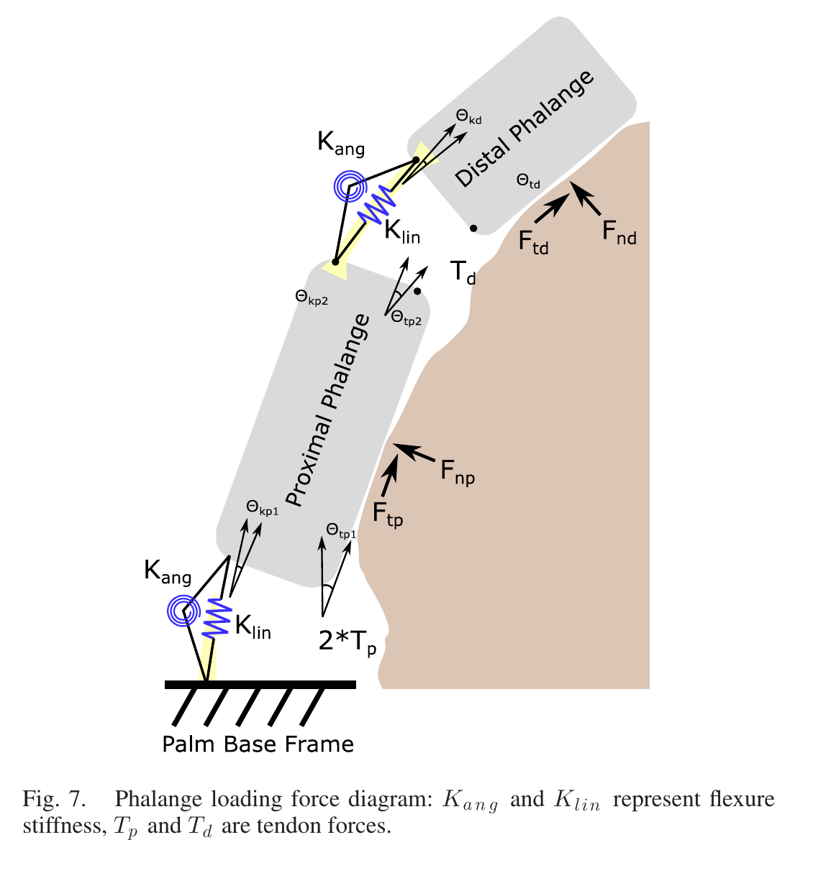
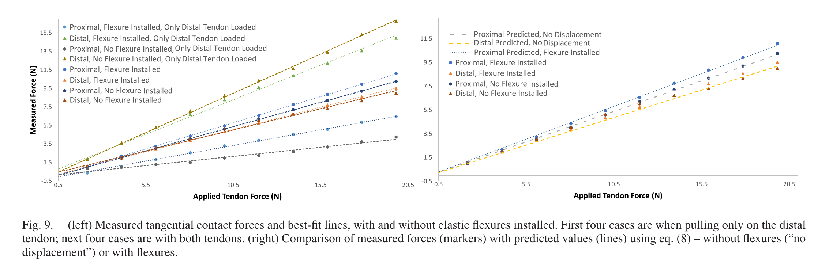
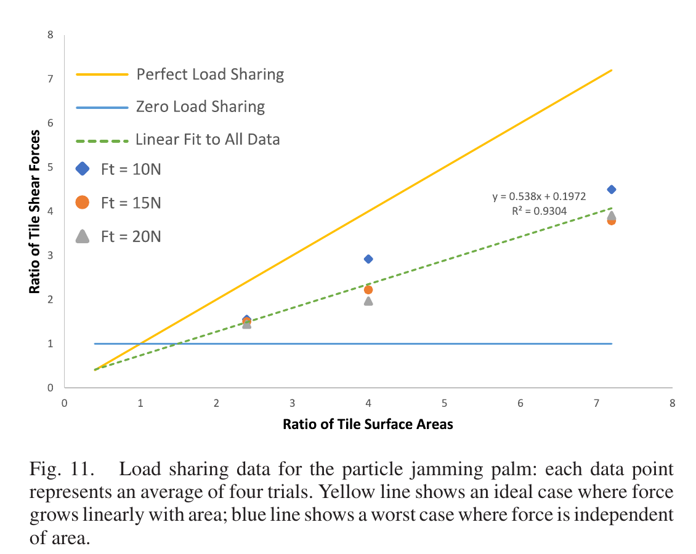

# 论文极简机理证据卡

- 题目：Load-Sharing in Soft and Spiny Paws for a Large Climbing Robot
- 作者：Wilson Ruotolo；Frances S. Roig；Mark R. Cutkosky
- 年份：2019
- DOI：10.1109/LRA.2019.2897002
- 论文类型：机构设计 + 理论 + 实验
- 研究对象：柔顺嵌入刺单元、颗粒阻塞掌面、欠驱动多指及其切向载荷共享
- 相关性等级：A
- 相关性说明：给出单刺等效柔度、指节差动均载和掌面区域分载的方程与直接实验，是阵列/单爪载荷共享的核心证据。
- 长度说明：论文含“嵌入刺—指节—掌面”三个独立层级，按模板放宽至 3500 个中文字符以内。

## 1. 论文实际解决的问题

论文设计可先柔顺贴合、再以真空阻塞增刚的多刺掌面，并用六路均载梁驱动三根双指节手指；输出单刺柔度匹配、指节切向力差和掌面区域分载模型，并用分区测力与曲面滑脱试验验证。

## 2. 核心机理

### M1 柔度存在“凸体破坏—过早滑脱”之间的匹配窗口

- 证据类型：[原文结论]
- 机理内容：系统过硬时，初始接触刺尚未位移到足以让更多刺挂接，凸体已先破坏；系统过软时，初始刺在达到承载潜力前旋转滑脱。设计目标是使旋转极限处的期望弹性刺力接近期望凸体失效力。
- 输入因素：有效刚度 $K_e$、可用转动行程、凸体间距和强度。
- 输出或影响：挂接刺数、单刺峰值力、凸体破坏与旋转滑脱次序。
- 成立条件：准静态切向加载，刺旋转柔度和线性柔度可合并为 $K_e$。
- 失效或不适用条件：未定义负有效行程的截断，也未求多刺竞争或失效后重分配。
- 来源：PDF p.3，Section III-A，Eq. (1)-(3)，Fig. 3。
- 对当前模型的用途：作为柔顺单元刚度/行程初选约束，而非通用最优式。

### M2 接触深度把承载能力与分载能力耦合

- 证据类型：[归纳]
- 机理内容：更深挂接使刺的有效转臂缩短、等效刚度增大；较大凸体的强度又约随尺度平方增加。因此实际单刺力不应被强制相等，较强凸体承担较大力可提高总承载。
- 输入因素：挂接深度、刺尖/凸体尺度、$K_e$。
- 输出或影响：刺间力离散、理想均载上限与实际总承载。
- 成立条件：真空后颗粒床近刚，主要柔度来自仍与刺粘结的聚氨酯皮层。
- 失效或不适用条件：论文未给出挂接深度到 $K_e$ 的显式标定式。
- 来源：PDF p.3-4、7，Section III-A、V，Fig. 3。
- 对当前模型的用途：支持“按局部能力分配”而非“各刺等力”的目标函数。

### M3 软掌面先贴形、颗粒阻塞后承载

- 证据类型：[直接证据]
- 机理内容：未抽真空时掌面顺应高起伏并增加接触刺数；挂接后抽真空锁定整体形状，局部皮层柔度继续允许被动分载。实测力比随受载面积比近似线性增长，但斜率仅 0.538，处于理想均载与不分载之间。
- 输入因素：表面起伏、受载面积、颗粒阻塞状态、皮层柔度。
- 输出或影响：有效接触面积、区域剪力比、掌面总剪力。
- 成立条件：先施加 5 N 挂接预载，再抽真空；屋面瓦粗糙面，10/15/20 N 剪切载荷。
- 失效或不适用条件：140 N 为由低载荷分区试验外推，并非整掌破坏实测。
- 来源：PDF p.6-7，Section IV-B，Fig. 11。
- 对当前模型的用途：提供区域均载指标及“柔顺贴合—锁形承载”两阶段边界。

### M4 均载梁等张力不等于任意曲率下指节等剪力

- 证据类型：[直接证据]
- 机理内容：六路均载梁令各腱近似等张力并把载荷直接送入近接触面的腱索，减少弯矩；指节摩擦、柔性铰链位移和曲率仍造成近/远端剪力差。两腱同时加载时两指节剪力近似相等，只拉远端腱时明显失衡。
- 输入因素：腱力 $T_p,T_d$、销轴摩擦 $mu$、关节位移 $x_p,x_d$、$K_{lin}$ 和各转角。
- 输出或影响：近端/远端切向力差。
- 成立条件：平面静力、腱绕光滑销轴、低曲率时可把角度和位移分别近似相等。
- 失效或不适用条件：弯曲增大时均载变差；理想等载仅对单一几何或两误差项恰好抵消时成立。
- 来源：PDF p.4-6，Section III-C、IV-A，Eq. (4)-(8)，Fig. 6-9。
- 对当前模型的用途：作为多指节/多区域切向载荷兼容方程。

### M5 硬刺—软皮界面需要中间刚度锚块扩散载荷

- 证据类型：[原文结论]
- 机理内容：尖锐钢刺直接嵌入低模量皮层会产生局部大应变、漏气、撕裂或分层；中等硬度锚块与织物背衬把法向/剪切力扩散到 5 mm 厚聚氨酯层。
- 输入因素：刺和皮层刚度比、锚块尺寸、织物背衬和皮层厚度。
- 输出或影响：皮层应变集中、气密性和结构失效。
- 成立条件：本文特定浇注结构与材料组合。
- 失效或不适用条件：未提供界面应力、疲劳寿命或剥离试验。
- 来源：PDF p.2-3，Section III-A，Fig. 3。
- 对当前模型的用途：仅作为整爪结构边界和局部承载上限的工程约束。

## 3. 核心公式

### E1 柔度—凸体失效匹配条件

$$
E[F_{asperity}]\approx E[(d_{travel}-d_{asperity})K_e]=E[F_{spine}].
$$

- 证据类型：设计判据；原公式号：Eq. (1)
- 变量与单位：$F$ 为 N；$d$ 为 mm；$K_e$ 为 N/mm。
- 成立条件：切向准静态、$K_e$ 把旋转与线性柔度等效，且已形成有效挂接。
- 是否可直接进入当前模型：需要修正；须显式截断 $d_{travel}-d_{asperity}\le0$ 的未挂接状态。
- 来源：PDF p.3，Section III-A。

### E2 凸体间距混合分布与掌面单刺估计

$$
P(D_{asperity}=d)\approx(1-\alpha)\delta(d)+\alpha\lambda e^{-\lambda d},
\qquad E[D_{asperity}]=\frac{\alpha}{\lambda},
$$

$$
E[F_{asperity}]\approx\left(L\sin\phi-\frac{\alpha}{\lambda}\right)K_e.
$$

- 证据类型：引入的随机模型 + 设计估计；原公式号：Eq. (2)-(3)
- 变量与单位：$\alpha$ 无量纲；$\lambda$ 为逆长度；$L,d$ 为 mm；$\phi$ 为角度。
- 关键假设：$d_{travel}=L\sin\phi$；屋面瓦取 $\alpha/\lambda=0.73/0.33$，原文未在本处明确 $\lambda$ 单位。
- 是否可直接进入当前模型：需要标定；分布来自前序文献 [30]，红砖三维搜索必须重估。
- 来源：PDF p.3，Section III-A。

### E3 完整指节切向力差

$$
\begin{aligned}
F_{tp}-F_{td}={}&T_p\left[2\cos\theta_{tp1}
-e^{\mu(\theta_{tp1}+\theta_{tp2})}(\cos\theta_{t2}+\cos\theta_{tp2})\right]\\
&+K_{lin}\left[x_d\cos\theta_{kp2}-x_p\cos\theta_{kp1}+x_d\cos\theta_{kd}\right].
\end{aligned}
$$

- 证据类型：平面静力式；原公式号：Eq. (7)
- 变量：$F_{tp},F_{td}$ 为近/远端切向力；$T_p$ 为近端腱力；$\mu$ 为腱—销摩擦；$x_p,x_d$ 为切向位移；角度定义见 Fig. 7。
- 关键假设：外载阶段 $T_d=T_p e^{\mu(\theta_{tp1}+\theta_{tp2})}$；初始驱动阶段高低张力方向相反；指数中的角度须用 rad。
- 是否可直接进入当前模型：需要改写；应保留真实腱路由、摩擦方向和接触曲率。
- 来源：PDF p.5，Section III-C，Eq. (4)-(7)。

### E4 低曲率指节均载近似

$$
F_{tp}-F_{td}=2T_p\cos\theta_t(1-e^{2\mu\theta_t})+xK_{lin}\cos\theta_k.
$$

- 证据类型：简化理论式；原公式号：Eq. (8)
- 成立条件：$\theta_{tp1}\approx\theta_{tp2}\approx\theta_{t2}\approx\theta_t$，$\theta_{kp1}\approx\theta_{kp2}\approx\theta_{kd}\approx\theta_k$，$x_p\approx x_d\approx x$。
- 输出含义：两项相消时近/远端剪力相等；铰链应足够软，弯曲增大时失衡增大。
- 是否可直接进入当前模型：是，作为低曲率校验式；不能替代 Eq. (7) 的通用几何。
- 来源：PDF p.5，Section III-C。

## 4. 关键参数表

| 参数 | 数值或范围 | 单位 | 工况/获得方式 | PDF 来源 | 当前用途 | 注意事项 |
|---|---:|---|---|---|---|---|
| 钢刺直径/长度/尖端半径 | 1 / 7 / 约15 | mm / mm / μm | 淬硬工具钢 | p.2-3 | 刺几何量级 | 掌面样件特定 |
| 锚块尺寸/硬度 | 2×4×7 / 85D | mm / Shore | Task 9 | p.3 | 刚软过渡 | 无界面疲劳数据 |
| 皮层厚度/模量 | 5 / 约344 | mm / kPa | Vytaflex 20 | p.3 | 柔顺层量级 | 非线性本构未给出 |
| 转臂 $L$ / 转角 $\phi$ | 约6 / 约40 | mm / ° | 几何设计 | p.3 | Eq. (3) | 含25°初角+15°越过垂直 |
| 单刺 $K_e$（FEA/实测） | 2.12 / 约2.4 | N/mm | SimScale / 4次试验线性拟合 | p.3, 6 | 单元刚度 | 实测 $R^2=0.96$，高位移略超弹性 |
| 单刺滑脱位移 | 3.73±0.12 | mm | 4次旋转滑脱 | p.6 | 行程上限 | 亚克力凸体 |
| 掌面刺数 | 71 | 根 | 样机 | p.3 | 理想总力上限 | 不等于有效承载刺数 |
| 指节刺数/伸出气压 | 远端50、近端56 / 0.34 | 根 / bar | 气动刺阵列 | p.4 | 阵列规模 | 无刺间分载测量 |
| 腱—钢销摩擦系数 | 约0.12 | 1 | 实测 | p.6 | Eq. (7)-(8) | Dyneema—钢界面 |
| 近似腱角/铰链角 | 约12.5 / 约12.5 | ° | Fig. 9 预测 | p.6 | 指节模型验证 | 代入指数前转 rad |
| 铰链位移项 | $x_dK_{lin}\approx0.04F_{applied}$ | N | 数据近似 | p.6 | 柔性铰链校正 | 仅本试验几何 |
| 单刺/理想掌面预测 | 3.6 / 259 | N | 实测刚度更新后 | p.6 | 上限比较 | 假设71刺等载 |
| 掌面分载斜率/外推总力 | 0.538（正文约0.54）/ 140 | 1 / N | Fig. 11 线性拟合/外推 | p.7 | 区域均载标定 | 10-20 N 数据外推 |
| 曲面掌面滑脱 | 115.3±18.6 | N | 11次试验 | p.7 | 整掌验证 | 椭球半径0.15/0.4 m |
| 整手系统演示下界 | >250 | N | 压满250 N传感器 | p.7 | 系统级可行性 | 未给精确峰值曲线 |

## 5. 最小实验或仿真证据

### V1 指节均载模型得到直接验证

- 类型：实验—理论对比
- 关键工况：近端相对竖直20°、远端再转25°；对比双腱同载/仅远端腱及有/无柔性铰链。
- 结果：仅远端腱加载时近/远端明显失衡；双腱同载时切向力近似相等。Eq. (7)-(8) 对无铰链数据吻合良好，加入 $x_dK_{lin}\approx0.04F_{applied}$ 后可描述有铰链趋势。
- 支撑内容：M4/E3-E4；来源：PDF p.5-6，Fig. 8-9。

### V2 单刺嵌入单元的刚度与滑脱行程

- 类型：实验—FEA 对比
- 关键工况：亚克力凸体加载至刺旋转滑脱，4次试验。
- 结果：线性拟合 $K_e\approx2.4$ N/mm、$R^2=0.96$，接近 FEA 的2.12 N/mm；平均滑脱位移3.73±0.12 mm。
- 支撑内容：M1/E1-E2；来源：PDF p.6，Fig. 10。

### V3 掌面仅达到中等而非理想分载

- 类型：区域测力实验
- 关键工况：5 N挂接预载后抽真空；10/15/20 N剪切；两块25×10至60×50 mm测力区，换位重复；每点4次均值。
- 结果：剪力比—面积比拟合为 $y=0.538x+0.1972$（$R^2=0.9304$），明显优于零分载但低于单位斜率理想均载。
- 支撑内容：M3；来源：PDF p.6-7，Fig. 11。

### V4 曲面整掌滑脱给出外推上限校核

- 类型：整掌实验
- 关键工况：椭球曲面，竖向/横向半径0.15/0.4 m；抽真空后切向加载至旋转滑脱，11次。
- 结果：115.3±18.6 N，低于按区域分载外推的140 N，支持其为略偏高的估计而非破坏实测值。
- 支撑内容：M3/M4；来源：PDF p.7，Section IV-B。

## 6. 关键图片

- 原图号：Fig. 7；PDF 页码：4；保留原因：Eq. (4)-(8) 的力、位移、角度和铰链刚度无法由短文字无歧义替代；支撑 M4/E3-E4。

- 原图号：Fig. 9；PDF 页码：6；保留原因：直接区分单腱失衡、双腱均载、柔性铰链偏差及模型预测；支撑 V1。

- 原图号：Fig. 11；PDF 页码：7；保留原因：直接量化理想、零分载与实测中等分载三种情形；支撑 M3/V3。

## 7. 可迁移关系

- [可直接采用] 以区域剪力比/面积比斜率衡量掌面分载，以及区分理想上限、外推值和破坏实测值。
- [可直接采用] 均载梁提供近似等腱力、Eq. (7) 描述指节几何/摩擦/铰链引起的切向力差。
- [需要标定] 红砖上的凸体间距/强度、$K_e$、刺尖磨损、皮层本构、腱摩擦、有效刺数和区域分载斜率。
- [仅作趋势验证] 柔顺过低或过高均降低阵列利用率；低曲率更易均载；先贴形后锁形提高有效接触面积。
- [仅作上限约束] 259 N 理想等载掌面值与 >250 N 整手传感器下界；二者不是同一试验量。
- [不能直接采用] 把 $140$ N 外推或单刺边缘分布当成红砖阵列破坏力，也不能把区域分载斜率当成逐刺独立等载系数。

## 8. 局限与风险

- Eq. (2) 和屋面瓦参数来自前序文献 [30]；本文未重建三维表面搜索或刺间接触相关性。
- 指节模型是平面准静态模型，不含整体力矩平衡、动态冲击、腱伸长、法向接触变化或多指耦合。
- 掌面分区试验仅在10-20 N剪切下进行，140 N为外推；Fig. 11 拟合还有0.1972截距。
- 因担心损坏，作者未在岩石上进行整爪直接拉脱；分载试验使用较弱的屋面瓦和60目砂纸。
- 曲面试验只测掌面，表面凸体密度又不同于标定用屋面瓦；不能据此分离材料、形貌和机构误差。
- 论文没有逐刺力、阵列间距、搜索轨迹竞争、行程饱和或单刺失效后的显式重分配数据。
- “超过250 N”只说明传感器过载，没有精确峰值、误差和失效模式。

## 9. 对当前研究的最小贡献

论文提供从嵌入单刺柔度匹配，到指节差动均载，再到锁形掌面区域分载的三级接口及实验校核；真实红砖三维搜索、逐刺载荷共享、渐进失效和对爪力矩平衡仍需其他文献补足。
