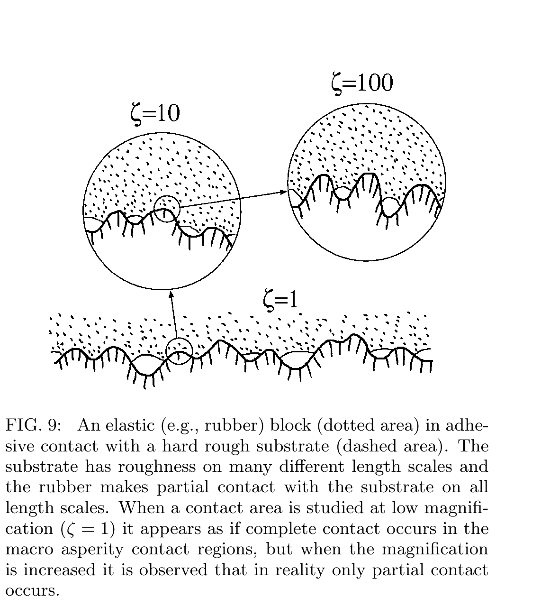
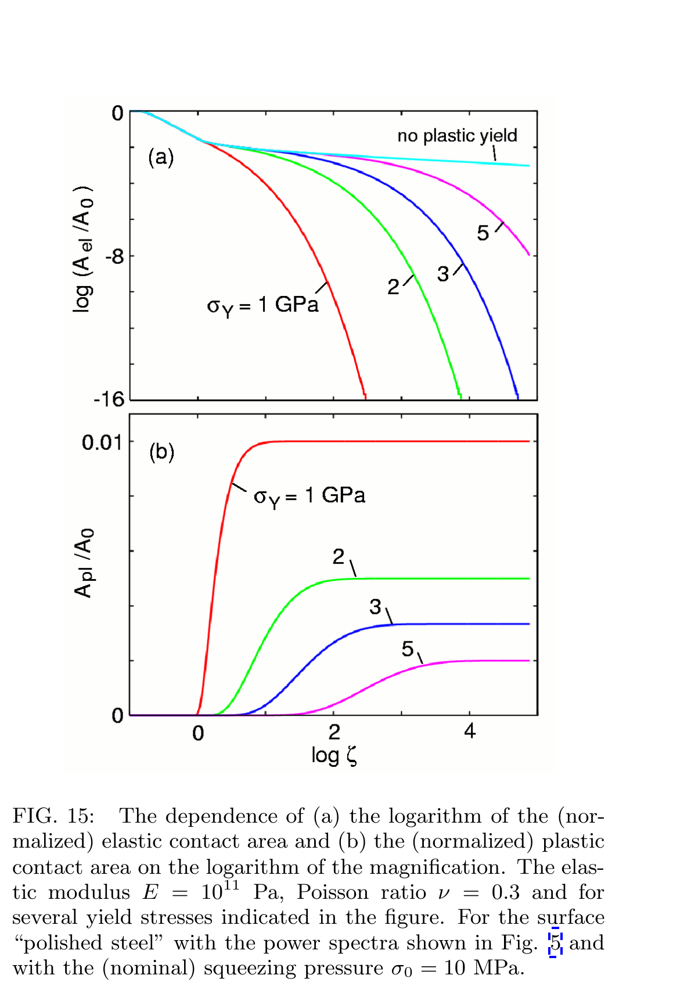
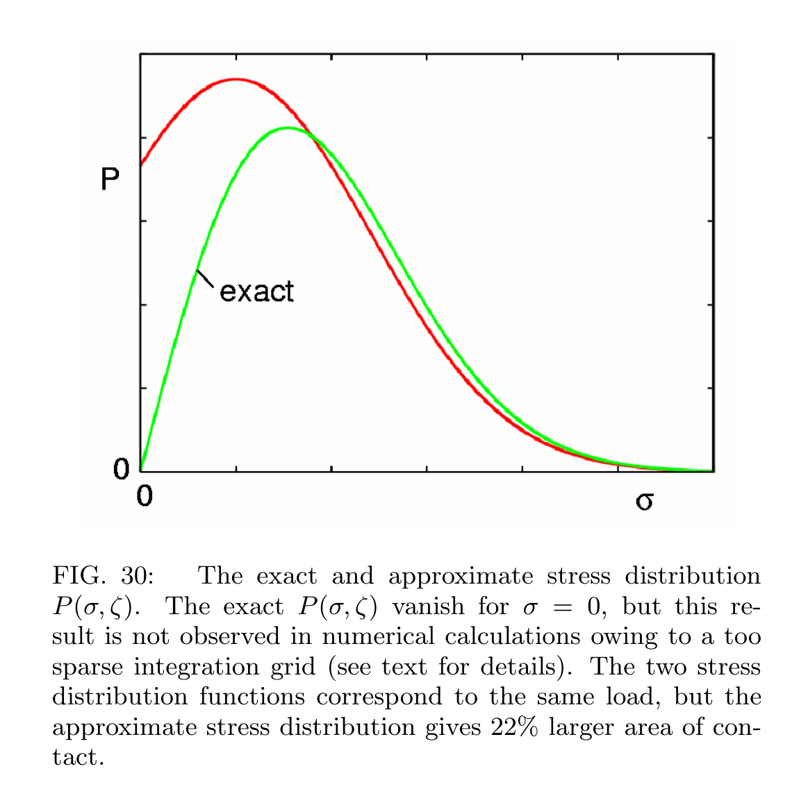

# 论文极简机理证据卡

## 1. 基本信息

- 题目：Contact mechanics for randomly rough surfaces
- 作者：B. N. J. Persson
- 年份：2006
- DOI：10.1016/j.surfrep.2006.04.001
- 论文类型：综述 + 理论推导 + 数值/实验案例分析
- 研究对象：具有多尺度随机粗糙度的名义平面接触，涵盖弹性、理想弹塑性和黏附分支
- 相关性等级：A
- 相关性说明：直接提供二维功率谱地形生成、尺度分辨接触方程及局部屈服和数值收敛边界。
- 长度说明：含形貌生成、弹性/弹塑性接触和数值质控四个子模型，按模板放宽至 3500 字。

## 2. 论文实际解决的问题

论文以二维功率谱表示跨尺度粗糙度，建立随放大倍数演化的法向应力概率分布，据此计算接触面积及弹性、塑性、非接触区域；当前任务只取非黏附主线。

## 3. 核心机理

### M1 功率谱而非单一粗糙度控制多尺度接触

- 证据类型：[原文结论]
- 机理内容：二维功率谱 $C(q)$ 保留各波长幅值；自仿射区满足幂律并有长、短波截止。更大的 rms 高度不保证更强接触/摩擦。
- 输入因素：实测高度场、波数范围、Hurst 指数、roll-off。
- 输出或影响：可生成形貌的谱输入及尺度分辨接触响应。
- 成立条件：统计平稳、各向同性随机表面。
- 失效或不适用条件：方向性、非高斯峰形和局部缺陷只靠径向平均 $C(q)$ 会丢失。
- 来源：PDF p.2-4，Section 2，Fig. 2-5。
- 对当前模型的用途：以红砖实测二维 PSD 替代只用 $S_a/R_a$ 的地形表征。

### M2 随机相位叠加可由目标功率谱生成地形

- 证据类型：[直接证据]
- 机理内容：给定 $C(q)$ 后，以独立均匀随机相位叠加傅里叶模态，生成目标二阶统计的随机高度场。
- 输入因素：$C(q)$、域长 $L$、离散波矢、随机相位。
- 输出或影响：随机地形实现 $h(x)$。
- 成立条件：有限离散域、周期边界、目标由二阶统计充分描述。
- 失效或不适用条件：原式未显式写出实值场所需的共轭对称；也不保证目标高度偏度、峰度或孤立孔洞。
- 来源：PDF p.3，Section 2，Eq. (1)。
- 对当前模型的用途：作为地形生成器基线；实现时补 Hermitian 对称并验证回算 PSD。

### M3 放大倍数把隐藏短波粗糙度转化为部分接触

- 证据类型：[归纳]
- 机理内容：低倍下看似完全接触的区域，加入高波数后分裂成微接触与非接触；应力概率沿尺度扩散，强度由 $q^3C(q)$ 加权。
- 输入因素：$C(q)$、$E$、$\nu$、名义压力 $\sigma_0$、放大倍数 $\zeta$。
- 输出或影响：$P(\sigma,\zeta)$、$A(\zeta)/A_0$ 和接触状态随尺度演化。
- 成立条件：无黏附、线弹性半空间、法向接触；扩散方程由完全接触推得并近似延拓到部分接触。
- 失效或不适用条件：原子尺度、非线性材料、有限厚度或脆性裂纹主导。
- 来源：PDF p.7-11，Sections 3.4-4，Eq. (14)-(26)，Fig. 9-13。
- 对当前模型的用途：给出形貌到法向接触占比/应力分布的子模型。

### M4 低接触率下真实接触面积与法向载荷近线性

- 证据类型：[直接证据]
- 机理内容：$A\ll A_0$ 时有 $A=\alpha F_N$；增载形成新接触并扩展既有接触，应力与接触斑尺寸分布近似不变。
- 输入因素：$F_N$、弹性参数、$\int d^2q\,q^2C(q)$。
- 输出或影响：真实接触面积斜率 $\alpha$。
- 成立条件：低接触率、无黏附、弹性接触。
- 失效或不适用条件：接近完全接触、显著黏附、屈服或破坏；不同理论的系数 $\kappa$ 不同。
- 来源：PDF p.7-10、p.26-27，Sections 3.3-3.5、13，Eq. (22)，Fig. 10-11。
- 对当前模型的用途：用于低载趋势验证，不直接替代单刺切向啮合承载式。

### M5 应力分布跨边界的“面积通量”区分非接触与塑性接触

- 证据类型：[直接证据]
- 机理内容：无黏附时 $P(0,\zeta)=0$；理想弹塑性再加 $P(\sigma_Y,\zeta)=0$。随 $\zeta$ 增大，概率分别流向非接触和塑性区；尺度相关硬度需加入 $\sigma_Y'$ 项。
- 输入因素：$P$、$f(\zeta)$、压痕硬度 $\sigma_Y(\zeta)$。
- 输出或影响：$A_{el}$、$A_{pl}$、$A_{non}$ 及面积守恒。
- 成立条件：理想弹塑性、法向压力上限由压痕硬度控制。
- 失效或不适用条件：红砖脆性压碎、剪切裂纹和碎屑再接触不能用理想塑流代表。
- 来源：PDF p.11-13，Sections 4、6-7，Eq. (26)-(34)，Fig. 15。
- 对当前模型的用途：仅作接触压力封顶和状态划分的候选框架。

### M6 稀疏网格会系统性高估真实接触面积

- 证据类型：[原文结论]
- 机理内容：网格不足使数值 $P$ 在 $\sigma=0$ 处不消失；同一总载荷下，其零阶矩即接触面积偏大。Fig. 30 示意高估 22%。
- 输入因素：最短粗糙波长 $\lambda_1$、最小接触斑尺度、每斑网格数。
- 输出或影响：接触面积和低应力尾部的离散偏差。
- 成立条件：以节点/网格判定接触的连续体离散。
- 失效或不适用条件：22% 是示意案例，不是通用修正系数；2006 年算力上限也不是当前硬约束。
- 来源：PDF p.25-26，Section 12，Fig. 30。
- 对当前模型的用途：把 $P(0)=0$、接触面积和网格加密联合设为收敛指标。

## 4. 核心公式

### E1 二维功率谱与自仿射标度

$$
C(\mathbf q)=\frac{1}{(2\pi)^2}\int d^2x\,\langle h(\mathbf x)h(\mathbf 0)\rangle e^{-i\mathbf q\cdot\mathbf x},
\qquad C(q)\sim q^{-2(H+1)},\quad D_f=3-H.
$$

- 证据类型：定义式 + 标度关系
- 原公式号：Section 2 无编号式
- 变量：$h$ 为相对平均平面的高度；$q=|\mathbf q|$；$H$ 为 Hurst 指数；$D_f$ 为表面分形维数。
- 单位：$h$ 为 m，$q$ 为 m$^{-1}$，按该归一化 $C$ 为 m$^4$。
- 正方向或角度定义：$\langle h\rangle=0$；文中仅考虑各向同性 $C(\mathbf q)=C(q)$。
- 成立条件：统计平稳；幂律仅用于有限 $q_0<q<q_1$。
- 关键假设：二阶统计足以描述所需形貌特征。
- 参数来源：实测二维高度场。
- 输出含义：各空间尺度的粗糙能量和自仿射斜率。
- 是否可直接进入当前模型：需要修正
- 所需修正：方向性红砖保留二维 $C(q_x,q_y)$，不要只做径向平均。
- 来源：PDF p.2-3，Section 2，Fig. 2。

### E2 目标谱随机表面生成

$$
h(\mathbf x)=\sum_{\mathbf q}B(\mathbf q)e^{i[\mathbf q\cdot\mathbf x+\phi(\mathbf q)]},
\qquad B(\mathbf q)=\frac{2\pi}{L}\sqrt{C(\mathbf q)}.
$$

- 证据类型：生成式
- 原公式号：Eq. (1)
- 变量：$\phi(\mathbf q)\sim U[0,2\pi)$ 独立；$L=A_0^{1/2}$。
- 单位：$B$ 和 $h$ 为 m。
- 正方向或角度定义：$\mathbf x=(x,y)$；相位从 $0$ 到 $2\pi$。
- 成立条件：有限周期域和离散波数集合。
- 关键假设：随机相位、目标主要由 PSD 决定。
- 参数来源：目标 $C(\mathbf q)$ 与域尺寸。
- 输出含义：随机粗糙高度场。
- 是否可直接进入当前模型：需要修正
- 所需修正：对 $\pm\mathbf q$ 施加共轭对称、去均值，并核对离散 FFT 归一化。
- 来源：PDF p.3，Section 2。

### E3 尺度分辨应力分布与接触面积

$$
P(\sigma,\zeta)=\frac{1}{A_0}\int_A d^2x\,\delta[\sigma-\sigma(\mathbf x,\zeta)],
\qquad \frac{A(\zeta)}{A_0}=\int d\sigma\,P(\sigma,\zeta).
$$

- 证据类型：定义式
- 原公式号：Eq. (14)-(16)
- 变量：$\zeta=L/\lambda=q/q_L$；$A$ 为该尺度的接触区。
- 单位：$P$ 为 Pa$^{-1}$，$\sigma$ 为 Pa。
- 正方向或角度定义：压应力取正；积分只在接触区，非接触区的 $\delta(\sigma)$ 项被排除。
- 成立条件：给定尺度下的界面法向应力场。
- 关键假设：面积投影到 $xy$ 平面。
- 参数来源：接触求解或 E4 的概率方程。
- 输出含义：接触面积是 $P$ 的零阶矩；载荷是其一阶矩。
- 是否可直接进入当前模型：是
- 所需修正：多材料接触需统一名义面积和压力符号。
- 来源：PDF p.7-8，Section 3.4。

### E4 无黏附弹性应力扩散

$$
\frac{\partial P}{\partial\zeta}=f(\zeta)\frac{\partial^2P}{\partial\sigma^2},\qquad
f(\zeta)=\frac{\pi}{4}\left(\frac{E}{1-\nu^2}\right)^2q_Lq^3C(q),\quad q=\zeta q_L,
$$

$$
P(\sigma,1)=\delta(\sigma-\sigma_0),\qquad P(0,\zeta)=0,qquad P(\sigma<0,\zeta)=0.
$$

- 证据类型：理论式 + 边界判据
- 原公式号：Eq. (17)-(19)；$P(0,\zeta)=0$ 在 Section 4 证明
- 变量：$E,\nu$ 为弹性参数；$q_L=2\pi/L$；$\sigma_0=F_N/A_0$。
- 单位：$f$ 为 Pa$^2$。
- 正方向或角度定义：压应力为正，无黏附时不允许拉应力。
- 成立条件：弹性体对刚性粗糙基底、法向准静态接触。
- 关键假设：完全接触推导的方程局部延拓到部分接触，并近似计入接触区弹性耦合。
- 参数来源：材料参数和 PSD。
- 输出含义：随分辨率增加的法向应力概率演化。
- 是否可直接进入当前模型：需要修正
- 所需修正：钢刺—红砖应使用等效接触模量，并另接脆性损伤状态。
- 来源：PDF p.8、p.11，Sections 3.4、4。

### E5 无黏附弹性接触面积闭式解

$$
\frac{A(\zeta)}{A_0}=\operatorname{erf}\!\left(\frac{1}{2\sqrt{G(\zeta)}}\right),
$$

$$
G(\zeta)=\frac{\pi}{4}\left[\frac{E}{(1-\nu^2)\sigma_0}\right]^2
\int_{q_L}^{\zeta q_L}dq\,q^3C(q).
$$

- 证据类型：理论式
- 原公式号：Eq. (20)-(21)
- 变量：$G$ 为无量纲谱—刚度—载荷组合。
- 单位：$A/A_0$、$G$ 无量纲。
- 正方向或角度定义：同 E4。
- 成立条件：E4 的初边值条件。
- 关键假设：各向同性 PSD、线弹性、无黏附。
- 参数来源：$C(q),E,\nu,\sigma_0$。
- 输出含义：给定分辨率下的表观接触比例。
- 是否可直接进入当前模型：需要修正
- 所需修正：用目标材料等效模量与实际波数窗；不把接触面积直接当作可啮合面积。
- 来源：PDF p.8，Section 3.4。

### E6 低载真实接触面积斜率

$$
A=\alpha F_N,\qquad
\alpha=\kappa\frac{1-\nu^2}{E}
\left(\int d^2q\,q^2C(q)\right)^{-1/2}.
$$

- 证据类型：渐近理论式
- 原公式号：Eq. (22)
- 变量：Persson 理论 $\kappa=\sqrt{8/\pi}$；Bush 理论 $\kappa=\sqrt{2\pi}$。
- 单位：$\alpha$ 为 Pa$^{-1}$，$A$ 为 m$^2$。
- 正方向或角度定义：$F_N>0$ 为压紧。
- 成立条件：$A\ll A_0$、弹性、无黏附。
- 关键假设：粗糙度跨多个尺度。
- 参数来源：PSD 和弹性参数。
- 输出含义：低载面积—载荷斜率。
- 是否可直接进入当前模型：否
- 所需修正：只作法向连续接触趋势；单刺切向互锁还需几何、摩擦和损伤判据。
- 来源：PDF p.8，Section 3.5。

### E7 恒定硬度的塑性面积通量

$$
P(0,\zeta)=P(\sigma_Y,\zeta)=0,\qquad
A'_{pl}(\zeta)=-A_0f(\zeta)\frac{\partial P}{\partial\sigma}(\sigma_Y,\zeta),
$$

$$
A_{el}+A_{pl}+A_{non}=A_0.
$$

- 证据类型：边界判据 + 守恒式
- 原公式号：Eq. (27)-(32)，其中 $A'_{pl}$ 为 Eq. (29)
- 变量：$\sigma_Y$ 为压痕硬度；撇号表示对 $\zeta$ 求导。
- 单位：面积为 m$^2$，$\sigma_Y$ 为 Pa。
- 正方向或角度定义：$\sigma=0$ 流向非接触，$\sigma=\sigma_Y$ 流向塑性接触。
- 成立条件：恒定硬度、理想塑性、无应变硬化。
- 关键假设：塑性区压力固定为 $\sigma_Y$。
- 参数来源：压痕试验；文中指出硬度约为单轴压缩屈服应力的 3 倍。
- 输出含义：弹性/塑性/非接触区随尺度的划分。
- 是否可直接进入当前模型：否
- 所需修正：红砖需用压碎/剪裂/断裂准则替代塑流边界。
- 来源：PDF p.12-13，Section 6，Fig. 15。

### E8 尺度相关硬度的修正边界

$$
A'_{pl}=-A_0\sigma'_Y P(\sigma_Y,\zeta)-A_0f(\zeta)\frac{\partial P}{\partial\sigma}(\sigma_Y,\zeta),
$$

$$
\sigma'_Y(\zeta)A_{pl}(\zeta)-A_0f(\zeta)P(\sigma_Y,\zeta)=0.
$$

- 证据类型：理论式
- 原公式号：Eq. (33)-(34)
- 变量：$\sigma_Y(\zeta)$ 为随接触尺度变化的压痕硬度。
- 单位：同 E7。
- 正方向或角度定义：同 E7。
- 成立条件：硬度可表示为单值尺度函数。
- 关键假设：仍为理想弹塑性而非脆性损伤。
- 参数来源：跨尺度压痕标定。
- 输出含义：移动硬度边界下的塑性面积通量与边界值。
- 是否可直接进入当前模型：否
- 所需修正：只有获得红砖微尺度压痕/划擦证据并确认塑性主导后才启用。
- 来源：PDF p.13，Section 7。

## 5. 关键参数表

| 参数 | 符号 | 数值或范围 | 单位 | 材料/工况 | 获得方式 | PDF 来源 | 当前用途 | 注意事项 |
|---|---|---:|---|---|---|---|---|---|
| 长波极限 | $q_L$ | $2\pi/L$ | m$^{-1}$ | 任意有限域 | 定义 | p.3, Fig. 2 | 地形最低波数 | 与采样域绑定 |
| roll-off | $q_0$ | 表面相关 | m$^{-1}$ | 多尺度表面 | PSD 拐点 | p.3, Fig. 2 | 参考尺度 | 红砖需实测 |
| 短波截止 | $q_1$ | 表面/分辨率相关 | m$^{-1}$ | 多尺度表面 | 物理或仪器截止 | p.3, Fig. 2 | 最小粗糙尺度 | 不应默认到原子尺度 |
| 自仿射指数 | $H$ | $3-D_f$ | 1 | 自仿射区 | PSD 斜率 | p.3 | 合成谱斜率 | 只在有限波数区有效 |
| Persson 系数 | $\kappa$ | $\sqrt{8/\pi}\approx1.596$ | 1 | 低载弹性 | 理论 | p.8, Eq. (22) | 面积斜率基线 | Bush 值不同 |
| Bush 系数 | $\kappa$ | $\sqrt{2\pi}\approx2.507$ | 1 | 低载弹性 | 理论 | p.8, Eq. (22) | 理论区间对照 | 忽略接触区耦合 |
| 线性区示例 | $A/A_0$ | $<0.1$ | 1 | Hyun 等有限元 | 数值观察 | p.9, Fig. 11 | 趋势验证 | 非普适阈值 |
| 硬度关系 | $\sigma_Y$ | 约 $3\times$ 单轴压缩屈服应力 | Pa | 理想弹塑性说明 | 经验关系 | p.12, Section 6 | 防止错用强度 | 压痕硬度不等于红砖断裂强度 |
| Fig. 15 工况 | $E,\nu,\sigma_0$ | $10^{11},0.3,10$ | Pa, 1, MPa | “polished steel”算例 | 指定输入 | p.13, Fig. 15 | 仅验证方向 | 不是目标材料参数 |
| Fig. 15 硬度 | $\sigma_Y$ | 1, 2, 3, 5 | GPa | 同上 | 参数扫描 | p.13, Fig. 15 | 塑性面积趋势 | 不可迁移到红砖 |
| 最小接触斑网格 | - | 至少 $10\times10$，优选约 $100\times100$ | 点/斑 | 文中数值建议 | 收敛经验 | p.26, Section 12 | 网格下限检查 | 2006 年经验，不是固定标准 |

## 6. 最小实验或仿真证据

### V1 低载面积线性与系数量级

- 类型：数值对比
- 关键工况：自仿射弹性表面接触刚性平面；$A/A_0<0.1$。
- 观测量：$A/F_N$ 与 $\kappa(H)$。
- 结果：Hyun 等有限元得到 $A\propto F_N$；$\kappa$ 随 $H$ 的结果位于两种解析预测附近。
- 数据处理定义：节点接触面积按节点对应方格计数。
- 支撑的机理或公式：M4、E6。
- 来源：PDF p.9，Fig. 11。

### V2 解析斜率与离散方法存在约 10%-20% 差异

- 类型：理论—数值对比
- 关键工况：$D_f=2.2$ 自仿射表面。
- 观测量：低载面积斜率 $\alpha$。
- 结果：文中汇总 MD 比理论高 14%、Hyun 高 13%，另一 DCM 约低 20%；差异与接触面积定义及网格有关。
- 数据处理定义：不同离散方法对“接触”的判定不一致。
- 支撑的机理或公式：E6 与数值不确定性。
- 来源：PDF p.9-10，Section 3.5。

### V3 硬度降低使塑性面积更早出现并增大

- 类型：理论数值算例
- 关键工况：$E=10^{11}$ Pa、$\nu=0.3$、$\sigma_0=10$ MPa，$\sigma_Y=1$-5 GPa。
- 观测量：$A_{el}/A_0$、$A_{pl}/A_0$ 随 $\zeta$。
- 结果：随放大倍数增加，塑性区持续增长并趋向 $\sigma_0/\sigma_Y$；硬度越低，转化越早、比例越高。
- 数据处理定义：恒定硬度、理想塑性。
- 支撑的机理或公式：M5、E7。
- 来源：PDF p.13，Fig. 15。

### V4 稀疏网格接触面积高估示意

- 类型：理论对比
- 关键工况：精确与近似 $P(\sigma,\zeta)$ 具有相同一阶矩。
- 观测量：$P(0)$ 与零阶矩 $A/A_0$。
- 结果：近似分布在零应力处非零，示意案例的接触面积高 22%。
- 数据处理定义：总载荷固定，比较概率分布零阶矩。
- 支撑的机理或公式：M6、E3-E4。
- 来源：PDF p.26，Fig. 30。

## 7. 关键图片

- 原图号：Fig. 9；PDF 页码：7；保留原因：不可由单个公式替代地展示“低分辨完全接触—高分辨部分接触”的尺度状态；支撑 M3/E3-E5。

- 原图号：Fig. 15；PDF 页码：13；保留原因：同时展示硬度、放大倍数与弹/塑面积通量的关系；支撑 M5/E7。

- 原图号：Fig. 30；PDF 页码：26；保留原因：给出 $P(0)=0$ 的数值验收含义及同载荷下面积高估的直接图示；支撑 M6/V4。

## 8. 可迁移关系

- [可直接采用] PSD 定义、有限波数窗与 Eq. (1) 的随机相位生成框架。
- [需要修正] Eq. (17)-(21) 用钢刺—红砖等效模量、实测二维 PSD 和有限尺度边界重新参数化。
- [需要标定] $q_0,q_1,H$、方向性谱以及微尺度压痕/压碎边界。
- [仅作上限约束] 理想弹塑性硬度边界；红砖局部剪裂、压碎和碎屑状态需另建。
- [仅作趋势验证] 低载 $A\propto F_N$ 与网格不足导致面积偏高。
- [不能直接采用] 黏附、PMMA、Pyrex 及轮胎案例参数；它们不是非黏附钢刺—烧结红砖工况。

## 9. 局限与风险

- 主公式假设各向同性统计；径向平均 PSD 会抹去红砖纹理方向性。
- Eq. (1) 只约束二阶统计且未显式写实值场共轭条件，不能保证峰谷非高斯形态。
- Persson 扩散方程在部分接触下是近似延拓，且原式针对弹性体—刚性粗糙基底。
- 理想硬度边界描述塑流，不等价于红砖的压碎、剪裂、断裂或碎屑再接触。
- 论文未处理有限半径爪刺、切向摩擦锥、搜索路径、互锁与主动脱附。
- 本地 PDF 为 arXiv v1；页码和公式号按该文件核对，DOI 对应出版版本，引用时应避免混用出版社页码。

## 10. 对当前研究的最小贡献

该文为“实测/合成多尺度形貌—法向接触面积与应力分布—局部屈服候选边界”提供理论底座，并给出网格收敛警告；不能解决单刺切向互锁、红砖脆性损伤、多刺载荷共享或对爪平衡。
