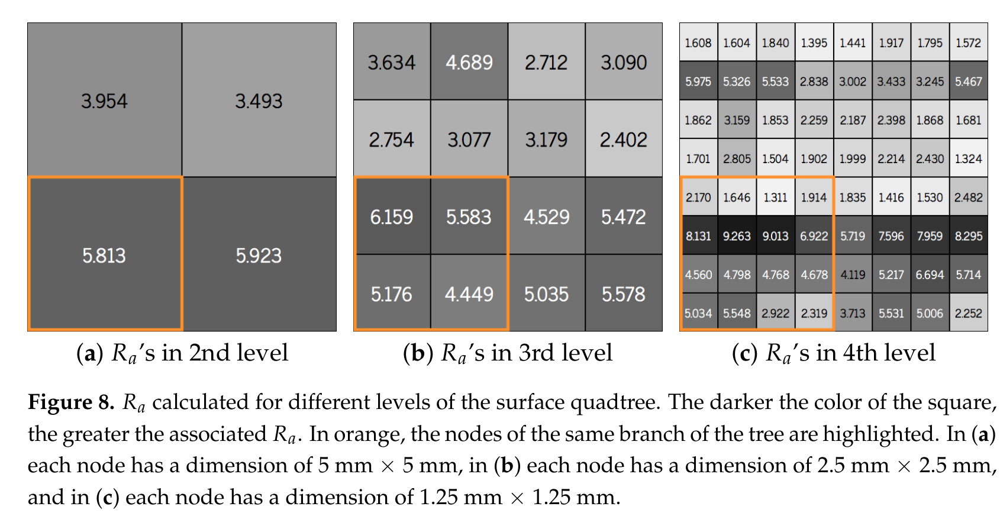

# 论文极简机理证据卡

- 题目：A Critical Analysis of Red Ceramic Blocks Roughness Estimation by 2D and 3D Methods
- 作者：Daiana Cristina Metz Arnold；Valéria Costa de Oliveira；Claudio de Souza Kazmierczak；Leandro Tonietto；Camila Werner Menegotto；Luiz Gonzaga Jr.；Cristiano André da Costa；Maurício Roberto Veronez
- 年份：2021
- DOI：10.3390/rs13040789
- 论文类型：实验 / 表面测量方法
- 研究对象：不同烧成温度红陶砖的二维接触式与三维激光形貌测量
- 相关性等级：A
- 相关性说明：直接给出红陶砖表面方向/位置异质性、二维欠采样偏差和三维点云分区表征方法，可约束 M1 的真实地形输入与质控。

## 1. 论文实际解决的问题

论文比较同一批红陶砖用二维触针轮廓与三维激光点云得到的粗糙度，检验单线测量是否受方向和位置影响，并输出基于拟合平面、四叉树分区及局部粗糙度签名的三维表征流程。

## 2. 核心机理

### M1 线采样不能代表异质红陶砖表面

- 证据类型：[原文结论]
- 机理内容：挤出条纹、烧成裂纹和局部表面伪影使红陶砖具有位置与方向相关的面内变化；单条二维轮廓只截取其中一条路径，所得 $R_a$ 随测线位置/方向改变。
- 输入因素：测线方向、测线位置、表面制造异质性。
- 输出或影响：二维 $R_a$ 的方差和代表性。
- 成立条件：本文 10 mm × 10 mm 红陶砖测区及触针测量流程。
- 失效或不适用条件：不能由本文推断任意砖材的方向性强度，也不能把所有水平—垂直配对都视为显著不同。
- 来源：PDF p.7、p.11-13、p.15-16，Table 1-2。
- 对当前模型的用途：否定“单条轮廓或单个 $R_a$ 足以生成代表性红砖地形”的输入假设。

### M2 探针几何与测量分辨率构成形貌滤波器

- 证据类型：[归纳]
- 机理内容：有限半径触针不能进入高频、尖锐峰谷，线采样还遗漏未穿过的极值；三维激光点云覆盖整片区域并具有不同量程/分辨率，因此两法输出不是可互换的材料常数。
- 输入因素：触针半径、激光/触针分辨率、采样维度与覆盖面积。
- 输出或影响：峰谷保真度、$R_a$ 均值和离散度。
- 成立条件：本文两套仪器与预处理方法。
- 失效或不适用条件：仪器与采样尺度改变后，本文 2D/3D 偏差比例必须重测。
- 来源：PDF p.4-5、p.8、p.14-16，Fig. 2，Table 4。
- 对当前模型的用途：规定输入地形必须携带空间分辨率、探头传递效应和测区尺度元数据。

### M3 三维粗糙度由统一拟合平面的高度残差计算

- 证据类型：[直接证据]
- 机理内容：每个 10 mm × 10 mm 点云先用最小二乘拟合一个平均平面，再以各点沿 $Z$ 轴到该平面的有符号距离区分峰/谷，并对绝对距离求平均；所有四叉树节点共享该全局拟合平面。
- 输入因素：三维点云、拟合平面、节点范围。
- 输出或影响：全域与局部 $R_a$ 及其空间分布。
- 成立条件：测区可由单一平面去趋势，且 $Z$ 轴距离可作为高度残差。
- 失效或不适用条件：强曲面、台阶或宏观形状误差需另行去趋势；论文未比较替代滤波/基准面。
- 来源：PDF p.8-9，Fig. 7-9。
- 对当前模型的用途：可直接改写为实测红砖点云的预处理与分区统计基线。

### M4 四叉树揭示尺度依赖与局部非均匀性

- 证据类型：[直接证据]
- 机理内容：同一 10 mm × 10 mm 表面按 5、2.5、1.25 mm 方格逐级细分后，各节点 $R_a$ 显著不同；单个全域均值会抹平局部高粗糙带和低粗糙区。
- 输入因素：节点尺度、节点位置、同一拟合平面下的高度残差。
- 输出或影响：多尺度粗糙度签名、局部统计和空间热图。
- 成立条件：规则方形测区和四叉树分割。
- 失效或不适用条件：$R_a$ 只反映高度幅值，不能替代局部坡度、曲率、方向、PSD 或刺尖可达性。
- 来源：PDF p.8-10，Fig. 8-10。
- 对当前模型的用途：用于地形质量图和局部采样充分性检查，不直接等同啮合能力图。

### M5 测量方法系统改变所见粗糙度分布

- 证据类型：[直接证据]
- 机理内容：48 个样区的三维/二维平均 $R_a$ 分别为 2.2701/1.6697 μm；二维均值为三维均值的 73.6%，且二维结果更集中在低值区间。
- 输入因素：二维触针或三维激光测量方法。
- 输出或影响：$R_a$ 均值、方差和分档分布。
- 成立条件：本文样品、设备、测区与数据处理。
- 失效或不适用条件：这是方法相关实验差异，不是二维值到真实三维值的普适换算系数。
- 来源：PDF p.13-15，Table 3-6，Fig. 11。
- 对当前模型的用途：可作“二维输入低估局部形貌幅值”的趋势验证和数据源筛选标准。

## 3. 核心公式

### E1 平均绝对高度残差

$$
R_a \approx \frac{1}{n}\sum_{i=1}^{n}|z_i|
$$

- 证据类型：定义式；原式无编号。
- 变量：$n$ 为评估域内采样点数；$z_i$ 为第 $i$ 点相对轮廓基准或三维拟合平面的 $Z$ 向有符号高度残差。
- 单位：$z_i$ 与 $R_a$ 均为长度，本文结果用 μm。
- 正方向：拟合平面以上为正峰、以下为负谷，公式取绝对值。
- 成立条件：先完成基准线/面的确定；三维节点沿用整幅点云的同一个拟合平面。
- 关键假设：高度方向为 $Z$，平均绝对偏差足以代表目标粗糙度。
- 是否可直接进入当前模型：需要修正。
- 所需修正：三维面参数应明确命名约定；同时保留原始高度场并补算坡度、曲率、方向谱、PSD/相关长度和有限刺尖可达性。
- 来源：PDF p.5、p.8，Section 2。

## 4. 关键参数表

| 参数 | 数值或范围 | 单位 | 来源 | 当前用途 | 注意事项 |
|---|---:|---|---|---|---|
| 砖块尺寸 | 9 × 14 × 24 | cm | p.5 | 样品背景 | 不代表局部测区尺度 |
| 烧成温度 | 700 / 800 / 900 / 1000 | °C | p.5 | 覆盖不同表面状态 | 未给出温度—形貌响应模型 |
| 升温速率 / 保温 | 150 / 10 | °C·h⁻¹ / h | p.5 | 制样边界 | 只针对本文同一黏土 |
| 测区 | 10 × 10 | mm | p.6、p.8 | 地形窗口 | 人工避开宏观缺陷 |
| 三维样区数 | 48 | 个 | p.8 | 统计样本量 | 4 个温度组的分层独立性未充分报告 |
| 三维采样节距 | 10 | μm | p.8 | 名义空间分辨率 | 与“每区约 10,000 点”不相容 |
| 三维点数 | 约 10,000 | 点/区 | p.8 | 数据规模 | 10 mm × 10 mm、10 μm 规则网格应约为 $10^6$ 点 |
| 二维触针半径 / 角度 | 5 / 90 | μm / ° | p.5 | 仪器滤波边界 | p.16 又写针尺寸 4 μm |
| 三维标尺分辨率 | 0.1 | μm | p.5 | 量测下限 | 不等同真实横向点距 |
| 局部分区尺度 | 5 / 2.5 / 1.25 | mm | p.9，Fig. 8 | 多尺度统计 | 四叉树第 2/3/4 层 |
| 三维 / 二维平均 $R_a$ | 2.2701 / 1.6697 | μm | p.14，Table 4 | 方法差趋势 | 不可作通用换算 |
| 三维 / 二维方差 | 0.5814 / 0.2543 | μm² | p.14，Table 4 | 离散性对照 | 正态性为检验前提 |

## 5. 最小实验或仿真证据

### V1 二维方向与位置效应

- 类型：实验 / F 检验。
- 关键工况：48 个 10 mm × 10 mm 样区，每区两条水平线和两条垂直线，显著性水平 0.05。
- 结果：合并水平线与合并垂直线比较为 $F=2.2731>1.4038$、$p=0.00004$；部分单线配对不显著，说明偏差依赖具体位置与方向而非固定方向常数。
- 支撑的机理：M1。
- 来源：PDF p.11-13，Table 1-2。

### V2 三维与二维方法差异

- 类型：实验 / Z 检验。
- 关键工况：同一 48 个样区，经论文方法将二维交叉测线拟合为稀疏点云后与三维结果比较。
- 结果：$Z=4.5501>1.96$；三维/二维平均 $R_a=2.2701/1.6697$ μm，差异显著。
- 支撑的机理：M2、M5。
- 来源：PDF p.13-14，Table 3-4。

### V3 局部尺度差异

- 类型：实验 / 空间分区。
- 关键工况：同一点云用 5、2.5、1.25 mm 节点逐级细分，所有节点相对同一拟合平面计算。
- 结果：各层和各位置的 $R_a$ 差异清晰，证明全域均值不能表达局部异质性。
- 支撑的机理：M3、M4。
- 来源：PDF p.8-10，Fig. 8-9。

## 6. 关键图片

- 原图号：Fig. 8；PDF 页码：9。
- 保留原因：同时给出节点继承关系、空间位置与 5/2.5/1.25 mm 三个尺度，不能由单个均值替代。
- 支撑内容：M4、V3。

## 7. 可迁移关系

- [可直接采用] 三维点云先去趋势、再按空间节点统计并保留局部图的处理框架。
- [需要标定] 测区大小、空间节距、滤波尺度和基准面，应按实际刺尖半径、搜索行程及红砖表面重新选择。
- [仅作趋势验证] 单线二维测量对异质砖面不稳定，且在本文设备下系统低于三维结果。
- [不能直接采用] 用 0.736 将任意二维 $R_a$ 换算为三维值；该比例混合了仪器、覆盖面积和样品差异。
- [不能直接采用] 仅凭 $R_a$ 生成啮合热图；仍需原始高度场、局部法向/坡度、曲率、方向性和有限刺尖可达性。
- [不能直接采用] 从本文推断摩擦、单刺承载或红砖局部断裂；论文没有爪刺加载与材料破坏试验。

## 8. 局限与风险

- 三维面统计仍记为 $R_a$，与常见线参数/面参数命名约定混用；实现时须明确变量定义。
- 只保留平均绝对高度，未报告 PSD、相关长度、坡度、曲率、方向谱或可供复算的原始点云。
- 10 μm 节距与约 10,000 点/100 mm² 在规则网格下不相容；不可据此设定求解器网格。
- p.5 的 5 μm 触针半径与 p.16 的 4 μm 针尺寸冲突；检测力印为 4 nM，量纲可疑。
- Table 4 为 Z 检验，但正文误写 $F=4.5501$；Table 1 标题与正文对“均值/标准差”的表述也不一致。
- 样区由单一观察者避开宏观缺陷后定性选择，且未建立烧成温度到形貌参数的独立响应关系，外推到服役砖面有选择偏差。

## 9. 对当前研究的最小贡献

该文确立真实红砖地形输入的最低要求：三维、带分辨率与测区元数据、保留空间异质性；它不提供啮合、摩擦或损伤方程，须由单刺与砖材断裂文献补足。
