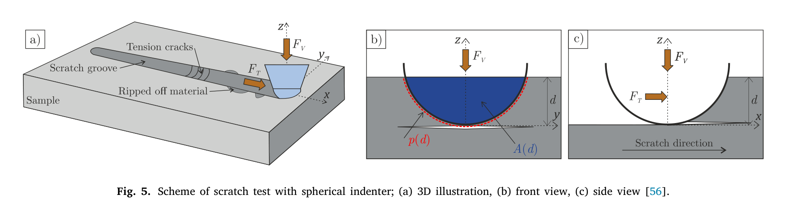
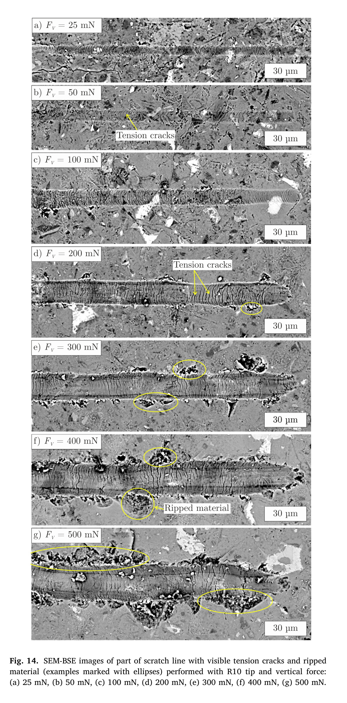

# 论文极简机理证据卡

## 1. 基本信息

- 题目：Fracture toughness of cement paste constituents assessed by micro-scratching correlated with acoustic emission
- 作者：Jiří Němeček、Radim Čtvrtlík、Lukáš Václavek、Jiří Němeček
- 年份：2024
- DOI：10.1016/j.cemconres.2024.107623
- 论文类型：实验 + 理论标定 + 三维有限元
- 研究对象：水泥浆体各水化相在 1–100 μm 尺度的球形压头微划痕、裂纹、压密与撕落
- 相关性等级：B
- 相关性说明：可提供局部划擦损伤辨识方法和裂纹—压密状态机，但材料、接触边界和阈值均非红砖爪刺的直接参数。

## 2. 论文实际解决的问题

用 R10 球形压头、SEM-BSE 与声发射快速测定水泥浆体各相断裂韧度；区分压密和撕落两种划擦机制，并以 Griffith 型拉压损伤有限元重现首裂、压缩损伤及损伤区尺度。

## 3. 核心机理

### M1 经压头标定的微划痕断裂韧度反演

- 证据类型：[直接证据]
- 机理内容：水平划擦力经接触周长和承载面积构成的形状函数归一化后反演 $K_c$；实际球头偏离理想几何，必须用已知韧度标准样标定形状函数。
- 输入因素：$F_T$、侵入深度 $d$、球头半径 $R$、标定系数、材料均匀尺度。
- 输出或影响：局部断裂韧度 $K_c$。
- 成立条件：轴对称探针、均质近似、浅划痕；解析式假定裂纹自压头水平传播。
- 失效或不适用条件：未标定压头、相尺寸小于划痕体积、真实裂纹轨迹/接触边界显著偏离标定样。
- 来源：PDF p.5，Section 2.5.2，Eq. (5)–(8)，Fig. 5–6。
- 对当前模型的用途：作为红砖微划痕标定方案；不能把本文水泥标定系数直接移植。

### M2 作用尺度决定“单相”还是“均质复合体”响应

- 证据类型：[直接证据]
- 机理内容：5–100 mN 下沟槽宽约 2.4–12.4 μm，可借 SEM 选择主导相；超过 200 mN 后划痕跨越多相且发生材料撕落，只能得到复合浆体响应。
- 输入因素：法向力、侵入深度、沟槽宽度、相尺寸和相界面。
- 输出或影响：参数所代表的材料层级、相混合误差和可否做相分离。
- 来源：PDF p.9–13，Sections 3.4–3.6，Table 1–2，Fig. 12–14。
- 对当前模型的用途：约束红砖局部试验的探针—组织尺度比；先定义代表体层级再标定参数。

### M3 压密与撕落竞争控制摩阻和表观强度

- 证据类型：[原文结论]
- 机理内容：低至中载时，压头下方及前方孔隙压密、堆积阻力增加，使 $COF$ 和拟合的压密态抗拉强度上升；高载出现侧向裂纹与材料撕落后，两者转而下降。
- 输入因素：$F_V$、接触压力、侵入深度、孔隙和相互作用。
- 输出或影响：摩擦系数、拟合强度、有效韧度及失效模式。
- 成立条件：本文 R10 水泥浆体划痕；模式转折约在 200 mN 附近。
- 失效或不适用条件：阈值受材料、探针、预载和尺度控制，不是通用载荷常数。
- 来源：PDF p.11–13、16–19，Sections 3.4.2、3.4.4、4.3–4.6，Fig. 14–15、20–21。
- 对当前模型的用途：为红砖局部接触引入“压密/压碎—拉裂—剥落”竞争分支。

### M4 首裂后发生前缘压缩损伤，高载再生侧向裂纹

- 证据类型：[归纳]
- 机理内容：模型先在压头接触处形成向下倾斜的拉裂纹，随后压头前缘启动压缩损伤并继续扩展，最终接触区完全损伤；$F_V>200$ mN 时新增侧向/斜裂纹，对应 SEM 中的撕落位置。
- 输入因素：主应力、$f_t$、$E$、$G_f$、压头位移和网格特征长度。
- 输出或影响：裂纹方向、损伤顺序、受影响深度与材料剥落候选区。
- 成立条件：单一均质相、刚性全接触、位移控制、只计算首裂和早期扩展。
- 来源：PDF p.14–18，Sections 4.1–4.3，Eq. (9)–(13)，Fig. 17–20，Table 3–4。
- 对当前模型的用途：可借用状态顺序和裂带正则化结构；接触和材料参数必须重建。

### M5 水化致密化提高水化相韧度

- 证据类型：[直接证据]
- 机理内容：4 个月至 6 年水化使总孔隙率由 16.9% 降至 15.2%，且小于 0.1 μm 的孔隙显著减少；OP 的 $K_c$ 增约 58%，IP/CH 增约 30%，大颗粒熟料基本不变。
- 输入因素：水化度、亚微米孔隙、相类型。
- 输出或影响：相级断裂韧度。
- 来源：PDF p.5、11–13、19，Sections 3.1、3.4.3、5，Fig. 7，Table 1–2。
- 对当前模型的用途：仅证明孔隙/成熟度可改变局部韧度；不能作为烧结红砖的定量关系。

### M6 声发射未检出不等于没有裂纹

- 证据类型：[直接证据]
- 机理内容：OP、IP 和熟料压痕经 SEM 明确存在裂纹但 AE 为零；仅晶态 CH 的突跳与 AE 峰同步，说明多孔异质材料会强烈散射/衰减微裂纹信号。
- 输入因素：断裂突发性、相结构、试样厚度、传播路径和阈值。
- 输出或影响：AE 可检出性，而非裂纹存在性的充分判据。
- 来源：PDF p.7–10，Sections 3.2.3、3.3、3.4，Fig. 9–12。
- 对当前模型的用途：红砖试验中 AE 只能与显微形貌/力—位移事件联合判读。

## 4. 核心公式

### E1 摩擦系数定义

$$
COF=\frac{F_T}{F_V}
$$

- 证据类型：定义式；原公式号：Eq. (4)
- 变量与单位：$F_T$ 为水平划擦力、$F_V$ 为法向力，二者同单位；$COF$ 无量纲。
- 正方向：见 Fig. 5，$F_T$ 沿划擦方向，$F_V$ 指向样品。
- 是否可直接进入当前模型：是，但它是工况相关表观量，不等同常数摩擦系数。
- 来源：PDF p.4–5，Section 2.5.2。

### E2 微划痕断裂韧度

$$
K_c=\frac{F_T}{\sqrt{2p(d)A(d)}}
$$

- 证据类型：简化理论式；原公式号：Eq. (5)
- 变量与单位：$p(d)$ 为接触周长（m），$A(d)$ 为水平承载面积（m²），$d$ 为侵入深度（m）；$K_c$ 为 Pa·m$^{1/2}$。
- 成立条件：均质近似、轴对称探针、经标准样校准；原模型把裂纹简化为自压头水平扩展。
- 是否可直接进入当前模型：需要修正；红砖需用相似破坏行为的标准样/独立试验重新校准。
- 来源：PDF p.5，Eq. (5)，Fig. 5。

### E3 接触形状函数与实测压头标定

$$
f_s(d)=2p(d)A(d)
$$

$$
f\!\left(\frac dR\right)=R^3\!\left[\alpha\left(\frac dR\right)^3+\delta\left(\frac dR\right)^2+\gamma\left(\frac dR\right)\right]
$$

- 证据类型：定义式 + 拟合式；原公式号：Eq. (6)、(8)
- 变量与单位：$R,d$ 为长度，$f_s/f$ 为长度³；$\alpha,\delta,\gamma$ 无量纲拟合系数。
- 参数来源：R10 在熔融石英 $K_c=0.65$ MPa·m$^{1/2}$ 上标定得到 $\alpha=298.1,\delta=0,\gamma=0$，$R^2=0.99$。
- 是否可直接进入当前模型：否；系数属于该实际 R10 压头和标定域。
- 来源：PDF p.5–6，Eq. (6)、(8)，Fig. 6。

### E4 拉压控制的等效应变选择

$$
\tilde\varepsilon_c=\frac1E\frac{-(\sigma_1-\sigma_3)^2}{k(\sigma_1+\sigma_3)},\qquad
\tilde\varepsilon=\max\left(\frac{\sigma_1}{E},\tilde\varepsilon_c\right)
$$

- 证据类型：Griffith/Rankine 型判据；原公式号：Eq. (9)–(10)
- 变量：$\sigma_1$、$\sigma_3$ 为未损伤态最大正/负有效主应力，$k=f_c/f_t$，$E$ 为杨氏模量。
- 成立条件：各向同性准脆性均质相；拉伸由 Rankine、压缩主导状态由 Griffith 型表达控制。
- 是否可直接进入当前模型：需要修正；需校核红砖的拉压比、各向异性和混合模态。
- 来源：PDF p.14，Section 4.1。

### E5 线性软化与裂带正则化损伤

$$
\sigma=f_t\left(1-\frac{w}{w_f}\right),\qquad
\sigma=(1-\omega)E\tilde\varepsilon
$$

$$
\omega=\left(1-\frac{\varepsilon_0}{\tilde\varepsilon}\right)
\left(1-\frac{hE\varepsilon_0^2}{2G_f}\right)^{-1}
$$

- 证据类型：本构/损伤式；原公式号：Eq. (11)–(13)
- 变量与单位：$w,w_f,h$ 为长度，$f_t,\sigma,E$ 为应力量，$\omega$ 无量纲，$G_f$ 为 J/m²，$\varepsilon_0$ 为弹性极限应变。
- 关键假设：线性软化、各向同性损伤、裂带方向取最大主应变；$h$ 用于网格客观性。
- 是否可直接进入当前模型：需要修正；可复用结构，参数和接触边界需重新标定。
- 来源：PDF p.14，Section 4.1。

### E6 文中用于 $K_c\to G_f$ 的平面应变换算

$$
G_f=K_c^2/E/(1-\nu^2)
$$

- 证据类型：正文未编号换算式。
- 状态：按 PDF p.15 排版逐符号保留；与常见平面应变等效模量写法存在括号/运算次序歧义。
- 是否可直接进入当前模型：否；须用原始计算文件、作者说明或表中未取整数据确认，不能静默改写。
- 来源：PDF p.15，Section 4.2，Table 3–4 前。

## 5. 关键参数表

| 参数 | 数值或范围 | 单位 | 材料/工况 | PDF 来源 | 当前用途 | 注意事项 |
|---|---:|---|---|---|---|---|
| 水灰比 / 水化度 | 0.4；0.83 / ≈1 | 1 | C-4m / C-6y | p.3 | 样品状态 | 非红砖 |
| 总孔隙率 | 16.9 / 15.2 | vol.% | C-4m / C-6y | p.5 | 孔隙—韧度趋势 | MIP；差异集中于亚微米孔 |
| 划痕压头 | R10 球形金刚石 | μm | 全部划痕 | p.4–5 | 探针尺度 | 实际形状需单独标定 |
| 划痕长度 / 速度 | 450；1, 5, 10, 25 | μm；μm/s | C-4m | p.4 | 工况 | 1–25 μm/s 内 $K_c$ 无显著速度趋势 |
| 法向力 | 5–500 | mN | C-6y | p.4、12 | 模式扫描 | 5–100 相级；≥200 复合响应 |
| R10 标定 | $\alpha=298.1,\delta=0,\gamma=0$ | 1 | 熔融石英 | p.5–6 | 复核 Eq. (8) | $K_c=0.65$ MPa·m$^{1/2}$，$R^2=0.99$ |
| C-6y 相级 $K_c$ | OP 0.54±0.03；IP 0.64±0.05；CH 0.66±0.06；CL 1.24±0.20 | MPa·m$^{1/2}$ | 5–100 mN 汇总 | p.12、19 | 数量级对照 | 水泥浆体专属，不作红砖输入 |
| 沟槽宽度 | 2.4–12.4 | μm | 5–100 mN, C-6y | p.12, Table 2 | 尺度分离 | 更高载荷不可分相 |
| 复合浆体 $K_c$ | 0.83±0.18 → 0.64±0.14 | MPa·m$^{1/2}$ | 200 → 500 mN | p.12、19 | 撕落趋势 | 不是材料常数单调变化 |
| $COF$ | 0.09±0.01 → 0.45±0.04 | 1 | 5 → 300 mN | p.12–13 | 压密趋势 | 300 mN 后下降 |
| AE 阈值 / 常见峰值 | 6；6–40（偶发 70–250） | μV | 压痕/划痕 | p.7 | 事件筛选 | 多孔相可能漏检 |
| FE 域 / 网格 | 25×100×30；0.1–5 | μm³；μm | 3D 四节点四面体 | p.14 | 数值尺度 | 4–4.5 万单元 |
| $k=f_c/f_t$ / $\nu$ | 8 / 0.2 | 1 | 全部 FE | p.14–15 | 本构输入 | 文献称 $k$ 常见 6–9 |
| 裂纹竖向深度 | 0.62–11.6 | μm | 5–500 mN | p.16–18 | 损伤区量级 | 由模型给出；非直接成像 |
| 拟合压密态抗拉强度 | 39–289 | MPa | C-6y，各载荷 | p.16–19 | 条件输出 | 压力依赖，非独立材料强度 |

## 6. 最小实验或仿真证据

### V1 压头形状必须标定

- 类型：标准样实验
- 关键工况：R10、熔融石英、$F_V=100$ mN、5 条划痕。
- 结果：仅二次项时 $R^2=0.89$；允许三次项后 $R^2=0.99$，且 $\alpha=298.1$ 主导。
- 支撑：M1、E2–E3；来源：PDF p.5–6，Fig. 6。

### V2 相级韧度在受控尺度内稳定

- 类型：实验 + 跨方法对比
- 结果：5–100 mN、1–25 μm/s 内相级 $K_c$ 基本稳定；C-6y 的 OP/IP/CH/CL 值与同尺度其他方法量级相符。
- 支撑：M1–M2；来源：PDF p.9–14，Table 1–2，Fig. 13、16。

### V3 SEM 直接显示模式切换

- 类型：实验
- 结果：≤100 mN 以沟槽内半圆拉裂为主；200 mN 起偶见撕落，300–500 mN 撕落区沿沟槽显著增多。
- 支撑：M3；来源：PDF p.11–13，Fig. 14。

### V4 三维模型重现损伤顺序

- 类型：仿真—实验对照
- 结果：模型横向峰值力与实验均值匹配，并重现“拉裂—前缘压损—完全损伤”；高载出现侧向/斜损伤区，竖向深度 0.62–11.6 μm。
- 支撑：M4、E4–E5；来源：PDF p.15–18，Fig. 18–20，Table 3–4。

### V5 AE 存在材料相关漏检

- 类型：实验负证据
- 结果：OP/IP/C 的 SEM 裂纹未产生 AE hit；只有 CH 的突跳与 AE 峰对应，减薄试样至 0.6 mm 仍未消除漏检。
- 支撑：M6；来源：PDF p.7–10，Fig. 9–12。

## 7. 关键图片

- 原图号：Fig. 5；PDF 页码：5；保留原因：定义 $F_T$、$F_V$、$d$、$p(d)$、$A(d)$ 与划擦方向，公式无法独立恢复坐标和几何语义。

- 原图号：Fig. 14；PDF 页码：13；保留原因：直接 SEM 证据显示 25–500 mN 下裂纹和撕落区演化，支撑 M3/V3。

- 原图号：Fig. 19–20；PDF 页码：17；保留原因：不可由单一曲线替代的拉裂、压损、完全损伤及高载侧裂时序，支撑 M4/V4。

## 8. 可迁移关系

- [可直接采用] “AE 未检出不等于无裂纹”的验收原则，以及力—位移、SEM 与 AE 联合判读流程。
- [需要重建] Eq. (5)–(8) 的红砖标定；应使用实际爪刺/探针几何和破坏相似的标准样。
- [需要标定] 红砖的 $E,\nu,G_f,f_t,k$、孔隙/方向性、接触边界和裂带长度；保留 Eq. (9)–(13) 的结构而非数值。
- [仅作趋势验证] 接触压力增大时由压密/沟槽拉裂过渡到侧裂/撕落，并可能出现摩阻峰值后下降。
- [不能直接采用] 水泥浆体各相 $K_c$、39–289 MPa 压密态强度及 200 mN 模式阈值。
- [不能直接采用] 把刚性全接触、位移驱动的球头划痕 FE 直接当作有限半径爪刺的摩擦滑移/脱附模型。

## 9. 局限与风险

- 材料是水泥浆体，不是烧结黏土红砖；相组成、孔隙、各向异性和破坏机理均不同。
- Eq. (5) 假定水平裂纹，而本论文 FE 显示首裂向下倾斜；定量可靠性依赖标准样校准。
- FE 把压头与样品设为刚性全接触并在划擦方向刚性连接，不含真实摩擦接触、分离、回跳和爪刺柔顺。
- FE 只研究首裂和早期传播，未模拟完整碎屑生成、脱落和再接触；高载损伤带宽还受最大网格尺寸影响。
- 拟合 $f_t^{com}$ 依赖接触压力和压密程度，作者明确指出不能与无压密的拉伸/弯曲强度直接比较。
- 文中未编号 $G_f$ 换算式存在运算次序歧义；在确认前不得作为求解器实现依据。

## 10. 对当前研究的最小贡献

该文提供局部划擦“压密—拉裂—前缘压损—侧裂撕落”的方法与状态序列，并给出可借鉴的裂带损伤框架；不能提供红砖参数、爪刺接触边界或阵列载荷共享。
