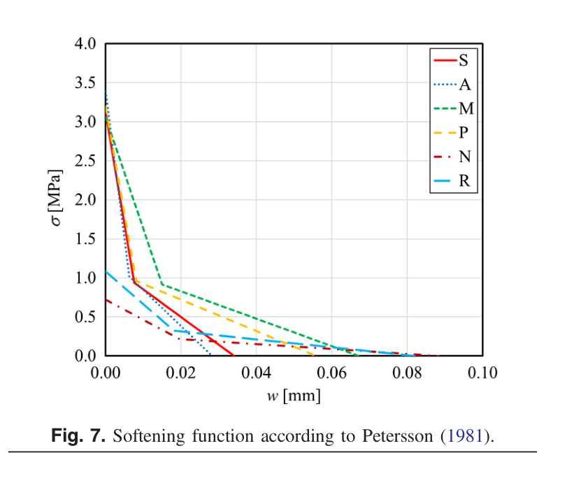
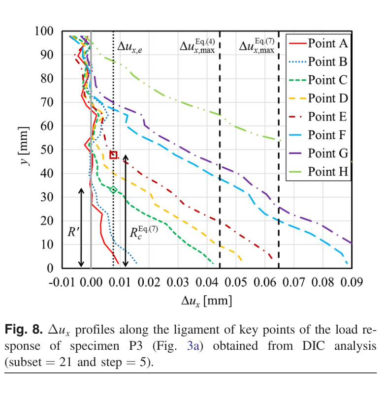
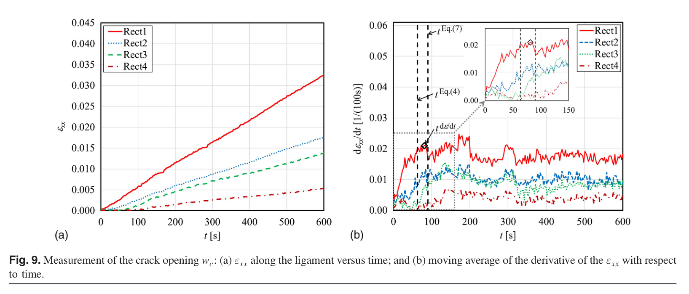

# 论文极简机理证据卡

## 1. 基本信息

- 题目：Advances in Knowledge of the Fracture Properties of Cohesive Materials: Fired-Clay and Tuff Bricks
- 作者：Tommaso D'Antino；Mattia Santandrea；Christian Carloni
- 年份：2020
- DOI：10.1061/(ASCE)EM.1943-7889.0001815
- 论文类型：材料 / 实验 / 断裂力学
- 研究对象：4 类烧结黏土砖与 2 类凝灰岩砖的 Mode-I 断裂、黏聚软化和断裂过程区（FPZ）
- 相关性等级：B
- 相关性说明：提供砖材直接断裂参数、黏聚软化边界和 DIC 识别方法，但宏观三点弯曲参数不能直接等同于微尺度爪刺接触参数。

## 2. 论文实际解决的问题

对带缺口整砖进行三点弯曲并用 DIC 追踪裂纹韧带，测得弹性、强度、断裂能与 FPZ 演化；论文还提出由应变率平台识别物理开裂时刻及临界裂纹张开量 $w_c$ 的方法，用于检验混凝土软化参数能否迁移到砖材。

## 3. 核心机理

### M1 准脆性砖材由黏聚裂纹而非瞬时脆断描述

- 证据类型：[原文结论]
- 机理内容：裂纹面在张开量 $w<w_c$ 时仍传递法向应力 $\sigma=f(w)$；曲线下面积为 Mode-I 断裂能 $G_F$，裂尖前方的微裂纹软化区构成 FPZ；当 $w=w_c$ 时应力降为零。
- 输入因素：$f_{bt}$、$G_F$、$w_c$、软化曲线形状。
- 输出或影响：裂纹起始、残余牵引、能量耗散和完全分离状态。
- 成立条件：准脆性材料、Mode-I 张开、零宽黏聚裂纹表述。
- 失效或不适用条件：不直接覆盖刺尖下的压碎、Mode-II 或混合模态裂纹。
- 来源：PDF p.1，Introduction；p.7-8，Softening Function，Eq. (4)-(7)，Fig. 7。
- 对当前模型的用途：建立红砖局部损伤子模型的状态框架，并以 $G_F$ 约束软化曲线面积。

### M2 裂纹状态可由跨韧带位移差分段

- 证据类型：[归纳]
- 机理内容：跨裂纹两侧的水平位移差 $\Delta u_x$ 先包含弹性伸长；超过 $\Delta u_{x,e}$ 后包含黏聚裂纹张开；达到 $\Delta u_{x,e}+w_c$ 后裂纹面完全分离、不再传递应力。
- 输入因素：$f_{bt}/E$、测量基距 $\xi$、$w_c$。
- 输出或影响：弹性、软化、完全开裂三种局部状态。
- 成立条件：论文的对称 DIC 取样几何与 Mode-I 韧带。
- 失效或不适用条件：剪切滑移显著、裂缝偏转或测量基距改变时须重建判据。
- 来源：PDF p.8，Displacement Profiles along the Ligament，Eq. (5)-(6)，Fig. 8。
- 对当前模型的用途：可改写为损伤状态机；不可把 DIC 基距直接当作爪刺接触单元长度。

### M3 FPZ 起点由拉伸阈值控制，但完全发展长度不可直接测得

- 证据类型：[原文结论]
- 机理内容：应变剖面与 $\varepsilon_t^E=f_{bt}/E$ 的交点定义 FPZ 起点；峰值载荷时多数试样的 $R'$ 约为 5-20 mm，但 DIC 只能给试验过程中的最大延伸，不能确定“完全发展”FPZ 的固有长度。
- 输入因素：$f_{bt}$、$E$、应变剖面、载荷阶段。
- 输出或影响：FPZ 起点及随载荷演化的表观长度。
- 成立条件：假定拉压弹性模量相同，DIC 条带平均能代表韧带应变。
- 失效或不适用条件：裂纹附近剖面异常时判线可能无交点。
- 来源：PDF p.6-7，Strain Profiles along the Ligament，Eq. (3)，Table 4，Fig. 5；p.10，Conclusions 2、6。
- 对当前模型的用途：只作损伤区尺度与网格正则化的初始参考，不作微尺度特征长度定值。

### M4 混凝土标定的统一软化参数不适用于所有砖材

- 证据类型：[直接证据]
- 机理内容：Petersson 与 Bažant 的 $w_c=3.6G_F/f_{bt}$、$5.6G_F/f_{bt}$ 均源自混凝土；DIC 识别得到的比例系数为 1.7-5.5，且凝灰岩总体更低，说明材料微结构改变临界张开量和 FPZ 演化。
- 输入因素：材料类型、$G_F$、$f_{bt}$、DIC 识别的物理开裂时刻。
- 输出或影响：$w_c$、软化尾长和预测开裂时刻。
- 成立条件：本文 CMOD 控制三点弯曲与应变率平台判据。
- 失效或不适用条件：识别方法仍是作者提出的判定假设，未形成跨材料统一拟合程序。
- 来源：PDF p.9-10，New Approach to Determine $w_c$，Table 4，Fig. 9；p.10，Conclusions 4-5。
- 对当前模型的用途：否定直接套用混凝土系数；目标红砖必须重新标定 $w_c$ 或完整软化曲线。

### M5 断裂能具有显著材料差异和试样离散性

- 证据类型：[直接证据]
- 机理内容：烧结黏土砖的单试样 $G_F$ 约为 20-70 N/m，整体高于凝灰岩；系列 CoV 可达 0.476，固定单一 $G_F$ 会掩盖历史砖材异质性。
- 输入因素：砖材来源、微结构、试样几何与缺陷。
- 输出或影响：峰后耗能、软化曲线面积与失效离散性。
- 成立条件：整砖 Mode-I 三点弯曲、每系列 3 个试样。
- 失效或不适用条件：数值范围不代表目标红砖批次或局部刺尖尺度。
- 来源：PDF p.5-6，Fracture Energy，Table 3。
- 对当前模型的用途：作为先验数量级与随机参数需求证据，最终分布须由目标材料试验更新。

## 4. 核心公式

### E1 FPZ 拉伸起始阈值

$$
\varepsilon_t^E=\frac{f_{bt}}{E}
$$

- 证据类型：判据；原公式号：Eq. (3)
- 变量与单位：$\varepsilon_t^E$ 无量纲；$f_{bt}$、$E$ 均为 MPa。
- 成立条件与假设：Mode-I 韧带；拉伸与压缩弹性模量相同；DIC 应变经过条带平均。
- 是否可直接进入当前模型：需要修正；应换成目标砖材局部拉伸/损伤阈值并校核多轴应力。
- 来源：PDF p.6，Strain Profiles along the Ligament。

### E2 Petersson 双线性软化节点

$$
\sigma(0)=f_{bt},\qquad
\bar w=0.8\frac{G_F}{f_{bt}},\qquad
\sigma(\bar w)=\frac{1}{3}f_{bt},\qquad
w_c=3.6\frac{G_F}{f_{bt}}
$$

- 证据类型：混凝土经验软化关系；原公式号：Eq. (4)（$w_c$），其余节点见相邻正文。
- 变量与单位：$\sigma,f_{bt}$ 为 MPa；$G_F$ 为 N/m；$w,w_c$ 为长度，单位换算须一致。
- 成立条件：Petersson 混凝土双线性软化；曲线面积等于 $G_F$。
- 是否可直接进入当前模型：否；论文以砖材 DIC 结果反证其普适性。
- 来源：PDF p.8，Softening Function，Fig. 7。

### E3 另一混凝土临界张开量

$$
w_c=5.6\frac{G_F}{f_{bt}}
$$

- 证据类型：文献经验式；原公式号：Eq. (7)
- 成立条件：Bažant 混凝土关系，仅作为论文比较线。
- 是否可直接进入当前模型：否；不能因系数更大就作为砖材上限。
- 来源：PDF p.8，Displacement Profiles along the Ligament。

### E4 弹性位移差阈值

$$
\Delta u_{x,e}=\varepsilon_t^E\,\xi
$$

- 证据类型：定义式；原公式号：Eq. (5)
- 变量与单位：$\Delta u_{x,e}$、$\xi$ 为 mm；本文 $\xi=13$ mm。
- 成立条件：两侧 DIC 方区对称、裂纹尚未贡献额外张开。
- 是否可直接进入当前模型：需要修正；$\xi$ 是测量基距而非材料常数。
- 来源：PDF p.8，Displacement Profiles along the Ligament。

### E5 完全开裂阈值

$$
\Delta u_{x,\max}=\Delta u_{x,e}+w_c
$$

- 证据类型：判据；原公式号：Eq. (6)
- 输出含义：达到该阈值时局部裂纹面物理分离，$\sigma=0$。
- 是否可直接进入当前模型：需要修正；应转为局部裂纹张开量而非实验测量位移差。
- 来源：PDF p.8，Displacement Profiles along the Ligament。

### E6 DIC 识别的材料系数

$$
w_c^{d\varepsilon/dt}=c_b\frac{G_F}{f_{bt}},\qquad c_b=1.7\text{-}5.5
$$

- 证据类型：实验归纳；原公式号：无，归一化量见 Table 4。
- 参数来源：10 个带 DIC 试样；烧结黏土砖 $c_b=3.5$-5.5，凝灰岩 $c_b=1.7$-3.1。
- 是否可直接进入当前模型：否；只证明系数材料相关，不能把总范围当作目标材料分布。
- 来源：PDF p.7、10，Table 4，New Approach to Determine $w_c$。

## 5. 关键参数表

| 系列 / 材料 | $f_b$ (MPa) | $f_{bt}$ (MPa) | $E$ (MPa) | $\bar G_F$ [N/m (CoV)] | DIC $c_b$ | PDF 来源 | 当前用途 / 注意事项 |
|---|---:|---:|---:|---:|---:|---|---|
| S / 商用烧结黏土砖 | 20.3 | 3.12 | 7,300 | 29.5 (0.272) | 4.3-5.0 | p.2, Table 1；p.5, Table 3；p.7, Table 4 | 同类材料先验；非目标批次 |
| A / 历史烧结黏土砖 | 18.7 | 3.40 | 7,430 | 26.6 (0.234) | 3.6 | 同上 | 单个 DIC 试样 |
| M / 历史烧结黏土砖 | 23.5 | 3.10 | 7,080 | 57.1 (0.236) | 3.5 | 同上 | $G_F$ 最高系列；单个 DIC 试样 |
| P / 历史烧结黏土砖 | 25.7 | 3.20 | 6,900 | 32.5 (0.476) | 4.8-5.5 | 同上 | 离散性最大 |
| N / 凝灰岩砖 | 4.34 | 0.70 | 3,390 | 17.7 (0.238) | 1.7-3.1 | 同上 | 不能代表烧结红砖 |
| R / 凝灰岩砖 | 6.25 | 1.10 | 4,320 | 24.6 (0.117) | 2.3-2.9 | 同上 | 不能代表烧结红砖 |
| TPB 几何与加载 | - | - | - | $S=210$ mm；$D=108.5$-148.5 mm；$a_0=32$-45 mm | - | p.3, Table 2 | 宏观 Mode-I 尺度；CMOD 速率 0.001 mm/min |
| 峰值时 FPZ 尺度 | - | - | - | 多数 $R'\approx5$-20 mm | - | p.7, Table 4 | A2=3.9 mm、P3=33.4 mm 为例外；不是材料固有长度 |

## 6. 最小实验或仿真证据

### V1 断裂能的材料差异与离散性

- 类型：三点弯曲实验
- 关键工况：每系列 3 个带缺口整砖，CMOD 控制 0.001 mm/min。
- 结果：烧结黏土砖单试样 $G_F\approx20$-70 N/m，系列均值 26.6-57.1 N/m；凝灰岩均值 17.7、24.6 N/m。
- 支撑的机理：M1、M5；来源：PDF p.5-6，Table 3。

### V2 DIC 与 LVDT 的能量结果一致

- 类型：实验方法对比
- 结果：尽管 DIC 与 LVDT 的初始刚度有差异，由两者 $P$-$\delta$ 曲线获得的 $G_F$ 一致，说明峰后功对初始调平误差较不敏感。
- 支撑的机理：M5；来源：PDF p.5-6，Fig. 3，Table 3。

### V3 混凝土 $w_c$ 关系给出错误的 FPZ 时序

- 类型：DIC 实验与经验式对比
- 结果：对 P3 使用 Eq. (4) 会把峰值附近判成最大 FPZ，作者认为与已知演化不符；改用不同 $w_c$ 或单试样 $G_F$ 会明显移动 $R_c$。
- 支撑的机理：M3、M4；来源：PDF p.8-9，Fig. 8。

### V4 应变率平台识别物理开裂

- 类型：DIC 实验
- 结果：缺口尖端邻域的 $d\varepsilon_{xx}/dt$ 从上升段转入近恒定平台，作者将转折时刻映射到 $\Delta u_x$ 并反算 $w_c$；所得 $c_b=1.7$-5.5，凝灰岩较低。
- 支撑的机理：M4/E6；来源：PDF p.9-10，Fig. 9，Table 4。

## 7. 关键图片

- 原图号：Fig. 7；PDF 页码：8；保留原因：直观显示相近拉伸强度下 $G_F$ 差异如何改变软化尾长，并保留凝灰岩与烧结砖的条件分支。

- 原图号：Fig. 8；PDF 页码：8；保留原因：不可由单一公式恢复多加载阶段、弹性阈值、两种 $w_c$ 阈值与 $R_c$ 的几何对应。

- 原图号：Fig. 9；PDF 页码：9；保留原因：呈现新判据的时间信号、平滑后转折点及与两条混凝土经验线的对照。

## 8. 可迁移关系

- [可直接采用] 黏聚裂纹的状态结构：起裂后仍传力、软化曲线面积等于 $G_F$、$w=w_c$ 时牵引归零。
- [需要标定] 目标红砖的 $E$、$f_{bt}$、$G_F$、$w_c$、软化曲线形状及批次离散性。
- [仅作数量级先验] 本文烧结黏土砖的宏观 Mode-I 强度、模量与 $G_F$ 范围。
- [仅作趋势验证] 固定单一 $G_F$ 不足，且材料微结构会改变 $w_c/(G_F/f_{bt})$。
- [不能直接采用] 混凝土系数 3.6、5.6，或本文 $c_b$ 总范围作为目标砖材常数。
- [不能直接采用] 将宏观三点弯曲 Mode-I 参数直接转成刺尖压碎/剪裂承载，或继续推广到阵列与对爪。

## 9. 局限与风险

- 试验是厘米级整砖 Mode-I 三点弯曲；爪刺局部接触可能由压缩、剪切、混合模态和高应力梯度主导。
- 每系列只有 3 个断裂试样，DIC 至少 1 个；历史砖几何和制造差异导致较高离散性。
- 新 $w_c$ 判据依赖“应变率进入平台即物理分离”的作者假设；客观 sigmoid 拟合仍待更多数据。
- 论文只重新识别 $w_c$，未独立反演砖材完整软化曲线；Fig. 7 仍采用混凝土 Petersson 形状。
- FPZ 的完全发展长度无法由本试验确定，$R'$ 或 $R_c$ 不应当作网格无关材料长度。
- 未研究材料方向性、循环损伤、速率效应、刺尖半径、摩擦、磨损及多接触耦合。

## 10. 对当前研究的最小贡献

该文为单刺局部损伤层提供红砖专属的宏观 Mode-I 参数、黏聚软化边界及“混凝土关系不可直接迁移”的关键约束；微尺度混合模态与接触破坏仍需专门试验补足。
