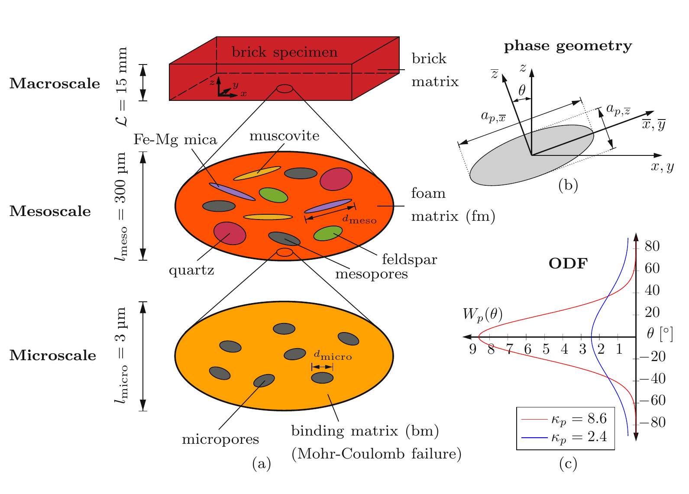
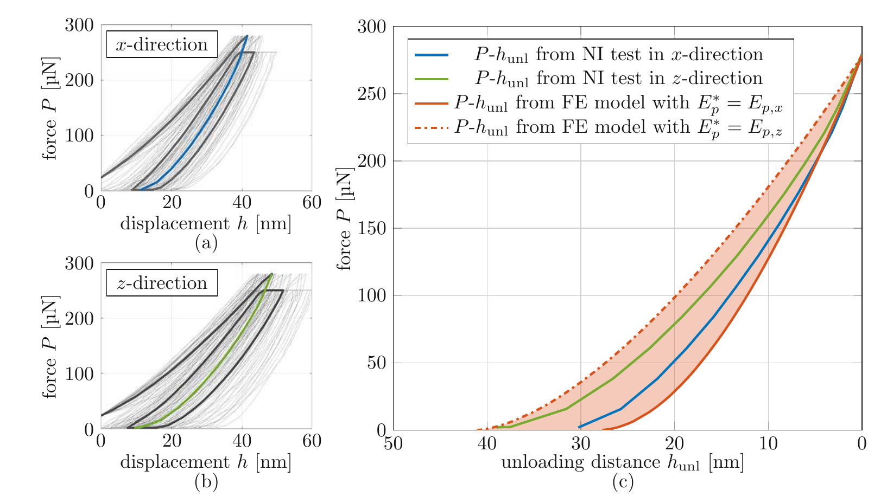
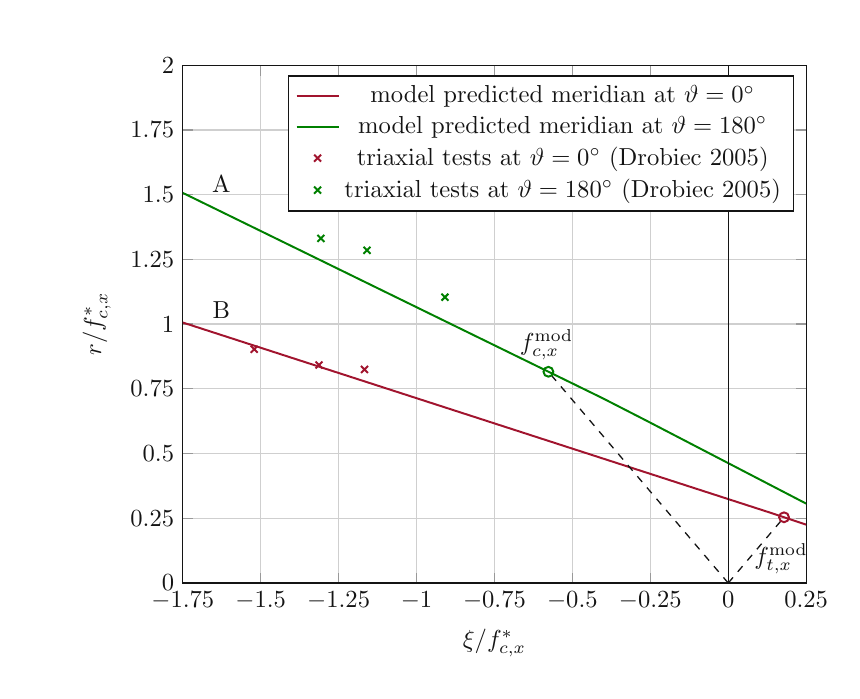

# 论文极简机理证据卡

- 题目：Multiscale Material Modeling of Fired Clay Bricks: Experimental Characterization of Microstructural Morphometry and Continuum Mechanical Prediction of Thermal Conductivity, Elastic Stiffness, and Strength Properties
- 作者：Thomas Buchner
- 年份：2022
- DOI：无（博士论文；Chapter 5 对应论文 DOI `10.1016/j.mechmat.2022.104334`）
- 论文类型：材料实验 + 连续微观力学 + 有限元验证
- 研究对象：880 °C 烧结挤出黏土砖的孔隙/物相形貌、方向性刚度和多轴强度
- 相关性等级：A
- 相关性说明：给出红砖微结构到方向性刚度、结合基质强度和宏观多轴失效面的定量链条，可约束单刺局部基材失效子模型。
- 长度说明：论文含“形貌参数化—弹性均匀化—强度下尺度/上尺度”三个独立子模型，按模板放宽至 3500 个中文字符以内。

## 1. 论文实际解决的问题

论文用多技术实验定量表征烧结砖孔隙和矿物相，再以两级 Mori–Tanaka 均匀化预测方向性刚度；把宏观拉压强度下尺度为结合基质 Mohr–Coulomb 常数，并用纳米压痕及独立双/三轴试验验证微观和宏观失效预测。

## 2. 核心机理

### M1 分级孔隙—物相结构决定等效响应

- 证据类型：[原文结论]
- 机理内容：砖体被表示为微尺度“结合基质+微孔”和介尺度“泡沫基质+介孔+矿物”的两级 RVE；孔/矿物用体积分数、扁球长宽比和取向分布描述。
- 输入因素：相含量、尺度、长宽比、取向参数、相刚度。
- 输出或影响：泡沫基质及砖体等效刚度、相应力集中。
- 成立条件：相间完美黏结、尺度分离、基质—夹杂形态、预失效线弹性。
- 失效或不适用条件：尖锐接触区无代表体积、显式裂纹/脱黏演化或大孔/大颗粒超出既有尺度。
- 来源：PDF p.73-76、100-103，Sections 4.2.2-4.2.3、5.2.1-5.2.3，Fig. 5.1，Eq. (4.1)-(4.3)、(5.1)、(5.5)-(5.6)。
- 对当前模型的用途：提供材料子模型的层级变量表；不能替代外表面三维地形。

### M2 挤出取向产生方向性刚度与强度

- 证据类型：[直接证据]
- 机理内容：孔隙和片状矿物优先平行于 $x$-$y$ 面，结合基质及矿物也具方向刚度；七种砖的 $C_{xxxx}/C_{zzzz}$ 约为小于 2 至接近 3，失效面亦呈横观各向同性偏差。
- 输入因素：挤出坐标、相长宽比、取向离散度、方向相刚度。
- 输出或影响：方向性法向/剪切刚度及 $x/y$ 与 $z$ 向强度差异。
- 成立条件：论文以 $x$ 为挤出方向、$z$ 为厚度方向，并近似 $x$-$y$ 面各向同性。
- 失效或不适用条件：实测存在轻微 $x$-$y$ 正交差异，强横向取向或局部层理需正交各向异性模型。
- 来源：PDF p.72-86、114-115，Sections 4.2-4.3.1、5.4.2.3，Table 4.3，Figs. 4.7、5.9-5.11。
- 对当前模型的用途：红砖接触刚度和承载上限应保留材料方向，不能默认各向同性。

### M3 大石英界面裂纹削弱承载

- 证据类型：[归纳]
- 机理内容：573 °C 石英相变的冷却收缩在大颗粒边界诱发裂纹；模型把短轴大于 10 µm 的石英视为完全失去黏结、刚度置零。全完整假设高估、全开裂假设多为低估，10 µm 阈值给出较好宏观刚度。
- 输入因素：石英尺寸、界面裂纹/黏结状态。
- 输出或影响：有效承载相比例和砖体刚度上、下界。
- 成立条件：本文七种 880 °C 砖及经验硬阈值。
- 失效或不适用条件：阈值不是界面断裂演化定律，不能直接作为刺尖诱发裂纹准则。
- 来源：PDF p.80、87、94，Section 4.2.5、4.3.1.3、4.4，Fig. 4.8。
- 对当前模型的用途：作为“缺陷相不承载”的负刚度/损伤分支与趋势证据。

### M4 结合基质黏聚—摩擦失效触发砖体首次失效

- 证据类型：[原文结论]
- 机理内容：宏观应力线性下尺度为结合基质空间平均应力；其最大/最小主应力满足 Mohr–Coulomb 等式时，同时定义微观和宏观首次失效。
- 输入因素：宏观应力、均匀化刚度、相应变集中张量、结合基质黏聚力和内摩擦角。
- 输出或影响：给定多轴宏观载荷的首次失效边界。
- 成立条件：预失效线弹性、空间平均相应力可代表失效、拉应力为正/压应力为负。
- 失效或不适用条件：不描述峰后软化、裂纹路径、断裂能、损伤历史和刺尖附近应力梯度。
- 来源：PDF p.101-105，Sections 5.2.2-5.3.3，Eq. (5.2)-(5.6)。
- 对当前模型的用途：可作为红砖单接触承载上限的候选材料判据，但必须做局部尺度再标定。

### M5 宏观拉压试验可反辨识微观强度

- 证据类型：[直接证据]
- 机理内容：把三点弯曲与单轴压缩的破坏应力分别下尺度并代入 $f_{MC}=0$，由两个方程得到 $c_{bm}=37.59$ MPa、$\phi_{bm}=33.14^\circ$；纳米压痕卸载曲线对这组常数敏感并落入方向刚度界限。
- 输入因素：宏观拉/压强度、相形貌与刚度、纳米压痕力—位移。
- 输出或影响：结合基质强度常数及微尺度独立校核。
- 成立条件：参考砖、880 °C、同一材料的形貌/弹性输入。
- 失效或不适用条件：常数并非直接微试验测得；三点弯曲名义应力含宏观尺寸效应。
- 来源：PDF p.104-112，Sections 5.3.3、5.4.1，Figs. 5.2、5.7-5.8。
- 对当前模型的用途：提供参数辨识流程，不提供目标砖可直接复制的常数。

### M6 下尺度判据生成压力敏感的宏观多轴失效面

- 证据类型：[直接证据]
- 机理内容：逐步放大宏观应力并检查结合基质 $f_{MC}$，得到近五棱锥的压力敏感失效面；方向性形貌造成拉、压和剪切强度的轻微方向差异。
- 输入因素：宏观应力路径、材料方向、$c_{bm}$、$\phi_{bm}$。
- 输出或影响：任意法向/剪切组合下的首次失效与安全域。
- 成立条件：比例加载、首次达到判据、参考砖形貌。
- 失效或不适用条件：非比例历史、循环损伤、局部破碎与裂纹扩展未建模。
- 来源：PDF p.113-117，Sections 5.4.2.3-5.4.2.4，Figs. 5.9-5.13。
- 对当前模型的用途：可把单刺接触力映射到材料方向相关安全域；需先解决接触应力到 RVE 平均应力的尺度接口。

## 3. 核心公式

### E1 相取向分布

$$
W_p(\theta)=\frac{\kappa_p\cosh\!\left(\kappa_p\cos\theta\right)}{\sinh\kappa_p}
$$

- 证据类型：定义式；原公式号：Eq. (4.1)
- 变量与单位：$W_p,\kappa_p$ 无量纲；$\theta\in[0,\pi]$ 为全局 $z$ 与相局部轴的天顶角，方位角 $\varphi$ 均匀。
- 成立条件：关于 $x$-$y$ 面对称的旋转分布；在球面积分中与 $\sin\theta/(4\pi)$ 联用。
- 是否可直接进入当前模型：需要标定；由目标砖图像拟合 $\kappa_p$。
- 来源：PDF p.75，Section 4.2.2。

### E2 两级弹性均匀化

$$
\mathbb C_{\mathrm{hom}}^{s}=\sum_r f_r^{s}\int_0^{\pi}\!\int_0^{2\pi}
W_r(\theta)\,\mathbb C_r:\mathbb A_r(\varphi,\theta;X_r)
\frac{\sin\theta}{4\pi}\,d\varphi\,d\theta
$$

- 证据类型：理论式；原公式号：Eq. (4.2)，在 Chapter 5 重写为 Eq. (5.5)
- 变量与单位：$\mathbb C$ 为刚度（GPa），$f_r$、$W_r$、长宽比 $X_r$、应变集中张量 $\mathbb A_r$ 无量纲。
- 成立条件：线弹性、完美黏结、扁球夹杂、Mori–Tanaka；先微尺度再介尺度。
- 是否可直接进入当前模型：需要修正；非球形各向异性使普通 Mori–Tanaka 张量非对称，论文采用后对称化。
- 来源：PDF p.75-76、102，Sections 4.2.3、5.2.3。

### E3 结合基质 Mohr–Coulomb 判据

$$
f_{MC}(\boldsymbol\sigma_{bm})=
\sigma_{bm,I}\frac{1+\sin\phi_{bm}}{2c_{bm}\cos\phi_{bm}}
-\sigma_{bm,III}\frac{1-\sin\phi_{bm}}{2c_{bm}\cos\phi_{bm}}-1
$$

- 证据类型：判据；原公式号：Eq. (5.2)
- 变量与单位：$\sigma_{bm,I/III}$、$c_{bm}$ 为 MPa；$\phi_{bm}$ 为角度；拉应力正、压应力负。
- 成立条件：$f_{MC}<0$ 安全，$f_{MC}=0$ 首次失效；使用结合基质空间平均主应力。
- 是否可直接进入当前模型：需要修正；需实际砖材和局部接触尺度标定，并补峰后/断裂分支。
- 来源：PDF p.101，Section 5.2.2。

### E4 宏观应力下尺度

$$
\boldsymbol\sigma_{bm}=\mathbb B_{bm}:\boldsymbol\Sigma
$$

- 证据类型：理论式；原公式号：Eq. (5.3)
- 变量与单位：$\boldsymbol\sigma_{bm}$、$\boldsymbol\Sigma$ 为 MPa；$\mathbb B_{bm}$ 无量纲。
- 成立条件：预失效线弹性与 RVE 空间平均。
- 是否可直接进入当前模型：否；刺尖接触的非均匀场须先体积平均或由局部模型桥接。
- 来源：PDF p.101，Section 5.2.3。

### E5 结合基质应力集中张量

$$
\mathbb B_{bm}=\mathbb C_{bm}:\mathbb A_{bm}:\mathbb A_{fm}:(\mathbb C_{brick})^{-1}
$$

- 证据类型：理论式；原公式号：Eq. (5.4)
- 变量与单位：$\mathbb C_{bm},\mathbb C_{brick}$ 为刚度；$\mathbb A_{bm},\mathbb A_{fm}$ 为微/介尺度应变集中张量。
- 成立条件：两级连续微观力学、相间完美黏结、线弹性。
- 是否可直接进入当前模型：需要修正；仅在完整取得目标砖相形貌和相刚度时可重建。
- 来源：PDF p.102，Section 5.2.3。

## 4. 关键参数表

| 参数 | 数值或范围 | 单位 | 来源 | 当前用途 | 注意事项 |
|---|---:|---|---|---|---|
| 微孔/微 RVE | $d_{micro}\le1$ / $l_{micro}=3$ | µm | p.100, Eq. (5.1) | 尺度接口 | 分离因子仅约 3 |
| 介相/介 RVE/宏观尺度 | $d_{meso}\le150$ / $l_{meso}=300$ / $L=15$ | µm / µm / mm | p.100, Eq. (5.1) | 均匀化边界 | 最大相与 RVE 仅约 2 倍 |
| 七砖相含量范围 | 微孔约 10-20；介孔约 8-30；结合基质 30-53；石英至 21 | vol-% | p.77-78, Fig. 4.5 | 材料先验 | 880 °C、无造孔剂/掺料 |
| 参考砖相含量 | 微孔/介孔/小石英/大石英/长石/白云母/Fe-Mg 云母/基质 = 10/26/5/11/9/7/2/30 | vol-% | p.103, Table 5.1 | 复现强度模型 | 仅参考钙质砖 |
| 结合基质方向模量 | $E_x=E_y=62.5$；$E_z=45.8$；$\nu=0.20$ | GPa / 1 | p.103, Table 5.1 | 相刚度 | $\nu$ 由玻璃类比 |
| 小石英方向模量 | 113.3 / 80.8（$x/y$ / $z$） | GPa | p.103, Table 5.1 | 刚性相 | 纳米压痕来源 |
| 大石英失载阈值 | 短轴 $>10$ 时刚度置零 | µm | p.80, Sec. 4.2.5 | 缺陷相分支 | 经验硬阈值 |
| 宏观弯曲拉强度 | $23.10\pm1.60$，$n=12$ | MPa | p.104, Sec. 5.3.3 | 反辨识 | 名义最大截面应力 |
| 宏观单轴压强度 | $74.29\pm5.07$，$n=16$ | MPa | p.104, Sec. 5.3.3 | 反辨识 | 净截面、挤出方向 |
| 结合基质强度 | $c_{bm}=37.59$；$\phi_{bm}=33.14$ | MPa / ° | p.105, Sec. 5.3.3 | 候选判据参数 | 宏试验反辨识，非直测 |
| 预测方向强度 | $f_c^{x/y}=74.29$，$f_c^z=68.70$；$f_t^{x/y}=23.10$，$f_t^z=22.18$ | MPa | p.114, Sec. 5.4.2.3 | 宏观安全域 | 参考砖、比例加载 |
| 预测剪切强度 | $f_s^{xy}=17.6$；$f_s^{xz/yz}=17.4$ | MPa | p.115, Fig. 5.11 | 剪切数量级 | 模型预测，非直接试验 |
| 超声刚度验证 | $C_{xxxx}=15.12$-29.00；$C_{zzzz}=5.62$-16.61 | GPa | p.85, Table 4.3 | 方向刚度范围 | 七砖宏观值，不等于局部接触模量 |
| 纳米压痕 | 尖端半径 100；峰值 280；约 40 个基质压痕/方向 | nm / µN / 个 | p.106-111 | 微强度验证 | 用第一循环卸载段，二维轴对称 FE |

## 5. 最小实验或仿真证据

### V1 多技术孔径测量揭示方法偏差

- 类型：实验
- 结果：MIP 测孔喉而系统低估真实孔径；micro-CT 的 50 体素阈值约为 5.5 µm，SEM 可延伸到约 50-700 nm。micro-CT+SEM 才给出基于真实孔径的跨尺度分布。
- 来源：PDF p.37-42，Section 2.5.2-2.6，Table 2.6。

### V2 方向刚度得到七种砖的宏观验证

- 类型：理论—实验对比
- 结果：模型相对超声的平均绝对误差对 $C_{xxxx/ yyyy}$、$C_{zzzz}$、$C_{xyxy}$、$C_{xzxz/yzyz}$ 分别为 2.8、1.5、1.3、0.6 GPa，并再现不同砖的方向性。
- 来源：PDF p.84-87，Section 4.3.1，Fig. 4.7。

### V3 微观强度常数经纳米压痕校核

- 类型：实验 + FE
- 结果：$x/z$ 两方向约 40 条结合基质压痕的首个平均卸载支路落在方向刚度两种 FE 界限内；改变 $c_{bm}$ 或 $\phi_{bm}$ 会破坏两方向同时匹配。
- 来源：PDF p.106-112，Figs. 5.7-5.8。

### V4 多轴失效面得到独立宏观验证

- 类型：理论—实验对比
- 结果：归一化预测与 Drobiec 两条三轴加载路径吻合；三组双轴/单轴压强比为 0.80、1.01、1.14，模型为 $65.72/74.29=0.88$。
- 来源：PDF p.113-117，Table 5.3，Figs. 5.12-5.13。

## 6. 关键图片

- 原图号：Fig. 5.1；PDF 页码：100；保留原因：不可由单一公式恢复微/介/宏尺度、相组成、坐标与 ODF 的接口；支撑 M1-M4。

- 原图号：Fig. 5.7；PDF 页码：111；保留原因：微观强度常数的最短独立验证链；支撑 M5/V3。

- 原图号：Fig. 5.12；PDF 页码：116；保留原因：直接显示两条归一化加载路径的宏观验证；支撑 M6/V4。

## 7. 可迁移关系

- [可直接采用] “外部粗糙地形”和“内部孔隙/物相形貌”必须分开建模的边界；本文只提供后者。
- [需要标定] 目标红砖的方向刚度、相含量/取向、$c_{bm}$、$\phi_{bm}$ 及大石英脱黏尺度。
- [需要重建] 把刺尖局部非均匀应力桥接到 RVE 平均应力，再使用 Eq. (5.2)-(5.4)。
- [仅作上限约束] 宏观拉压/剪切强度可暂作局部承载数量级上限，不得当作微接触阈值。
- [仅作趋势验证] 挤出方向更硬/略强、围压提高承载、大石英界面裂纹削弱刚度。
- [不能直接采用] 10 µm 硬阈值、单一 880 °C 参考砖参数以及无峰后软化的首次失效面。

## 8. 局限与风险

- 强度模型只针对一种 880 °C 钙质砖；多轴验证使用缺少微结构信息的其他砖，依赖单轴强度归一化。
- 结合基质常数由宏观拉压反辨识而非直接测量；纳米压痕 FE 又采用二维轴对称、等效各向同性界限和光滑塑性势。
- Eq. (5.3) 使用相内空间平均应力，可能掩盖刺尖附近局部峰值、孔边应力集中和尺寸效应。
- Mori–Tanaka 假设完美黏结和基质—夹杂形态；普通方案对各向异性非球相产生非对称刚度，论文以对称化近似处理。
- 模型只给首次失效，不含裂纹萌生位置、扩展方向、断裂能、压碎、划伤、循环损伤和峰后重分配。
- 本文测量的是砖体内部形貌，不含外表面高度、坡度、曲率、摩擦或爪刺搜索/挂接过程。

## 9. 对当前研究的最小贡献

该文提供红砖“内部相形貌—方向刚度—压力敏感多轴首次失效”的材料层接口，可约束单刺基材承载上限；不能解决外表面啮合、局部裂纹演化、阵列载荷共享与对爪平衡。
