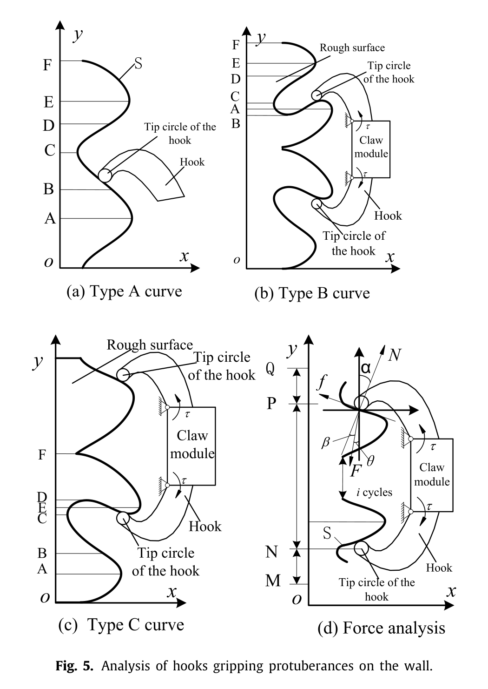
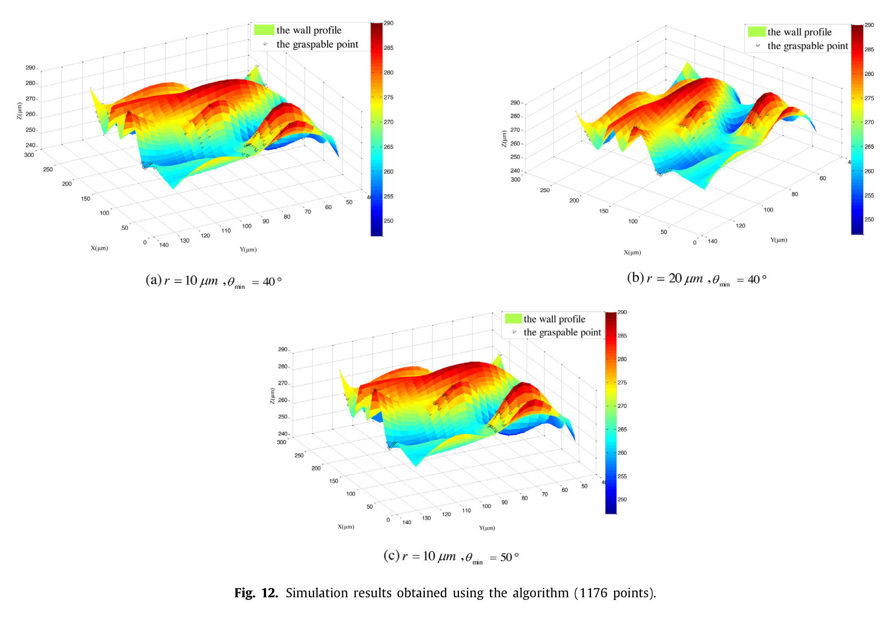
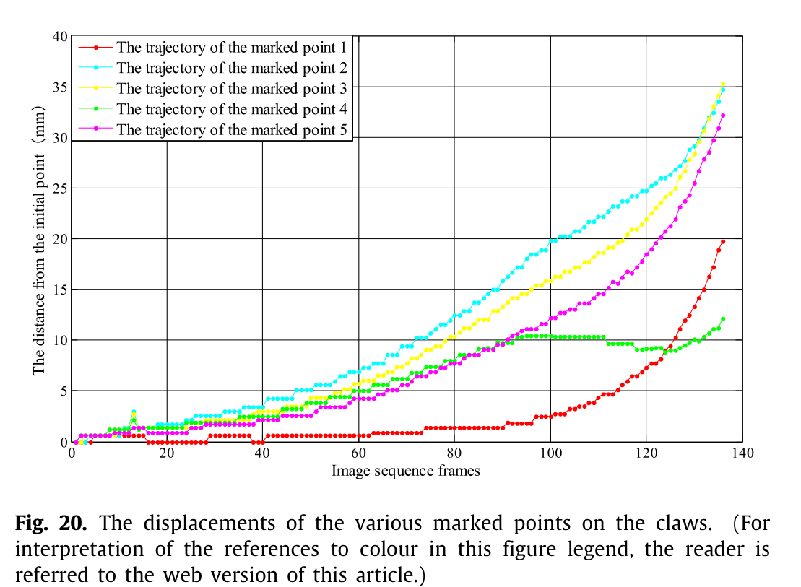

# 论文极简机理证据卡

## 1. 基本信息

- 题目：Grappling claws for a robot to climb rough wall surfaces: Mechanical design, grasping algorithm, and experiments
- 作者：Fengyu Xu；Fanchang Meng；Quansheng Jiang；Gaoliang Peng
- 年份：2020
- DOI：10.1016/j.robot.2020.103501
- 论文类型：表面测量 / 理论 / 几何算法 / 整爪实验
- 研究对象：有限半径钩尖在三维粗糙墙点云上的可接触与摩擦自锁，以及十字交叉主动爪的抗振抓附
- 相关性等级：A
- 相关性说明：给出“实测点云—有限钩尖可达性—摩擦判据—可抓点图—整爪抗扰实验”链条，可直接支撑形貌、单刺和整爪模型。
- 长度说明：论文含三个独立层级，按模板放宽至 3500 个中文字符以内。

## 2. 论文实际解决的问题

论文把砂石粗糙墙扫描为三维点云，以半球钩尖和空球约束筛出可接触三角形，再用摩擦自锁角筛出可抓位置；同时制造十字交叉主动爪，用振动台比较主动抓持与无驱动力挂靠的抗扰能力。

## 3. 核心机理

### M1 实测粗糙形貌可转换为三维可抓位置输入

- 证据类型：[直接证据]
- 机理内容：重叠扫描经标记点拼接、滤波后形成三维点云和表面；局部高度、钩尖尺度与搜索方向共同进入可抓位置判别。
- 输入因素：点云坐标、扫描/拼接误差、插值点距、搜索方向。
- 输出或影响：三维墙面轮廓及候选接触区域。
- 成立条件：数据分辨率足以解析钩尖尺度；坐标与实际搜索方向一致。
- 失效或不适用条件：扫描误差大于目标微形貌，或点云经插值产生并不存在的细节。
- 来源：PDF p.3-4，Section 2.2，Figs. 2-4，Table 1。
- 对当前模型的用途：提供实测地形到可抓性计算的接口；目标红砖必须重新测量并做尺度质控。

### M2 局部法向、载荷方向与摩擦共同决定单钩自锁

- 证据类型：[原文结论]
- 机理内容：接触处满足 $F\sin\beta<N\mu$、$F\cos\beta=N$ 时不滑移，等价于 Eq. (1)；槽形 B/C 剖面可能产生直接几何钩挂，论文重点继续分析无槽 A 型。
- 输入因素：局部法向角 $\alpha$、抓持力方向 $\theta$、摩擦系数 $\mu$。
- 输出或影响：局部滑移或稳定抓持。
- 成立条件：二维准静态点接触、库仑摩擦、刚性几何。
- 失效或不适用条件：离面三维载荷、材料压碎/断裂、多点载荷共享或动态冲击。
- 来源：PDF p.4-5，Section 2.3，Eq. (1)，Fig. 5。
- 对当前模型的用途：可作为单刺摩擦稳定基线，但须改写为统一三维向量判据。

### M3 半球钩尖以空球三角形约束过滤不可达点

- 证据类型：[直接证据]
- 机理内容：把三维点云三点组合视为接触三角形；边长、三角形面积和半径为 $r$ 的空球共同保证有限钩尖能同时接触三点，再由朝向球心的三角形法向计算接触角。
- 输入因素：钩尖半径 $r$、点云三点组合、其他点到球心距离、搜索方向、$\theta_{min}$。
- 输出或影响：可接触三角形与可抓三角形集合。
- 成立条件：钩尖为刚性半球，表面由离散点代表，钩沿负 $y$ 方向运动。
- 失效或不适用条件：非球尖端、接触变形、非局部三角组合、点云噪声或大数据量暴力遍历。
- 来源：PDF p.6-9，Sections 3.2.1-3.2.2，Eqs. (4)-(7)，Figs. 10-11。
- 对当前模型的用途：可改写为有限刺尖可达性过滤器；应使用局部邻域索引和稳健曲面法向。

### M4 钩尖越小、最小可抓角越低，几何候选越多

- 证据类型：[直接证据]
- 机理内容：同一 1176 点表面上，$(r,\theta_{min})=(10\,\mu m,40^\circ)$、$(20\,\mu m,40^\circ)$、$(10\,\mu m,50^\circ)$ 分别得到 104、46、73 个候选；另两表面保持同一趋势。
- 输入因素：$r$、$\theta_{min}$、形貌和搜索方向。
- 输出或影响：候选点计数及位置。
- 成立条件：4 µm 三次插值、论文的空球与角度判据。
- 失效或不适用条件：计数不是唯一接触事件数、面积、概率或承载力；重叠三角形导致面积不可靠。
- 来源：PDF p.9-11，Section 3.2.3，Figs. 12-14。
- 对当前模型的用途：仅作几何趋势与参数扫描验证，不能直接当作抓附成功率。

### M5 十字交叉爪用纵向主抓持与横向抗翻转形成整爪协同

- 证据类型：[原文结论]
- 机理内容：两对副爪由气缸驱动沿壁面滑动以搜索、抓持和脱离；纵向上下副爪承担主抓持，横向副爪抑制侧滑与翻转，弹性钢片补偿墙面不平。
- 输入因素：气缸驱动力、纵横布置、弹性钢片变形、局部挂点。
- 输出或影响：主动夹紧、粗糙度适应和抗翻转。
- 成立条件：至少若干钩尖找到可承载凸体，驱动持续提供夹紧。
- 失效或不适用条件：论文没有测量每根钩的接触数、载荷或纵横分配。
- 来源：PDF p.3，Section 2.1，Fig. 1。
- 对当前模型的用途：给整爪功能分工与驱动状态；不能替代阵列载荷共享模型。

### M6 主动抓持提高抗振阈值，失去驱动后出现顺序脱离

- 证据类型：[直接证据]
- 机理内容：在相同扫频频率下，施加驱动力可承受更大墙面振幅；撤去驱动后，五个标记点先后大位移，作者据此判断右副爪先脱离、随后左/下副爪与主体脱离，最后上副爪失效。
- 输入因素：驱动开/关、振动方向、频率、振幅、初始挂点。
- 输出或影响：最大可承受扰动与整爪顺序失稳。
- 成立条件：实验室磨石墙、单台原型和论文测试流程。
- 失效或不适用条件：无重复数、误差带、接触力或通用动力学模型。
- 来源：PDF p.12-14，Sections 4.2.1-4.2.3，Figs. 19-20。
- 对当前模型的用途：用于主动预紧抗扰和局部脱离链的趋势验证。

## 4. 核心公式

### E1 单钩摩擦自锁条件

$$
\alpha < \theta + \arctan(\mu)
\tag{1}
$$

- 证据类型：准静态判据；原公式号：Eq. (1)
- 变量与单位：$\alpha,\theta$ 为角度，$\mu$ 无量纲；$\alpha$ 为接触法向与竖直面的夹角，$\theta$ 为抓持力与负 $y$ 方向夹角。
- 正方向或角度定义：见 Fig. 5(d)；由 $\beta<\arctan\mu$ 推得。
- 成立条件：二维、库仑摩擦、$F\cos\beta=N$、准静态。
- 是否可直接进入当前模型：需要修正；应改为三维局部法向—摩擦锥—载荷方向判定，并补材料失效。
- 来源：PDF p.4，Section 2.3。

### E2 有限半径三点接触的空球约束

$$
|AC|,|AB|,|BC|\le 2r
\tag{4}
$$

$$
0<\sqrt{p(p-AB)(p-AC)(p-BC)}\le\frac{3\sqrt{3}}{4}r^2,
\quad p=\frac{AB+AC+BC}{2}
\tag{5}
$$

$$
|AO|=|BO|=|CO|=r,\qquad |PO|\ge r
\tag{6}
$$

- 证据类型：几何可接触约束；原公式号：Eqs. (4)-(6)
- 变量与单位：$A,B,C,P,O$ 为点/球心；长度与 $r$ 同单位；$P$ 表示点云中其他任意点。
- 成立条件：存在实数球心，取较大 $z$ 解；球内无其他采样点。
- 是否可直接进入当前模型：需要修正；限制为局部邻域并加入噪声容差、网格邻接和非球尖端支持函数。
- 来源：PDF p.8，Section 3.2.1。

### E3 接触三角形法向与抓持角筛选

$$
\vec n=\frac{\overrightarrow{AB}\times\overrightarrow{AC}}
{|\overrightarrow{AB}\times\overrightarrow{AC}|}
\tag{7}
$$

$$
\frac{\pi}{2}-\theta_c>\theta_{min}
\quad\text{(论文 Step 4 的无编号判据)}
$$

- 证据类型：几何定义 + 判据；原公式号：Eq. (7) 与无编号角度条件
- 变量与单位：$\vec n$ 无量纲；$\theta_c,\theta_{min}$ 为角度。为避免原文复用符号，此处把 Section 3.2 的 $\theta$ 重记为 $\theta_c$。
- 正方向：将 $\vec n$ 翻转至朝向球心；$\theta_c$ 为该法向与钩尖反向运动方向的夹角。
- 是否可直接进入当前模型：需要修正；论文在 Eq. (1) 和 Section 3.2 中复用 $\theta$ 表示不同角度，且未显式推导 $\theta_{min}$ 与 $\mu$ 的映射。
- 来源：PDF p.8-9，Sections 3.2.1-3.2.2。

## 5. 关键参数表

| 参数/工况 | 数值或范围 | 单位 | 来源 | 当前用途 | 注意事项 |
|---|---:|---|---|---|---|
| 粗糙墙/扫描区 | 650×450×20 / 250×250 | mm | p.3 | 实测范围 | 砂石墙，不是红砖 |
| 扫描点与误差 | 13,386；重投影 0.058818；拼接 0.019248 | 点；mm | p.3-4 | 数据质控 | 误差约 59/19 µm |
| 仿真点距/钩尖下限 | 4 / $r\ge10$ | µm | p.9 | 数值分辨率 | 与扫描误差尺度不相容 |
| Fig. 12 候选计数 | 104 / 46 / 73 | 个 | p.9-10 | 半径/角度趋势 | 对应 1176 点三种工况 |
| 另两表面候选计数 | 272/114/191；67/46/56 | 个 | p.9-11 | 跨形貌趋势 | 同三组 $(r,\theta_{min})$ |
| 原型质量/气缸行程/驱动力 | 431 / 17.5 / 12.7 | g / mm / N | p.11 | 整爪参数 | 未给驱动力—接触力传递 |
| 磨石试验墙 | $R_a\approx93$；$R_q\approx130$ | µm | p.11 | 试验边界 | 单墙数据，不是普适阈值 |
| 纵向扫频驱动开/关 | 12.3；1.5875 / 0.41875 | Hz；mm | p.12 | 抗扰趋势 | “强度百分比”设备相关 |
| 竖向扫频驱动开/关 | 12.5；2.2547 / 0.6895 | Hz；mm | p.13-14 | 抗扰趋势 | 无重复数和误差带 |
| 位移跟踪 | 1280×1024；500；标记 6 | pixel / frame·s$^{-1}$ / mm | p.12-13 | 失稳时序 | 图像标定后位移 |

## 6. 最小实验或仿真证据

### V1 半径与角度对候选数的影响

- 类型：几何仿真；关键工况：三种点云，$r=10/20$ µm，$\theta_{min}=40/50^\circ$。
- 结果：三表面均表现为增大 $r$ 或 $\theta_{min}$ 会减少候选计数。
- 数据处理定义：重叠三角形使面积不可靠，论文改用候选点计数。
- 来源：PDF p.9-11，Figs. 12-14。

### V2 主动夹紧提高纵向与竖向抗振幅值

- 类型：整爪实验；关键工况：分别在 12.3 Hz 和 12.5 Hz 比较驱动开/关。
- 结果：纵向最大振幅由 0.41875 mm 增至 1.5875 mm；竖向由 0.6895 mm 增至 2.2547 mm。
- 支撑的机理：主动气缸夹紧与十字布置提高抗扰性。
- 来源：PDF p.12-14，Sections 4.2.1、4.2.3。

### V3 撤去驱动力后的顺序脱离

- 类型：高速影像；关键工况：12 Hz、80% 输出、振幅 1.6667 mm；五个标记点。
- 结果：驱动存在时整爪保持抓附并小幅调整；无驱动时各标记位移先后增长，最终整体脱离。
- 数据处理定义：位移相对初始位置；具体副爪顺序为作者依据颜色轨迹作出的判断。
- 来源：PDF p.13-14，Figs. 19-20。

## 关键图片

- 原图号：Fig. 5；PDF 页码：5；保留原因：集中定义 A/B/C 剖面、$\alpha/\beta/\theta$ 和上下钩作用；支撑 M2/E1。

- 原图号：Fig. 12；PDF 页码：10；保留原因：直接展示相同点云上的 $r$ 与 $\theta_{min}$ 对候选位置/数量的影响；支撑 M4/V1。

- 原图号：Fig. 20；PDF 页码：14；保留原因：顺序失稳不能由单一阈值替代；支撑 M6/V3。

## 7. 可迁移关系

- [可直接采用] “有限尖端可接触过滤—局部法向—摩擦稳定筛选”的算法层次。
- [需要重建] 用局部邻域/三角网格替代全三点遍历，并加入噪声容差、真实尖端形状和三维搜索方向。
- [需要标定] 目标红砖点云、$\mu$、$r$、$\theta_{min}$ 及扫描分辨率；不得沿用砂石/磨石墙数值。
- [仅作趋势验证] 减小尖端半径会增加几何候选，但还受尖端强度、磨损和材料破坏约束。
- [仅作整爪趋势验证] 主动预紧提高抗扰、撤去预紧后局部接触先后丢失。
- [不能直接采用] 候选点计数作为成功概率/承载热力图，或把 $R_a=93$ µm、$R_q=130$ µm 当作通用抓附阈值。

## 8. 局限与风险

- 扫描重投影/拼接误差约 59/19 µm，而仿真插值点距 4 µm、最小钩尖半径 10 µm；微尺度候选位置未获分辨率保证。
- 三点组合遍历并对每个球心检查全点云，计算量和非局部组合风险高；论文只演示 1176/1436 点。
- 模型是刚性纯几何 + 库仑自锁，不含局部压碎、断裂、磨损、针体柔顺、载荷上限和多钩分载。
- 三维算法仅由仿真内部趋势检查；振动实验先人工寻找稳定区域，没有逐点报告预测—实测命中率。
- 抗振阈值无样本数、重复性或误差带；振动器“强度百分比”与装置相关，不能跨设备迁移。
- 实测扫描墙、仿真点云与振动磨石墙并非同一受控红砖数据链；摘要所称随机户外墙缺少可复核定量结果。

## 9. 对当前研究的最小贡献

该文提供真实点云到有限刺尖可达性、摩擦筛选和整爪抗扰验证的桥接；不解决红砖微损伤、多刺载荷共享、对爪力矩平衡与预测点逐点实验校核。
