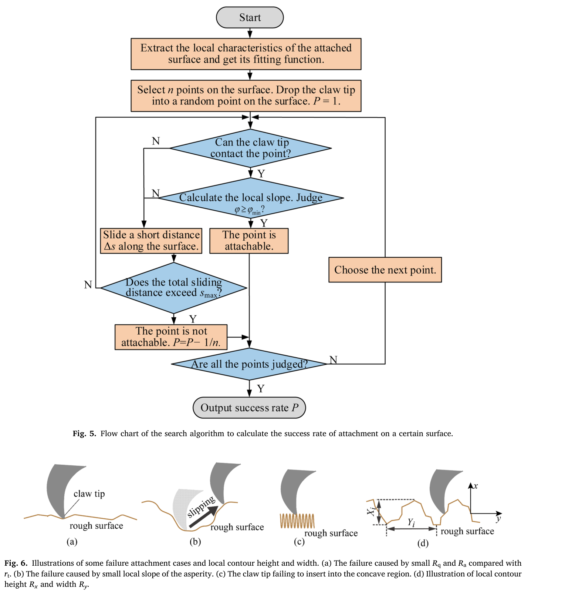
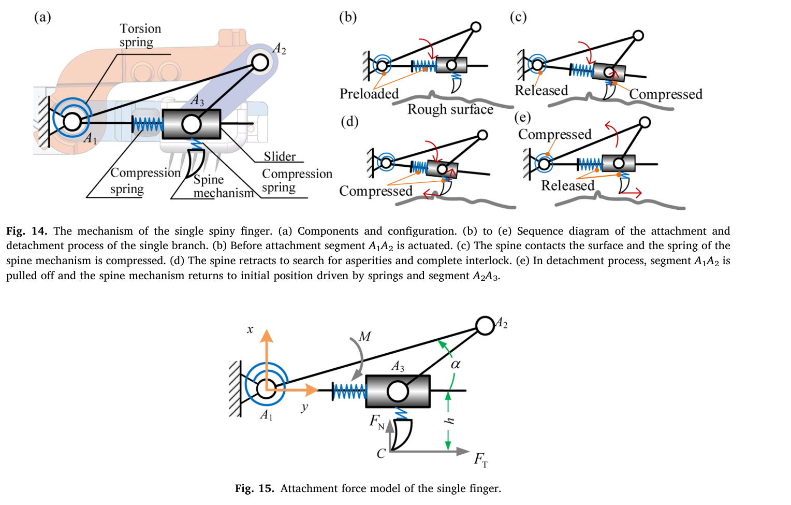
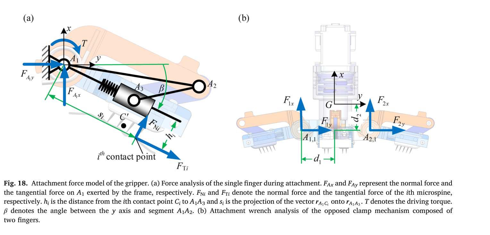

# 论文极简机理证据卡

- 题目：A mechanical adhesive gripper inspired by beetle claw for a rock climbing robot
- 作者：Peijin Zi, Kun Xu, Yaobin Tian, Xilun Ding
- 年份：2023（online 2022-11-28）
- DOI：10.1016/j.mechmachtheory.2022.105168
- 论文类型：理论 / 仿真 / 机构 / 实验混合
- 研究对象：粗糙岩面上的线性约束微刺阵列、四分支对置抓持器及攀爬机器人
- 相关性等级：A
- 相关性说明：覆盖形貌搜索、阵列、多级柔顺、分支力传递、对置力旋量与实验，是爪单元主干证据。

## 1. 论文实际解决的问题

作者用有限刺尖沿粗糙轮廓滑动的算法估计挂接概率并选择行程/排布；再以四分支抓持器建立分支静力与对置力旋量边界，用试验验证承载/脱附。

## 2. 核心机理

### M1 有限刺尖的可达性、局部坡度与有限行程共同决定挂接概率

- 证据类型：[直接证据]
- 机理内容：随机起点先检查刺尖能否几何接触，再检查局部坡度是否满足 $\varphi\geq\varphi_{\min}$；不满足时沿表面步进，直到捕获或累计滑移超过 $s_{\max}$。$R_a/R_q$ 不能区分小坡度和刺尖进不去的凹谷，作者改用平均轮廓高度 $R_x$ 与宽度 $R_y$ 描述搜索适用域。
- 输入因素：表面、刺尖半径、$R_x/R_y$、摩擦/载荷角、起点与 $s_{\max}$。
- 输出或影响：至少一次成功的概率 $P$ 与能力图。
- 成立条件：硬粗糙表面、截面接触判据、沿给定方向离散滑动；Monte Carlo 起点超过 500 个。
- 失效或不适用条件：缺随机面谱函数、步长/种子和碰撞实现；未含破坏、三维受力与接触历史。
- 来源：PDF p.3-7，Sections 2.1-2.2，Eq. (1)-(3)，Figs. 3、5-12。
- 对当前模型的用途：可直接改写为地形可达性/搜索模块骨架；必须换成目标三维网格和明确的有限球头接触。

### M2 搜索行程增加有饱和，而固定相对位置下单纯增刺收益有限

- 证据类型：[原文结论]
- 机理内容：在本文随机面上，$s_{\max}$ 增大显著提高 $P$，约 4.5 mm 后接近饱和；固定相对位置时，继续增刺和改变间距的概率收益较弱，故建议每列 3-5 刺并优先增加可均载 tile。
- 输入因素：$R_x/R_y$、$s_{\max}$、$d_{Ny}/d_{Nz}$、刺数 $N$、相对位置是否微动。
- 输出或影响：捕获概率、排布密度、搜索机构复杂度与冗余承载。
- 成立条件：文中随机面族、固定相对刺位、Fig. 8 隐含 $r_t=15\ \mu$m。
- 失效或不适用条件：实物刺尖为 $30\ \mu$m；允许微动时增刺仍可能有益，不能推广为“刺数无效”。
- 来源：PDF p.5-8，Figs. 8-12。
- 对当前模型的用途：作为阵列参数扫描范围和收益饱和假设；须在目标红砖实测面上重算。

### M3 层级柔顺把顺序接触、搜索、均载与反向脱附串成一个过程

- 证据类型：[直接证据]
- 机理内容：扭簧使分支独立贴面，刺轨压簧吸收法向差，滑块切向回缩搜索；尼龙绳、柔性轴和弹性体协调分支/tile。脱附连杆产生离面法向与反挂接切向分量，使刺模块先退离。
- 输入因素：扭簧预载、刺轨刚度/行程、弹性体与绳索刚度、驱动转矩、接触先后和地形高度差。
- 输出或影响：贴合、有效接触数、层级均载与脱附。
- 成立条件：该四杆-滑块-绳驱结构；弹性元件保持在工作行程内。
- 失效或不适用条件：缺绳/柔性轴/弹性体本构和接触级载荷，不能形成定量均载矩阵。
- 来源：PDF p.8-11，Sections 3.1-3.2、4.1，Figs. 14、16-17。
- 对当前模型的用途：用于建立“法向贴合-切向搜索-收紧承载-反向脱附”的状态顺序及层级柔顺拓扑。

### M4 随机压力中心把多刺载荷聚合为分支力，再由对置分支形成耦合力旋量

- 证据类型：[直接证据]
- 机理内容：各刺切/法向力的加权力臂形成压力中心 $C'$；$C'$、$\beta$ 与转矩决定分支反力。共缆对置分支组成平面 wrench，四分支再合成为六维 wrench。只有刺插入坑槽才形成 form closure，否则轴向抗扭较弱。
- 输入因素：$C'$、$\beta$、驱动转矩、扭簧刚度、接触力上限、摩擦和分支几何。
- 输出或影响：分支反力、$F_x/F_y/M_z$、整爪六维承载域及薄弱扭转方向。
- 成立条件：掌位姿固定、准静态、共缆对指转矩近似相等、给定接触上限与工作区。
- 失效或不适用条件：$C'$ 被随机化而非接触求解；各分量耦合，不能独立取最大值。
- 来源：PDF p.12-14，Section 4.2-4.3，Eq. (13)-(21)，Figs. 18-20。
- 对当前模型的用途：可作为单爪到对爪/整爪力-力矩聚合接口；需由阵列求解器输出真实接触集和 $C'$。

### M5 分支角改变法向/切向能力的权衡，实验只验证趋势而非理论上限

- 证据类型：[直接证据]
- 机理内容：随 $\beta$ 增大，法向能力上升，切向能力先升后降；玄武岩试验复现趋势，但理论假设 10 刺/指，实际法向为 4-6、切向为 6-8 根，故峰值低于理论边界。
- 输入因素：$\beta$、有效刺数、外载偏心、结构刚度与表面形貌。
- 输出或影响：法向/切向承载、弯矩诱发变形和有效刺数。
- 成立条件：同一玄武岩位置每个角度 3 次试验；0.352 kg 抓持器。
- 失效或不适用条件：重复少且无原始数据；切向加载伴随弯矩和变形诱发接合，非纯角度效应。
- 来源：PDF p.13-14、17-19，Figs. 20、23-24。
- 对当前模型的用途：用于验证角度趋势、有效接触数缺口和外载偏心敏感性，不作绝对承载标定。

### M6 过载变形通过增大等效刺尖半径形成持久性能退化

- 证据类型：[原文结论]
- 机理内容：少数刺过载会弯曲刺尖/针杆；等效半径增大使小凹谷不可达，针杆弯曲还会恶化导轨滑动和后续挂接。
- 输入因素：有效刺数、单刺载荷、针材强度、刺尖/针杆变形和导轨间隙。
- 输出或影响：几何可达性退化、滑动阻滞、重复试验漂移与失效。
- 成立条件：本文针材、导轨和多次最大载荷试验；为观察性证据。
- 失效或不适用条件：未给出临界载荷、残余曲率、磨损寿命或材料模型。
- 来源：PDF p.18-19，Section 6.2、Conclusion。
- 对当前模型的用途：建立“过载-残余几何变化-后续捕获下降”的慢变量；阈值需专项试验。

## 3. 核心公式

### E1 摩擦-坡度稳定挂接阈值

$$
\varphi_{\min}=\varphi_{\mathrm{load}}+\operatorname{arccot}(\mu),
\qquad \varphi\geq\varphi_{\min}
$$

- 证据类型：判据；原公式号：Eq. (1)，引自 Asbeck et al. 的截面模型而非本文原创。
- 变量与方向：$\varphi$ 为局部法向相对表面竖直方向的角；$\varphi_{\mathrm{load}}$ 为表面与外载夹角；$\mu$ 为摩擦系数。
- 成立条件：二维、库仑摩擦、已发生可达接触、硬表面且不破坏。
- 是否可直接进入当前模型：需要修正；应改为三维局部法向/摩擦锥并统一角度正方向。
- 来源：PDF p.3，Section 2.1，Fig. 3。

### E2 轮廓高度与宽度描述量

$$
R_x=\frac{1}{m}\sum_{i=1}^{m}X_i,
\qquad
R_y=\frac{1}{m}\sum_{i=1}^{m}Y_i
$$

- 证据类型：定义式；原公式号：Eq. (2)-(3)。
- 变量与单位：$X_i,Y_i,R_x,R_y$ 为长度；$m$ 为采样长度内轮廓单元数。
- 成立条件：先把截面分割成作者所定义的轮廓单元。
- 是否可直接进入当前模型：需要修正；须明确三维方向、尺度和分割，且不能替代坡度/曲率/PSD。
- 来源：PDF p.4，Fig. 6(d)。

### E3 单分支虚功力传递

$$
F_T=\frac{M}{\rho},
\qquad
F_N=\frac{M-F_T h}{\lVert\mathbf r_{A_1A_3}\rVert}
$$

- 证据类型：理论式；原公式号：Eq. (10)-(11)。
- 变量与单位：$M$ 为 N·mm；$\rho,h,\lVert\mathbf r\rVert$ 为 mm；$F_T,F_N$ 为 N。
- 正方向：Fig. 15 中 $x$ 为法向、$y$ 为切向；$\alpha$ 从 $\mathbf r_{A_1A_3}$ 转向 $\mathbf r_{A_1A_2}$。
- 成立条件：非奇异构型，忽略杆件惯性和压簧力。
- 是否可直接进入当前模型：需要修正；加入压簧、摩擦、接触状态与柔性构件。
- 来源：PDF p.8-9，Eq. (4)-(11)，Figs. 14-15。

### E4 扭簧驱动与阵列压力中心

$$
F_T=\frac{T+k_\beta(\pi/3-\beta)}{\rho'},
\qquad
h_{C'}=\frac{\sum_iF_{Ti}h_i}{\sum_iF_{Ti}},
\qquad
s_{C'}=\frac{\sum_iF_{Ni}s_i}{\sum_iF_{Ni}}
$$

- 证据类型：等效理论式；原公式号：Eq. (14)、(16)、(18)。
- 变量与单位：$T$ 为 N·mm；$k_\beta$ 为 N·mm/rad（文中实物参数以 N·mm/° 给出）；$h_{C'},s_{C'}$ 为 mm。
- 成立条件：忽略各弹簧变形，将多刺合力作用点压缩为 $C'$。
- 是否可直接进入当前模型：需要修正；$\rho'$ 的 Eq. (15) 仍使用 $\alpha$ 导数而本节状态量改为 $\beta$，实现前必须重推符号映射。
- 来源：PDF p.12-13，Section 4.2，Fig. 18。

### E5 分支对基座的法/切向反力

$$
\begin{aligned}
F_{A_1x}&=-\frac{[T+k_\beta(\pi/3-\beta)-F_T h_{C'}]\sin\beta}{s_{C'}}-F_T\cos\beta,\\
F_{A_1y}&=-\frac{[T+k_\beta(\pi/3-\beta)-F_T h_{C'}]\cos\beta}{s_{C'}}+F_T\sin\beta.
\end{aligned}
$$

- 证据类型：理论式；原公式号：Eq. (19)。
- 输出含义：给定驱动、构型与压力中心后的单分支基座反力。
- 成立条件：与 E4 相同；$x/y$ 分别为掌法向/掌平行方向。
- 是否可直接进入当前模型：需要修正；Eq. (17) 写作 $F_T h$，Eq. (19) 写作 $F_T h_{C'}$，原文未解释两者等同关系。
- 来源：PDF p.13，Section 4.2。

### E6 对置分支的平面力旋量

$$
{}^{G}\mathbf W_{xy}=
\begin{pmatrix}F_x\\F_y\\M_z\end{pmatrix}
=
\begin{pmatrix}
-F_{1x}-F_{2x}\\
-F_{1y}-F_{2y}\\
F_{1x}d_1-F_{2x}d_1-F_{1y}d_2-F_{2y}d_2+k_\beta(\beta_1-\beta_2)
\end{pmatrix}
$$

- 证据类型：理论式；原公式号：Eq. (20)；Eq. (21) 仅把四分支结果记为六维 $[F_x,F_y,F_z,M_x,M_y,M_z]^T$。
- 成立条件：对置分支共用 attachment cable，驱动转矩近似相等；各分支力由 E5 给出。
- 输出含义：平面内力/矩耦合及后续六维承载域搜索输入。
- 是否可直接进入当前模型：需要修正；加入非对称接触、单分支失效与三维接触方向。
- 来源：PDF p.13-14，Section 4.2-4.3，Figs. 18-19。

## 4. 关键参数表

| 参数 | 数值或范围 | 单位 | PDF 来源 | 当前用途 / 注意事项 |
|---|---:|---|---|---|
| 搜索仿真起点 | $>500$ | 个/表面 | p.5 | Monte Carlo 下限；无收敛分析 |
| 仿真刺尖半径（由 Fig. 8 倍数反推） | 15 | $\mu$m | p.6, Fig. 8 | 与实物 30 $\mu$m 不一致 |
| 推荐最大搜索行程 $s_{\max}$ | 4.5 | mm | p.6-8 | 仅对本文随机面族近饱和 |
| 推荐间距 $d_{Ny},d_{Nz}$ | 2.5, 2.5 | mm | p.6-7 | 平衡密度、尺寸和结构强度 |
| 推荐每列刺数 | 3-5 | 根 | p.7-8 | 固定相对位置假设 |
| 实物微刺 | 0.8 / 30 | mm / $\mu$m | p.10 | 针杆直径 / 刺尖半径 |
| 刺轨压簧刚度 | 0.16 | N/mm | p.10 | 法向贴合参数源 |
| 导轨角 / 间隙 | 80 / 0.1 | ° / mm | p.10 | 相对 tile 切向 / 滑动间隙 |
| 分支扭簧刚度 | 5.53 | N·mm/° | p.10 | 使用前换算为 N·mm/rad |
| 抓持器排布 | 4×20 | 分支×刺/分支 | p.8, 10 | 四分支相隔 90°，总 80 刺 |
| wrench 搜索约束 | 10；10；0.2 | N/刺；刺/指；- | p.13 | FEA 切向上限；假定最多 50% 接合；摩擦系数 |
| 玄武岩实测 | 39.7 / 47.5 | N | p.18-19 | 最大法向 / 切向；抓持器 0.352 kg |
| 实际强接触刺数 | 4-6 / 6-8 | 根/指 | p.18 | 法向 / 切向试验；低于理论 10 根 |
| 天然面切向承载 | 34.7 / 17.3 | N | p.18 | 碎石 / 沥青；前者 $\beta\approx15^\circ$ |
| 竖直页岩承载 | 13.2 / 23.4 | N | p.18 | 法向 / 切向，已扣自重 |

## 5. 最小实验或仿真证据

### V1 形貌-行程-排布概率图

- 类型：Monte Carlo 仿真
- 关键工况：高斯随机面；$R_x,R_y\in[0,2000]\ \mu$m；$s_{\max}=0.15$-6 mm；多种间距/$N$。
- 结果：行程增益约在 4.5 mm 附近饱和；固定相对位置下间距和 3-9 刺数的概率差异较小。
- 支撑的机理：M1-M2；来源：PDF p.5-8，Figs. 7-12。

### V2 约束搜索得到对置抓持 wrench 边界

- 类型：准静态数值遍历与边界拟合
- 关键工况：遍历各指 $T,\beta,C'$；$F_{Ti}<10$ N、至多 10 刺/指、$\mu=0.2$。
- 结果：得到耦合的 $F_x$-$F_y$-$M_z$ 包络；法向能力随 $\beta$ 上升，切向能力约在 $30^\circ$ 后下降。
- 支撑的机理：M4-M5/E4-E6；来源：PDF p.13-15，Figs. 19-20。

### V3 玄武岩承载趋势验证

- 类型：整爪实验
- 关键工况：同一位置、每个 $\beta_{average}$ 3 次，角度 $14.5^\circ$-$38^\circ$，拉至分支滑移。
- 结果：最大法/切向 39.7/47.5 N；角度趋势一致，但有效刺数为 4-8 而非 10 根/指。
- 支撑的机理：M5；来源：PDF p.17-19，Figs. 23-24。

### V4 多类粗糙面与动态攀爬

- 类型：整爪/整机实验
- 结果：三类表面承载差异显著；90°、2/3 重力条件下以 0.135 m/min 攀爬，附着/脱附约 15 s。
- 支撑的机理：形貌条件性、顺序接触和脱附可行性；来源：PDF p.18-19，Figs. 25-26。

### V5 反复极限加载后的残余变形

- 类型：观察性实验
- 结果：部分刺尖或针杆发生变形；作者因此限制试验次数，并指出半径增大和导轨卡滞会降低后续性能。
- 支撑的机理：M6；来源：PDF p.18-19。

## 6. 关键图片

- 原图号：Fig. 5-6；PDF 页码：5；保留原因：流程图与四类几何状态共同定义可达-坡度-有限行程判定，不能由单一公式恢复。

- 原图号：Fig. 14-15；PDF 页码：9；保留原因：同时保留弹簧状态、切向搜索、反向脱附、$\alpha$、$h$ 与 $F_T/F_N$ 的定义。

- 原图号：Fig. 18；PDF 页码：12；保留原因：压力中心、接触力臂、$\beta$ 及对指 $d_1/d_2$ 的对应关系不可由结果表替代。

## 7. 可迁移关系

- [可直接采用] 有限刺尖“可达-坡度判定-沿面步进-行程终止”的搜索状态结构。
- [需要标定] 目标红砖上的 $R_x/R_y$ 定义、三维随机/实测面、$s_{\max}$、间距、刺数与接触概率。
- [需要修正] 由单刺接触集合/载荷计算 $C'$，再把分支力汇总为对置平面 wrench 和整爪六维 wrench。
- [仅作趋势验证] $\beta$ 增大使法向能力上升、切向能力先升后降，以及实际有效刺数低于名义刺数。
- [仅作上限约束] 10 N/刺、10 刺/指和基于此得到的理论 wrench 边界。
- [不能直接采用] 4.5 mm、2.5 mm、$\mu=0.2$、实测承载和天然岩面数据作为目标红砖/自研机构常数。

## 8. 局限与风险

- 随机面生成未给出可复现的 PSD/协方差、离散步长、随机种子和收敛分析；2D 向 3D 的扩展只作描述。
- Fig. 8 隐含仿真 $r_t=15\ \mu$m，而实物 $r_t=30\ \mu$m，推荐搜索行程并非同一尖端几何下直接验证。
- 单分支推导依次忽略压簧力或全部弹簧变形；Eq. (15) 的 $\alpha$ 与后续 $\beta$、Eq. (17) 的 $h$ 与 Eq. (19) 的 $h_{C'}$ 需重推确认。
- wrench 边界假设每指 10 根刺接合、每刺 10 N 和 $\mu=0.2$；实验只有 4-8 根强接触且单刺 10 N 仅来自未展开的 FEA。
- 每个角度仅在同一位置重复 3 次；极限试验会永久弯针，样本、位置、磨损与试验顺序未充分隔离，且无原始数据。
- 未建模单刺材料破坏、绳/弹性体本构、接触级载荷共享、逐刺脱离和局部失效后的重分配；整机攀爬只能证明可行性。

## 9. 对当前研究的最小贡献

该文连接地形搜索、阵列排布、分支柔顺与对置力旋量，是“单刺输出-单爪-对爪”聚合主干；局部红砖损伤、可复现三维地形和接触级渐进失效仍需其他文献与试验补足。
