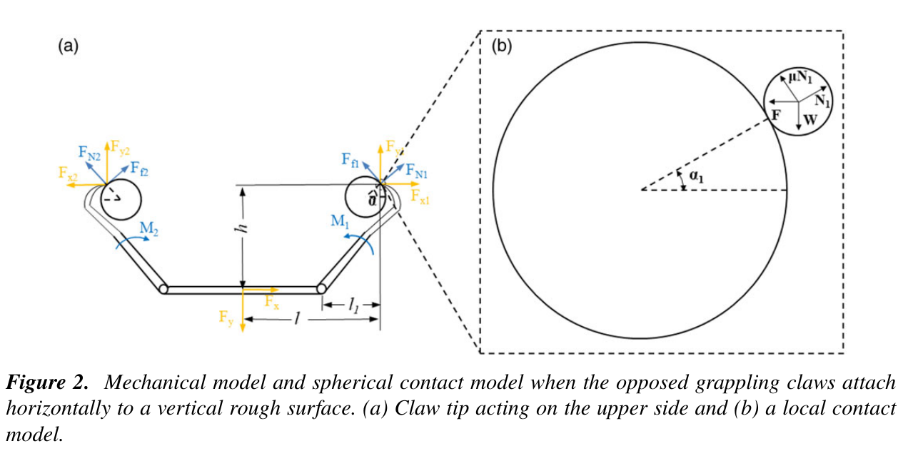
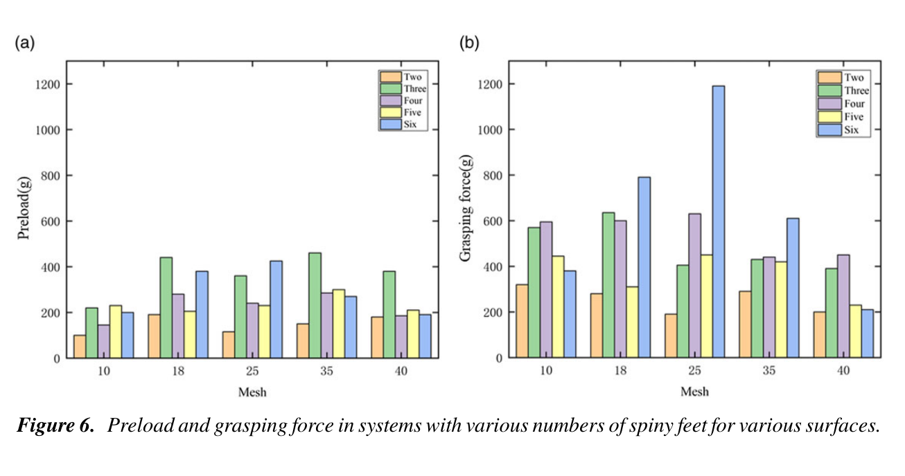
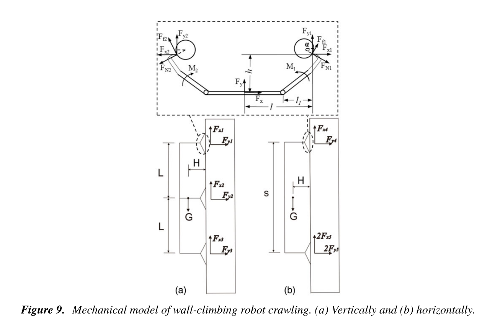

# 论文极简机理证据卡

- 题目：A climbing robot with paired claws inspired by gecko locomotion
- 作者：Qingfei Han；Aihong Ji；Nan Jiang；Jie Hu；Stanislav N. Gorb
- 年份：2022
- DOI：10.1017/S0263574722000492
- 论文类型：理论 + 实验 + 机器人系统
- 研究对象：球形刺尖与半球凸体接触、相向驱动对爪、多足抓附及六足壁虎机器人
- 相关性等级：A
- 相关性说明：给出单接触角-摩擦关系、对爪静力分配、足数效应和整机力矩平衡，并有多尺度实验验证。

## 1. 论文实际解决的问题

论文用相向转动的带刺足解决单向刺足难以横向/斜向爬墙的问题；建立理想球-半球接触及对爪静力模型，测试足数和石英砂粒度对预载/抓附力的影响，并以六足机器人验证 0°-180°方向爬行。

## 2. 核心机理

### M1 对爪几何把驱动力转成双侧切向分量

- 证据类型：[直接证据]
- 机理内容：水平抓附且忽略机构水平合力时，两侧竖向分量各承担总载荷的一半；驱动转矩、作用臂和机构高度共同决定单侧载荷角。
- 输入因素：$M_1,F_y,l_1,h$。
- 输出或影响：$F_{x1},F_{y1}$ 与载荷角 $\theta$。
- 成立条件：准静态、对称机构、两刺尖接触点同一水平面、$F_x=0$。
- 失效或不适用条件：左右表面/转矩不对称、整体转动、动态冲击或接触切换。
- 来源：PDF p.3-4，Section 2.2，Eqs. (1)-(8)，Fig. 2。
- 对当前模型的用途：作为对爪内部力分解基线；坐标和转矩正方向须先重定义。

### M2 接触角与摩擦共同决定主动内收需求

- 证据类型：[直接证据]
- 机理内容：球形刺尖位于半球凸体上侧时，接触角增大或摩擦系数增大都会降低所需内收力比 $F/W$；下侧接触采用相反符号分支。
- 输入因素：$\mu,\alpha_1/\alpha_2,W$。
- 输出或影响：$F/W$ 与 $\theta_1/\theta_2$。
- 成立条件：二维球-半球、库仑摩擦、单点准静态接触。
- 失效或不适用条件：有限尖端、非球形三维地形、滚动/压碎、黏附或多点接触。
- 来源：PDF p.3-5，Section 2.2，Eqs. (9)-(14)，Fig. 2。
- 对当前模型的用途：可作局部接触角-摩擦筛选式；不能替代真实地形接触。

### M3 抓附和脱附由接触角演化控制

- 证据类型：[原文结论]
- 机理内容：下压时刺尖沿凸体滑动至合适角度并形成预载；上拉脱附时足垫变形、接触角和抓附力上升，临界前达到峰值，随后各刺同时或依次脱开。
- 输入因素：驱动位移、足垫变形、表面凸体与初始间隙。
- 输出或影响：预载、峰值抓附力和脱附顺序。
- 成立条件：三足、25 目石英砂、1.8 mm/s 台架工况。
- 失效或不适用条件：高速冲击、基材损伤、独立弹簧行程或再搜索。
- 来源：PDF p.5-7，Section 3.2，Fig. 4。
- 对当前模型的用途：作为接近-滑动-稳定-增载-脱附的实验状态序列。

### M4 足数增加不保证接触数或抓附力线性增加

- 证据类型：[原文结论]
- 机理内容：不平表面使部分刺尖无法以合适角度接触，故 3-6 足的预载和抓附力均非线性；六足虽在部分工况预载低于三足，但在三种表面上的最大抓附力更高。
- 输入因素：足数、周向排布、石英砂目数、足垫变形。
- 输出或影响：有效接触数、预载与最大抓附力。
- 成立条件：2-6 足、10/18/25/35/40 目表面，每个足数-表面组合重复 5 次。
- 失效或不适用条件：逐刺载荷、接触数、误差条和原始数据均未报告。
- 来源：PDF p.7-8，Section 3.3，Figs. 5-6。
- 对当前模型的用途：作为“刺数不等于有效刺数”和阵列收益非线性的直接验证。

### M5 低剖面对爪通过反向转动实现抓附/脱附

- 证据类型：[直接证据]
- 机理内容：一对橡胶刺足由齿轮驱动反向旋转；每足 10 根 45°弯钩针。该结构降低离墙高度并主动切换抓附与脱附。
- 输入因素：针数、针角、齿轮转角、足垫柔顺。
- 输出或影响：双向/倒置承载及姿态稳定。
- 成立条件：本文样机和石英砂粗糙面。
- 失效或不适用条件：未给针尖半径、足垫刚度、逐针载荷或样本数。
- 来源：PDF p.8，Section 4.1，Fig. 7。
- 对当前模型的用途：提供对爪机构参数和系统级承载数量级。

### M6 整机抓附需同时满足重力与离墙力矩平衡

- 证据类型：[直接证据]
- 机理内容：固定在墙上的三组对爪以切向分量平衡重力，以法向分量和足间距平衡质心离墙力矩；竖直与水平爬行对应不同分配式。
- 输入因素：$G,H,L,S$ 与各对爪合力。
- 输出或影响：单对爪所需切向/法向力及整机静态极限。
- 成立条件：附着框架准静态、三组对爪性能相同。
- 失效或不适用条件：动态步态、载荷离散、单足失效和左右不对称。
- 来源：PDF p.9-11，Section 4.2，Eqs. (15)-(18)，Fig. 9，Table I。
- 对当前模型的用途：作为对爪到整机的力/力矩接口和实验校核。

## 3. 核心公式

### E1 对称对爪的单侧载荷与载荷角

$$
F_{y1}=F_{y2}=\frac{F_y}{2},\qquad
F_{x1}=F_{x2}=\frac{2M_1+F_y l_1}{2h},
$$

$$
\theta=\arctan\frac{F_{x1}}{F_{y1}}
=\arctan\frac{2M_1+F_y l_1}{F_y h}.
$$

- 证据类型：平面静力式；原公式号：Eqs. (6)-(8)
- 变量与单位：$F$ 为 N；$M_1$ 为 N·m 或 N·mm；$l_1,h$ 使用一致长度单位；$\theta$ 为角度。
- 正方向：沿用 Fig. 2；Section 2 中 $x$ 为水平切向、$y$ 为竖直切向。
- 成立条件：对称、准静态、$F_x=0$、两接触点同一水平面。
- 是否可直接进入当前模型：需要修正；正文称增大 $M$ 会减小 $\theta$，但印刷式在固定正号下给出相反趋势，必须重定正方向。
- 来源：PDF p.4，Section 2.2。

### E2 球形凸体上/下侧的摩擦-载荷角关系

$$
\frac{F}{W}=\frac{\cos\alpha_1-\mu\sin\alpha_1}
{\mu\cos\alpha_1+\sin\alpha_1},\qquad
\theta_1=\arctan\frac{1}{\mu}-\alpha_1,
$$

$$
\theta_2=\arctan\frac{1}{\mu}+\alpha_2.
$$

- 证据类型：二维接触平衡式；原公式号：Eqs. (11)-(14)
- 变量与单位：$F,W$ 为力；$\mu$ 无量纲；$\alpha,\theta$ 为角度。
- 成立条件：球形刺尖、半球凸体、库仑摩擦、单点准静态接触。
- 是否可直接进入当前模型：需要修正；需统一 $\alpha_2$ 的带符号定义并扩展到三维有限尖端。
- 来源：PDF p.4，Section 2.2。

### E3 三组对爪的整机静力平衡

$$
G=F_{x1}+F_{x2}+F_{x3},\qquad
GH=2L F_{y1}+L F_{y2},
$$

$$
G=F_{x4}+2F_{x5},\qquad
GH=S F_{y4}.
$$

- 证据类型：整机静力式；原公式号：Eqs. (15)-(18)
- 变量与单位：$G,F$ 为 N；$H,L,S$ 为一致长度单位。
- 正方向：Fig. 9 中 $F_x$ 沿墙并支撑重力，$F_y$ 为法向力；与 Section 2 的轴定义不同。
- 成立条件：附着半机架准静态、三对爪性能相同、几何对称。
- 是否可直接进入当前模型：需要修正；先统一坐标，再加入不对称、力矩自由度和失效重分配。
- 来源：PDF p.10，Section 4.2。

## 4. 关键参数表

| 参数 | 数值或范围 | 单位 | 工况/来源 | 当前用途 | 注意事项 |
|---|---:|---|---|---|---|
| 抓附试验面 | 100×100；石英砂 0.425-2 | mm；mm | p.5 | 表面/装置量级 | 未测三维形貌 |
| 表面分组 | 10/18/25/35/40 | 目 | p.7-8，Fig. 6 | 粒度趋势验证 | 目数不等于通用粗糙度 |
| 足数与重复数 | 2-6；每组合 5 | 足；次 | p.7 | 阵列规模趋势 | 五足非对称，形成混杂因素 |
| 台架接近距离/速度 | 10 / 1.8 | mm / mm·s⁻¹ | p.5 | 准静态边界 | 抓附和脱附同速 |
| 单足针数/接触角 | 10 / 45 | 根 / ° | p.8 | 爪单元几何 | 未给针尖半径 |
| 单对爪样机承载 | 400/400/200 | g | 竖直/水平/倒置，p.8 | 系统数量级 | 原文以质量载荷 g 报告 |
| 机器人质量 | 428.5 | g | p.9 | 重力输入 | 不含外载 |
| 机器人长/足端距/宽/高 | 300/320/240/36 | mm | p.9 | 整机几何 | 高为框架最高点离墙 |
| 平衡几何 $H/L/S$ | 约26/150/180 | mm | p.10 | E3 输入 | 特定样机 |
| 舵机转矩/电压 | 2.50 / 4.8 | kg·cm / V | p.9 | 驱动上限 | 非爪接触极限 |
| 单对爪需求 $F_x/F_y$ | 1.43/0.25；1.43/0.62 | N | 竖直；水平，p.10-11 | 静力校核 | 依赖等性能假设 |
| 爬行表面/速度/载荷 | 石英砂0.5-1 / 7.45 / 200 | mm / mm·s⁻¹ / g | p.11 | 整机验证 | 性能受舵机转矩限制 |
| 静态极限载荷 | 横向700；纵向900 | g | Table I，p.11 | 整机上限 | 100 g步进，终止为倾覆或未挂接 |

## 5. 最小实验或仿真证据

### V1 抓附-脱附力时序

- 类型：实验
- 关键工况：三足、25 目石英砂、1.8 mm/s。
- 结果：下压滑动形成预载；上拉时接触角和力升高至峰值后脱开。
- 支撑内容：M3；来源：PDF p.6-7，Fig. 4。

### V2 足数收益非线性

- 类型：实验
- 关键工况：2-6 足、五种目数、每组合 5 次并更换表面。
- 结果：预载/抓附力不随足数线性增长；六足在三种表面上高于三足，但其预载可更低。
- 支撑内容：M4；来源：PDF p.7-8，Fig. 6。

### V3 对爪与整机承载

- 类型：实验 + 静力计算
- 结果：单对爪竖直/水平/倒置载荷为 400/400/200 g；整机横/纵静态极限为 700/900 g。
- 支撑内容：M5-M6；来源：PDF p.8、11，Fig. 7，Table I。

### V4 任意方向爬行

- 类型：整机实验
- 关键工况：0°-180°方向、0.5-1 mm 石英砂墙面。
- 结果：速度 7.45 mm/s；携带 200 g 时可竖直和水平稳定爬行，更高载荷首先受舵机转矩限制。
- 支撑内容：M6；来源：PDF p.11，Fig. 10。

## 6. 关键图片

- 原图号：Fig. 2；PDF 页码：3；保留原因：不可由文字无歧义恢复力、力矩、长度和接触角定义；支撑 M1-M2/E1-E2。

- 原图号：Fig. 6；PDF 页码：8；保留原因：直接显示足数收益与粒度效应均非单调/线性；支撑 M4/V2。

- 原图号：Fig. 9；PDF 页码：10；保留原因：完整定义 Eqs. (15)-(18) 的力方向与力臂；支撑 M6/E3。

## 7. 可迁移关系

- [可直接采用] 对爪必须同时满足沿墙承载与离墙力矩平衡的分层接口。
- [需要标定] 目标爪的针角、驱动转矩、柔度、有效接触数及表面粒度/形貌。
- [仅作趋势验证] 足数增加时有效接触和抓附力不会线性增加。
- [仅作上限约束] 400/200 g 单对爪和 700/900 g 整机值只适用于本文样机与石英砂面。
- [不能直接采用] 将球-半球二维接触、目数标签或平均同爪假设直接用于三维红砖。
- [不能直接采用] 把整机倾覆/舵机受限载荷当成局部刺尖或材料破坏阈值。

## 8. 局限与风险

- Section 2 与 Fig. 9 对 $x/y$ 方向的用途不同，公式跨节组合前必须统一坐标。
- Eq. (8) 固定正号下 $M$ 增大使 $\theta$ 增大，而正文称其减小；转矩正方向存在内部不一致。
- Eq. (14) 对下侧接触角的带符号定义含混，不能在未重推前编码。
- 论文用球形刺尖和半球颗粒，不含有限尖端、真实三维形貌、材料压碎或裂纹。
- Fig. 6 未给原始数据、误差条或逐刺接触/载荷；五足排布又与其余足数不同。
- 静态极限把挂接失败、倾覆和驱动受限混在系统结果中，不能隔离接触容量。

## 9. 对当前研究的最小贡献

该文提供“单接触角-摩擦、足数非线性、对爪及整机平衡”三级证据；可支撑 M2/M3/M4，但三维形貌、逐刺载荷共享和红砖局部破坏仍需其他文献。
