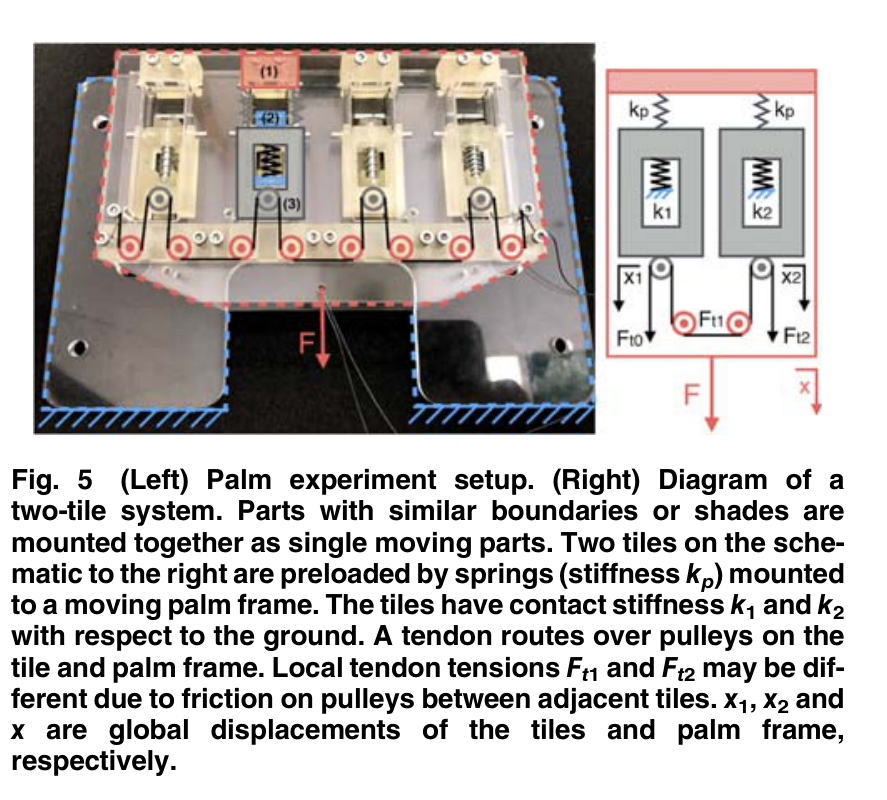
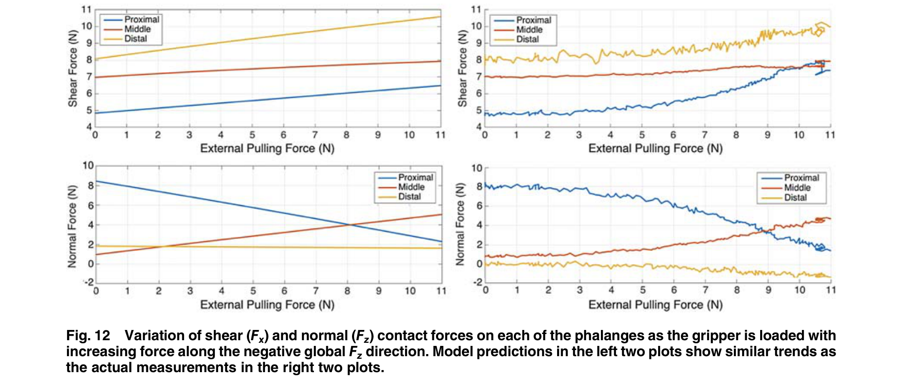
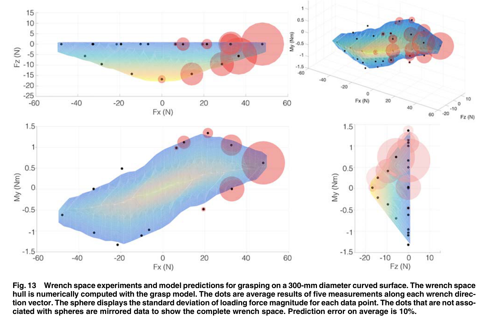

# 论文极简机理证据卡

- 题目：SpinyHand: Contact Load Sharing for a Human-Scale Climbing Robot
- 作者：Shiquan Wang；Hao Jiang；Tae Myung Huh；Danning Sun；Wilson Ruotolo；Matthew Miller；William R. T. Roderick；Hannah S. Stuart；Mark R. Cutkosky
- 年份：2019
- DOI：10.1115/1.4043023
- 论文类型：机构设计 + 理论 + 实验 + 参数化仿真
- 研究对象：方向性微刺瓦片、腱驱动多指机构、瓦片/指节载荷共享及整手力-力矩承载域
- 相关性等级：A
- 相关性说明：把瓦片接触能力、腱传动分载、指节平衡和整手承载域连成模型，并提供单瓦片、指节力和整手承载域三级验证。
- 长度说明：论文同时含瓦片分载、指节接触求解和整手承载域三个独立层级，按模板放宽至 3500 个中文字符以内。

## 1. 论文实际解决的问题

论文面向 100 kg 级攀爬机器人，设计多指微刺手；以弹簧和腱路由使瓦片先贴合、后切向加载，并建立从单指接触力到整手六维承载域的快速求解方法及台架验证。

## 2. 核心机理

### M1 适量传动摩擦可把载荷转移给更强接触

- 证据类型：[原文结论]
- 机理内容：零摩擦单腱使相邻瓦片切向力相等；有摩擦时，较硬、挂接更牢的瓦片承担更大载荷。两瓦片理想目标不是等力，而是满足 $F_1/k_1=F_2/k_2$，使位移裕度与接触能力相配。
- 输入因素：接触刚度 $k_1,k_2$、回位刚度 $k_p$、腱-滑轮摩擦 $\mu$、掌面位移。
- 输出或影响：瓦片力分配、最弱接触位移和总承载上限。
- 成立条件：线性弹簧、准静态、相邻两瓦片、摩擦方向已知且 $\mu$ 取常数。
- 失效或不适用条件：多瓦片各滑轮的摩擦方向不定；过大摩擦会阻碍姿态重调。
- 来源：PDF p.4-5，Section 4.1-4.2，Eq. (1)-(3)，Fig. 5-7。
- 对当前模型的用途：建立“按局部能力分载”的相邻单元约束，并为腱摩擦设置有益但有限的范围。

### M2 刚度层级决定“先闭合贴形、后瓦片搜索加载”

- 证据类型：[原文结论]
- 机理内容：指甲关节最软、主关节次之、滑动瓦片最硬；手指先卷曲贴合，全部指节落位后瓦片才滑动、捕获凸体并建立切向力，避免提前加载造成抓取弹出。
- 输入因素：关节/瓦片刚度、预载、腱张力与滑轮半径。
- 输出或影响：闭合顺序、有效接触数、切向加载时机和弹出风险。
- 成立条件：单腱依次绕过关节与瓦片滑轮，弹簧预载维持初始姿态。
- 失效或不适用条件：刚度/预载层级改变，或瓦片在指节落位前被过早加载。
- 来源：PDF p.3-4，Section 3.1-3.2，Fig. 3-4。
- 对当前模型的用途：作为状态机顺序约束。

### M3 指节接触力由关节矩平衡与瓦片平移平衡共同唯一确定

- 证据类型：[直接证据]
- 机理内容：在已知几何、腱力和每指节一个接触时，关节矩平衡与瓦片局部 $x$ 向力平衡组成方阵 $A\mathbf f_c=\mathbf b$；若 $A$ 可逆，可直接求全部接触力，无需识别难测的整手结构刚度。
- 输入因素：关节位姿 $\mathbf q$、接触位置 $\mathbf c$、腱力 $f_t$、滑轮半径、弹簧刚度/预载和瓦片行程。
- 输出或影响：各指节二维法向/切向力及手指合力矩。
- 成立条件：指平面内准静态、每指节一个已知接触、先忽略手内摩擦且 $A$ 方阵可逆。
- 失效或不适用条件：接触丢失使方程超定；$\operatorname{cond}(A)>270$ 时反求对位姿扰动高度敏感。
- 来源：PDF p.5-6，Section 5.1、5.4，Eq. (4)-(12)，Fig. 8。
- 对当前模型的用途：提供单爪接触状态到指节力的线性求解接口。

### M4 接触能力是方向相关的非凸边界，任一瓦片滑脱被保守定义为抓取失效

- 证据类型：[归纳]
- 机理内容：瓦片最大承载 $f_s=s(\mathbf v)$ 随加载方向变化，并在给定平面上线性化；任一接触满足 $f_c>f_s$ 即判整抓失效。
- 输入因素：加载方向、单瓦片接触位置与表面挂接状态。
- 输出或影响：固定腕最大腱力、浮动腕极限外载和最先失效指节。
- 成立条件：瓦片承载边界已由目标表面试验或上游模型标定。
- 失效或不适用条件：该判据偏保守；近端接触脱开后整体有时仍能保持并形成 crimp 抓取。
- 来源：PDF p.6-8、12，Section 5.5、5.7、Appendix，Eq. (13)-(17)、Eq. (A4)，Fig. 9-10。
- 对当前模型的用途：把上游微刺阵列能力作为整爪求解器的方向相关边界。

### M5 固定腕与浮动腕对应两种不同承载域

- 证据类型：[原文结论]
- 机理内容：固定腕时承载域是各指作用向量张成的多面体；浮动腕时需搜索满足手指运动学及接触上限的可行位姿点云并取凸包。
- 输入因素：各指可行运动集、腱力上限、腕位姿和瓦片承载边界。
- 输出或影响：可承受的全局力/力矩集合以及极限方向。
- 成立条件：接触位置与手指几何已知；浮动腕使用小位移与数值刚度近似。
- 失效或不适用条件：仅验证平面对置双指的 $(F_x,F_z,M_y)$ 子空间。
- 来源：PDF p.6-9，Section 5.4-6.3，Eq. (9)-(17)，Fig. 9、13。
- 对当前模型的用途：提供对爪整体力/力矩平衡、承载域与加载方向规划框架。

### M6 曲率、腱力与滑轮半径共同改变薄弱指节和承载域

- 证据类型：[直接证据]
- 机理内容：300 mm 小直径曲面具有更大承载域；700 mm 低曲率表面更难抓且多由近端指节先失效。中等腱力扩大承载域，过大腱力会牺牲切向能力；滑轮半径改变全部接触力，远端半径大于中间半径可在外载前触发固定腕失效。
- 输入因素：表面曲率、腱力、各关节/瓦片滑轮半径。
- 输出或影响：近/远端失效次序、剪切/法向极限和力矩能力。
- 成立条件：论文样机几何和已标定的细混凝土/砂纸瓦片能力。
- 失效或不适用条件：参数扫描仅为仿真，不能迁移为红砖最优值。
- 来源：PDF p.9-11，Section 6.3、7.1，Fig. 13-16。
- 对当前模型的用途：作为曲率、预载和传动比的趋势验证与设计扫描变量。

## 3. 核心公式

### E1 两瓦片接触力

$$
\begin{aligned}
F_1&=\frac{2(2+\mu)k_1k_2+4k_pk_1}{(2-\mu)k_1+(2+\mu)k_2+4k_p}\,x,\\
F_2&=\frac{2(2-\mu)k_1k_2+4k_pk_2}{(2-\mu)k_1+(2+\mu)k_2+4k_p}\,x.
\end{aligned}
$$

- 证据类型：线性静力式；原公式号：Eq. (1)
- 变量与单位：$F_1,F_2$（N）；$k_1,k_2,k_p$（N/mm）；$x$（mm）；$\mu$（1）。
- 正方向：$x,x_1,x_2$ 按 Fig. 5 向下为正，$F$ 同向加载。
- 成立条件：两瓦片、线性接触/回位弹簧、恒定摩擦且摩擦方向与附录假设一致。
- 是否可直接进入当前模型：需要修正；多瓦片应逐滑轮判定粘着/滑动与摩擦方向。
- 来源：PDF p.4，Section 4.1；推导见 p.12，Eq. (A1)-(A2)。

### E2 能力匹配摩擦与两瓦片上限

$$
\mu=2\frac{k_1-k_2}{k_1+k_2},
\qquad
F=\frac{4k_1k_2+2k_pk_1+2k_pk_2}{(2-\mu)k_1+2k_p}\,x_2.
$$

- 证据类型：设计判据；原公式号：Eq. (2)-(3)
- 变量与单位：同 E1；$x_2$ 是较弱接触达到上限时的位移。
- 成立条件：$k_1>k_2$，并以 $F_1/k_1=F_2/k_2$ 作为理想能力匹配目标。
- 是否可直接进入当前模型：仅作相邻单元初值/上限；不代表全阵列最优摩擦。
- 来源：PDF p.4，Section 4.1。

### E3 指节接触线性系统

$$
J(\mathbf q,\mathbf c)^T\mathbf f_c+f_t\mathbf r-K_r\mathbf q-\mathbf p_r=0,
$$

$$
P_x\mathbf f_c+\mathbf f_p(\mathbf c,f_t)-K_p\mathbf d-\mathbf p_p=0,
\qquad
A\mathbf f_c=\mathbf b,
$$

$$
A=\begin{bmatrix}J^T\\P_x\end{bmatrix},\qquad
\mathbf b=\begin{bmatrix}K_r\mathbf q+\mathbf p_r-f_t\mathbf r\\K_p\mathbf d+\mathbf p_p-\mathbf f_p(\mathbf c,f_t)\end{bmatrix}.
$$

- 证据类型：平面准静态平衡式；原公式号：Eq. (4)-(7)
- 变量：$\mathbf f_c$ 为各指节接触力列向量；$\mathbf q,\mathbf c,\mathbf d$ 分别为关节角、接触位置和瓦片行程；其余为刚度、预载和滑轮半径。
- 单位：统一采用 N、N·m、mm 与 rad；矩阵各行须保持量纲一致。
- 成立条件：指平面内、每指节一个接触、无手内摩擦、$A$ 方阵可逆。
- 是否可直接进入当前模型：是，作为单指接触求解骨架；需加入接触切换、行程限位和三维映射。
- 来源：PDF p.5，Section 5.1。

### E4 指内摩擦修正

$$
\mathbf b=
\begin{bmatrix}
K_r\mathbf q+\mathbf p_r-f_tM\mathbf r\\
K_p\mathbf d+\mathbf p_p-M\mathbf f_p(\mathbf c,f_t)
\end{bmatrix},
\qquad
M=\operatorname{diag}\!\left(1,1-\mu,\ldots,(1-\mu)^{n-1}\right).
$$

- 证据类型：集中参数修正式；原公式号：Eq. (8)
- 成立条件：闭合时张力从近端向远端递减，$\mu$ 为相邻指节间集总摩擦。
- 关键限制：静摩擦阶段每个对角项应由接触力增量修正并限于 $1\pm\mu$；不能只用单一滑动方向。
- 是否可直接进入当前模型：需要修正为逐滑轮粘滑状态。
- 来源：PDF p.6、12，Section 5.2、Appendix Eq. (A3)。

### E5 指/整手力矩映射

$$
\mathbf w_f=W_f\mathbf f_c,\qquad
\mathbf w_g=\sum_{i=1}^{n}\mathbf w_{fi}.
$$

- 证据类型：定义式；原公式号：Eq. (9)-(10)
- 变量与单位：$\mathbf f_c$（N）；$\mathbf w$ 含力（N）和力矩（N·m）；$W_f$ 为接触力到掌坐标的力矩映射。
- 成立条件：所有指力矩已表达在同一掌坐标系。
- 是否可直接进入当前模型：是。
- 来源：PDF p.6，Section 5.3。

### E6 方向相关瓦片失效边界

$$
f_s=s(\mathbf v),\qquad
f_s=f_{s\max}-k_{slp}\phi,\qquad
k_{slp}=\frac{f_{s\max}-f_{s\min}}{\phi_{\max}}.
$$

- 证据类型：上游模型接口 + 经验线性化；原公式号：Eq. (13)、Eq. (A4)
- 变量与单位：$f_s,f_{s\max},f_{s\min}$（N）；$\mathbf v$ 为单位加载方向；$\phi$（rad 或 deg，标定时一致）；$k_{slp}$ 为 N/角度。
- 成立条件：固定加载平面内，方向-承载关系可由实测近似线性拟合。
- 是否可直接进入当前模型：需要用目标红砖与目标瓦片重新标定。
- 来源：PDF p.6、12，Section 5.5、Appendix。

### E7 固定腕接触力分解

$$
\mathbf f_c=A^{-1}\begin{bmatrix}K_r\mathbf q+\mathbf p_r\\K_p\mathbf d+\mathbf p_p\end{bmatrix}
-A^{-1}f_t\begin{bmatrix}\mathbf r\\\mathbf c_p\end{bmatrix}
=\mathbf c_{sys}+f_t\mathbf c_{act}.
$$

- 证据类型：线性分解；原公式号：Eq. (14)
- 成立条件：瓦片加载角近似固定，$\mathbf f_p=\mathbf c_p f_t$，固定腕姿态。
- 输出含义：被动弹簧决定初始分量，腱力线性缩放驱动分量。
- 是否可直接进入当前模型：是；需与 E6 的接触上限逐瓦片联立。
- 来源：PDF p.6-7，Section 5.5.1。

### E8 固定腕整手承载域

$$
\mathcal W_g=\left\{\mathbf w_g\,\middle|\,
\mathbf w_g=\mathbf o+\sum_{i=1}^{n}f_{ti}\mathbf v_i,
\ 0\le f_{ti}\le f_{ti(\max)}\right\},
$$

$$
\mathbf o=\sum_{i=1}^{n}W_{fi}\mathbf c_{sys,i},\qquad
\mathbf v_i=W_{fi}\mathbf c_{act,i}.
$$

- 证据类型：可行集定义；原公式号：Eq. (16)
- 成立条件：固定腕、各指姿态不变、各指腱力可独立控制，最大腱力由首个瓦片失效确定。
- 输出含义：$n$ 指承载域为由 $\mathbf v_i$ 张成、以 $\mathbf o$ 为一顶点的多面体。
- 是否可直接进入当前模型：是，适用于固定腕/力控分支；浮动腕须使用位姿可行集搜索。
- 来源：PDF p.7，Section 5.6。

## 4. 关键参数表

| 参数 | 数值或范围 | 单位 | 工况/获得方式 | PDF 来源 | 当前用途 | 注意事项 |
|---|---:|---|---|---|---|---|
| 整手质量 / 设计承载 | 2.6 / 最高50 | kg / kg | RoboSimian 末端设计 | p.2-3 | 整机量级 | 50 kg 是需求，不是本文破坏实测 |
| 整手瓦片数 | 22 | 块 | 四指+掌面 | p.3 | 接触组规模 | 每瓦片含多根刺 |
| 掌面尺寸 / 刺数 / 滑动瓦片数 | 11×6 / >300 / 8 | cm / 根 / 块 | 样机 | p.4 | 掌面阵列量级 | 无逐刺载荷 |
| 单指最大腱力 / 指尖力 | 约700 / 最高600 | N / N | 236:1、20 W 电机 | p.3 | 驱动上限 | 后者是结构能力描述 |
| 指甲/主关节/瓦片刚度 | 0.025 / 0.05 / 11.5 | N·m/rad / N·m/rad / N/mm | 设计值 | p.4 | 闭合顺序 | 不等于接触刚度 |
| 接触模拟弹簧 | 1.4、2.2、4.9 | N/mm | 两/四瓦片台架 | p.4-5 | E1-E2验证 | 人工线性弹簧 |
| Dyneema-固定杆摩擦 $\mu$ | 0.34 | 1 | 经验测定 | p.4 | 传动摩擦 | 轴承滑轮近似零 |
| 两/四瓦片摩擦增益 | 至少14 / 至少24 | % | 台架最大载荷 | p.5 | 分载趋势验证 | 四瓦片正文与图中配置数不一致 |
| 单瓦片能力试验 | 70 | 次 | 36目砂纸 | p.8 | E6标定验证 | 每个图点至少5次 |
| 指节力试验预载 | 37 | N/指腱 | 300 mm直径曲面 | p.8 | M3验证 | 初始瓦片挂接各异 |
| 指节传感器 | 109；约5 | Hz；% | $F_x$ 0-25 N，$F_z$ 0-10 N | p.8 | 力曲线验证 | 仅对称侧布置 |
| 试验中掌基位移 | 最高5 | mm | 浮动腕加载 | p.8 | 小位移检查 | 模型忽略相应角度/腱长变化 |
| 300 mm承载域采样 | 17×5 | 方向×重复 | 36目砂纸，$F_z\le0$ | p.8-9 | 整手验证 | 其余点按对称镜像 |
| 300/700 mm平均模型误差 | 10 / 12、14 | % | 37 N / 30、40 N腱力 | p.9 | 验证容差 | 高承载区离散更大 |
| 近端滑轮半径 | 5.5 | mm | 样机固定值 | p.10 | 参数扫描基准 | 远端半径不宜大于中间半径 |

## 5. 最小实验或仿真证据

### V1 摩擦提高异质接触的两/四瓦片总承载

- 类型：实验-模型对比
- 关键工况：三类线性接触弹簧；两瓦片每配置5次；固定杆 $\mu=0.34$ 与轴承滑轮近零摩擦对比。
- 结果：两瓦片模型与试验在5%内，摩擦使最大载荷至少提高14%；四瓦片所有报告配置均提高，正文称至少24%。
- 支撑内容：M1/E1-E2；来源：PDF p.4-5，Fig. 5-7。

### V2 单瓦片方向承载边界可线性近似

- 类型：实验-上游模型对比
- 关键工况：36目砂纸、单瓦片、70次加载至滑脱。
- 结果：极限力数据与既有微刺模型一致；给定平面内用直线近似方向-承载曲线被认为足以降低整手计算量。
- 支撑内容：M4/E6；来源：PDF p.8，Fig. 10。

### V3 指节法向/切向力趋势得到直接验证

- 类型：浮动腕双指实验
- 关键工况：300 mm直径曲面、每指37 N腱力、沿全局 $-F_z$ 拉载。
- 结果：各指节切向力随外载增加；近端与远端法向裕度下降，中间指节通常保持安全。模型捕捉趋势，但摩擦/回差引起振荡和非线性。
- 支撑内容：M3；来源：PDF p.8-9，Fig. 11-12。

### V4 整手三维子空间承载域与试验相符

- 类型：实验-数值承载域对比
- 关键工况：对置双指、$(F_x,F_z,M_y)$、300/700 mm直径曲面；300 mm用17个方向、每方向5次。
- 结果：300 mm平均误差10%；700 mm在30/40 N腱力下为12%/14%。高承载方向离散最大。
- 支撑内容：M5；来源：PDF p.8-9，Fig. 13。

### V5 参数扫描给出非单调腱力与传动比趋势

- 类型：仿真
- 关键工况：300/700 mm曲面、细混凝土能力边界，扫描腱力和中/远端滑轮半径。
- 结果：中等腱力扩大承载域，过高腱力降低剪切上限；不当滑轮半径会在施加外载前触发接触失效或弹出。
- 支撑内容：M6；来源：PDF p.10-11，Fig. 15-16。

## 6. 关键图片

- 原图号：Fig. 5；PDF 页码：4；保留原因：完整定义 E1-E2 的接触刚度、回位刚度、局部张力与位移方向。

- 原图号：Fig. 12；PDF 页码：9；保留原因：同时显示近/中/远指节法向与切向载荷转移，无法由单个统计量替代。

- 原图号：Fig. 13；PDF 页码：9；保留原因：直接呈现 $(F_x,F_z,M_y)$ 承载域、方向离散性和模型10%平均误差。

## 7. 可迁移关系

- [可直接采用] 关节矩平衡 + 瓦片平移平衡的 $A\mathbf f_c=\mathbf b$ 求解骨架，以及接触力到整手力矩的统一坐标映射。
- [可直接采用] 固定腕多面体承载域与浮动腕“单指可行集-运动学交集-力矩凸包”计算流程。
- [需要标定] 红砖上的方向承载边界、接触刚度、腱摩擦、回差、各弹簧与滑轮半径。
- [仅作趋势验证] 适量摩擦将载荷转向更强接触；低曲率更难抓；中等腱力优于过低或过高腱力。
- [仅作上限/容差] 10%-14%平均承载域误差只适用于本文平面对置双指、砂纸曲面台架。
- [不能直接采用] 把瓦片边界当单刺边界，或把36目砂纸/细混凝土结果直接作为红砖参数。

## 8. 局限与风险

- 自有实验使用36目砂纸；“岩石力为2-5倍”来自文献[17]，不是本文直接测量。
- 6D模型仅在平面对置双指的 $(F_x,F_z,M_y)$ 子空间验证，外指中间旋角、整手四指和掌面接触未系统验证。
- 接触位置预先给定、每指节只设一个合力接触；不含三维表面搜索、逐刺竞争或有效刺数演化。
- 线性模型不解释摩擦、回差和挂接随机性；$A$ 病态使反求对小姿态误差敏感。
- “任一瓦片脱开即整抓失败”偏保守；接触丢失后的关节移动只用缩减方程临时处理，未建立一般接触切换/重分配状态机。
- Fig. 7 可见7种四瓦片配置，正文却称8种；保留“至少24%”趋势，不据图补写缺失配置。

## 9. 对当前研究的最小贡献

P19提供瓦片接触能力到指节分载、再到对爪力-力矩承载域的核心桥梁；它不能生成粗糙地形，也不解析单刺接触和逐刺渐进失效，须由P01/P07/P09及材料文献补足上游边界。
