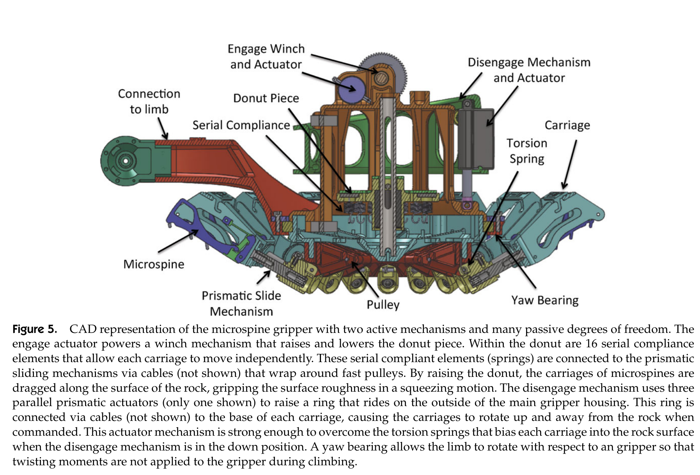
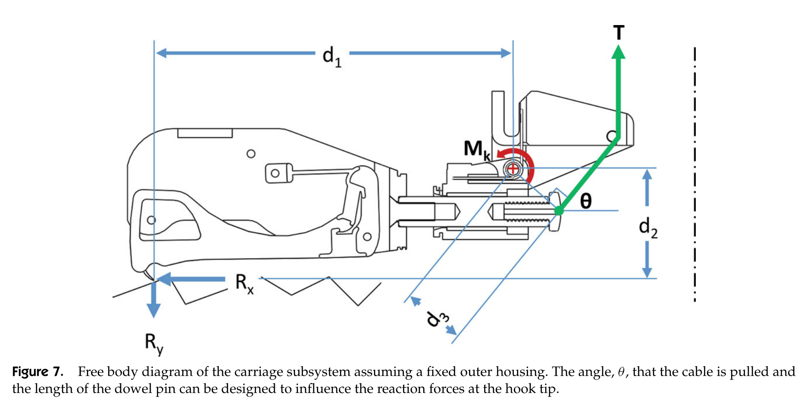
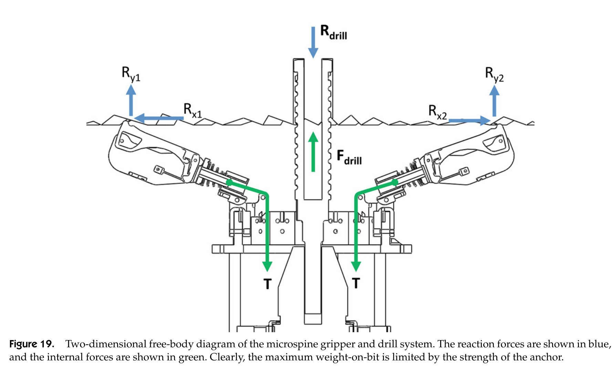

# 论文极简机理证据卡

- 题目：Gravity-independent Rock-climbing Robot and a Sample Acquisition Tool with Microspine Grippers
- 作者：Aaron Parness；Mathew Frost；Nitish Thatte；Jonathan P. King；Kevin Witkoe；Moises Nevarez；Michael Garrett；Hrand Aghazarian；Brett Kennedy
- 年份：2013
- DOI：`10.1002/rob.21476`
- 论文类型：机器人机构 + 实验验证
- 研究对象：天然岩石上的径向分层柔顺微刺整爪、LEMUR IIB 攀爬机器人及自锚定钻削工具
- 相关性等级：A
- 相关性说明：给出径向多阵列整爪的接合、分层顺应、多方向承载和整机验证，可直接约束单爪/整爪模型及实验边界。
- 长度说明：论文同时包含整爪机构、车架静力、跨材料拉脱、车架测力与整机验证，按模板放宽至 3500 个中文字符以内。

## 1. 论文实际解决的问题

论文把独立柔顺微刺扩展为 16 个径向车架的机器人化整爪，验证其在天然岩石上跨方向锚定、受控接合/脱离和整机攀爬，并以车架静力、拉脱试验、力传感及钻削试验给出可用边界。

## 2. 核心机理

### M1 径向相反搜索形成跨方向锚定

- 证据类型：[原文结论]
- 机理内容：16 个车架沿径向布置并由中心机构同时向内拖曳；不同方位的微刺在天然岩面捕获凸体，使整爪可承受法向、切向及其间方向的拉载。
- 输入因素：车架方位、中心收紧位移、局部可挂接凸体、各方位接触强度。
- 输出或影响：径向整爪的方向承载能力。
- 成立条件：固结且足够粗糙的岩石；载荷通过爪体中心附近施加，扭矩受抑制。
- 失效或不适用条件：松散颗粒、易碎表层、显著偏心力矩或缺少可挂接凸体。
- 来源：PDF p.2、5-7、10-11、17，Sections 1、3、6、9，Figs. 5、8、13，Table I。
- 对当前模型的用途：提供“多个单向阵列的方向能力汇集为整爪能力”的实验骨架；不能替代完整六维力—力矩域。

### M2 两级独立柔顺适应跨尺度粗糙度

- 证据类型：[原文结论]
- 机理内容：车架相互独立以适应 cm 级起伏；每车架内 16 根微刺独立伸展/拖曳以适应 mm 级及更小粗糙度，串联弹簧在某车架挂接后继续容许其他车架搜索并被动分载。
- 输入因素：车架转动/滑移、微刺柔度、串联弹簧、表面多尺度起伏。
- 输出或影响：有效挂接点数、表面贴合和载荷共享。
- 成立条件：各柔顺自由度未到硬止挡，刺/车架仍有搜索行程。
- 失效或不适用条件：大尺度起伏超出机构运动学；弹簧饱和或接触高度差超过可达范围。
- 来源：PDF p.1-2、4-6、17，Sections 1、3、9，Figs. 3-6。
- 对当前模型的用途：定义“刺级—车架级—整爪级”分层自由度，提示不能用单一等效弹簧替代全部贴合过程。

### M3 接合、承载与脱离由串联柔顺切换

- 证据类型：[归纳]
- 机理内容：扭簧先把车架压向表面，中心绞盘再使车架向内拖曳；刺挂接后车架停止而串联弹簧伸长并建立载荷。释放时先卸中心张力，再主动抬离车架。
- 输入因素：扭簧偏置、绞盘位移、挂接状态、串联弹簧伸长、抬离指令。
- 输出或影响：搜索距离、挂接载荷、主动脱离和卡滞概率。
- 成立条件：准静态机器人化接合；中心收紧量足以让全部车架完成搜索。
- 失效或不适用条件：刺尖深陷凹坑、卡滞或机构过载；论文未给出逐刺状态与弹簧刚度。
- 来源：PDF p.5-6，Section 3，Figs. 5-6。
- 对当前模型的用途：提供可实现的接合/卸载顺序和状态切换证据。

### M4 车架几何分配压入与向内拖曳

- 证据类型：[直接证据]
- 机理内容：接合缆张力对车架枢轴产生力矩；缆线角度与销轴长度改变刺尖切向、法向反力之间的权衡，扭簧在未收紧时也提供初始压入。
- 输入因素：$T$、$M_k$、$d_1$-$d_3$、缆线角度 $\theta$。
- 输出或影响：刺尖/车架反力 $R_x,R_y$。
- 成立条件：外壳固定、二维准静态车架自由体。
- 失效或不适用条件：单个力矩式不足以唯一恢复两个反力，也不含多刺内部载荷分布。
- 来源：PDF p.6-7，Section 3，Eq. (1)，Fig. 7。
- 对当前模型的用途：可作为车架级力传递约束；须与接触方向和其他平衡式联立。

### M5 岩面强度与粗糙度共同截断承载

- 证据类型：[直接证据]
- 机理内容：整爪在固结岩石上承载随样本粗糙程度总体增加，但易碎表面会先破坏；松散材料几乎不能形成法向/45°锚定，不能把几何粗糙度单独当作承载能力。
- 输入因素：表面固结状态、定性粗糙度、易碎性、拉载方向。
- 输出或影响：整爪峰值拉脱力及“滑脱/材料破坏”失效模式。
- 成立条件：每材料每方向 5 次慢速拉脱，力经爪体中心附近施加。
- 失效或不适用条件：未测量三维形貌、强度或摩擦，且未报告离散性。
- 来源：PDF p.10-11，Section 6，Fig. 13-14，Table I。
- 对当前模型的用途：作为跨材料趋势和失效分支验证，不能反辨识单一形貌参数。

### M6 柔顺存在均载/减振与定位精度的双向效应

- 证据类型：[原文结论]
- 机理内容：柔顺对刺间均载和钻削振动衰减必不可少，却导致整机逐步下垂，并放大钻头起孔游走，使后续足端够不到表面或整爪脱附。
- 输入因素：整爪柔度、机构自由度、循环步态、偏心/振动载荷。
- 输出或影响：均载、减振、下垂、可达性和脱附风险。
- 成立条件：本文三自由度肢体、开环步态和钻削配置。
- 失效或不适用条件：更高自由度肢体、闭环补偿或不同刚度分配可能改变权衡。
- 来源：PDF p.8-10、16-17，Sections 4-5、8-9，Figs. 12、17-21。
- 对当前模型的用途：柔度优化必须同时检查均载与整爪位姿误差，不能只最大化顺应性。

## 3. 核心公式

### E1 车架枢轴力矩关系

$$
\sum M_{+}=M_k+T d_3-R_x d_2-R_y d_1
$$

- 证据类型：静力关系；原公式号：Eq. (1)
- 变量与单位：$M_+,M_k$ 为 N·m；$T,R_x,R_y$ 为 N；$d_1,d_2,d_3$ 为 m。
- 正方向或角度定义：$R_x$ 沿岩面、$R_y$ 指向图中向下；$T$ 沿缆线，$\theta$ 为缆线相对水平角；正力矩按 Fig. 7 标注。
- 成立条件：外壳固定、二维准静态车架自由体。
- 关键假设：接触反力集中到图示钩尖；忽略惯性、三维偏载和车架内多刺分配。
- 输出含义：缆线几何和扭簧力矩对切向/法向反力组合的约束。
- 是否可直接进入当前模型：需要修正；须补平动平衡、接触/摩擦约束和多刺合力定义。
- 来源：PDF p.6，Section 3。

### E2 对置车架—钻头二维反力平衡

$$
R_{\mathrm{drill}}=R_{y1}+R_{y2},\qquad R_{x1}=R_{x2}
$$

- 证据类型：静力关系；原公式号：Eq. (2)-(3)
- 变量与单位：全部为反力，单位 N；方向按 Fig. 19。
- 成立条件：二维、对称的两侧车架示意，钻削轴穿过整爪中心。
- 关键假设：左右切向反力相互平衡；未显式写入力矩和周向钻削扭矩。
- 输出含义：轴向进给力上限受两侧锚定反力之和限制。
- 是否可直接进入当前模型：需要修正；只能作为径向整爪对称截面的局部平衡，不是完整对爪或六维承载式。
- 来源：PDF p.13、15，Section 8，Fig. 19。

## 4. 关键参数表

| 参数/工况 | 数值 | 单位 | PDF 来源 | 当前用途 | 注意事项 |
|---|---:|---|---|---|---|
| 车架 × 每车架微刺 | $16\times16=256$ | 个 | p.1, 5, 17 | 分层阵列规模 | 未给逐刺有效挂接数 |
| 机器人化单爪质量 | 1.05 | kg | p.6 | 系统载荷 | 含两套主动机构 |
| 易卡滞 / 仍不脱离 | $<5$ / $<1$ | % | p.6 | 脱离状态概率 | 未给试验次数与置信区间 |
| 飞行型挂接点 / 柔顺层级 | 80 / 1 | 个 / 层 | p.7 | 架构对照 | 聚合物版为256点/两级 |
| 飞行型跨方向承载 | $>130/>150/>140$ | N | p.7, Fig. 8 | 法向/45°/切向下界 | 单次图示，无统计量 |
| Saddleback basalt | 32.3 / 54.5 / 44.1 | N | p.11, Table I | 法向/45°/切向均值 | 每格5次 |
| Bishop tuff | 120.5 / 91.8 / 110.7 | N | p.11, Table I | 同上 | 每格5次 |
| Vesicular basalt | 189.5 / 113.2 / 281.4 | N | p.11, Table I | 同上 | 每格5次 |
| Volcanic breccia | 132.6 / 83.2 / 164.1 | N | p.11, Table I | 同上 | 每格5次 |
| 松散材料三方向范围 | 0.2-3.1 | N | p.11, Table I | 低承载对照 | 材料先破坏 |
| 车架力感知误差 | $<5$ | % | p.13 | 载荷验证接口 | 加载初始有瞬态增误差 |
| 机器人 / 过悬角 | 10 / 105 | kg / ° | p.9, 17 | 整机验证 | 倒置试验另有卸载 |
| 倒置重力卸载 | 30-60 | % | p.9, 17 | 验证边界 | 不是完整1 g倒置自由攀爬 |
| 钻削进给载荷 | 约60 | N | p.15 | 扰动工况 | 锚定强度限制其上限 |

## 5. 最小实验或仿真证据

### V1 跨岩种、跨方向单爪拉脱

- 类型：实验
- 关键工况：8 种材料，法向/45°/切向，每格 5 次，慢速增载至滑脱或表层破坏。
- 结果：4 种固结岩明显优于松散材料；vesicular basalt 分别为 189.5/113.2/281.4 N，且易碎/松散样品多由材料先破坏。
- 支撑的机理或公式：M1、M5。
- 来源：PDF p.10-11，Fig. 13-14，Table I。

### V2 飞行型架构对照

- 类型：实验
- 结果：仅80挂接点、一级柔顺的全金属样机约达聚合物整爪75%性能，并在三个方向均超过130 N。
- 支撑的机理或公式：M1-M2；说明刺数/柔顺层级与单点强度存在结构权衡。
- 来源：PDF p.6-7，Fig. 8。

### V3 车架力感知与非均匀分载

- 类型：实验
- 关键工况：三车架样机；位姿传感反算力与串联载荷元比较；外载0/14/23 N。
- 结果：线性行程内误差通常小于5%；单车架载荷与整爪外载不强相关。
- 支撑的机理或公式：M2、M4；否定“各车架随总载同比例增载”的简单假设。
- 来源：PDF p.12-13，Fig. 15-16。

### V4 整机攀爬边界

- 类型：实验
- 结果：10 kg 机器人完成竖直和105°过悬攀爬；倒置在30-60%重力卸载下演示。失败主因是柔顺下垂与有限运动学，而非单爪静态强度。
- 支撑的机理或公式：M6、整爪趋势验证。
- 来源：PDF p.8-10、17，Figs. 9-12。

### V5 钻削扰动下的柔顺权衡

- 类型：实验
- 结果：约60 N进给下多工况成功取芯；起孔游走偶发整爪脱附，柔顺会放大游走但同时衰减振动并维持载荷共享。
- 支撑的机理或公式：M6、E2。
- 来源：PDF p.13-17，Figs. 17-22。

## 6. 关键图片

- 原图号：Fig. 5；PDF 页码：5；保留原因：不可由单一公式恢复径向车架、串联弹簧、滑轨、扭簧和接合/脱离执行器的层级接口；支撑 M1-M3。

- 原图号：Fig. 7；PDF 页码：7；保留原因：定义 Eq. (1) 的力方向、力臂和角度；支撑 M4/E1。

- 原图号：Fig. 19；PDF 页码：15；保留原因：定义 Eq. (2)-(3) 的两侧反力和内部张力，并显式显示其二维对称边界；支撑 E2/V5。

## 7. 可迁移关系

- [可直接采用] 接合时“压向表面—沿各径向搜索—挂接后串联弹簧增载—先卸张力再抬离”的状态顺序。
- [需要建模] 把 16 个方位单向阵列的方向承载域汇集为整爪力—力矩域，并显式处理偏心载荷。
- [需要标定] 目标红砖上的车架/刺刚度、行程、挂接数、卡滞率和三方向拉脱分布。
- [仅作趋势验证] 固结粗糙岩优于松散材料；易碎性会截断形貌收益；柔顺同时改善均载并增加位姿误差。
- [仅作下界] Fig. 8 的三个“>”承载值及整机可行性演示。
- [不能直接采用] Table I 岩石均值作为红砖参数、Eq. (2)-(3) 作为完整对爪平衡、30-60%卸载倒置试验作为全重力验证。

## 8. 局限与风险

- 没有三维表面测量、粗糙度量化、刺尖半径、摩擦或材料强度，无法分离形貌、摩擦和表层破坏贡献。
- Table I 每格仅 5 次且不报告标准差、原始曲线或接触点复用方式，只能作均值趋势。
- Eq. (1) 是单个车架二维力矩式，既不闭合两个反力，也不描述车架内16刺分载和失效重分配。
- 传感试验只用三车架小样机；“单车架力与外载不强相关”未转化为统计载荷共享模型。
- 单爪试验通过枢轴尽量消除力矩；水平钻削还需钓线反力，论文未验证单爪六维承载域。
- 整机开环、肢体仅三自由度；倒置有30-60%卸载，且完整6D攀爬被作者列为后续工作。

## 9. 对当前研究的最小贡献

该文提供径向整爪的分层柔顺、接合顺序、车架静力与天然岩石跨方向验证；不能给出逐刺载荷、红砖参数、渐进失效或完整六维对爪平衡。
