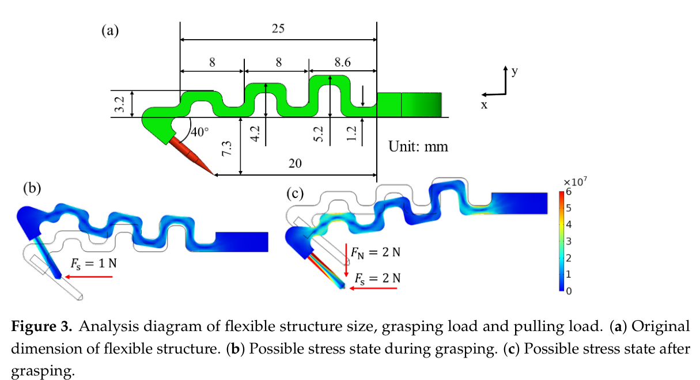
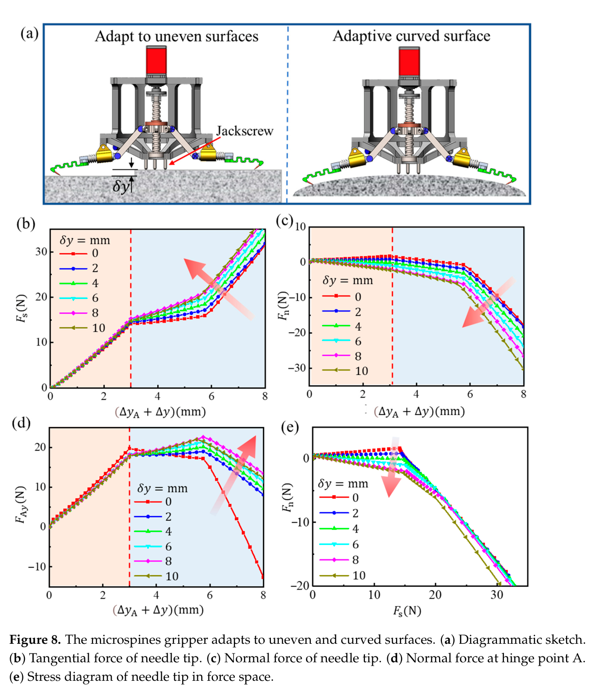
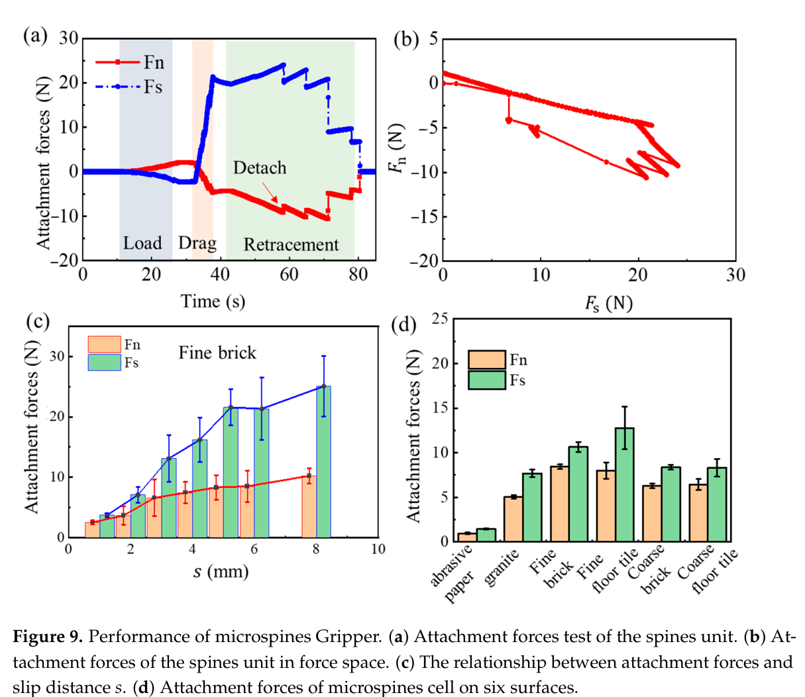

# 论文极简机理证据卡

- 题目：An Underactuated Adaptive Microspines Gripper for Rough Wall
- 作者：Xinxin Li，Wenqing Chen，Xiaosong Li，Xin Hou，Qian Zhao，Yonggang Meng，Yu Tian
- 年份：2023
- DOI：10.3390/biomimetics8010039
- 论文类型：机构设计 + 有限元/刚柔耦合仿真 + 实验
- 研究对象：之字柔顺微刺、10 刺单元及 8 单元/80 刺欠驱动对置抓爪
- 相关性等级：A
- 相关性说明：给出柔顺刚度矩阵、搜索滑移尺度、曲面适应边界、渐进脱附和整爪承载，可直接支撑单刺柔顺、阵列与对爪模型。

## 1. 论文实际解决的问题

设计单电机欠驱动微刺抓爪，用刺级之字柔顺吸收亚毫米至毫米粗糙度，用连杆与滑动副适应毫米至厘米几何不规则；通过刚柔耦合仿真和单刺—单元—整爪三级试验给出刚度、搜索距离、力演化与整体承载证据。

## 2. 核心机理

### M1 对置欠驱动把单向微刺组成法向/切向整爪

- 证据类型：[原文结论]
- 机理内容：8 个微刺单元沿圆周对置布置，每单元 10 刺；丝杠螺母同时驱动各连杆，压簧约束冗余自由度，单电机完成接合与脱离。
- 输入因素：丝杠位移、连杆/滑块几何、压簧、单元初始接触高度。
- 输出或影响：相反方位单元共同形成法向与切向承载，并被动适应不同表面高度。
- 成立条件：各单元机构相同、近轴对称驱动，表面存在可互锁粗糙峰。
- 失效或不适用条件：论文未给各单元预载、位移兼容或非对称表面分载。
- 来源：PDF p.2-3，Section 2.1.1，Fig. 1。
- 对当前模型的用途：定义 8 单元对置拓扑和单驱动—多被动自由度接口。

### M2 各向异性之字柔顺同时提供搜索、贴合与负耦合

- 证据类型：[直接证据]
- 机理内容：柔顺结构以 $\mathbf F=\mathbf K\boldsymbol\delta$ 关联切向、法向与转角；设计要求为 $K_{xx}$ 适中、$K_{yy}$ 较小、$K_{xy}<0$，使一刺挂接后的变形继续把其余刺推向壁面。
- 输入因素：之字梁尺寸、材料、刺安装角、切/法向位移与转角。
- 输出或影响：独立贴合、载荷分散、维持刺姿态并降低剥离式级联失效。
- 成立条件：小变形线性刚度近似；本文 SLA 几何与材料。
- 失效或不适用条件：Eq. (2) 的转动耦合项单位存在原文歧义，不能不经核对直接编码。
- 来源：PDF p.4-6，Section 2.1.3，Eq. (1)-(2)，Fig. 3。
- 对当前模型的用途：作为单刺 3 自由度柔顺本构骨架及阵列位移耦合来源。

### M3 滑移—跳峰—再锚定形成“自动过滤”搜索

- 证据类型：[归纳]
- 机理内容：刺尖沿壁面拖曳；遇不可靠/可破坏粗糙峰时，柔顺转角与滑移使刺跳过该峰，切向力突降而法向力近似不变，随后可二次锚定；承载阶段切、法向力使刺姿态回稳。
- 输入因素：切向驱动、峰间距、刺尖反力、柔顺结构转角。
- 输出或影响：排除弱峰并继续搜索，减少首次不合格接触导致的终止。
- 成立条件：仿真规定 $F_s=10$ N 时允许 $0\leq\Delta x\leq2$ mm 滑移；刺尖未断裂。
- 失效或不适用条件：峰间距“通常不超过 2 mm”未由本文形貌测量验证，接触/滑移边界是规定条件。
- 来源：PDF p.5，8，Section 2.1.3、3.1，Fig. 3、6-7。
- 对当前模型的用途：定义搜索状态、弱峰跳过事件和再接触分支。

### M4 正常高度偏置控制平面搜索磨损与曲面承载

- 证据类型：[直接证据]
- 机理内容：欠驱动单元把不平整/曲面等效为刺尖不同法向初始位置 $\delta y$。仿真中 $\delta y\approx4$ mm 时平面搜索法向接触力接近 0 N，可减小拖曳摩擦与磨损；更大偏置使柔顺件更多沿高刚度轴向受拉并提高承载。
- 输入因素：$0\leq\delta y\leq10$ mm、顶丝高度、表面曲率、加载位移。
- 输出或影响：接触保持、搜索阻力、法向/切向承载域变化。
- 成立条件：单单元准静态刚柔耦合模型、给定刺尖边界、连杆铰链忽略摩擦。
- 失效或不适用条件：平面凸起工况可在挂接前产生负法向力并提前脱离；未做对应力曲线实验验证。
- 来源：PDF p.8-10，Section 3.1，Fig. 8。
- 对当前模型的用途：提供几何失配变量和接触保持/低磨损设计约束。

### M5 约 5 mm 拖曳使单元切向承载趋于饱和

- 证据类型：[原文结论]
- 机理内容：单元先压到 $F_n=2$ N，随后水平拖曳；附着随拖曳距离增加，超过约 5 mm 后增量变缓，作者据此建议实际接合拖曳约 5 mm。
- 输入因素：法向预压、拖曳距离、表面类型、柔顺刚度。
- 输出或影响：切向附着、法向反力反转及刺尖磨损/过载风险。
- 成立条件：本文试验台、细砖等测试表面与 10 刺单元。
- 失效或不适用条件：未报告样本数、统计定义或跨表面饱和距离，不能作为通用最优值。
- 来源：PDF p.7，10-11，Section 2.3、3.2，Fig. 5、9c。
- 对当前模型的用途：作为搜索行程标定目标和行程不足/过长磨损的边界。

### M6 局部脱附不等于整单元瞬时失效

- 证据类型：[直接证据]
- 机理内容：回撤过程中最初若干刺先脱离时法向附着尚未达到最大值，切向附着仍相对稳定；脱附刺数继续增加后才整体失效，表现为渐进脱附与剩余接触承载。
- 输入因素：回撤位移、已挂接刺数、各刺状态与局部峰强度。
- 输出或影响：单元载荷重分配、力曲线阶跃及最终脱附。
- 成立条件：刺尖未先发生断裂，10 刺单元的试验工况。
- 失效或不适用条件：未同步测逐刺力/状态，无法识别每次阶跃对应刺数或重分配系数。
- 来源：PDF p.10-11，Section 3.2，Fig. 9a-b。
- 对当前模型的用途：否定“首刺脱离即整爪失败”，支持逐刺状态与渐进失效。

## 3. 核心公式

### E1 刺端三自由度线性刚度映射

$$
\mathbf F=\mathbf K\boldsymbol\delta=
\begin{bmatrix}F_s\\F_n\\M_\theta\end{bmatrix}=
\begin{bmatrix}
K_{xx}&K_{xy}&K_{x\theta}\\
K_{yx}&K_{yy}&K_{y\theta}\\
K_{\theta x}&K_{\theta y}&K_{\theta\theta}
\end{bmatrix}
\begin{bmatrix}\delta_s\\\delta_n\\\delta_\theta\end{bmatrix}.
$$

- 证据类型：线性本构/定义式
- 原公式号：Eq. (1)
- 变量：$F_s,F_n$ 为刺端切/法向力，$M_\theta$ 为力矩；$\delta_s,\delta_n,\delta_\theta$ 为对应位移/转角。
- 单位：力 N、力矩 N·mm、平移 mm、转角 rad；各 $K_{ij}$ 单位随共轭量而定。
- 正方向或角度定义：Fig. 3 画出 $+x$ 向左、$+y$ 向上及 40° 初始几何，但正文未完整说明 $F_n$ 符号。
- 成立条件：有限元单位位移辨识、线性小变形、本文柔顺结构。
- 是否可直接进入当前模型：需要修正。
- 所需修正：统一 $s/n$ 与 $x/y$ 坐标，补全力矩共轭单位和正负号，再验证线性区间。
- 来源：PDF p.4，Section 2.1.3。

### E2 本文之字柔顺结构的有限元刚度矩阵

$$
\mathbf K=
\begin{bmatrix}
1.5\ \mathrm{N/mm} & -0.42\ \mathrm{N/mm} & 5\ \mathrm{N/rad}\\
-0.42\ \mathrm{N/mm} & 0.46\ \mathrm{N/mm} & -6.4\ \mathrm{N/rad}\\
5\ \mathrm{N/rad} & -6.4\ \mathrm{N/rad} & 11.4\ \mathrm{N\,mm/rad}
\end{bmatrix}.
$$

- 证据类型：有限元辨识矩阵（按原文单位照录）
- 原公式号：Eq. (2)
- 参数来源：COMSOL 6.0 对刺端分别施加单位位移后反算。
- 输出含义：量化切/法向柔度、负耦合与转动耦合。
- 是否可直接进入当前模型：否。
- 所需修正：原文称“diagonal symmetric”但矩阵含非零非对角项；第三行前两项按量纲应再核，不能用对称数值替代单位审查。
- 来源：PDF p.5，Section 2.1.3。

## 4. 关键参数表

| 参数/工况 | 数值 | 单位 | PDF 来源 | 当前用途 | 注意事项 |
|---|---:|---|---|---|---|
| 单元 × 每单元刺数 | $8\times10=80$ | 个 | p.2, 12 | 整爪拓扑 | 未给有效挂接数 |
| 针柄直径 / 尖端锥角 | 约 0.7 / 24 | mm / ° | p.3 | 刺几何 | 商用针 |
| 初始刺尖半径 | 10-20 | μm | p.3-4, Fig. 2a | 有限刺尖可达性 | 仅显微图/正文范围 |
| 磨损后刺尖半径 | 20-40（图）/ 40-60（正文） | μm | p.3-4, Fig. 2b | 磨损风险 | 原文冲突，禁止合并 |
| SLA 材料 $E$/抗拉强度 | 2.6 / 60 | GPa / MPa | p.4 | 柔顺件材料量级 | 非红砖参数 |
| 热变形温度 | 58 | °C | p.4 | 环境边界 | 材料商数据 |
| 仿真柔顺件峰值应力 | 约 50 | MPa | p.6 | 结构强度检查 | 根部；未给安全系数 |
| 滑动副约束行程 | 0-5 | mm | p.6 | 欠驱动行程 | 仿真设置 |
| 规定跳峰滑移 | 0-2 | mm | p.7-8 | 搜索事件范围 | 非形貌实测 |
| 单单元/整爪驱动力 | $<30/<300$ | N | p.8 | 电机与传动上界 | 仿真推算 |
| 法向位置偏置 | 0-10 | mm | p.8-10 | 不平整/曲面扫描 | 仿真范围 |
| 低磨损搜索偏置 | 约 4 | mm | p.8 | 平面搜索设定 | 此时法向力近 0 N，仅仿真 |
| 单元试验法向预压 | 2 | N | p.9 | 接合初始条件 | 达到后再拖曳 |
| 建议拖曳距离 | 约 5 | mm | p.10-11, Fig. 9c | 搜索行程标定 | 细砖趋势，非普适最优 |
| 80 刺整爪承载 | 法向 $>60$；切向 $>30$ | N | p.12 | 整爪验证下界 | 未给重复数/离散性 |

## 5. 最小实验或仿真证据

### V1 柔顺矩阵与应力位置
- 类型：有限元
- 关键工况：刺端单位位移辨识，SLA 之字梁。
- 结果：获得 Eq. (2)；示例载荷下最大应力约 50 MPa，位于连接根部。
- 支撑内容：M2、E1-E2；来源：PDF p.5-6，Fig. 3。

### V2 跳峰和二次锚定
- 类型：准静态刚柔耦合仿真
- 关键工况：$\Delta y_A=3$ mm 驱动，$F_s=10$ N 后允许 $\Delta x=0-2$ mm，随后反向加载 5 mm。
- 结果：滑移时切向力突降、法向力近似不变；单单元驱动力不超过 30 N。
- 支撑内容：M3；来源：PDF p.7-9，Fig. 6-7。

### V3 不平整与曲面适应
- 类型：准静态刚柔耦合仿真
- 关键工况：$\delta y=0-10$ mm 扫描。
- 结果：$\delta y\approx4$ mm 时平面搜索法向接触力近 0 N；偏置增大后轴向拉伸和承载提高。
- 支撑内容：M4；来源：PDF p.8-10，Fig. 8。

### V4 单元拖曳与渐进脱附
- 类型：实验
- 关键工况：压到 $F_n=2$ N、停 10 s、水平拖曳、再停 10 s并回撤。
- 结果：约 5 mm 后承载增量变缓；最初几刺脱离未触发整体失效，继续脱附后才失效。
- 支撑内容：M5-M6；来源：PDF p.7，10-11，Fig. 9。

### V5 80 刺整爪与物体抓取
- 类型：实验/演示
- 结果：作者报告法向 $>60$ N、切向 $>30$ N；展示 6.2 kg 不规则岩石和 6.5 kg 树干模型抓取。
- 支撑内容：M1；来源：PDF p.11-12，Fig. 10、Conclusion。

## 6. 关键图片

- 原图号：Fig. 3；PDF 页码：5；保留原因：同时定义几何、方向、载荷状态和应力集中。

- 原图号：Fig. 8；PDF 页码：10；保留原因：不可由单一数值替代的偏置扫描、接触保持和力域变化。

- 原图号：Fig. 9；PDF 页码：11；保留原因：直接支撑渐进脱附、5 mm 行程和跨表面趋势。

## 7. 可迁移关系

- [可直接采用] 接触—拖曳搜索—挂接承载—逐刺脱附—整体脱离的事件顺序。
- [需要标定] $\mathbf F=\mathbf K\boldsymbol\delta$ 骨架、5 mm 搜索行程、法向偏置和各表面力界。
- [仅作趋势验证] 负切/法向耦合促进剩余刺贴近、首刺脱离不等于整单元失效。
- [仅作下限约束] 80 刺整爪法向 $>60$ N、切向 $>30$ N，只适用于本文样机与表面。
- [不能直接采用] Eq. (2) 转动耦合项单位、磨损后半径及单单元到整爪的线性倍增。
- [不能直接采用] 将六种表面排名解释为纯形貌效应；未测形貌、摩擦与表层强度。

## 8. 局限与风险

- 刚柔耦合只算一个对称单元再外推整爪，未求 8 单元在非对称表面上的兼容与分载。
- Eq. (2) 的文字描述、非对角项和转动耦合单位不完全自洽，需重建量纲后使用。
- 接触边界规定刺尖固定/达到 10 N 后滑移；未建立局部法向、摩擦锥、峰破坏或三维接触。
- Fig. 9 有误差棒但未报告样本数、误差定义和原始数据；整爪承载亦无重复统计。
- 刺尖磨损后半径在 Fig. 2 与正文冲突；材料强度与表面形貌也未独立测量。
- 补充视频未随本地 PDF 提供；6.2/6.5 kg 仅作演示边界，不能当力—位移标定。

## 9. 对当前研究的最小贡献

P21连接了单刺各向异性柔顺、10刺搜索/渐进脱附与80刺欠驱动对置整爪；可提供状态序列、刚度骨架和行程标定，但需由三维接触、真实形貌及逐刺分载文献补齐。
