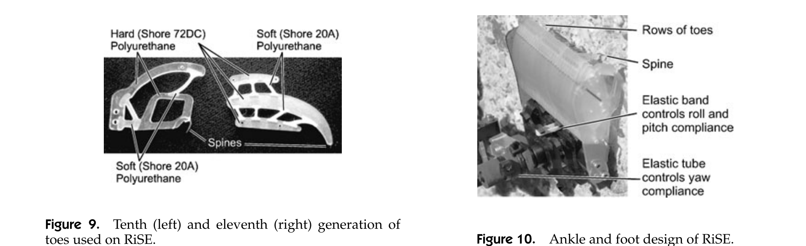
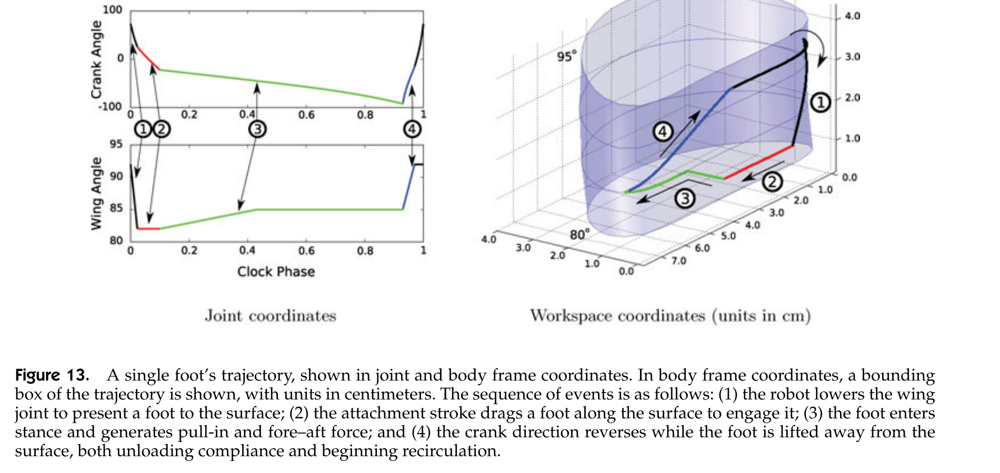
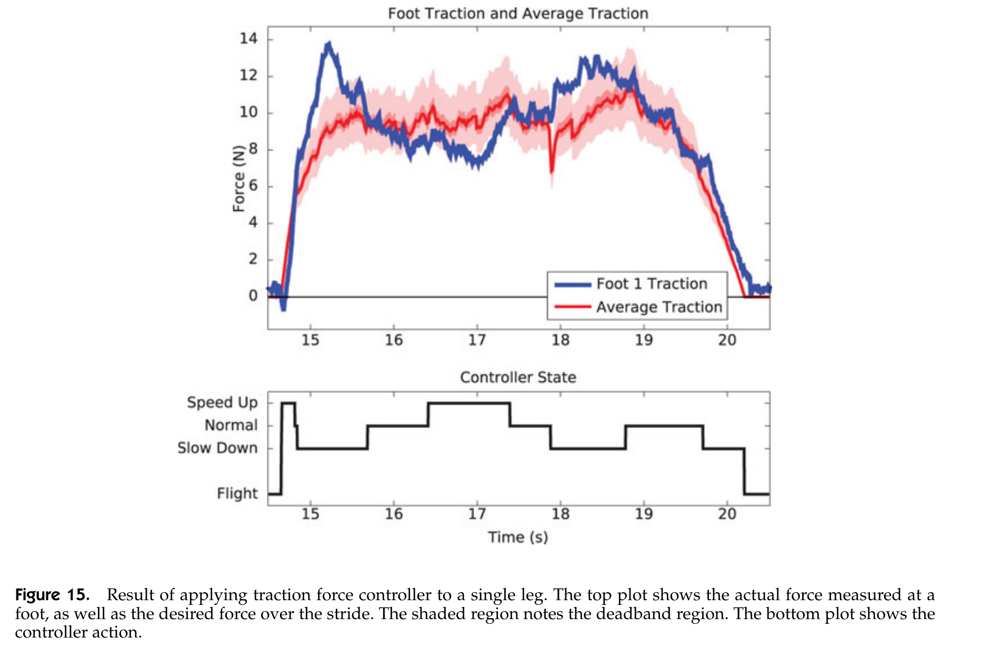

# 论文极简机理证据卡

- 题目：Biologically Inspired Climbing with a Hexapedal Robot
- 作者：M. J. Spenko；G. C. Haynes；J. A. Saunders；M. R. Cutkosky；A. A. Rizzi；R. J. Full；D. E. Koditschek
- 年份：2008
- DOI：`10.1002/rob.20238`
- 论文类型：机器人机构 + 控制 + 实验
- 研究对象：六足 RiSE 机器人在砖、灰泥、混凝土砌块和碎石等竖直粗糙建筑表面上的微刺附着、分层柔顺、多足均载与失效恢复。
- 相关性等级：A
- 相关性说明：直接给出“微刺足—单足轨迹—足间力反馈—整机冗余”的闭环证据，可支撑阵列/整爪状态与系统级验证，但不能替代单刺接触模型。
- 长度说明：论文含足级接合、分层柔顺、足间主动均载与整机验证四组独立核心证据，按模板放宽至 3500 个中文字符以内。

## 1. 论文实际解决的问题

论文把微刺足、腿/踝/趾分层柔顺、六足步态和足端力反馈集成为可长期攀爬的整机；输出可复用的接合/卸载/重试状态、足间均载关系、控制阈值及跨控制方案实验对比。

## 2. 核心机理

### M1 硬表面微刺通过“轻压—滑动—凸体捕获”形成方向承载

- 证据类型：[原文结论]
- 机理内容：微刺用于不可实际穿透的硬表面；刺尖沿表面滑动并挂住凸体，刺尖—表面摩擦使足端能同时施加沿墙向上的牵引力和指向墙内的拉入力。
- 输入因素：刺尖尺度、凸体尺度、摩擦、滑动方向、法向压入力。
- 输出或影响：捕获状态、牵引力与拉入力组合。
- 成立条件：粗糙 90° 硬表面，刺尖尺度与可捕获凸体相当。
- 失效或不适用条件：光滑面、软基材穿刺、无可达凸体或摩擦不足。
- 来源：PDF p.8（期刊 p.230），Section 3。
- 对当前模型的用途：给出接触搜索状态和切向/法向联合承载的定性边界；摩擦锥与单刺阈值仍需其他论文闭合。

### M2 有限刺尖尺度决定可利用的表面尺度

- 证据类型：[直接证据]
- 机理内容：10 代足约 25 μm 刺尖适于砖和石材较大凸体；11 代足约 15 μm 刺尖在混凝土砌块较小凸体上表现更好。单刺最多承载“数牛顿”，故 3.8 kg 平台需要多刺并联。
- 输入因素：刺尖半径、凸体密度/尺度、单接触强度、机器人重量。
- 输出或影响：候选捕获数量、单足所需刺数和适用表面。
- 成立条件：本文两代鱼钩/微刺足及所述建筑表面。
- 失效或不适用条件：未测三维形貌，也未隔离材料强度与摩擦；不能拟合通用半径—成功率曲线。
- 来源：PDF p.8-9（期刊 p.230-231），Section 3-3.1，Fig. 9。
- 对当前模型的用途：用于刺尖半径与地形可达尺度的数量级约束和跨表面趋势验证。

### M3 趾—踝—腿分层、各向异性柔顺兼顾贴合与稳定

- 证据类型：[原文结论]
- 机理内容：每足 25-50 个多材料柔顺趾；法向柔顺限制推离墙面的正压力，前后向柔顺促进趾间分载。踝部俯仰较硬以防绕接触点旋转脱开，滚转尽量柔顺以增加足宽参与接触，偏航柔顺使支撑期保持表面对齐。腿径向柔度过低会产生过大横向力而失抓，过高则使整机外垂并后仰。
- 输入因素：趾法向/前后向柔度、踝俯仰/滚转/偏航刚度、腿径向柔度。
- 输出或影响：法向压力、有效趾数、足端对齐、载荷离散度和整机姿态。
- 成立条件：本文聚氨酯趾、万向踝和被动腿机构。
- 失效或不适用条件：未报告刚度、行程或阻尼数值；“最柔/较硬”不能直接参数化。
- 来源：PDF p.6、9-10（期刊 p.228、231-232），Sections 2.2、3.1-3.2，Figs. 5、9-10。
- 对当前模型的用途：定义三层柔顺接口和刚度方向约束，数值仍须标定。

### M4 单足采用可逆接合序列，并在失败后换位重试

- 证据类型：[直接证据]
- 机理内容：足端先压向表面，再沿表面拖曳以挂接微刺，进入支撑后生成拉入和前后向力；末端反转曲柄、抬足并卸载柔顺后循环。法向控制先搜索至测得 1 N 接触力再回到名义角度；若初始接合后滑移，pawing 提前抬足并在稍不同位置重新接合。
- 输入因素：足端轨迹相位、法向力、牵引力、接合状态与滑移检测。
- 输出或影响：接触、搜索、挂接、承载、卸载、脱离、重试状态。
- 成立条件：准静态波步态和本文足端力传感/几何轨迹。
- 失效或不适用条件：轨迹按任务人工调参；未给局部地形定位、单刺状态或重试成功概率。
- 来源：PDF p.11-15（期刊 p.233-237），Sections 4.1.2、4.2.2、4.3.1，Figs. 13、16。
- 对当前模型的用途：可直接作为单爪外层事件顺序；内部单刺搜索仍须细化。

### M5 足间牵引反馈以平均足力为目标主动均载

- 证据类型：[直接证据]
- 机理内容：在接触足之间计算平均牵引力；低载足相对加速以进一步加载其微刺，高载足减速以卸载。载荷过高会使趾柔顺件超过极限强度或触发硬限位脱开，过低则因接合不足滑移，因此均载不是单纯限制峰值，而是维持双侧安全区间。
- 输入因素：各接触足牵引力、接触足数、比例增益、死区。
- 输出或影响：腿相位/速度修正、足间载荷离散度、滑移与过载风险。
- 成立条件：$n\le 6$ 个接触足、支撑期牵引传感有效；控制律为经验式。
- 失效或不适用条件：没有足内逐趾载荷；控制增益和量纲未给，不能直接复制实现。
- 来源：PDF p.13-14（期刊 p.235-236），Section 4.2.1，Eqs. (5)-(6)，Fig. 15。
- 对当前模型的用途：作为整爪/多足级主动载荷重分配接口和过载/欠载状态判据。

### M6 多足冗余与反馈组合显著延长无失效攀爬距离

- 证据类型：[直接证据]
- 机理内容：困难表面采用五足始终接触的波步态，仅一足循环；牵引均载、法向搜索、pawing 和相位调节协同后，完整反馈方案的失效前距离为 960 cm，约为 T+GR 的 3.3 倍，并较其余单项/开环方案高约一个数量级。
- 输入因素：接触足数、相位间隔、力反馈、接触搜索与失败重试。
- 输出或影响：实际承载足数、力波动、速度和失效前距离。
- 成立条件：石英碎石—树脂板面；25 次试验总计 37 min、19.03 m，完整反馈方案 10 次。
- 失效或不适用条件：各控制组样本量不等；无随机地形重复、置信区间或受控单足失效转移试验。
- 来源：PDF p.12、16-19（期刊 p.234、238-241），Fig. 14，Table I，Figs. 18-20。
- 对当前模型的用途：验证冗余、均载和重试的组合收益，不能反推单刺参数。

## 3. 核心公式

### E1 接触足平均牵引力

$$
a_t=\frac{\sum_i f_{t,i}}{n}
$$

- 证据类型：定义式；原公式号：Eq. (5)
- 变量与单位：$a_t$、$f_{t,i}$ 为 N；$i$ 为腿编号；$n$ 为当前接触足数，$n\le6$。
- 正方向或角度定义：$f_{t,i}$ 沿足端前后/攀爬牵引方向；正文未另给符号正方向图。
- 成立条件：只对当前接触足求平均。
- 关键假设：以算术平均力作为分载目标，不含足位、力矩臂、法向能力或不同足容量。
- 输出含义：足间牵引均载参考值。
- 是否可直接进入当前模型：需要修正；应扩展为容量加权且满足整体力—力矩平衡的目标。
- 来源：PDF p.13（期刊 p.235），Section 4.2.1。

### E2 牵引力比例修正

$$
b_{t,i}=k_p\left(a_t-f_{t,i}\right)
$$

- 证据类型：经验控制式；原公式号：Eq. (6)
- 变量与单位：$b_{t,i}$ 为施加到支撑相位偏置的控制修正；$k_p$ 为比例增益。论文未给二者单位或数值。
- 正方向或角度定义：$a_t>f_{t,i}$ 时使该腿相对加速并增载；反之减速卸载。
- 成立条件：支撑期、足力在死区外；实际采用离散实现。
- 关键假设：腿相对速度变化能单调改变足牵引力。
- 输出含义：通过相位/速度调节实现足间载荷重分配。
- 是否可直接进入当前模型：需要修正；须标定增益、采样、饱和和稳定性，并加入接触容量/失效约束。
- 来源：PDF p.13-14（期刊 p.235-236），Section 4.2.1，Fig. 15。

## 4. 关键参数表

| 参数/工况 | 数值或范围 | 单位 | PDF 来源 | 当前用途 | 注意事项 |
|---|---:|---|---|---|---|
| 机器人质量 / 载荷 | 3.8 / 1.5 | kg | p.7 | 整机工况 | 原目标质量前后有 2.0/2.5 kg 两种表述，不作实机值 |
| 每足柔顺趾数 | 25-50 | 个 | p.9 | 单爪阵列规模 | 排成一排，未给间距和有效接触数 |
| 10/11 代刺尖半径 | 约 25 / 15 | μm | p.9 | 有限刺尖尺度 | 分别对应较大/较小凸体的定性表面 |
| 单刺承载 | 最多数 N | N | p.8 | 单点数量级上界 | 非试验表值，不能作精确阈值 |
| 趾材料硬度 | Shore 20A / 72DC | - | p.9 | 柔顺材料参考 | 未给几何等效刚度 |
| 切向/法向足力测量精度 | 0.25 | N | p.7 | 传感误差 | 应变片两轴 |
| 腿轴向力测量精度 | 约 0.5 | N | p.7 | 传感误差 | 减振器滞回导致较差精度 |
| 法向接触确认阈值 | 1 | N | p.14 | 接触状态切换 | 机器人足级阈值 |
| 波步态占空比 / 相位间隔 | $5/6$ / $1/6$ | - | p.12 | 五足支撑冗余 | 困难表面用 |
| 牵引控制死区 | 85%-120% | 目标力 | p.13 | 均载容差 | 经验设定 |
| 低载加速 / 高载减速 | +70% / -41% | 名义腿速 | p.13-14 | 控制饱和参考 | 经验调参 |
| “实际承载足”判定 | $f_t\ge2$ 且法向拉入 $>0$ | N | p.17 | Load Count 定义 | 足级而非刺级 |
| 完整反馈失效前距离 | 960 | cm | p.17, Table I | 系统验证 | 10 次累计至失效 |
| T+GR / 开环失效前距离 | 293 / 78.7 | cm | p.17, Table I | 对照趋势 | 各为 3 次试验 |

## 5. 最小实验或仿真证据

### V1 两代微刺足与表面尺度

- 类型：机构对比/实机观察
- 关键工况：约 25 μm 与 15 μm 刺尖；砖/石材与混凝土砌块。
- 结果：较大刺尖用于较大凸体表面，较小刺尖在较小凸体砌块上表现更好。
- 支撑的机理或公式：M2。
- 来源：PDF p.9，Fig. 9。

### V2 足间牵引反馈单腿响应

- 类型：控制实验
- 关键工况：单腿牵引力与六足平均牵引比较；85%-120% 死区。
- 结果：测得力偏低/偏高时控制器切换为加速/减速，展示 Eq. (6) 的离散实现。
- 支撑的机理或公式：M5、E1-E2。
- 来源：PDF p.13-14，Fig. 15。

### V3 六种控制组合对比

- 类型：整机实验
- 关键工况：石英碎石嵌树脂表面；25 次、37 min、19.03 m；记录足力、速度、承载足数和失效前距离。
- 结果：FB 为 960 cm，T+GR 为 293 cm，其余为 35.1-81.1 cm；完整反馈提升鲁棒性而非所有单项指标最优。
- 支撑的机理或公式：M4-M6。
- 来源：PDF p.16-18，Table I。

### V4 力波形与真实建筑验证

- 类型：整机实验
- 结果：完整反馈相较开环使六足支撑期牵引曲线更平滑、上下界更紧；机器人完成约 12 m 混凝土建筑无缆攀爬，但粗糙面速度被限制且未达到 0.25 m/s 目标。
- 支撑的机理或公式：M5-M6。
- 来源：PDF p.18-19，Figs. 18-20。

## 6. 关键图片

- 原图号：Figs. 9-10；PDF 页码：9；保留原因：同时定义趾内软/硬材料分区与踝部滚转、俯仰、偏航柔顺接口；支撑 M2-M3。

- 原图号：Fig. 13；PDF 页码：12；保留原因：不可由单一公式恢复四阶段轨迹、坐标与方向；支撑 M4。

- 原图号：Fig. 15；PDF 页码：14；保留原因：把足力偏差、死区与加速/减速状态直接对应；支撑 M5/E1-E2。

## 7. 可迁移关系

- [可直接采用] “压向表面—拖曳搜索—进入支撑—反转卸载—抬离循环”的足级状态顺序，以及失败后换位重试分支。
- [需要标定] 红砖目标上的刺尖半径、趾/踝/腿各向刚度、接触阈值、牵引死区与重试成功率。
- [需要扩展] Eq. (5)-(6) 从等容量足间均载扩展到异质单爪/对爪的容量加权、位移兼容和力矩平衡。
- [仅作趋势验证] 多级柔顺改善贴合/均载但过柔会导致外垂；完整反馈显著提高失效前距离。
- [仅作数量级] 15-25 μm 刺尖、单刺数牛顿、每足 25-50 趾及足力传感精度。
- [不能直接采用] Table I 的整机距离或足级 1/2 N 阈值作为红砖单刺参数；整机多足结果也不能代替标准对爪平衡。

## 8. 局限与风险

- 未测表面高度场、凸体统计、摩擦系数或材料强度，刺尖—表面匹配只有类别化观察。
- 未给单刺力—位移、挂接成功率、刺/基材破坏阈值或逐刺载荷，足级证据不能下推为单刺定量模型。
- 趾、踝和腿的刚度/行程/阻尼均未量化，分层柔顺只能提供结构与方向约束。
- Eq. (6) 为经验控制，增益、采样、单位、稳定性和饱和未完整报告。
- 控制组多数仅 3 次，完整反馈 10 次；缺少随机化、置信区间和同一地形重复性说明。
- 论文验证多足整机而非对置双爪；足间平均力不包含完整力矩平衡、左右预载或薄弱侧失效。

## 9. 对当前研究的最小贡献

该文提供足级接合/重试状态、分层柔顺、足间主动均载与六足冗余验证；不能给出红砖形貌、单刺接触阈值、逐刺渐进失效或标准对爪平衡。
