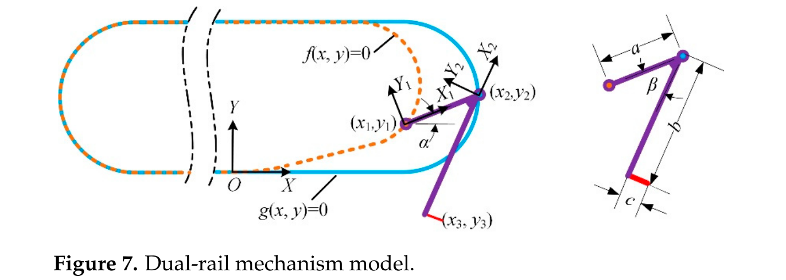
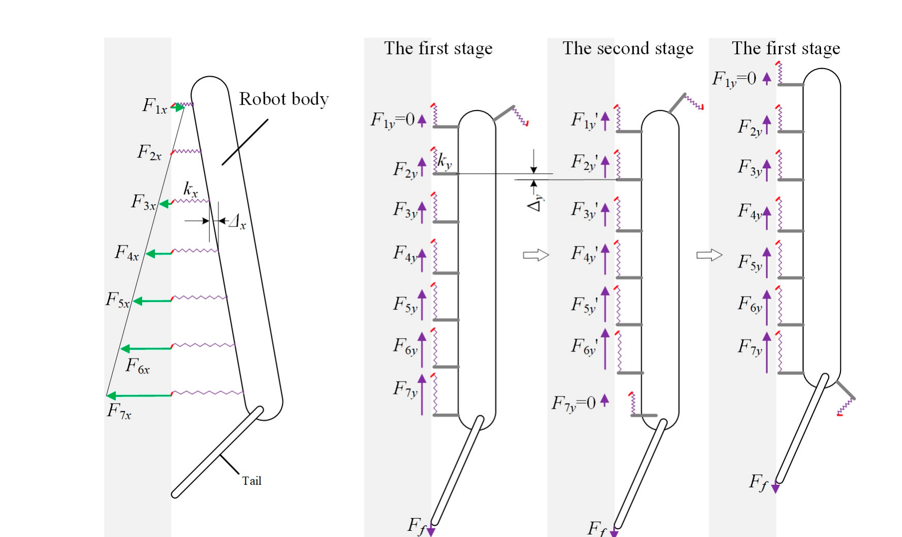
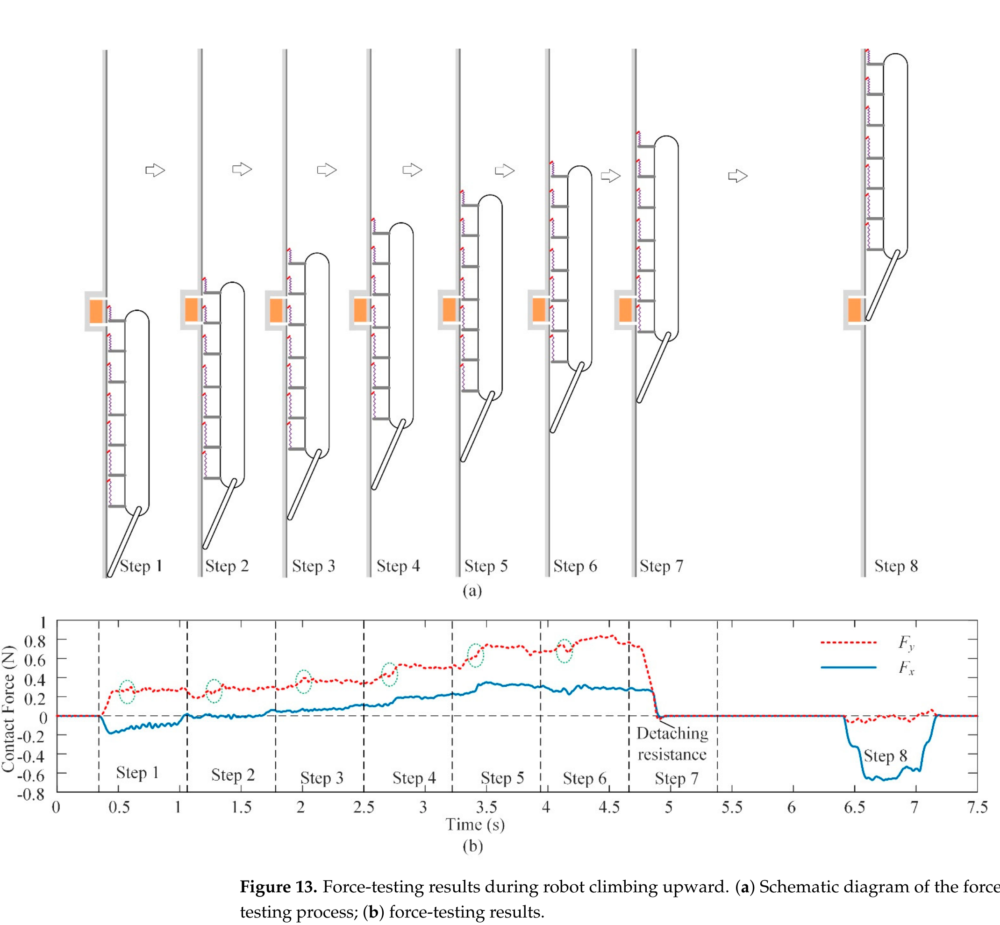

# 论文极简机理证据卡

- 题目：A Spiny Climbing Robot with Dual-Rail Mechanism
- 作者：Yanwei Liu；Hao Wang；Chongyang Hu；Qiang Zhou；Pengyang Li
- 年份：2023
- DOI：`10.3390/biomimetics8010014`
- 论文类型：机器人机构 + 运动学 + 准静态模型 + 实验验证
- 研究对象：由双轨机构导向的连续微刺履带、足单元载荷分配及垂直粗糙墙面攀爬
- 相关性等级：A
- 相关性说明：直接给出足单元接合/脱离轨迹、6/7 单元循环换载模型和二维测力验证，可约束阵列重分配与整机实验。
- 长度说明：含三条独立证据链，按模板放宽至 3500 个中文字符。

## 1. 论文实际解决的问题

论文以一对闭合内外导轨控制履带足单元姿态，使前端足接合、后端足沿近似反向轨迹拔出；同时建立垂直攀爬平衡与 6/7 个附着单元换载模型，并用足单元二维测力和多种粗糙墙面攀爬验证。

## 2. 核心机理

### M1 双轨几何把连续履带运动转换为定向接合与两段脱离

- 证据类型：[直接证据]
- 机理内容：内轨约束链轮销/足内销，外轨约束外销并改变足姿；前足逆时针接合，后足先顺时针作反向运动拔刺，再逆时针远离墙面。
- 输入因素：内外轨曲线、足几何和履带位移。
- 输出或影响：刺尖轨迹、足姿和接合/脱离状态。
- 成立条件：足可简化为两滑动销间的刚性连杆。
- 失效或不适用条件：不含导轨间隙、足柔性、摩擦/卡滞及三维侧偏。
- 来源：PDF p.4-6，Sections 2.3、3.1，Eqs. (1)-(3)，Figs. 4-8。
- 对当前模型的用途：可直接提供机构规定的搜索/脱离边界轨迹；不能代替单刺接触求解。

### M2 脱离先沿刺轴附近拔出，再增加离壁间隙

- 证据类型：[原文结论]
- 机理内容：刺尖先上抬约 3 mm且方向近似刺轴，随后始终远离墙面；即使按 2 mm全刺长进入表面，作者认为几何行程仍足够。
- 输入因素：双轨末端曲线、足姿、刺长和履带/机体相对运动。
- 输出或影响：拔出距离与脱离可靠性。
- 成立条件：接触足相对墙面固定、机体随履带前进的二维假设。
- 失效或不适用条件：3 mm 是几何位移，不是可克服卡滞、摩擦或材料夹持的力/能量保证。
- 来源：PDF p.6，Section 3.1，Fig. 8b。
- 对当前模型的用途：定义主动脱附轨迹与最小行程检查；脱附力仍需另行建模或标定。

### M3 足内柔顺提高接触、挂接和分载

- 证据类型：[原文结论]
- 机理内容：每足 10 个刺趾以弹簧状悬架连接足座；法向柔顺增加接触刺，切向变形增加挂接刺并共享载荷。
- 输入因素：法向/切向柔度、表面形貌、刺数和单刺挂接概率。
- 输出或影响：接触刺数、挂接刺数及足单元等效刚度。
- 成立条件：悬架未触及止挡且刺尖存在可挂接粗糙体。
- 失效或不适用条件：未给单刺刚度、行程或足内分配；等效刚度随表面和挂接状态变化。
- 来源：PDF p.3、7，Sections 2.2、3.2，Fig. 3、9。
- 对当前模型的用途：支持“逐刺柔顺—足单元等效响应”的层级接口，不支持等载假设。

### M4 末端足脱离触发剩余足单元等增量换载

- 证据类型：[直接证据]
- 机理内容：第一阶段 7 足附着且新足切向力为零；第 7 足脱离后，在剩余六足等刚度、同变形增量假设下，其载荷以 $F_{7y}/6$ 加到各足；新足接触后恢复第一阶段。
- 输入因素：附着足数、末足载荷、切向刚度和步进事件。
- 输出或影响：各足切向力的阶梯式增加和周期性重分配。
- 成立条件：准静态、六个剩余足等刚度、相同位移增量、无滑移/破坏和尾轮摩擦已知。
- 失效或不适用条件：实际刚度被作者承认会变化；模型不含单刺失效、随机挂接和行程饱和。
- 来源：PDF p.6-8，Sections 3.2-3.3，Eqs. (4)、(6)-(7)，Figs. 9-10。
- 对当前模型的用途：可作为离散接触事件后的基准重分配规则和实验对照。

### M5 尾部预载同时影响抗俯仰和平衡载荷集中

- 证据类型：[归纳]
- 机理内容：尾轮支撑过小不能平衡外翻力矩；过大又使更多足压紧而非拉附，导致更少足承担更大附着力，因此预载应适中。
- 输入因素：尾轮支撑、重心距离、足间距、尾部力臂和重力。
- 输出或影响：法向力分布、有效拉附足数及局部载荷集中。
- 成立条件：二维垂直、准静态、载荷按 Eq. (4) 和 Fig. 9 定义。
- 失效或不适用条件：未给最优值、稳定域或逐足法向测量；Eq. (5) 的下标与正文/图示不一致。
- 来源：PDF p.6-8，Sections 3.2-3.3，Eqs. (4)-(5)，Figs. 9-10。
- 对当前模型的用途：把预载作为受力平衡与有效接触数的双向约束，而非单调增益。

### M6 连续换载产生可测的力突变，但主动拔出阻力很小

- 证据类型：[直接证据]
- 机理内容：36 目砂纸测力显示，步 3-6 法向/切向力渐增；末足脱离时其余足增载并出现阶跃，法向/切向脱离阻力仅 0.01/0.02 N。
- 输入因素：履带步进、足序号、双轨脱离轨迹和表面。
- 输出或影响：足单元力时程、换载突变和脱离阻力。
- 成立条件：论文所示单次 36 目砂纸、二维力传感器和该样机速度/结构。
- 失效或不适用条件：未报告重复次数、离散性或同步逐足测量，不能直接作为随机模型分布。
- 来源：PDF p.9-11，Section 4.1，Figs. 12-13。
- 对当前模型的用途：用于验证换载事件的方向、阶跃和数量级，不作通用标定。

## 3. 核心公式

### E1 双轨连杆约束

$$
f(x_1,y_1)=0,\qquad g(x_2,y_2)=0,\qquad
(x_1-x_2)^2+(y_1-y_2)^2=a^2
$$

- 证据类型：几何约束；原公式号：Eq. (1)
- 变量与单位：$f,g$ 为外/内轨隐式曲线；$(x_1,y_1)$、$(x_2,y_2)$ 和 $a$ 为位置/连杆长度，统一采用 mm。
- 正方向：机体系 $X$-$Y$ 与原点按 Fig. 7。
- 成立条件与假设：两销严格在轨道中心线上、连杆刚性且长度恒定，二维无间隙。
- 输出含义：由轨道位置求足单元两约束点。
- 是否可直接进入当前模型：是，作为机构运动学约束；实际样机需加入间隙与制造误差。
- 来源：PDF p.5，Section 3.1。

### E2 刺尖位置与足姿

$$
\begin{bmatrix}x_3\\y_3\end{bmatrix}
=R(\alpha+\beta)\begin{bmatrix}-b\\-c\end{bmatrix}
+\begin{bmatrix}x_2\\y_2\end{bmatrix},\qquad
\alpha=\operatorname{atan2}(y_2-y_1,\,x_2-x_1)
$$

- 证据类型：二维刚体运动学；原公式号：Eqs. (2)-(3)
- 变量与单位：$(x_3,y_3)$ 为刺尖位置；$b,c$ 为足结构长度，其中 $c$ 为刺长；$\beta$ 为固定结构角；长度用 mm，角度应一致。
- 成立条件与假设：足单元按 Fig. 7 刚体几何，刺不弯曲且无接触反作用造成的姿态偏差。
- 输出含义：沿双轨运动时的刺尖轨迹。
- 是否可直接进入当前模型：需要修正；可作驱动边界，但接触后需与柔顺和接触约束耦合。
- 来源：PDF p.5，Section 3.1。

### E3 垂直攀爬二维准静态平衡

$$
\sum_{m=1}^{n}F_{mx}=F_n,\qquad
\sum_{m=1}^{n}F_{my}=F_f+G,\qquad
\sum_{m=1}^{n}F_{mx}(ml-l+l_T)=Gh
$$

- 证据类型：静力平衡；原公式号：Eq. (4)
- 变量与单位：$F_{mx},F_{my}$ 为第 $m$ 足法向/切向力；$F_n,F_f$ 为尾轮支撑/摩擦；$G$ 为重力，单位 N；$h,l,l_T$ 为力臂，单位 m 或 mm 但须统一。
- 正方向：提供拉附时 $F_{mx}>0$；方向见 Fig. 9。
- 成立条件与假设：二维垂直准静态，忽略惯性、侧向力矩和履带内部动力学。
- 输出含义：总力和俯仰力矩闭合。
- 是否可直接进入当前模型：需要修正；可作整机平衡校核，三维/动态工况需扩展。
- 来源：PDF p.6-7，Section 3.2。

### E4 七足到六足的切向重分配

$$
F_{1y}=0,\qquad
F_{(m+1)y}=F'_{my}=F_{my}+\frac{F_{7y}}{6},\qquad m=1,\ldots,6
$$

$$
F_{my}=\frac{m-1}{6}F_{7y}=\frac{m-1}{21}(G+F_f)
$$

- 证据类型：等刚度换载模型；原公式号：Eqs. (6)-(7)
- 变量与单位：力均为 N；撇号表示第 7 足脱离后剩余足的新载荷。
- 成立条件与假设：第一阶段 7 足附着；末足脱离后剩余 6 足等 $k_y$、同增量 $\Delta y$，且无滑移/破坏。
- 输出含义：足序号对应的等差切向力及脱离事件后的等增量重分配。
- 是否可直接进入当前模型：需要修正；仅作等刚度基线，应替换为状态相关刚度和接触约束下的重求解。
- 来源：PDF p.8，Section 3.3。

> 公式核查警告：Eq. (5) 正文和 Fig. 10a讨论法向 $F_{1x}$-$F_{nx}$，但印刷式为 $F_{(m+1)y}-F_{my}=k_x\Delta x$。该下标冲突无法仅凭本文消解，因此未作为可执行公式保留。

## 4. 关键参数表

| 参数/工况 | 数值 | 单位 | PDF 来源 | 当前用途 | 注意事项 |
|---|---:|---|---|---|---|
| 履带足单元 × 每单元微刺足 × 每足刺趾 | $16\times2\times10$ | 个 | p.2-3 | 名义阵列规模 | 不等于同时有效挂接数 |
| 攀爬中附着足单元数 | 6 或 7 | 个 | p.6 | 离散接触状态 | 仅该履带几何与垂直步态 |
| 刺杆直径 / 刺尖半径 | 300 / 约10 | $\mu$m | p.8 | 刺几何数量级 | 针灸针，未给批次离散性 |
| 刺长 / 计算上抬距离 | 2 / 约3 | mm | p.6 | 脱离行程校核 | 2 mm全进入表面是作者最坏假设 |
| 样机尺寸 / 质量 | $250\times121\times44$ / 273 | mm / g | p.8 | 整机边界 | 含电池 |
| 第1步预压力 / 稳定切向力 | 0.2 / 0.28 | N | p.10 | 测力曲线基线 | 法向为负，0.2 N按幅值报告 |
| 步3-6最大法向附着 / 切向力 | 约0.8 / 约0.36 | N | p.10 | 换载趋势 | 单次36目砂纸示例 |
| 法向 / 切向脱离阻力 | 0.01 / 0.02 | N | p.10 | 脱附验证 | 未给重复次数 |
| 尾轮支撑力 | 约0.67 | N | p.10 | 整机平衡量级 | 尾轮摩擦被称为可忽略 |
| 可攀表面阈值参照 | 粗于 P120；砂粒约120 | - / $\mu$m | p.11 | 定性表面下界 | 不是三维粗糙度参数 |
| 砖 / 卵石混凝土 / 粗灰泥粒径 | 约2 / 3 / 1 | mm | p.11 | 实墙验证工况 | 仅平均粒径描述 |
| 砖面无载 / 200 g负载速度 | 约36 / 20 | mm/s | p.11 | 整机趋势验证 | 无重复性和误差条 |

## 5. 最小实验或仿真证据

### V1 双轨脱离轨迹

- 类型：运动学计算
- 关键工况：机体随履带前进、接触足相对墙面固定。
- 结果：刺尖先沿近似刺轴方向上抬约 3 mm，再持续远离墙面；超过作者假定的 2 mm全刺长进入量。
- 支撑的机理或公式：M1-M2，E1-E2。
- 来源：PDF p.6，Fig. 8b。

### V2 足单元顺序测力

- 类型：实验
- 关键工况：36 目砂纸、二维测力区、同一足从第1位运行到第7位并脱离。
- 结果：步3-6载荷渐增；末足脱离时出现阶跃且其余足增载；法向/切向脱离阻力仅0.01/0.02 N。
- 支撑的机理或公式：M4、M6、E4。
- 来源：PDF p.9-11，Figs. 12-13。

### V3 实际接合/脱离顺序

- 类型：实验影像
- 结果：前足逆时针接近并接合；后足先顺时针拔出，再逆时针远离；7 足阶段在后足脱离后切至 6 足阶段，新足接触后恢复。
- 支撑的机理或公式：M1、M4。
- 来源：PDF p.12，Fig. 15。

### V4 多表面整机攀爬

- 类型：实验
- 关键工况：90°垂直砂纸、砖面、卵石混凝土墙和粗灰泥墙。
- 结果：砖面无载约36 mm/s；负载200 g时约20 mm/s，并完成两种实际外墙攀爬。
- 支撑的机理或公式：整机可行性与表面边界。
- 来源：PDF p.11，Fig. 14。

## 6. 关键图片

- 原图号：Fig. 7；PDF 页码：5；保留原因：定义 E1-E2 的轨道、坐标、两销、足姿和刺尖几何。

- 原图号：Fig. 10；PDF 页码：8；保留原因：同时定义法向预载分布、两阶段接触状态和第7足脱离后的重分配接口。

- 原图号：Fig. 13；PDF 页码：10；保留原因：直接显示逐步增载、换载阶跃、脱离阻力和尾轮受力，是 E4 的最小实验验证。

## 7. 可迁移关系

- [可直接采用] 用双轨几何生成“接近—接合—反向拔出—远离表面”的足单元驱动轨迹。
- [可直接采用] 把附着足数 7→6→7 作为离散事件，并在每次脱离/新接触后重求局部载荷。
- [需要修正] 用状态相关刚度、实际接触和行程约束替换 E4 的六足等刚度、等增量分配。
- [需要标定] 目标红砖上的逐刺/逐足 $k_x,k_y$、挂接概率、脱离力、有效刺数和表层破坏阈值。
- [仅作趋势验证] 预载存在过小/过大的双侧边界；足脱离会使剩余足阶跃增载；定向拔出可降低脱离阻力。
- [不能直接采用] P120/粒径作为三维地形参数、单次砂纸力曲线作为概率分布、200 g负载作为单爪承载上限。

## 8. 局限与风险

- Eq. (5) 的 $x/y$ 下标与正文及 Fig. 10a冲突，法向等差公式必须回查作者勘误或按物理定义重建。
- 作者明确指出足单元刚度是由形貌、柔顺、刺数和挂接概率共同形成的统计量，却在分载推导中假设所有附着足刚度相等。
- 测力只给一条36目砂纸示例；未报告试验次数、速度、误差、逐足同步力或原始数据。
- 3 mm上抬只验证几何行程；没有卡滞力、摩擦、刺弯曲、材料夹持或损伤能量。
- 表面仅用砂纸目数和平均粒径近似，论文还明确称随机粒径、嵌入深度和分布使性能难以由单一粗糙度描述。
- 整机只验证向上垂直攀爬；转向、横向、地面—墙面过渡和多链节履带均被列为后续工作。

## 9. 对当前研究的最小贡献

该文提供机构规定的主动脱附轨迹、连续履带接触事件和脱离后载荷重分配基线，并给出足单元测力验证；不能提供真实三维形貌、单刺失效、非等刚度渐进破坏或对爪六维平衡。
