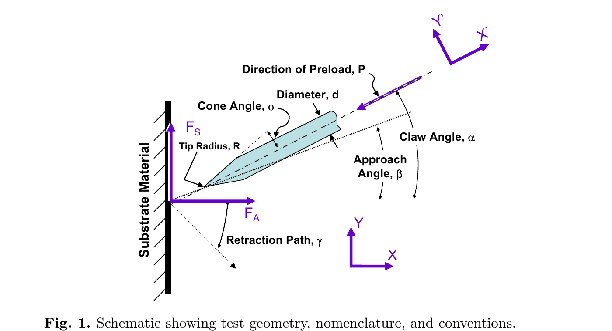
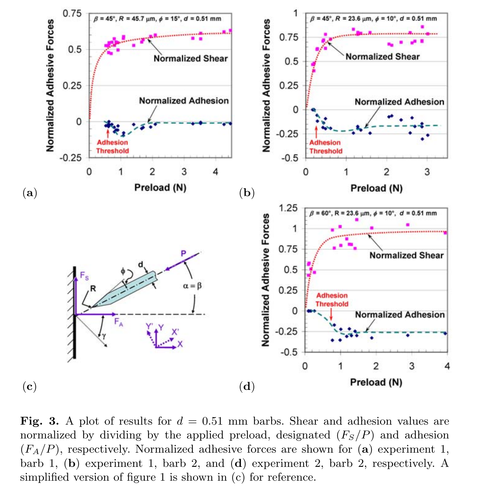
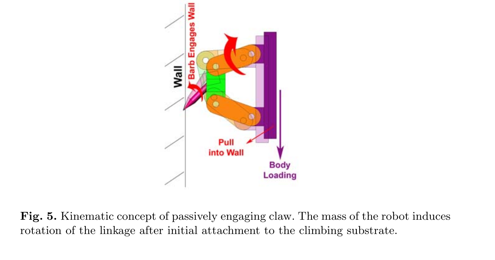

# 论文极简机理证据卡

- 题目：Towards Penetration-based Clawed Climbing
- 作者：William R. Provancher；Jonathan E. Clark；Bill Geisler；Mark R. Cutkosky
- 年份：2005（PDF 页眉注明发表于 CLAWAR 2004）
- DOI：`10.1007/3-540-29461-9_94`
- 论文类型：单刺穿透实验 + 机构概念
- 研究对象：圆锥形金属倒钩在光滑软木中的准静态刺入、拔出、剪切和法向附着
- 相关性等级：C
- 相关性说明：可作为“软基材穿透锚定”与当前“硬粗糙面非穿透啮合”的条件边界；其数值不得直接迁移到红砖。

## 1. 论文实际解决的问题

论文用单根倒钩试验比较直径、锥角、尖端半径与刺入角对软木穿透后剪切/法向附着的影响，并据此提出多刺独立柔顺和接合后转角的足端概念；未建立穿透本构或阵列模型。

## 2. 核心机理

### M1 尖端半径控制穿透与附着门槛

- 证据类型：[原文结论]
- 机理内容：同一直径配对中，较小尖端半径的倒钩具有更高的归一化附着/剪切和更低的附着预载门槛；作者认为尖端半径的影响显著强于锥角。
- 输入因素：尖端半径 $R$、线径 $d$、锥角 $\phi$、预载 $P$。
- 输出或影响：能否刺入、附着门槛、$|F_A|/P$ 与 $F_S/P$。
- 成立条件：光滑软木，$\alpha=\beta=45^\circ$，$\gamma=-45^\circ$，准静态刺入/拔出。
- 失效或不适用条件：硬脆红砖、仅几何挂接而不穿透、不同材料强度或钝化状态。
- 来源：PDF p.5-7，Section 2.1、3，Fig. 3，Table 1。
- 对当前模型的用途：仅用于建立“若进入穿透分支，有限尖端半径是关键控制量”的条件边界。

### M2 刺入角在法向附着与剪切之间形成权衡

- 证据类型：[直接证据]
- 机理内容：对同一倒钩，$\beta=45^\circ$ 的平均归一化附着最高且附着门槛最低；$\beta=60^\circ$ 的平均归一化剪切最高；$\beta=75^\circ$ 未能刺入软木。
- 输入因素：刺入角 $\beta$；实验中爪轴角被约束为 $\alpha=\beta$。
- 输出或影响：穿透成功、附着与剪切分量。
- 成立条件：$d=0.51$ mm、$\phi=10^\circ$、$R=23.6\,\mu$m，$\gamma=-45^\circ$，软木。
- 失效或不适用条件：不能把结果解释为 $\alpha$ 或 $\beta$ 的独立效应，也不能外推到其他拔出方向。
- 来源：PDF p.3-6，Section 2、2.1，Fig. 1、3，Table 2。
- 对当前模型的用途：提供角度扫描的穿透型对照，并提示接近法向时可能无法形成穿透锚定。

### M3 预载先促成穿透，钝尖时继续增载可能降低附着比例

- 证据类型：[原文结论]
- 机理内容：剪切和附着总体随预载近似增加；最尖倒钩的单次观测最高达到 $F_S/P=1.03$、$|F_A|/P=0.34$。钝尖倒钩在较高预载下附着比例下降并产生较大离散性。
- 输入因素：预载、尖锐度、穿透深度与局部软木破坏。
- 输出或影响：附着/剪切幅值、效率和离散性。
- 成立条件：首组预载范围 0.095-9.38 N；论文仅报告位移控制的近似预载。
- 失效或不适用条件：上述最大比例不是总体均值；论文未测穿深、孔损伤或材料本构，不能据此建立普适力律。
- 来源：PDF p.4-7，Section 2.1、3，Fig. 2-3，Table 1。
- 对当前模型的用途：把预载作为穿透状态触发量而非无条件增益，并保留钝化后的非单调分支。

### M4 接合后转角与多刺柔顺是待验证的机构假设

- 证据类型：[推论]
- 机理内容：作者据单刺结果建议以 $45^\circ$ 降低初始附着门槛，接合后向 $60^\circ$ 转动以提高附着；四杆机构可由机器人剪切载荷被动转动并把足端拉向壁面，同时多根独立弹簧刺可分散预载。
- 输入因素：初始角、接合状态、体重剪切载荷、连杆几何、刺级柔顺。
- 输出或影响：接合门槛、法向压紧趋势和单刺预载。
- 成立条件：仅为 Fig. 4-5 的概念设计；未做足端或阵列试验。
- 失效或不适用条件：没有刚度、行程、转角—载荷关系、接合数或载荷共享数据。
- 来源：PDF p.7-8，Section 3、4，Fig. 4-5。
- 对当前模型的用途：仅作为后续柔顺/变角机构的候选拓扑，不作为已验证机理。

## 3. 核心公式

### E1 预载归一化附着与剪切

$$
\eta_A=\frac{|F_A|}{P},\qquad \eta_S=\frac{F_S}{P}
$$

- 证据类型：定义式；原公式号：无（Fig. 3 与 Table 1-2 的数据处理定义）
- 变量与单位：$F_A$ 为法向拔离力幅值、$F_S$ 为沿壁剪切/犁削力、$P$ 为刺入预载，均为 N；$\eta_A,\eta_S$ 无量纲。
- 正方向或角度定义：方向见 Fig. 1；Fig. 2-3 将附着画为负值，而表格以正幅值报告，故此处显式取 $|F_A|$。
- 成立条件：每次试验先用该次预载归一化，再对试验集合求均值和标准差。
- 关键假设：该比值是比较指标，不是线性本构或恒定摩擦系数。
- 是否可直接进入当前模型：否；仅用于复现实验统计和趋势验证。
- 来源：PDF p.5-6，Fig. 3，Table 1-2。

## 4. 关键参数表

| 参数/工况 | 数值或范围 | 单位 | PDF 来源 | 当前用途 | 注意事项 |
|---|---:|---|---|---|---|
| 基材 | 软木 | - | p.4 | 穿透模式边界 | 非硬脆红砖 |
| 线径 $d$ | 0.51-1.50 | mm | p.5-6 | 几何扫描范围 | 与 $R,\phi$ 未正交设计 |
| 锥角 $\phi$ | 10-21 | ° | p.5-6 | 几何扫描范围 | 不能独立辨识效应 |
| 尖端半径 $R$ | 15.7-121.9 | $\mu$m | p.5-6 | 穿透敏感尺度 | 未报告使用后半径 |
| 首组预载 | 0.095-9.38 | N | p.5 | 数量级/触发范围 | 位移控制得到的近似预载 |
| 刺入 / 拔出速度 | 0.01 / 0.05 | mm/s | p.4 | 准静态边界 | 其他材料可能有应变率效应 |
| 停顿时间 | 2 | s | p.4 | 试验状态顺序 | 未研究时间依赖 |
| 首组样本量 | 25/倒钩；8号为21 | 次 | p.5 | 离散性判断 | 8种几何各自不同 |
| 角度组样本量 | 25/角；$60^\circ$ 为17 | 次 | p.6 | 角度趋势 | $75^\circ$ 无成功试验 |
| $\beta=45^\circ$ | $\overline{\eta_A}=0.2328\pm0.1570$ | - | p.6, Table 2 | 附着对照 | 与 $\alpha$ 同步变化 |
| $\beta=60^\circ$ | $\overline{\eta_S}=0.7928\pm0.2158$ | - | p.6, Table 2 | 剪切对照 | $n=17$ |
| $\beta=75^\circ$ | 未穿透 | - | p.6 | 失效边界 | 仅针对软木与该倒钩 |

## 5. 最小实验或仿真证据

### V1 几何扫描

- 类型：实验
- 关键工况：8种倒钩，$\alpha=\beta=45^\circ$、$\gamma=-45^\circ$，软木，21-25次/倒钩。
- 结果：同直径配对中小 $R$ 均提高平均归一化附着与剪切；作者据此判定 $R$ 比 $\phi$ 更关键。
- 支撑的机理或公式：M1、E1。
- 来源：PDF p.5-6，Fig. 3，Table 1。

### V2 刺入角扫描

- 类型：实验
- 关键工况：同一倒钩，$\beta=15^\circ,30^\circ,45^\circ,60^\circ,75^\circ$，且 $\alpha=\beta$。
- 结果：$45^\circ$ 附着均值最高，$60^\circ$ 剪切均值最高，$75^\circ$ 不穿透。
- 支撑的机理或公式：M2、E1。
- 来源：PDF p.6，Table 2。

### V3 单次刺入—停顿—拔出曲线

- 类型：实验
- 关键工况：8号倒钩，$d=1.5$ mm、$R=30.5\,\mu$m、$\phi=18^\circ$。
- 结果：峰值预载 2.2 N，最大附着 -0.26 N，剪切 1.85 N；曲线明确区分刺入、2 s停顿与拔出阶段。
- 支撑的机理或公式：M3 与符号核对。
- 来源：PDF p.4，Fig. 2。

## 6. 关键图片

- 原图号：Fig. 1；PDF 页码：3；保留原因：定义 $R,d,\phi,\alpha,\beta,\gamma$、$F_A/F_S$ 与 $X/Y,X'/Y'$，避免角度和符号误用。

- 原图号：Fig. 3；PDF 页码：5；保留原因：表格不能表达附着门槛、钝尖高预载下降和逐次离散。

- 原图号：Fig. 5；PDF 页码：8；保留原因：给出“接合后转角—向壁运动”的机构拓扑；仅为概念，未验证。

## 7. 可迁移关系

- [可直接采用] 将“穿透软基材”和“挂接硬粗糙面”设为互不混用参数的接触模式。
- [仅作趋势验证] 穿透分支中减小尖端半径可降低预载门槛；预载增益在钝化后可能饱和或反降。
- [需要重新标定] 红砖上的压碎/划伤阈值、允许穿深、尖端磨损、速度效应和角度窗口。
- [仅作候选机构] 初始约 $45^\circ$、接合后向 $60^\circ$ 转角的被动连杆与独立柔顺刺。
- [不能直接采用] Table 1-2 的软木比例作为红砖摩擦系数、承载上限或非穿透啮合参数。

## 8. 局限与风险

- 仅测试光滑软木；未测材料强度、硬度、穿深、孔损伤或尖端接触压力。
- $\alpha=\beta$ 始终耦合，$\gamma=-45^\circ$ 固定，无法独立辨识三个角度。
- 几何组同时改变 $R$ 与 $\phi$，不是完整因子试验；“$R$ 远强于 $\phi$”应保留为作者的初步结论。
- 归一化力是经验统计指标；论文没有穿透本构、接触平衡或失效判据。
- 独立弹簧、多刺分载和四杆变角均未进行足端/阵列验证。
- 试验为低速准静态；作者明确指出换材料后应变率可能使这些结果失效。

## 9. 对当前研究的最小贡献

该文只提供软木穿透型单刺的尖端半径、预载与角度边界，以及未经验证的柔顺变角概念；它不能提供红砖非穿透啮合、阵列载荷共享或对爪平衡模型。
