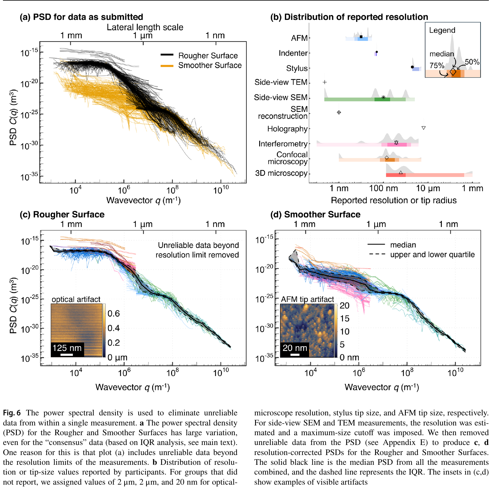
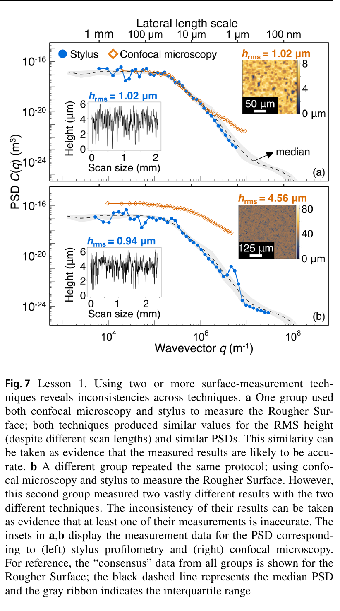
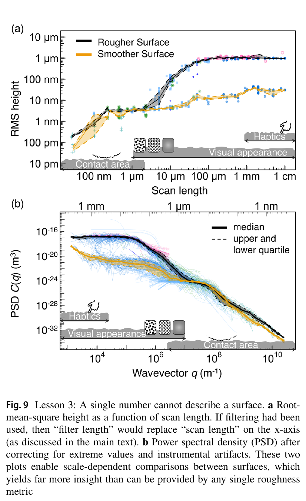

# 论文极简机理证据卡

## 1. 基本信息

- 题目：The Surface-Topography Challenge: A Multi-Laboratory Benchmark Study to Advance the Characterization of Topography
- 作者：A. Pradhan；M. H. Müser；N. Miller；J. P. Abdelnabe；L. Afferrante；D. Albertini 等（共 153 位作者）
- 年份：2025
- DOI：`10.1007/s11249-025-02014-y`
- 论文类型：多实验室测量基准 + 稳健统计 + 多尺度形貌分析
- 研究对象：两类 CrN/硅硬表面的 2088 次跨仪器形貌测量，以及从原始高度数据获得可信多尺度描述的质控流程
- 相关性等级：B（条件启用）
- 相关性说明：可直接约束红砖三维形貌采集、预处理和质量审计，但不提供微刺啮合、摩擦或材料破坏模型。
- 长度说明：论文同时包含测量质控、稳健汇总和 PSD 计算三个独立接口，证据卡按多模型上限保留。

## 2. 论文实际解决的问题

论文让 64 个研究组/企业用多类仪器测量统计等价的粗、光两类硬表面，量化单值粗糙度的尺度歧义、仪器分辨率伪影和跨技术分歧，并给出可复核的多尺度 RMS 高度、PSD、稳健汇总与原始数据留存流程。

## 3. 核心机理

### M1 表面描述必须显式携带横向尺度

- 证据类型：[直接证据]
- 机理内容：同一表面的 RMS 高度随扫描长度变化；忽略尺度时，同一表面的提交值可跨多个数量级。不同表面可在大尺度明显不同、在小尺度近乎相同，因此单个 $R_a/R_q$ 不能唯一描述表面。
- 输入因素：扫描/滤波长度、采样间距、表面高度场。
- 输出或影响：尺度相关 RMS 高度、PSD、不同表面的可区分尺度区间。
- 成立条件：比较采用相同预处理、统计定义与有效分辨率范围。
- 失效或不适用条件：把不同扫描长度下的单值粗糙度直接横向比较。
- 来源：PDF p.8-10、15-16，Sections 4.2、4.4、5.2-5.3，Figs. 3、6、9。
- 对当前模型的用途：红砖形貌库和啮合热力图必须记录扫描范围、像素间距、滤波截止与目标刺尖尺度。

### M2 仪器物理分辨率决定可信波段

- 证据类型：[原文结论]
- 机理内容：光学技术受横向分辨率/衍射与陡坡缺失限制，接触式技术受探针半径卷积和窄谷不可达限制；名义像素间距小于物理分辨率并不会产生可信小尺度形貌。
- 输入因素：镜头配置、横向分辨率、探针半径、扫描长度、表面陡坡/窄谷。
- 输出或影响：PSD 的有效波数上限、缺失区和伪影区。
- 成立条件：按具体仪器和配置确定截止，而不是照抄厂商的“最高分辨率”。
- 失效或不适用条件：把本文对未报告仪器采用的默认截止当作普适常数。
- 来源：PDF p.11-15，Sections 4.5、5.2，Figs. 6、8。
- 对当前模型的用途：进入地形生成或刺尖可达性计算前，先按仪器传递能力屏蔽不可信尺度。

### M3 跨技术复测与稳健统计用于发现异常

- 证据类型：[归纳]
- 机理内容：同一表面若由物理原理不同的技术得到相近 PSD，可提高可信度；明显不一致则说明至少一组测量有误。作者先在技术内按尺度保留 IQR，再用分辨率规则裁剪，最后以跨技术中位数/IQR 汇总，并以多数规则处理整类技术分歧。
- 输入因素：重复位置、方向、扫描尺度、技术类别和每尺度样本数。
- 输出或影响：共识 PSD、中位数、不确定带与异常标记。
- 成立条件：同类样本统计等价，且有足够重复与独立技术。
- 失效或不适用条件：只有单次扫描；或把“多数”误当绝对真值。
- 来源：PDF p.9-14，Sections 4.3、4.6、5.1，Figs. 4-7。
- 对当前模型的用途：为自采红砖形貌建立位置×方向×尺度复测、双技术交叉检查和不确定度留档。

### M4 预处理会改变长、短波形貌，必须完整记录

- 证据类型：[直接证据]
- 机理内容：二次去趋势会删除长波成分；缺失点不能在傅里叶变换中直接置零；非周期高度场需要窗函数；PSD 数值还依赖傅里叶归一化约定。上述选择均会改变下游坡度、曲率和接触输入。
- 输入因素：趋势函数、缺失区、窗函数、傅里叶约定、线/面处理方式。
- 输出或影响：RMS、PSD 及其低波数/高波数伪影。
- 成立条件：保留原始数据，并让处理配置可复现。
- 失效或不适用条件：只保存处理后的标量或网格而不保存原始高度与元数据。
- 来源：PDF p.7-8、19-21，Section 4.1，Appendices D-E，Eqs. (D1)-(D3)、(E1)-(E8)。
- 对当前模型的用途：形成原始高度→去趋势→缺失值处理→加窗→PSD/尺度统计的可审计入口。

## 4. 核心公式

### E1 去趋势后的 RMS 高度

$$
h_{\mathrm{rms}}^2=\frac{1}{L}\int_0^L [h(x)-t(x)]^2\,\mathrm{d}x,
\qquad
h_{\mathrm{rms}}^2=\frac{1}{N}\sum_{k=1}^{N}[h_k-t(x_k)]^2.
$$

- 证据类型：定义式；原公式号：Eq. (D1)-(D2)。
- 变量与单位：$h,t,h_{\mathrm{rms}}$ 为长度；$x,L$ 为长度；$N$ 无量纲。
- 正方向或角度定义：高度相对拟合参考线；均值在去趋势后为零。
- 成立条件：等距离散数据按分段常值解释；非等距线扫先线性插值。作者取 $t(x)=z_0+\alpha x+\beta x^2$；面积数据用二次趋势面并逐行汇总。
- 关键假设：本文 $h_{\mathrm{rms}}$ 基于未滤波数据；若使用标准滤波，须同时报告截止尺度。
- 是否可直接进入当前模型：需要修正；三维红砖应同时保留面积统计与方向统计，不能只逐行平均。
- 来源：PDF p.19-20，Appendix D，Eqs. (D1)-(D3)。

### E2 一维 PSD 及其与 RMS 高度的关系

$$
\tilde h(q)=\int_L h(x)e^{-iqx}\,\mathrm{d}x,
\qquad
C(q)=\frac{1}{L}\left\langle |\tilde h(q)|^2\right\rangle_e,
\qquad
h_{\mathrm{rms}}^2=\frac{1}{\pi}\int_0^{\infty}C(q)\,\mathrm{d}q.
$$

- 证据类型：定义式；原公式号：Eqs. (E1)、(E7)-(E8)。
- 变量与单位：$q$ 为 m$^{-1}$；一维 $C(q)$ 为 m$^3$；$\langle\cdot\rangle_e$ 为相邻线的集合平均。
- 正方向或角度定义：面积图按相邻水平线/快扫方向计算，$q=2\pi n/L$。
- 成立条件：高度均值为零，使用论文给定的傅里叶归一化，并先对非周期数据加窗。
- 关键假设：本文为一维线扫 PSD，不等同于完整二维各向异性 PSD。
- 是否可直接进入当前模型：需要修正；实现时固定归一化、方向和单位，并补充二维 PSD/方向谱。
- 来源：PDF p.20-21，Appendix E.1、E.4。

### E3 缺失区调和插值与窗函数归一化

$$
\nabla^2 h_{\mathrm{imp}}(x,y)=0\quad\text{in }A_{\mathrm{imp}},
\qquad h_{\mathrm{imp}}=h\quad\text{on }\partial A_{\mathrm{imp}},
\qquad h_w(x)=w(x)h(x),\quad \langle w^2(x)\rangle_x=1.
$$

- 证据类型：数值处理规则；原公式号：拉普拉斯边值问题见正文，窗归一化为 Eq. (E6)。
- 变量与单位：$h_{\mathrm{imp}},h,h_w$ 为长度；$w$ 无量纲。
- 成立条件：缺失区由边界有效数据包围；论文 PSD 使用归一化 Hann 窗。
- 关键假设：调和插值最小化缺失区梯度能量，但不恢复真实微观形貌。
- 是否可直接进入当前模型：需要修正；大缺失区应保留掩膜并做插值敏感性分析。
- 来源：PDF p.20-21，Appendix E.2-E.3，Eqs. (E4)-(E6)。

## 5. 关键参数表

| 参数/工况 | 数值或范围 | 单位 | PDF 来源 | 当前用途 | 注意事项 |
|---|---:|---|---|---|---|
| 数据规模 | 2088 次测量；153 人；64 组/企业；20 国 | - | p.1、3、16 | 基准研究规模 | 非目标红砖样本量要求 |
| 表面 | CrN/抛光 Si；CrN/刻蚀粗糙 Si | - | p.2、17 | 硬表面方法验证 | 非多孔红砖 |
| 原始 $h_{\rm rms}$ 离散 | 小于 100 pm 至 10 µm | 长度 | p.8 | 忽略尺度的负证据 | 混合尺度与伪影 |
| 技术内稳健保留 | 25%-75%（IQR）；每尺度箱至少 5 点 | - | p.9 | 异常筛查 | 阈值为本文方案 |
| 未报告 AFM 探针时默认值 | 20 | nm | p.11-12 | 审计示例 | 不是通用 AFM 截止 |
| 未报告 stylus/indenter 探针时默认值 | 2 | µm | p.11-12 | 审计示例 | 应实测真实探针 |
| 光学技术统一横向截止 | 2 | µm | p.12 | 分辨率下限示例 | 依镜头/波长重定 |
| 截面技术最大扫描长度 | 500 | µm | p.12 | 像素化上限示例 | 本文数据集专用 |
| 100 µm 尺度 RMS | 粗面 900；光面 10.5 | nm | p.16，Fig. 9 | 尺度差异验证 | 共识近似值 |
| 1 µm 尺度 RMS | 两表面均约 3 | nm | p.16，Fig. 9 | 小尺度趋同验证 | 不推广到红砖 |

## 6. 最小实验或仿真证据

### V1 忽略尺度后的六数量级分散

- 类型：多实验室测量；关键工况：两类统计等价 CrN/Si 表面，多技术、多扫描长度。
- 结果：按原提交值汇总时，同一表面的 RMS 高度从小于 100 pm 到 10 µm；加入扫描长度后可解释主要分散，但技术间差异仍在。
- 支撑的机理或公式：M1、E1。
- 来源：PDF p.8-10，Figs. 3-5。

### V2 分辨率裁剪使 PSD 收敛

- 类型：跨技术数据处理对比。
- 结果：按探针半径或横向分辨率删除不可信波段后，各技术 PSD 明显靠拢；中位数和 IQR 给出共识谱。
- 支撑的机理或公式：M2-M3、E2。
- 来源：PDF p.11-12，Fig. 6。

### V3 两种技术的一致/不一致可暴露异常

- 类型：同表面交叉测量。
- 结果：一组 stylus 与 confocal 的 RMS/PSD 近乎一致；另一组相同技术组合相差显著，证明单技术结果难以自证可靠。
- 支撑的机理或公式：M3。
- 来源：PDF p.13-14，Fig. 7。

### V4 表面排序随尺度改变

- 类型：共识数据对比。
- 结果：100 µm 尺度两表面 RMS 约为 900 nm 与 10.5 nm；1 µm 尺度两者均约 3 nm。
- 支撑的机理或公式：M1、E1-E2。
- 来源：PDF p.15-16，Fig. 9。

## 7. 关键图片

- 原图号：Fig. 6；PDF 页码：11；保留原因：同时给出不可信波段、分辨率分布、伪影实例及裁剪后中位 PSD/IQR。

- 原图号：Fig. 7；PDF 页码：13；保留原因：直接展示跨技术复测如何发现无法由单次测量识别的错误。

- 原图号：Fig. 9；PDF 页码：15；保留原因：展示两表面在大尺度分离、小尺度重合，不能由单个粗糙度数值替代。

## 8. 可迁移关系

- [可直接采用] 保存原始高度场、仪器配置、扫描范围、像素间距、方向、缺失掩膜和全部处理参数。
- [可直接采用] 用尺度相关 RMS/PSD 替代孤立的 $R_a/R_q$，并让分析波段覆盖目标刺尖与候选凸体尺度。
- [需要标定] 红砖对应的光学分辨率、探针半径、陡坡漏检率、滤波截止和可接受缺失率。
- [仅作质控] 技术内 IQR、中位数和双技术一致性；多数规则不能替代校准标准或物理真值。
- [需要扩展] 由逐行一维 PSD 扩展为二维 PSD、方向谱、坡度/曲率分布和有限刺尖可达形貌。
- [不能直接采用] 本文 CrN/Si 的 RMS、PSD 或默认分辨率作为红砖地形生成参数。

## 9. 局限与风险

- 样品是 CrN 涂层硅片，表面连续且硬；不代表红砖的孔洞、颗粒脱落、陡壁和方向异质性。
- 论文研究测量可信度，不建立形貌到捕获概率、摩擦、承载或损伤的关系。
- 面积图按线逐行处理，可能弱化二维各向异性与横向相关。
- 二次去趋势会删除长波成分，作者未修正由此产生的低波数 PSD 下弯。
- 缺失区调和插值、Hann 窗和多数规则均含方法选择，必须做敏感性分析。
- 某些分辨率值由作者代填，整类技术的剔除也只针对本次提交，不能评价该技术总体优劣。

## 10. 对当前研究的最小贡献

该文为 M1 提供“可信三维地形输入”的测量与质控接口；它能防止伪影和尺度混用进入啮合求解器，但不能替代红砖形貌实测，也不能提供单刺、阵列或对爪机理。
