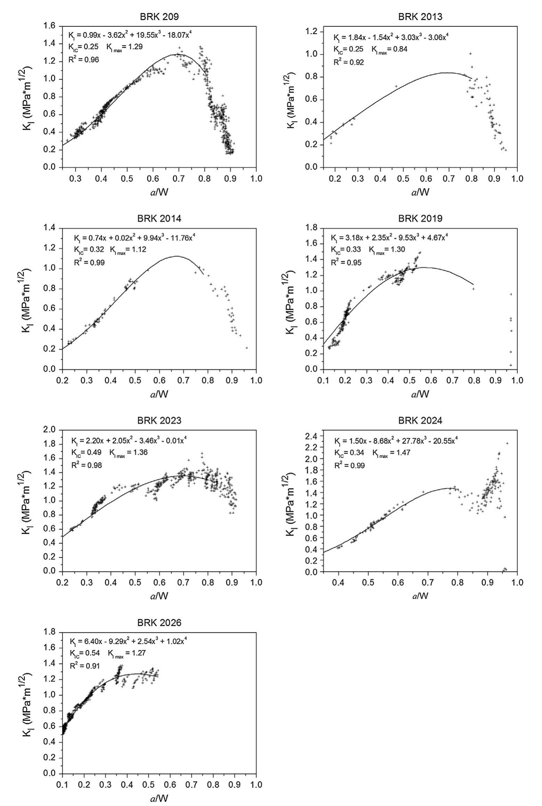
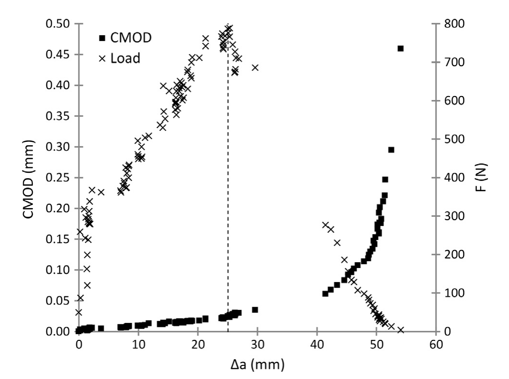

# 论文极简机理证据卡

## 1. 基本信息

- 题目：Measurement of R-curve in clay brick blocks using optical measuring technique
- 作者：Lorenzo Graziani；Marcin Kneć；Tomasz Sadowski；Marco D'Orazio；Stefano Lenci
- 年份：2014
- DOI：`10.1016/j.engfracmech.2014.04.007`
- 论文类型：材料实验 + 断裂力学 + 光学测量
- 研究对象：带预裂纹黏土砖梁在三点弯曲下的 Mode-I 裂纹扩展、应力强度因子与 R-curve
- 相关性等级：B（条件启用）
- 相关性说明：提供黏土砖裂纹扩展阻力、离散性和 DIC 标定方法；仅能约束单刺基材损伤，不能直接代表微尺度混合模态接触。

## 2. 论文实际解决的问题

论文用 DIC 逐帧定位七个黏土砖试样的裂尖，把载荷与裂纹长度配对以构建 R-curve，并用 CMOD/CTOD 方法交叉计算起裂韧度。输出包括裂纹长度相关阻力、宏观 $K_{IC}$、快速失稳区间和光学识别流程。

## 3. 核心机理

### M1 裂纹扩展阻力不是单一常数

- 证据类型：[直接证据]
- 机理内容：七条 $K_I(a/W)$ 曲线总体随裂纹增长而上升，约在 $a/W=0.7$ 达到峰值，随后下降；作者明确指出 $a/W>0.8$ 通常已进入试样坍塌，数据不可靠。
- 输入因素：载荷 $F$、裂纹长度 $a$、试样几何 $B,W,S$。
- 输出或影响：起裂 $K_{IC}$、扩展阶段 $K_I$ 和峰值 $K_{I,\max}$。
- 成立条件：带直预裂纹梁、三点弯曲、LEFM、论文给定尺度和裂纹几何。
- 失效或不适用条件：把四阶拟合外推到 $a/W>0.8$，或把宏观曲线直接当成刺尖局部损伤定律。
- 来源：PDF p.4-8，Section 2.3.1、3.1，Eqs. (1)-(2)，Figs. 7-8。
- 对当前模型的用途：证明红砖损伤上限可能随裂纹扩展演化；若启用 R-curve，必须以目标砖和局部尺度重新标定。

### M2 多孔非均质性伴随裂纹跳跃和试样分组

- 证据类型：[归纳]
- 机理内容：部分试样在较宽 $a/W$ 区间没有数据点，裂纹近乎瞬时跨越；七条曲线又形成高、低两组。作者推测厚度方向孔隙变化会影响韧度和裂纹速度，但明确要求进一步验证。
- 输入因素：孔隙结构、厚度位置、裂纹长度和加载阶段。
- 输出或影响：裂纹速度、可观测数据间断、R-curve 离散和峰值位置。
- 成立条件：本文 26% 平均孔隙率的单批黏土砖试样。
- 失效或不适用条件：将孔隙率与裂纹跳跃写成已证实的确定性函数。
- 来源：PDF p.6-9，Section 3.1、Conclusions，Figs. 7-8。
- 对当前模型的用途：为红砖局部失效引入空间离散性/随机分支提供材料层证据，不提供概率分布参数。

### M3 DIC 将裂尖位置与载荷同步配对

- 证据类型：[直接证据]
- 机理内容：DIC 给出表面位移/应变场；以应变显示阈值突出裂纹路径，再由 ImageJ 手动跟踪裂尖，可为每个载荷时刻获得对应裂纹长度并计算 $K_I$。
- 输入因素：散斑图像、标尺、应变显示阈值、载荷时序。
- 输出或影响：$F-a$ 序列、CMOD、裂纹扩展和 R-curve。
- 成立条件：表面可视、图像标定有效、裂纹未快到跨越采样间隔。
- 失效或不适用条件：快速失稳、图像噪声或自动识别把非裂纹高应变区当作裂尖。
- 来源：PDF p.3-5，Sections 2.1-2.3.1，Figs. 2、4-5。
- 对当前模型的用途：可作为目标红砖裂纹参数和仿真失效模式的实验标定方法。

### M4 CTOD 交叉法能发现异常试样

- 证据类型：[直接证据]
- 机理内容：由 CMOD 间接求 CTOD，再由 Eq. (3) 计算 $K_{IC}$；六个试样与 Eq. (1) 的差值不超过 $0.03\ \mathrm{MPa\sqrt m}$，BRK 2026 的差值为 $0.23\ \mathrm{MPa\sqrt m}$。
- 输入因素：CMOD、裂纹长度、$E$、屈服应力、转动系数。
- 输出或影响：独立 $K_{IC}$ 估计与异常标记。
- 成立条件：极小塑性区、$k=1$、塑性铰位于试样中心且 $r=0.5$。
- 失效或不适用条件：论文未报告 Eq. (3) 使用的 $E$ 和屈服应力数值，且异常试样显示交叉法并非恒定一致。
- 来源：PDF p.5-9，Sections 2.3.2、3.2，Eqs. (3)-(4)，Table 1。
- 对当前模型的用途：只作为材料参数交叉校核流程，不作为微刺接触公式。

## 4. 核心公式

### E1 三点弯曲应力强度因子

$$
K_I=\frac{FS}{BW^{3/2}}f\!\left(\frac{a}{W}\right).
\tag{1}
$$

- 证据类型：LEFM 几何式；$F$ 为中点载荷，$S$ 为支承跨距，$B$ 为厚度，$W$ 为高度，$a$ 为直裂纹长度。
- 单位：采用一致 SI 单位时 $K_I$ 为 $\mathrm{Pa\sqrt m}$；论文结果以 $\mathrm{MPa\sqrt m}$ 给出。
- 成立条件：三点弯曲、直裂纹、脆性材料和 LEFM；本文 $S=200$ mm、$B=30$ mm、$W=60$ mm。
- 是否可直接进入当前模型：否；只能复现实验标定，不能替代刺尖非均匀接触场。
- 来源：PDF p.4-5，Section 2.3.1。

> Eq. (2) 的页面渲染清楚显示为 $\sqrt[3]{a/W}$，且括号结构按原文排印较异常。为避免把可能的排印问题写入求解器，本卡不转录该几何因子；实施前须回查论文引用的原始公式来源。

### E2 CTOD 与应力强度因子的关系

$$
\mathrm{CTOD}=\frac{K_I^2}{k\,\sigma_{ys}E}.
\tag{3}
$$

- 证据类型：CTOD 换算式；$k$ 为塑性区修正系数，$\sigma_{ys}$ 为屈服应力，$E$ 为杨氏模量。
- 成立条件：本文取 $k=1$；临界 CTOD 在峰值载荷对应的裂纹扩展处确定。
- 是否可直接进入当前模型：否；论文没有给出实际代入的 $E$ 和 $\sigma_{ys}$ 数值。
- 来源：PDF p.5-6，Section 2.3.2。

### E3 CMOD 到 CTOD 的几何换算

$$
\frac{\mathrm{CMOD}}{\mathrm{CTOD}}
=\frac{a}{r(W-a)}+1.
\tag{4}
$$

- 证据类型：几何换算式；$r$ 为绕塑性铰转动的系数。
- 成立条件：黏土砖塑性区很小；本文假定塑性铰在试样中心并取 $r=0.5$。
- 是否可直接进入当前模型：否；仅用于该梁式试样的 CTOD 交叉计算。
- 来源：PDF p.5-6，Section 2.3.2，Fig. 6。

## 5. 关键参数表

| 参数/工况 | 数值或范围 | 单位 | PDF 来源 | 当前用途 | 注意事项 |
|---|---:|---|---|---|---|
| 试样数 | 7 | 个 | p.2、6 | 离散性背景 | 单批次、小样本 |
| 试样尺寸 | $260\times30\times60$ | mm | p.2 | 梁式复现 | 非微接触尺度 |
| 支承跨距 | 200 | mm | p.3-5 | Eq. (1) 输入 | 三点弯曲专用 |
| 平均孔隙率 / 密度 | 26 / 1798 | % / kg·m$^{-3}$ | p.2 | 材料背景 | 不足以定义局部孔隙场 |
| 抗压 / 抗折强度 | 77.33 / 21.87 | MPa | p.2 | 数量级先验 | 宏观辅助试验 |
| 位移步长 | 预裂纹 0.01；正式试验 0.005 | mm | p.3-4 | 准静态复现 | 手动加载 |
| Eq. (1) 的 $K_{IC}$ | 0.25-0.54；报告平均 0.36 | MPa$\sqrt{\mathrm m}$ | p.6-9、Table 1 | 宏观 Mode-I 先验 | 不直接作局部阈值 |
| $K_{I,\max}$ | 平均 $1.24\pm0.20$；剔除异常后 1.27 | MPa$\sqrt{\mathrm m}$ | p.6-7 | 扩展阻力数量级 | 峰值约在 $a/W=0.7$ |
| 临界 CTOD | 4.34-13.77 | µm | p.8、Table 1 | 交叉校核 | 依赖缺失的 $E,\sigma_{ys}$ |
| R-curve 可靠范围 | $a/W\lesssim0.8$ | 1 | p.6-7 | 有效域 | 后段受坍塌影响 |

## 6. 最小实验或仿真证据

### V1 七个试样的裂纹长度相关阻力

- 类型：DIC + 三点弯曲实验。
- 结果：各试样 $K_I$ 随 $a/W$ 上升至峰值，曲线幅值和局部形状明显离散；$a/W>0.8$ 被作者判为不可靠。
- 支撑的机理或公式：M1-M2、E1。
- 来源：PDF p.6-8，Figs. 7-8。

### V2 峰值载荷附近由稳定转为失稳

- 类型：载荷、CMOD 与裂纹扩展同步测量。
- 结果：失稳前 CMOD 随裂纹扩展近线性变化，峰值后转为幂律式快速张开并伴随载荷下降。
- 支撑的机理或公式：M1、M4、E3。
- 来源：PDF p.8，Fig. 9。

### V3 两种 $K_{IC}$ 方法的交叉比较

- 类型：两种数据处理方法对比。
- 结果：六个试样差值不超过 $0.03\ \mathrm{MPa\sqrt m}$，一个试样差 $0.23\ \mathrm{MPa\sqrt m}$。
- 支撑的机理或公式：M4、E2-E3。
- 来源：PDF p.8-9，Table 1。

## 7. 关键图片

- 原图号：Fig. 7；PDF 页码：7；保留原因：同时显示试样间离散、峰值位置、数据缺口和 $a/W>0.8$ 的失效边界，不能由单个平均值替代。

- 原图号：Fig. 9；PDF 页码：8；保留原因：直接展示峰值载荷前后的稳定/失稳转换和 CTOD 取点依据。

## 8. 可迁移关系

- [需要标定] 以 $K_{IC}\approx0.36\ \mathrm{MPa\sqrt m}$ 作为目标红砖宏观 Mode-I 试验的数量级先验，而非求解器固定常数。
- [需要重建] 将 $K_I(a/W)$ 转换为局部物理裂纹长度、混合模态和接触应力驱动的损伤接口。
- [可直接采用] DIC 同步测量裂尖、CMOD 和载荷的参数辨识流程。
- [仅作趋势验证] 多孔砖可能出现裂纹跳跃、厚度方向韧度变化和试样分组。
- [不能直接采用] 七个试样的四阶多项式、$a/W\approx0.7$ 峰值和 $a/W=0.8$ 截止作为微刺接触常数。
- [不能直接采用] 宏观 Mode-I 韧度代表压碎、剪切、划伤或循环磨损阈值。

## 9. 局限与风险

- 证据来自厘米级三点弯曲和 Mode-I 预裂纹，爪刺接触通常为局部压缩、剪切及混合模态。
- 仅七个同类试样；未系统报告烧制制度、砖材方向或独立孔隙空间分布。
- 裂尖由人工逐帧标记；快速裂纹区即使使用 DIC 仍会丢点。
- 四阶多项式是试样级拟合，不是材料本构；坍塌后的下降段不能外推。
- Eq. (2) 的根号/括号排印异常；Eq. (3) 又缺少实际使用的 $E$ 和 $\sigma_{ys}$，定量复现不完整。
- CTOD 交叉法存在 BRK 2026 异常，且依赖中心塑性铰、$r=0.5$、$k=1$ 等假设。

## 10. 对当前研究的最小贡献

该文只在需要显式区分红砖起裂与裂纹扩展阻力时启用：它为 M2 提供宏观 Mode-I R-curve、DIC 标定和失稳跳跃证据；局部接触尺度、混合模态、压碎/剪裂和目标砖参数仍需另行试验。
