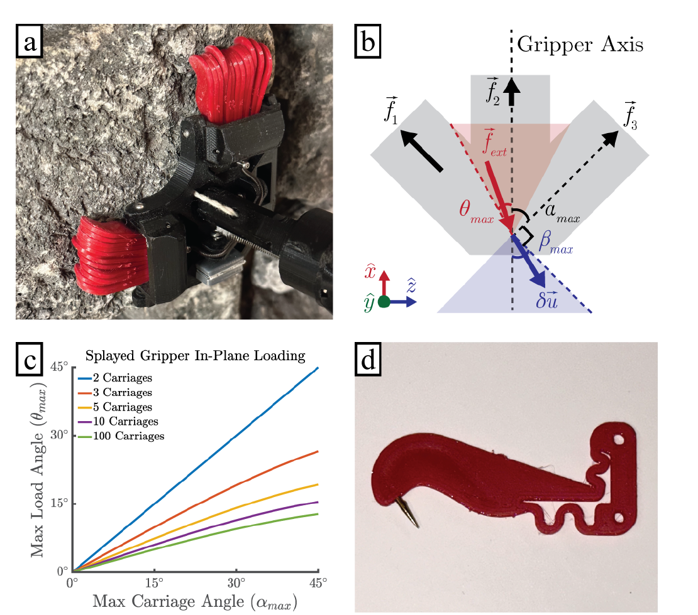
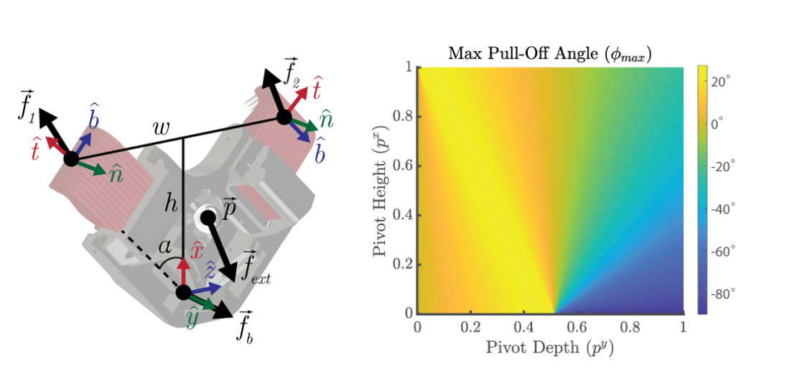
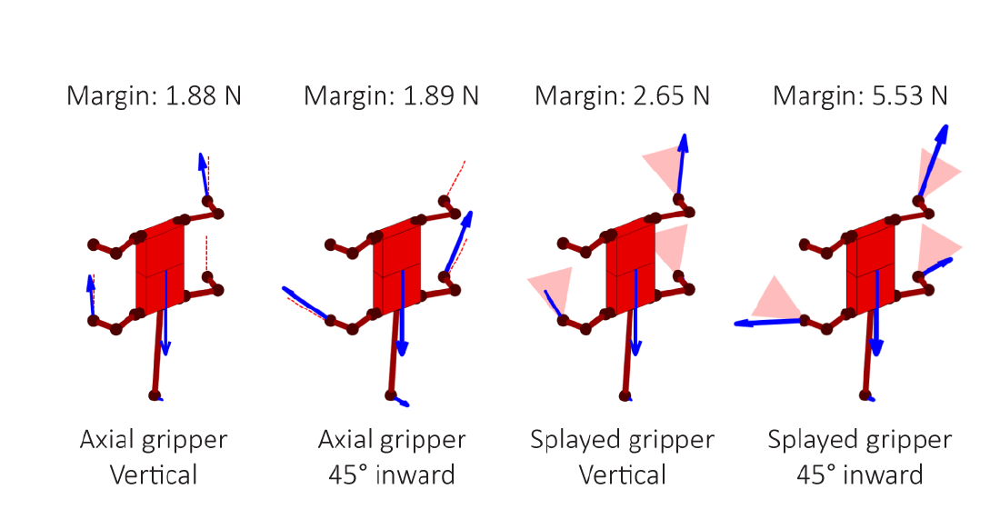

# 论文极简机理证据卡

- 题目：LORIS: A Lightweight Free-Climbing Robot for Extreme Terrain Exploration
- 作者：Paul Nadan；Spencer Backus；Aaron M. Johnson
- 年份：2024
- DOI：`10.1109/ICRA57147.2024.10611653`
- 论文类型：机器人机构 + 准静态优化 + 力控制 + 整机实验
- 研究对象：双 carriage 被动微刺爪、三自由度被动腕、足间定向内力分配及四足自由攀爬
- 相关性等级：A
- 相关性说明：直接给出整爪方向承载边界、被动腕静力、整机附着裕度线性规划与 DIG 对照实验；逐刺接触仍需其他文献补足。
- 长度说明：论文含整爪、被动腕、整机优化和实验四条独立证据链，按模板放宽至 3500 个中文字符以内。

## 1. 论文实际解决的问题

论文设计无需爪端执行器的轻量四足攀爬机器人：以外张 carriage 扩大被动微刺爪的面内承载方向，以被动腕适应不规则落足面，再用线性规划和足间内力控制最大化最小附着裕度，并在砌块、玄武岩、炉渣和凝灰岩上验证。

## 2. 核心机理

### M1 外张 carriage 把单向微刺承载扩展为扇形面内承载域

- 证据类型：[直接证据]
- 机理内容：第 $i$ 个 carriage 只沿自身微刺方向提供切向弹簧力；将 carriage 以不同 $\alpha_i$ 外张后，各方向分量合成为整爪 $x$-$z$ 平面外力。任一 carriage 的位移投影反向，即 $\cos(\beta-\alpha_i)<0$，作者即判定该 carriage 脱离、抓取失败。
- 输入因素：carriage 数 $n$、外张角 $\alpha_i$、等效刚度 $k_i$、小位移 $\delta u$ 与位移方向 $\beta$。
- 输出或影响：整爪可承受的面内载荷方向 $[-\theta_{max},\theta_{max}]$。
- 成立条件：小位移、线性弹簧、准静态、各 carriage 方向性承载；不解析逐刺挂接。
- 失效或不适用条件：负切向或纯侧向载荷、carriage 内部分刺脱离但仍可承载、材料破坏与大变形。
- 来源：PDF p.2，Section II.A，Eqs. (1)-(2)，Fig. 2。
- 对当前模型的用途：可作为“逐刺求解结果聚合到整爪方向承载域”的上层接口，不可替代单刺接触模型。

### M2 carriage 数量、外张角与初始挂接角形成结构权衡

- 证据类型：[原文结论]
- 机理内容：在均匀间隔、等刚度的对称设计中，两 carriage 的最大承载角优于 3/5/10/100 carriage；增加中间 carriage 会增大载荷沿位移方向的相对分量，却不扩展 $\beta$ 边界。最外侧 $\alpha_{max}$ 超过约 $45^\circ$ 时，初始接触攻角过陡而难以挂接。
- 输入因素：carriage 数、$\alpha_{max}$、初始接触攻角。
- 输出或影响：方向承载范围与初始挂接可行性。
- 成立条件：Fig. 2c 的对称、等间距、等刚度、任一 carriage 反向即失败假设。
- 失效或不适用条件：不等刚度、逐刺概率挂接、局部 carriage 失效后重分配或主动重定向。
- 来源：PDF p.2，Section II.A，Fig. 2c。
- 对当前模型的用途：用于阵列/单爪布局候选筛选，并作为“增加分支不必然扩大承载域”的负证据。

### M3 三点接触与共点被动腕实现姿态自适应，但受转轴位置约束

- 证据类型：[归纳]
- 机理内容：两组微刺与爪基接触构成至少三点，使爪在 pitch/roll 上贴合表面；三转轴交于一点可把未知爪姿态与腿运动学解耦。转轴离表面过远会增大刺的拉离分量，过近又会使爪在较小载荷角下旋转，故转轴应接近最大承载时的微刺合力线。
- 输入因素：爪宽 $w$、刺到基接触高度 $h$、外张角 $\alpha$、转轴位置 $\vec p$、外力/力矩及负预载转矩。
- 输出或影响：微刺法/切向力、基接触法向力、最大拉离角 $\phi_{max}$ 与姿态稳定。
- 成立条件：准静态、基接触无摩擦、至少三点接触；样机 pitch/roll 为 $\pm35^\circ$、yaw 为低摩擦 $360^\circ$。
- 失效或不适用条件：高度凸起使三点接触不能成立；被动 yaw 依赖明显的面内重力分量，不适用于完全倒置或微重力。
- 来源：PDF p.3，Section II.B，Eqs. (3)-(10)，Fig. 3。
- 对当前模型的用途：提供整爪—被动腕静力接口和转轴位置约束；需由逐刺承载域替换经验拉离角。

### M4 分层柔顺把单刺尺度贴合扩展到 carriage 尺度

- 证据类型：[原文结论]
- 机理内容：26 根微刺均分在两个形成 $90^\circ$ 夹角的 carriage 上；两个 carriage 可独立向表面转动最多 $30^\circ$，低刚度复位弹簧保持接近时向下俯；每根 TPU 微刺中的蛇形斜向柔顺件提供法向顺应。
- 输入因素：刺级法向柔顺、carriage 转角、复位弹簧和落足面曲率。
- 输出或影响：对凸起的跨尺度贴合和初始接触姿态。
- 成立条件：柔顺件与 carriage 未到行程/转角止挡，局部形貌允许微刺挂接。
- 失效或不适用条件：论文未给刺级/车架级刚度、行程、力—位移或逐刺载荷；高曲率落足仍会失配。
- 来源：PDF p.4，Section II.C，Figs. 2d、4。
- 对当前模型的用途：定义“逐刺—carriage—整爪”三级柔顺拓扑，参数需另文或实验标定。

### M5 最大化最小附着裕度可自动生成足间 DIG 内力

- 证据类型：[直接证据]
- 机理内容：线性规划同时满足整机三维力/力矩平衡、各爪切向上下限、面内角和拉离角约束，并最大化所有爪中最小的附着裕度 $c$。爪朝内布置时，最优解自然产生合力为零但提高各爪切向压载的 DIG 内力。
- 输入因素：姿态、爪位置/方向、重力、尾部法向力、$f_{min}/f_{max}$、$\theta_{max}$ 与 $\phi_{max}$。
- 输出或影响：各爪接触力、尾力和最小安全裕度 $c$。
- 成立条件：准静态、接触力域线性化、参数已标定且当前接触集合固定。
- 失效或不适用条件：惯性、逐刺随机失效、非凸/非线性承载域、摩擦/破坏随历史演化或力矩饱和。
- 来源：PDF p.4-5，Section III.A，Eqs. (11)-(17)，Fig. 5。
- 对当前模型的用途：可直接作为对爪/多爪上层平衡优化骨架；约束边界应换成当前求解器输出的单爪能力域。

### M6 零空间力控制维持内力；整机对照显示收益也暴露单足失效风险

- 证据类型：[直接证据]
- 机理内容：力误差经抓取映射 $G$ 的零空间投影后，只产生爪间相对位移而不改变机体净 wrench。砌块对照中 DIG 将跌落/步数由 9/141（6.4%）降至 4/177（2.3%），完整 1 m 攀爬由 1/10 提高到 6/10；但四足机器人通常仅三足支撑，单爪意外脱离仍常导致不可恢复跌落。
- 输入因素：目标/估计接触力、抓取映射、比例增益、支撑足集合及 DIG 开关。
- 输出或影响：足间内力误差、步失败率与全程成功次数。
- 成立条件：$G$ 与力估计足够准确、准静态、砌块两组均为 TX2 载荷且有人辅助选点。
- 失效或不适用条件：关节/接触饱和、映射误差、表面改变、支撑集突变；论文没有统计显著性或独立重复批次。
- 来源：PDF p.5-6，Sections III.B、IV、V，Eq. (18)，Table II。
- 对当前模型的用途：验证“内部预载提高安全裕度”的系统趋势，并把单爪脱离设为整机离散重求解事件。

## 3. 核心公式

### E1 外张 carriage 的小位移合力

$$
f_i^t=k_i\cos(\beta-\alpha_i)\,\delta u,
\qquad
\vec f_{ext}^{xz}=-\sum_{i=1}^{n}f_i^t
\begin{bmatrix}\cos\alpha_i\\ \sin\alpha_i\end{bmatrix}
$$

- 证据类型：线性弹簧静力；原公式号：Eqs. (1)-(2)
- 变量与单位：$k_i$（N/m）、$\delta u$（m）、$f_i^t$ 与 $\vec f_{ext}^{xz}$（N）；$\alpha_i,\beta$ 为相对爪轴的角度。
- 正方向或角度定义：$+x$ 沿爪轴承载方向，$z$ 为侧向；坐标与角度见 Fig. 2b。
- 成立条件：小位移、线性且仅受压载方向有效；若 $\cos(\beta-\alpha_i)<0$，该 carriage 反向脱离。对称设计中 $\beta\in[\alpha_{max}-90^\circ,-\alpha_{max}+90^\circ]$。
- 是否可直接进入当前模型：需要修正；把 $k_i$ 和方向边界替换为逐刺接触聚合结果。
- 来源：PDF p.2，Section II.A。

### E2 被动腕三接触静力与不脱离约束

$$
\begin{aligned}
0&=f_{ext}^{x}+(f_1^t+f_2^t)\cos\alpha,\\
0&=f_{ext}^{z}+(f_2^t-f_1^t)\sin\alpha,\\
0&=f_{ext}^{y}+f_1^n+f_2^n+f_b^y,\\
0&=\tau_{ext}^{x}+\frac{w}{2}(f_1^n-f_2^n)+p^y f_{ext}^{z},\\
0&=\tau_{ext}^{z}+h(f_1^n+f_2^n)+p^x f_{ext}^{y}-p^y f_{ext}^{x}
\end{aligned}
$$

$$
-f_1^n\le f_1^t\tan\phi_{slip},\qquad
-f_2^n\le f_2^t\tan\phi_{slip},\qquad
0\le f_b^y
$$

- 证据类型：准静态平衡 + 可行性判据；原公式号：Eqs. (3)-(10)
- 变量与单位：力为 N，力矩为 N·m，$w,h,\vec p$ 为 m；$t/n/b$ 为各接触的切向/法向/基接触方向。
- 正方向或角度定义：爪局部 $x,y,z$ 与 $\hat t,\hat n,\hat b$ 见 Fig. 3；$\phi_{slip}$ 为微刺拉离角阈值。
- 关键假设：基接触无摩擦、静力、三接触成立；作者在求 $\phi_{max}$ 时另取 $f_{ext}^{z}=\tau_{ext}^{x}=\tau_{ext}^{z}=0$。
- 是否可直接进入当前模型：需要修正；可作被动腕平衡校核，$\phi_{slip}$ 和接触集合必须标定/重求。
- 来源：PDF p.3，Section II.B。

### E3 最大附着裕度线性规划

$$
\max_{\{\vec f_i\},f_{tail}^{n},c} c
$$

$$
\begin{aligned}
\vec0&=\sum_{i=1}^{N}R_i\vec f_i+R_{tail}\vec f_{tail}+\vec f_g,\\
\vec0&=\sum_{i=1}^{N}\vec r_i\times R_i\vec f_i+\vec r_{tail}\times R_{tail}\vec f_{tail},\\
f_{min}&\le f_i^t\le f_{max},\\
-f_i^t\tan\theta_{max}&\le f_i^b\le f_i^t\tan\theta_{max},\\
-f_i^n-f_i^t\tan\phi_{max}+c&\le0,\qquad 0\le f_{tail}^{n}
\end{aligned}
$$

- 证据类型：准静态线性规划；原公式号：Eqs. (11)-(17)
- 变量与单位：$\vec f_i=[f_i^t,f_i^n,f_i^b]^T$、$\vec f_g$、$f_{tail}^n$ 与 $c$ 为 N；$\vec r_i$ 为 m；$R_i$ 无量纲；角度为一致角制。
- 输出含义：$c$ 是所有爪中“使其脱离还需增加的最小法向力”；$c<0$ 表示至少一个约束已违反。
- 关键假设：当前接触集固定、准静态、爪能力域可由线性角界和常数切向界表示。
- 是否可直接进入当前模型：是，作为上层骨架；需由单爪仿真/实验提供 $f_{min},f_{max},\theta_{max},\phi_{max}$ 或更完整能力域。
- 来源：PDF p.4，Section III.A。

### E4 抓取映射零空间内力控制

$$
\hat f_i=J_i^{-T}\hat\tau_i,
\qquad
\delta X=-\left(I-G^T\operatorname{pinv}(G^T)\right)k_p(F^*-\hat F)
$$

- 证据类型：力估计 + 反馈控制律；原公式号：力估计无编号，控制律为 Eq. (18)
- 变量与单位：$\hat\tau_i$（N·m）、$\hat f_i,F^*,\hat F$（N）、$\delta X$（m），$k_p$ 的单位应与位移/力映射一致。
- 成立条件：$G$ 将接触力映射到机体 wrench；投影矩阵 $A=I-G^T\operatorname{pinv}(G^T)$ 满足 $GA\delta X=0$。
- 关键假设：Jacobian 可逆/广义逆稳定，电流—转矩与 $G$ 足够准确，未触及关节、行程或接触约束。
- 是否可直接进入当前模型：需要修正；须加入饱和、接触切换、估计误差与状态相关刚度。
- 来源：PDF p.5，Section III.B。

## 4. 关键参数表

| 参数/工况 | 数值 | 单位 | PDF 来源 | 当前用途 | 注意事项 |
|---|---:|---|---|---|---|
| carriage 数 / 外张角 | 2 / $\pm45$ | 个 / ° | p.2 | 单爪方向承载布局 | Fig. 2 模型取等刚度 |
| 每爪微刺数 | 26（两 carriage 均分） | 根 | p.4 | 名义阵列规模 | 不等于有效挂接数 |
| carriage 独立俯转 | 最大 30 | ° | p.4 | 层级柔顺范围 | 未给转矩—转角与止挡载荷 |
| 被动腕 pitch / roll / yaw | $\pm35$ / $\pm35$ / 360 | ° | p.3 | 姿态适应边界 | yaw 依赖重力方向对准 |
| 样机质量 / 速度 | 3.2 / 0.20 | kg / m·min$^{-1}$ | p.2, Table I | 整机量级 | Table I 的代表速度 |
| Fig. 5 四种设计附着裕度 | 1.88 / 1.89 / 2.65 / 5.53 | N | p.5 | 优化趋势 | 仅同一典型姿态，不是实测 |
| 砌块无/有 DIG 步失败率 | 9/141 (6.4%) / 4/177 (2.3%) | 跌落/步 | p.5-6, Table II | DIG 对照 | 每组10次，有人工选点 |
| 砌块无/有 DIG 全程成功 | 1/10 / 6/10 | 次 | p.5 | 系统验证 | 全程为1 m |
| DIG 站立功耗 | 约51→56（+9.3%） | W | p.6 | 控制代价 | NUC 约20 W |
| 炉渣 DIG 工况 | 3/86 (3.5%)；7/10完成0.5 m | 跌落/步；次 | p.6 | 不规则面验证 | 3.2 kg，NUC，有人工干预 |

## 5. 最小实验或仿真证据

### V1 carriage 几何扫描

- 类型：准静态解析计算
- 关键工况：2/3/5/10/100 个等间距、等刚度 carriage，对称外张。
- 结果：两 carriage 在给定 $\alpha_{max}$ 下产生最大 $\theta_{max}$；$\alpha_{max}>45^\circ$ 又受初始挂接攻角限制。
- 支撑的机理或公式：M1-M2、E1。
- 来源：PDF p.2，Fig. 2c。

### V2 被动腕转轴位置扫描

- 类型：数值静力求解
- 关键工况：两 carriage、$\pm45^\circ$ 外张、三点接触、基接触无摩擦。
- 结果：最大拉离角随归一化转轴深度/高度形成明显可行区域；最优转轴近似沿最大承载时的微刺合力线。
- 支撑的机理或公式：M3、E2。
- 来源：PDF p.3，Fig. 3。

### V3 四种爪形态/朝向的力优化

- 类型：线性规划
- 关键工况：典型三足支撑姿态，比较轴向/外张爪与竖直/$45^\circ$ 内转。
- 结果：附着裕度依次为 1.88、1.89、2.65、5.53 N；只有外张爪与内转方向共同使用时出现大幅 DIG 收益。
- 支撑的机理或公式：M5、E3。
- 来源：PDF p.5，Fig. 5。

### V4 砌块 DIG 对照与多表面攀爬

- 类型：整机实验
- 关键工况：每种工况10次；约5 cm/步；可恢复滑移不计失败，恢复步不计总步；人工辅助落足点选择。
- 结果：同为2.8 kg、TX2载荷时，DIG 将砌块步失败率由6.4%降至2.3%。
- 支撑的机理或公式：M6、E3-E4。
- 来源：PDF p.5-6，Fig. 6，Table II。

## 6. 关键图片

- 原图号：Fig. 2；PDF 页码：2；保留原因：同时定义 $\alpha_i,\beta,\theta_{max}$、合力方向、carriage 数量权衡与刺级柔顺结构。

- 原图号：Fig. 3；PDF 页码：3；保留原因：E2 的接触方向、几何变量和转轴位置扫描无法由短表格替代。

- 原图号：Fig. 5；PDF 页码：5；保留原因：直接显示四种形态/朝向的最优力分布与 1.88-5.53 N 裕度对比。

## 7. 可迁移关系

- [可直接采用] E3 的“整体力/力矩平衡 + 单爪能力域 + 最大化最小裕度”作为 M4 上层优化结构。
- [需要修正] 用逐刺接触求解得到的非线性/分段单爪能力域替换固定 $f_{min},f_{max},\theta_{max},\phi_{max}$。
- [需要标定] carriage/刺级刚度、行程、有效挂接数、拉离角、切向上下限及红砖局部破坏阈值。
- [仅作趋势验证] 外张 carriage 与向内足姿共同提高 DIG 裕度；单爪脱离触发整机失效风险。
- [不能直接采用] Fig. 5 的裕度或 Table II 的失败率作为红砖单刺/单爪通用参数。
- [不能直接采用] 由砌块、玄武岩、炉渣的整机结果反推表面粗糙度、摩擦系数或逐刺挂接概率。

## 8. 局限与风险

- E1 把每个 carriage 等效为单个线性弹簧，并把任一 carriage 反向视为整抓失败，未描述部分微刺脱离和剩余刺重分配。
- 论文未报告 $k_i,f_{min},f_{max},\theta_{max},\phi_{max}$ 的完整标定值，Fig. 5 的 1.88-5.53 N 难以独立复算。
- E2 的基接触无摩擦、固定三接触和零力矩简化不覆盖高凸面、滑移、接触切换或腕部卡滞。
- 电机电流力估计、Jacobian 映射和抓取映射没有独立测力标定误差、噪声统计或饱和分析。
- 砌块对照样本小、步数分母不同且有人选点；“显著提高”是作者的工程性表述，并非文中统计显著性检验。
- 玄武岩无 DIG 且使用旧弱电机，炉渣有 DIG 且载荷/表面不同，两组不能用于隔离 DIG 因果效应。

## 9. 对当前研究的最小贡献

该文提供 carriage/被动腕到整机 DIG 的显式接口和对照验证，适合作为 M3 单爪方向域与 M4 整体平衡骨架；它不能提供红砖形貌、逐刺搜索、单点失效或阵列渐进重分配。
