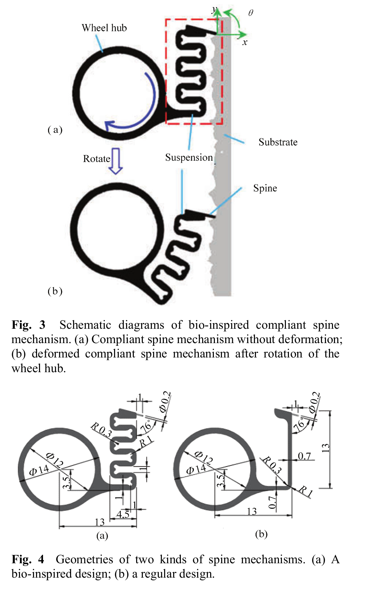
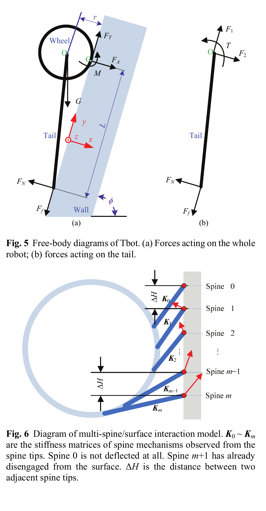
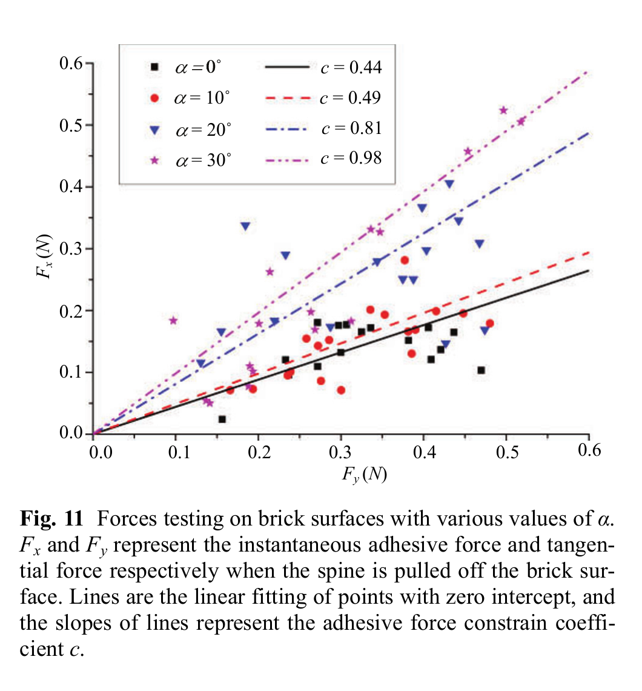

# 论文极简机理证据卡

## 1. 基本信息

- 题目：A Wheeled Wall-Climbing Robot with Bio-Inspired Spine Mechanisms
- 作者：Yanwei Liu；Shaoming Sun；Xuan Wu；Tao Mei
- 年份：2015
- DOI：`10.1016/S1672-6529(14)60096-2`
- 论文类型：机器人机构 + 有限元刚度辨识 + 准静态模型 + 实验
- 研究对象：双轮旋转微刺阵列、S 形柔顺悬架、尾部支撑及砖面攀爬
- 相关性等级：B（条件启用）
- 相关性说明：给出单刺刚度矩阵、多刺分载线性系统、尾部平衡和砖面拉脱标定；二维固定接触假设限制直接迁移。
- 长度说明：含单刺柔顺、多刺分载和整机平衡三条独立证据链，按多模型上限保留。

## 2. 论文实际解决的问题

论文设计每轮 64 刺的 T 形轮式攀爬机器人，以有限元辨识柔顺刺端刚度，用二维准静态模型连接单刺受力、多刺分载和尾部平衡，并以砖面拉脱、不同尾长和整机攀爬试验检查设计趋势。

## 3. 核心机理

### M1 轮转把单刺接触组织为预压-挂接-拉脱循环

- 证据类型：[原文结论]
- 机理内容：轮毂旋转先使悬架把刺尖压向墙并沿墙向下拖曳搜索；捕获粗糙峰后进入承载；继续转动提高所需附着，超过刺-峰可承受边界后拉脱。
- 输入因素：轮角、悬架变形、表面可用粗糙峰和切向载荷。
- 输出或影响：法向力符号、挂接状态和释放事件。
- 成立条件：表面存在可钩挂峰，轮速足以按准静态处理。
- 失效或不适用条件：论文没有显式地形、碰撞搜索或再接触算法。
- 来源：PDF p.3、7-8，Section 2.1、3.3，Fig. 8。
- 对当前模型的用途：定义旋转单爪的状态顺序和事件接口，不替代三维接触求解。

### M2 各向异性悬架用低法向刚度、负耦合和适中切向刚度兼顾搜索与承载

- 证据类型：[直接证据]
- 机理内容：作者要求 $k_{xx}$ 很小以限制预压反力，$k_{xy}$ 小且最好略负以避免向下拉伸导致刺尖离壁，$k_{yy}$ 既要小到允许更多刺贴合，又要大到承受自重；S 形方案的有限元矩阵更接近该目标。
- 输入因素：悬架几何、PA2200 材料、刺端平移与转角。
- 输出或影响：刺端法向/切向力、转矩及跨方向耦合。
- 成立条件：平面内小变形、线性 3 自由度刚度。
- 失效或不适用条件：大变形、屈曲、材料非线性和行程止挡未建模。
- 来源：PDF p.4-5，Section 2.2，Eqs. (1)-(2)，Table 2，Figs. 3-4。
- 对当前模型的用途：作为独立柔顺刺的本构骨架及刚度数量级参考。

### M3 旋转后的刺端刚度与共同位移兼容形成多刺分载

- 证据类型：[直接证据]
- 机理内容：每个接触刺的局部刚度由同一基准矩阵按轮上角位置旋转；$m+1$ 个接触中，刚开始接触的 spine 0 不受力，最末 spine $m$ 承载，spine $m+1$ 已脱离。共同的轮-墙距离变化、相邻刺尖高度差和各悬架变形组成 Eq. (18) 的线性系统。
- 输入因素：接触主动集、$\alpha_0$、$\Delta\alpha=360^\circ/n$、$\Delta H$、基准刚度矩阵和整机等效载荷。
- 输出或影响：各刺 $F_{ix},F_{iy}$、悬架转角和总法向/切向力。
- 成立条件：刺尖为不传矩的固定铰、脱离前无滑移、悬架小变形且两轮对称。
- 失效或不适用条件：不含形貌导致的接触竞争、单刺损伤、非线性摩擦和失效后的任意重分配。
- 来源：PDF p.5-7，Section 3.2，Eqs. (6)-(18)，Figs. 6-7。
- 对当前模型的用途：提供“主动接触集 + 旋转刚度 + 位移兼容 + 总载荷闭合”的可改写求解骨架。

### M4 砖面拉脱边界随刺机构转角显著改变

- 证据类型：[直接证据]
- 机理内容：作者把小/中等附着力近似为 $F_x$ 与 $F_y$ 的线性约束，并在砖面上对 $\alpha=0^\circ,10^\circ,20^\circ,30^\circ$ 进行过零点拟合，得到 $c=0.44,0.49,0.81,0.98$；转角越大，单位切向力可伴随的法向附着越高。
- 输入因素：拉脱瞬间转角、切向力、表面局部坡度与静摩擦。
- 输出或影响：可行附着域和拉脱判定参数 $c$。
- 成立条件：本文针尖、砖面和拉脱台架；拟合强制过原点。
- 失效或不适用条件：试验忽略接近角、拖曳距离和预压，未报告重复数或不确定度；原文约束不等号与“越界即脱离”的文字不完全自洽。
- 来源：PDF p.7、9，Sections 3.2、4.1，Eq. (19)，Fig. 11。
- 对当前模型的用途：仅作为砖面条件下角度相关拉脱边界的标定目标，不作通用摩擦定律。

### M5 尾部力臂把多刺合力转换为整机可攀倾角

- 证据类型：[直接证据]
- 机理内容：柔性尾端的法向支撑与摩擦、轮-尾距离 $L$、重心离壁距离 $r$ 和多刺等效力矩 $M$ 共同闭合整机力与力矩；增加尾长先改善抗外翻能力，超过约 120 mm 后收益趋于饱和。
- 输入因素：$G,L,r,\phi,\mu_1,M$ 与轮端合力。
- 输出或影响：所需 $F_A,F_T,T$ 和最大可攀倾角 $\phi_{max}$。
- 成立条件：二维、两轮对称、准静态，尾重忽略并把重力作用于轮心。
- 失效或不适用条件：不含转弯、动态过渡、左右轮不对称和尾部弯曲接触分布。
- 来源：PDF p.5、8-10，Sections 3.1、3.3、4.2，Eqs. (3)-(5)，Figs. 5、9，Table 4。
- 对当前模型的用途：作为整机平衡校核和尾长参数扫描的低阶模型。

### M6 质量和柔顺存在双侧边界，而非“越轻越好”或“越软越好”

- 证据类型：[原文结论]
- 机理内容：质量过大时刺与悬架可能因大变形破坏；质量过小时悬架变形不足，仅少数刺接触而导致不稳定。S 形悬架在砖面可攀 100°，直梁悬架只能攀 80°。
- 输入因素：整机重量、悬架刚度/强度和有效接触刺数。
- 输出或影响：接触数量、局部载荷和整机稳定性。
- 成立条件：本文 60 g 样机、64 刺/轮与测试砖面。
- 失效或不适用条件：没有测量逐刺接触数、悬架应力或破坏概率，双侧边界仅为定性趋势。
- 来源：PDF p.8-10，Sections 3.3、4.2、5，Figs. 9、12。
- 对当前模型的用途：要求参数扫描同时检查接触不足与结构过载两类失效。

## 4. 核心公式

### E1 刺端三自由度线性刚度与有限元辨识值

$$
\mathbf F=\mathbf K\boldsymbol\delta,
\qquad
\mathbf K_B=
\begin{bmatrix}
0.23&-0.05&1.5\\
-0.05&1.3&-4.6\\
1.5&-4.6&27
\end{bmatrix},
\quad
\mathbf K_R=
\begin{bmatrix}
0.43&0.85&1.7\\
0.85&5.3&-3.3\\
1.7&-3.3&24
\end{bmatrix}.
$$

- 证据类型：线性本构 + 有限元辨识；原公式号：Eqs. (1)-(2)，数值见 Table 2。
- 变量与单位：$\mathbf F=(F_x,F_y,M_\theta)^T$，$\boldsymbol\delta=(\Delta u_x,\Delta v_y,\Delta w_\theta)^T$；原 Table 2 的单位矩阵逐行为 `[N/mm,N/mm,N/rad]`、`[N/mm,N/mm,N/rad]`、`[N/rad,N/rad,N·mm/rad]`，转动耦合量纲在编码前需复核。
- 正方向：刺端坐标 $x$ 为墙面法向，$y$ 沿墙，$\theta$ 逆时针为正，见 Fig. 3a。
- 成立条件与假设：二维小变形；$B/R$ 分别为 S 形仿生/直梁常规悬架。
- 参数来源：固定轮毂，分别施加 $(-0.5\ \mathrm{mm},0,0^\circ)$、$(0,0.2\ \mathrm{mm},0^\circ)$、$(0,0,2^\circ)$ 三组位移后由 FEA 反算。
- 是否可直接进入当前模型：骨架可直接采用；数值需按实际结构和材料重算。
- 来源：PDF p.4-5，Section 2.2。

### E2 尾支撑下的整机准静态平衡

$$
F_A=\frac{M+G(r\sin\phi-L\cos\phi)}{L},
$$
$$
F_T=\frac{\mu_1M+G(\mu_1r+L)\sin\phi}{L},
\qquad
T=\frac{(M+Gr\sin\phi)(L+\mu_1r)}{L}.
$$

- 证据类型：二维静力平衡；原公式号：Eqs. (3)-(5)。
- 变量与单位：$F_A,F_T,G$ 为 N；$M,T$ 为 N·mm；$L,r$ 为 mm；$\phi$ 为墙面相对水平倾角；$\mu_1$ 为尾-墙摩擦系数。
- 成立条件：两轮对称，尾部满足 $F_f=\mu_1F_N$，尾重约为两轮总重的 7% 因而被忽略。
- 输出含义：轮端所需法向附着、沿墙切向力和电机转矩。
- 是否可直接进入当前模型：需要修正；可作二维准静态校核，动态/三维需重新列平衡。
- 来源：PDF p.5，Section 3.1，Fig. 5。

### E3 各接触刺的坐标旋转与力-位移映射

$$
\Delta\alpha=\frac{360^\circ}{n},\qquad
\mathbf K_0=\mathbf T_{\alpha_0}^{T}\mathbf K\mathbf T_{\alpha_0},
$$
$$
\mathbf F_m=\mathbf K_m\boldsymbol\delta_m,qquad
\mathbf K_m=\mathbf T_m^{T}\mathbf K_0\mathbf T_m,qquad
\mathbf T_m=
\begin{bmatrix}
\cos m\Delta\alpha&-\sin m\Delta\alpha&0\\
\sin m\Delta\alpha&\cos m\Delta\alpha&0\\
0&0&1
\end{bmatrix}.
$$

- 证据类型：坐标变换 + 线性本构；原公式号：Eqs. (6)-(9)。
- 变量：$n$ 为轮周名义刺数，$\alpha_0$ 为刚接触刺角度，$m$ 为接触序号。
- 成立条件：所有刺机构具有同一基准 $\mathbf K$，只因轮上角位置不同而旋转。
- 输出含义：把每根刺的局部柔顺统一到墙面坐标。
- 是否可直接进入当前模型：是，作为装配变换；实际阵列需允许逐刺参数差异。
- 来源：PDF p.6，Section 3.2。

### E4 轮-墙位移与第 $m$ 刺变形兼容

$$
\Delta r=\Delta x_m-\Delta u_m,
\qquad
m\Delta H=\Delta y_m-\Delta v_m.
$$

- 证据类型：几何兼容；原公式号：Eqs. (10)-(11)。
- 变量与单位：$\Delta r,\Delta x_m,\Delta u_m,\Delta H,\Delta y_m,\Delta v_m$ 均为 mm。
- 正方向与几何：$R$ 为轮轴到刺尖向量，$\beta$ 为 $R$ 与墙面的夹角，见 Fig. 7b。
- 成立条件：相邻未变形刺尖沿墙间距统一为 $\Delta H$，墙面被简化为直线。
- 是否可直接进入当前模型：需要修正；真实地形应把 $m\Delta H$ 替换为逐刺接触点几何。
- 来源：PDF p.6，Section 3.2。

### E5 多刺合力、合矩闭合

$$
F_A=2\sum_{i=1}^{m}F_{ix},\qquad
F_T=2\sum_{i=1}^{m}F_{iy},
$$
$$
M=2\sum_{i=1}^{m}F_{ix}\left(i\Delta H-|R|\cos\beta\right).
$$

- 证据类型：阵列合力/合矩；原公式号：Eqs. (15)-(17)。
- 变量与单位：$F_{ix},F_{iy}$ 为单刺 N；$M$ 为 N·mm；因两轮对称乘 2。
- 成立条件：刺尖铰接不传递局部矩 $M_m=0$；此处整机等效矩 $M$ 与局部 $M_m$ 不是同一量。
- 输出含义：连接 E2 的整机需求与 E3-E4 的逐刺未知量。
- 是否可直接进入当前模型：需要修正；三维阵列应使用接触点位置向量叉乘。
- 来源：PDF p.7，Section 3.2。

### E6 刺-粗糙峰附着约束系数

$$
F_{mx}<cF_{my},
\qquad
c=\tan\!\left(\theta_{min}-\tan^{-1}\frac{1}{\mu}\right).
$$

- 证据类型：近似判据；原公式号：Eq. (19)，线性约束写在同页正文。
- 变量：$\mu$ 为刺尖-粗糙峰最大静摩擦系数；$\theta_{min}$ 为可用峰法向与墙面法向的最小夹角；$c$ 无量纲。
- 成立条件：小到中等附着力，基于文献 [9,11] 的二维近似。
- 参数来源：本文另以砖面拉脱数据的 $F_x/F_y$ 过零拟合斜率识别 $c$。
- 是否可直接进入当前模型：否。
- 所需修正：统一可行域方向和等号边界；把 $c$ 改为角度、局部法向、摩擦和材料状态的条件函数并重新标定。
- 来源：PDF p.7、9，Sections 3.2、4.1，Fig. 11。

> Eq. (18) 是由 E3-E5 与 Eqs. (12)-(14) 组装的 $(3m+2)$ 阶块线性系统；其结构已逐项核对，但为避免把固定接触、等间距直墙假设固化为通用实现，证据卡不复写整块矩阵。

## 5. 关键参数表

| 参数/工况 | 数值 | 单位 | PDF 来源 | 当前用途 | 注意事项 |
|---|---:|---|---|---|---|
| 每轮阵列 × 每阵列刺数 | $16\times4=64$ | 根 | p.3、8 | 名义阵列规模 | 论文二维模型又令 $n=64$ 均匀环列，轴向 16 组与周向 4 刺的映射未解释 |
| 轮直径 | 32 | mm | p.3、8 | 轮转几何 | 样机值 |
| 刺长 / 杆径 / 尖端半径 | 1 / 0.2 / 30-60 | mm / mm / μm | p.2、4、8 | 刺几何量级 | 针灸针，未给批次离散性 |
| 悬架厚度 / 长度 / 刺夹角 | 1.6 / 13 / 76 | mm / mm / ° | p.4，Fig. 4 | 柔顺结构复现 | 仅本文 SLS 几何 |
| PA2200 $E$/抗拉强度 | 1700 / 48 | MPa | p.5，Table 1 | 刚度/强度重算 | 厂商/烧结材料参数 |
| 不锈钢 $E$/抗拉强度 | 200000 / 250 | MPa | p.5，Table 1 | 刺体刚度量级 | 未报告针尖硬度或屈服 |
| 仿生/常规刚度矩阵 | 见 E1 | 混合单位 | p.5，Table 2 | 柔顺本构 | FEA，未做实体刚度试验 |
| 样机质量 / 重力设定 | 60 / 0.6 | g / N | p.7-8 | 整机平衡 | 不含电池；0.6 N 为仿真取值 |
| 样机长/宽/尾长 | 120 / 110 / 120 | mm | p.2、8 | 机构边界 | 尾长为筛选结果 |
| Fig. 8 仿真工况 | $c=0.3,\mu_1=0.2,n=64,L=120,\phi=90^\circ$ | - / mm / ° | p.7-8 | 单周期趋势复现 | 表面和初始接触角未充分参数化 |
| 砖面拟合 $c$（$\alpha=0,10,20,30^\circ$） | 0.44 / 0.49 / 0.81 / 0.98 | - | p.9，Fig. 11 | 拉脱边界标定目标 | 强制过零；无误差条/样本数 |
| 尾长 100/110/120/200 mm 的仿真 $\phi_{max}$ | 87 / 99 / 103 / 105 | ° | p.9，Table 4 | 尾长趋势 | $G=0.6$ N、$c=0.5$ |
| 同组实验 $\phi_{max}$ | 85 / 95 / 100 / 100 | ° | p.9，Table 4 | 整机趋势验证 | 离散角度试验，无置信区间 |
| 仿生/常规悬架砖面最大倾角 | 100 / 80 | ° | p.9 | 结构对照 | 只报告能否攀爬 |
| 100° 砖面 / 垂直珍珠棉速度 | 10 / 20 | cm/s | p.8-10 | 整机性能边界 | 珍珠棉由穿刺附着，机理不同 |

## 6. 最小实验或仿真证据

### V1 仿生悬架产生完整三阶段力循环

- 类型：仿真
- 关键工况：$G=0.6$ N、$c=0.3$、$\mu_1=0.2$、$n=64$、$L=120$ mm、垂直墙。
- 观测量：各接触刺 $F_x,F_y$ 随轮角变化。
- 结果：S 形悬架出现预压、附着、拉脱三阶段；直梁方案没有预压阶段。
- 支撑内容：M1-M3、E1-E5。
- 来源：PDF p.7-8，Fig. 8。

### V2 砖面拉脱系数随转角上升

- 类型：单刺机构实验
- 关键工况：砖面、$\alpha=0^\circ-30^\circ$、二维力传感器，拉脱瞬时记录 $F_x,F_y$。
- 数据处理：各角度过零点线性拟合，斜率定义为 $c$。
- 结果：$c$ 从 0.44 增至 0.98；$20^\circ-30^\circ$ 数据多数位于 $c=0.5-1$。
- 支撑内容：M4、E6。
- 来源：PDF p.9，Fig. 11。

### V3 尾长扫描的仿真-实验趋势一致但存在饱和

- 类型：仿真-整机实验对比
- 关键工况：砖面，尾长 100、110、120、200 mm；试验倾角 80°-105°。
- 结果：仿真/实验最大倾角分别为 87/85、99/95、103/100、105/100°；120 mm 后实验不再提高。
- 支撑内容：M5、E2。
- 来源：PDF p.9，Table 4。

### V4 柔顺结构对砖面整机能力有直接对照

- 类型：整机实验
- 关键工况：相同 Tbot 架构，S 形仿生与直梁常规悬架对照。
- 结果：仿生方案在 100° 砖面攀爬，常规方案不能垂直攀爬、上限为 80°。
- 支撑内容：M2、M6。
- 来源：PDF p.9-10，Section 4.2，Fig. 12。

### V5 表面材料改变附着模式

- 类型：整机实验/原文解释
- 结果：砖面依赖粗糙峰挂接；珍珠棉中刺尖通常穿入材料并产生更大附着，最大可攀 130°。作者同时指出本文刺尖过大，不能抓住光滑涂漆内墙。
- 支撑内容：硬粗糙挂接、软材料穿刺和光滑面失效的模式边界。
- 来源：PDF p.9-11，Sections 4.2、5，Fig. 13。

## 7. 关键图片

- 原图号：Figs. 3-4；PDF 页码：4；保留原因：同时定义 E1 的 $x/y/\theta$ 坐标、轮转变形方式和两种悬架几何。

- 原图号：Figs. 5-6；PDF 页码：5；保留原因：定义 E2、E5 的力方向、力臂、等效合力以及 spine 0 到 spine $m$ 的接触状态。

- 原图号：Fig. 11；PDF 页码：9；保留原因：保存四个转角的原始散点、过零拟合和 $c$ 值，不能由单一平均数替代。

## 8. 可迁移关系

- [可直接采用] 预压-挂接-拉脱的轮转事件顺序，以及接触主动集变化后重新求解的接口。
- [可直接采用] $\mathbf F=\mathbf K\boldsymbol\delta$、逐刺坐标旋转、位移兼容和合力/合矩闭合的线性骨架。
- [需要重算] 实际悬架的 3 自由度刚度矩阵、行程和结构强度；Table 2 数值只属于本文 SLS 结构。
- [需要标定] 红砖上的角度相关拉脱边界、局部摩擦、有效接触数、搜索距离和接近/预压历史。
- [仅作趋势验证] 负切-法耦合有利于贴壁；质量过轻会接触不足、过重会过载；尾长存在饱和。
- [不能直接采用] 把 $n=64$ 的二维等间距接触当作实际 16 轴向阵列分载，或把珍珠棉穿刺结果迁移到硬红砖。

## 9. 局限与风险

- 整机模型是二维、对称、准静态的；忽略惯性、左右轮不对称、转向、动态地面-墙面过渡和尾部连续弯曲。
- 多刺模型把接触刺尖视为不传矩固定铰，脱离前无滑移且悬架线性小变形；不含真实地形搜索、峰破坏、刺弯曲或渐进失效。
- 实物为每轮 16 组、每组 4 刺，模型却令 $n=64$ 在二维轮周等角分布；横向错列、同峰竞争和刚性轮宽效应被消去。
- Eq. (19) 的约束不等号与正文“越界拉脱”措辞不能唯一确定数值实现方向；必须回到统一摩擦/几何定义后重写。
- Fig. 11 未报告重复数、误差或原始加载历史，并明确忽略接近角、拖曳距离和预压，$c$ 不能作为材料常数。
- 验证主要是离散最大倾角和能否攀爬，没有逐刺力、接触数或 Eq. (18) 分载的同步实验；砖面也没有形貌、摩擦和强度表征。

## 10. 对当前研究的最小贡献

P29 连接单刺柔顺、多刺分载与尾支撑整机平衡，并给出砖面拉脱和尾长趋势；它不含三维形貌、接触搜索、逐刺损伤或非对称重分配，宜作为 P03/P21/P23 的条件补充。
