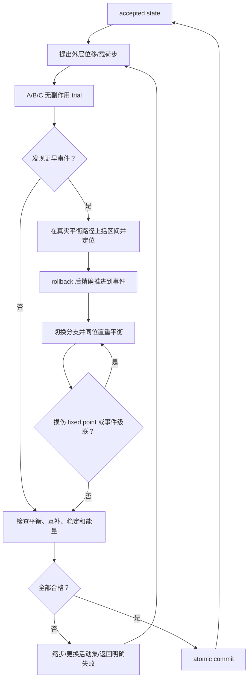

# 从牛顿平衡到分层非光滑算子

## 钩爪式爬壁机器人“壁面—单刺—阵列—十字对爪”准静态机理的教学型论文稿

**版本：** 0.1.0-tutorial
**日期：** 2026-07-17
**读者：** 熟悉普通牛顿运动学/动力学，但尚不熟悉算子、互补条件、wrench、非光滑事件和历史变量的研究生
**模型来源：** 当前 [SYSTEM_INTEGRATED_MODEL](../system/SYSTEM_INTEGRATED_MODEL.md) 及 [A](../modules/A_INTEGRATED_MODEL.md)、[B](../modules/B_INTEGRATED_MODEL.md)、[C](../modules/C_INTEGRATED_MODEL.md) 集成模型

> **成熟度声明。** 本文是对现有机理规范的重新推导和教学化组织，不是已经通过实验的论文结果。当前只能说“理论主链已定义”；代码实现、数值收敛、实验趋势和定量预测均未验证。已发现的闭合问题见 [独立复核报告](../review/DERIVATION_VERIFICATION_2026-07-17.md)。

## 摘要

微小爪刺在粗糙壁面上的啮合，表面上像“针尖勾住一个凸起”，实际却同时包含有限针尖几何、单边接触、摩擦、针体弯曲、安装弹簧、多刺载荷共享、接触切换、局部损伤和整机偏心力矩。若直接从一个经验“抓附系数”出发，很难回答针尖为什么挂接、某根针失效后载荷如何转移、预紧何时足够以及整机为何失稳。

本文从普通牛顿方程出发。慢速拖曳下忽略惯性，动力学方程退化为力和力矩的准静态平衡；把全部方程移到等号左边得到残量，把“给定运动和历史、求接触力与新状态”的整组计算称为算子。理想刚体接触并不总给出唯一的逐点反力，因此必须用不等式、互补条件或集合值图，而不能把所有关系强行写成普通单值函数。本文依次推导 A 层单刺、B 层阵列单元和 C 层十字系统，解释 wrench/虚功、活动集、凝聚切线、事件定位和原子提交，并给出当前唯一直线拖曳实验所能标定与不能标定的参数边界。

**关键词：** microspine；准静态；Signorini 接触；Coulomb 摩擦；wrench；互补问题；载荷共享；事件驱动；可辨识性

## 1. 研究问题与分层思想

### 1.1 我们真正要计算什么

实验过程是：

1. 以主动推力把爪刺压向壁面；
2. 直线模组沿壁面拖曳；
3. 针尖搜索表面凸起并可能挂接；
4. 挂接后拉力上升；
5. 接触可能滑动、释放、再挂接，针或壁面也可能失效；
6. 多根针共同工作时，一根针状态变化会使其他针重新受力；
7. 四个阵列单元装成十字机构后，偏心拉力还会产生整机力矩和 rocking。

目标不是只算一个最大力，而是得到一条带事件和历史的曲线：

\[
F_x(x),\quad
\{\text{contact, stick, slide, release, re-engage, damage}\},
\]

以及在合同允许时得到稳定可达分支上的临界承载。

### 1.2 为什么分 A、B、C 三层

若把所有针、所有接触和整机六自由度一次性写进一个巨型方程，既难审计，也容易重复计算力或柔顺。因此采用三层：

| 层 | 物理对象 | 输入 | 核心输出 |
|---|---|---|---|
| A | 一个有限球尖爪刺 | 根部运动、表面、参数、历史 | 壁面对单刺的 contact-only wrench、事件、试探状态 |
| B | 一个多刺阵列单元 | 板运动或主动推力、各 A 状态 | 单元总 wrench、拉力、逐刺状态、重分配 |
| C | 四个 B 单元的十字机构 | 预紧坐标、整机位姿、偏心载荷 | 六维平衡、稳定分支、系统事件与临界承载 |

一句话理解：

> A 负责“每根针怎么受力”，B 负责“许多针怎样共同平衡”，C 负责“四个阵列怎样让整机平衡”。

## 2. 坐标、符号与基本假设

### 2.1 全局与局部坐标

壁面的平均平面是全局 XY 平面：

- +X、+Y：沿壁面；
- +Z：离开壁面；
- 压向壁面：-Z。

每个阵列单元有局部坐标：

- +x：从针头指向根部的搜索/拖曳方向；
- \(\mathbf e_y=\mathbf E_Z\times\mathbf e_x\)；
- z 与全局 Z 一致。

针初始轴向可写成

\[
\mathbf a_0
=\cos\alpha\cos\beta\,\mathbf e_x
+\cos\alpha\sin\beta\,\mathbf e_y
-\sin\alpha\,\mathbf E_Z.
\]

当前主线 \(\beta=0\)。\(\alpha\) 越大，针轴指向壁面的分量越大。

### 2.2 单位

统一使用 N–mm–MPa：

\[
1\ \mathrm{MPa}=1\ \mathrm{N/mm^2}.
\]

输入弹簧刚度若为 N/m，进入模型前除以 1000；针尖半径若为 µm，进入模型前除以 1000。

### 2.3 准静态并不等于“永远没有动态”

把接触、结构和约束力全部显式列出，完整广义动力学是

\[
M(\mathbf q)\ddot{\mathbf q}
=\mathbf Q_{ext}
+\mathbf Q_{contact}
+\mathbf Q_{internal}
+\mathbf Q_{constraint}.
\]

取特征质量 \(M_*\)、长度 \(L_*\)、时间 \(T_*\)、力 \(F_*\)，惯性与外力的比值约为

\[
\varepsilon_I
=\frac{M_*L_*}{T_*^2F_*}.
\]

当拖曳足够慢且 \(\varepsilon_I\ll1\)，连续加载段可近似忽略惯性：

\[
\mathbf Q_{ext}
+\mathbf Q_{contact}
+\mathbf Q_{internal}
+\mathbf Q_{constraint}
=\mathbf0.
\]

对一个完整刚体汇总时，内部力成对消去，这才简化为熟悉的

\[
\sum\mathbf F=\mathbf0,\qquad
\sum\mathbf M=\mathbf0.
\]

本项目 1 mm/s 的稳态拖曳以该近似为主。但针突然释放时真实机构会振动或跳回；准静态模型只能做事件前后平衡与能量预算，不能自动再现高速瞬态。

## 3. 从普通力学到 wrench、虚功和残量

### 3.1 wrench 只是“力和力矩打包”

定义

\[
\mathbf W=
\begin{bmatrix}
\mathbf F\\
\mathbf M_O
\end{bmatrix},
\qquad
\mathbf V=
\begin{bmatrix}
\mathbf v_O\\
\boldsymbol\omega
\end{bmatrix}.
\]

\(\mathbf W\) 叫 wrench，\(\mathbf V\) 叫 twist。名字看起来陌生，内容仍是普通的力、力矩、线速度和角速度。

瞬时功率为

\[
\mathcal P
=\mathbf F\cdot\mathbf v_O
+\mathbf M_O\cdot\boldsymbol\omega
=\mathbf W^\mathsf T\mathbf V.
\]

这就是虚功和功共轭的核心：哪个广义力乘哪个广义位移/速度，必须给出功。

### 3.2 为什么换参考点时必须搬运力矩

令 \(\mathbf r_{OP}\) 是从 O 指向 P 的向量。同一组力从 P 搬到 O：

\[
\mathbf M_O
=\mathbf M_P+\mathbf r_{OP}\times\mathbf F.
\]

刚体速度满足

\[
\mathbf v_P
=\mathbf v_O+\boldsymbol\omega\times\mathbf r_{OP}.
\]

代入可得

\[
\mathbf F\cdot\mathbf v_P
+\mathbf M_P\cdot\boldsymbol\omega
=
\mathbf F\cdot\mathbf v_O
+\mathbf M_O\cdot\boldsymbol\omega.
\]

所以正确搬运前后功率不变。这是检查坐标和正负号最可靠的方法之一。

例：力作用点离参考点 50 mm，方向为 +X：

\[
\mathbf r=50\mathbf E_Z,\qquad
\mathbf M=50F\mathbf E_Y.
\]

这就是 C 层偏心拉力产生力矩的来源，并没有引入新的力学定律。

### 3.3 残量只是“等号左边还差多少”

一维弹簧受外力 P：

\[
kx=P.
\]

移项定义残量：

\[
r(x)=kx-P.
\]

平衡条件就是

\[
r(x)=0.
\]

Newton 迭代仍是熟悉的“误差除以刚度”：

\[
x^{j+1}
=x^j-\frac{r(x^j)}{r'(x^j)}.
\]

阵列法向平衡也完全一样：

\[
r_z(u_z)
=\sum_iF_{z,i}(u_x,u_z,s_i,D)-P_z.
\]

求 \(r_z=0\)，就是寻找让所有针的法向合力等于主动推力的 \(u_z\)。

### 3.4 “算子”没有神秘性

普通函数可能写成

\[
y=f(x).
\]

单刺计算不仅需要位置，还要表面、参数和上一步历史；输出也不仅是力，还包括接触状态、事件和试探历史。因此写成

\[
(\mathbf W_A,\mathcal E,S_A^{trial})
=\mathcal A(
\Delta\mathbf q_A,
S_A^n,D^n,\mathbf p_A).
\]

这里的 \(\mathcal A\) 就叫算子。可以把它理解成：

> 输入本步边界运动、旧档案和参数，内部解一组牛顿平衡与接触条件，输出力、新档案草稿和事件。

### 3.5 为什么有时要写集合值关系

理想刚体接触可能不唯一。比如一张绝对刚的四脚桌放在绝对刚的地面上，只知道总重力，并不总能唯一决定四条腿各承担多少；很多反力组合都满足总力和总力矩平衡。

这时不能诚实地写唯一函数 \(\mathbf f=f(\mathbf q)\)，而应写

\[
\mathbf f\in\mathcal G(\mathbf q)
\]

或广义方程

\[
\mathbf0\in\mathcal R(\mathbf z).
\]

“\(\in\)”不是故弄玄虚，而是在承认解可能是一组。实际程序必须通过物理柔顺、活动集、互补求解器或明确选解规则把问题处理清楚。

## 4. A 层：从壁面几何到单刺接触力

### 4.1 壁面高度场与法向

主线把壁面写成高度场

\[
Z=h(X,Y).
\]

表面点

\[
\mathbf p(X,Y)
=X\mathbf E_X+Y\mathbf E_Y+h(X,Y)\mathbf E_Z.
\]

指向壁外的单位法向为

\[
\mathbf n
=\frac{(-h_X,-h_Y,1)}
{\sqrt{1+h_X^2+h_Y^2}}.
\]

高度场适合快速查询和程序化随机表面；三角网格可覆盖悬垂等更一般几何，但最近特征、法向连续性和碰撞处理更复杂。

### 4.2 为什么不能把针尖当成数学点

针尖半径 \(R_t=50\) 或 100 µm。若把它当点，会错误地进入比针尖更窄的沟槽，也会错误估计可接触的坡度。

设球尖中心为 \(\mathbf c_t\)，壁面实体为
\(\Omega_h=\{Z\le h(X,Y)\}\)，其欧氏有符号距离为
\(\phi_{\Omega_h}\)。对完整球，几何间隙写成

\[
g_n=\phi_{\Omega_h}(\mathbf c_t)-R_t.
\]

这样针心一旦进入实体，间隙会保持为负，不会像无符号边界距离那样错误地重新变正。对高度场还可用正式 A 模型的球形包络 \(H_{R_t}\) 表达等价的非穿透可行域与零接触条件：

\[
g_{env}=c_{t,Z}-H_{R_t}(c_{t,X},c_{t,Y})\ge0.
\]

\(g_{env}\) 是竖直包络裕量，与欧氏 \(g_n\) 具有相同的可行域和接触零集，但一般不具有相同数值尺度；跨后端接触互补仍采用 \(g_n=\phi_{\Omega_h}(\mathbf c_t)-R_t\)。

接触时存在候选点满足

\[
\mathbf c_t-\mathbf p=R_t\mathbf n.
\]

真实针尖只是有限球冠，所以候选点还必须落在由当前针轴 \(\mathbf a_t\) 定义的合法球冠内；针杆也必须做扫掠碰撞检查。有限球冠、最近点和杆体碰撞共同构成 morphology。

### 4.3 单边接触：三种情况写进一组式子

法向间隙 \(g_n\) 与法向接触力 \(\lambda_n\) 满足

\[
g_n\ge0,\qquad
\lambda_n\ge0,\qquad
g_n\lambda_n=0.
\]

分别代表：

- \(g_n>0,\lambda_n=0\)：悬空；
- \(g_n=0,\lambda_n=0\)：刚好接触但不承载；
- \(g_n=0,\lambda_n>0\)：闭合并承载。

它等价于“壁面能推针，不能用接触力把针吸过去”。这组条件叫 Signorini 互补条件。

### 4.4 摩擦锥与粘着/滑动

把切向接触力记为 \(\boldsymbol\lambda_t\)，Coulomb 摩擦锥为

\[
\|\boldsymbol\lambda_t\|
\le\mu\lambda_n.
\]

粘着时：

\[
\mathbf v_t=\mathbf0,\qquad
\|\boldsymbol\lambda_t\|\le\mu\lambda_n.
\]

滑动时：

\[
\mathbf v_t\ne\mathbf0,\qquad
\boldsymbol\lambda_t
=-\mu\lambda_n
\frac{\mathbf v_t}{\|\mathbf v_t\|}.
\]

注意“力在摩擦锥边界”不自动等于滑动；在临界状态仍可能瞬时粘着，需要结合相对运动和加载方向判断。

### 4.5 一个二维坡面例子：为什么 μ 与表面坡度分不开

在 x–z 截面令坡度 \(s=h'(x)\)，

\[
\mathbf n=\frac{(-s,1)}{\sqrt{1+s^2}},
\qquad
\mathbf t=\frac{(1,s)}{\sqrt{1+s^2}}.
\]

接触力

\[
\mathbf F_c=\lambda_n\mathbf n+\lambda_t\mathbf t.
\]

它的水平分量是

\[
F_x
=\frac{-s\lambda_n+\lambda_t}
{\sqrt{1+s^2}}.
\]

所以同样的水平拉力可以来自：

- 更大的 \(\mu\)；
- 更陡、更有利的局部坡度 \(s\)；
- 更大的法向力；
- 更深的几何互锁。

这直接证明：没有局部形貌测量时，仅凭 \(F_x\) 不能唯一反演摩擦系数。

### 4.6 针体梁柔顺

把针在首版看作圆截面悬臂梁：

\[
A=\frac{\pi d^2}{4},\qquad
I=\frac{\pi d^4}{64},\qquad
J=\frac{\pi d^4}{32}.
\]

轴向伸缩：

\[
u_a=\frac{NL}{EA}.
\]

二维弯曲中，尖端横向位移和转角与尖端力/矩关系为

\[
\begin{bmatrix}
u_b\\
\theta_b
\end{bmatrix}
=
\begin{bmatrix}
L^3/(3EI) & L^2/(2EI)\\
L^2/(2EI) & L/(EI)
\end{bmatrix}
\begin{bmatrix}
V_b\\
M_b
\end{bmatrix}.
\]

扭转为

\[
\theta_t=\frac{TL}{GJ}.
\]

三维 A 层把这些关系沿针轴和两个横向方向组装。接触力决定梁挠曲，梁挠曲又改变针尖位置与法向，所以接触几何和结构平衡必须联立求解。

### 4.7 独立安装弹簧

若根部安装只受压弹簧，内点分支为

\[
f_s=k_s\delta_s,
\qquad 0<\delta_s<\delta_{max}.
\]

\(\delta_{max}=4\) mm。到上限后，硬挡块可提供额外反力；需求拉伸时弹簧应释放而不是产生拉力。A 权威模型已经把零位冻结为 \(\delta_s=0,F_s=0,Q_s=0\)；B 的重复摘要与该分支冲突，须以 A 为准并修订 B 文档，详见复核报告。

梁柔顺和安装弹簧柔顺是两个物理元件，不能把同一轴向变形同时计入二者。

### 4.8 单刺平衡

对针体自由体：

\[
\mathbf F_{root}+\sum_c\mathbf F_c=\mathbf0,
\]

\[
\mathbf M_{root}
+\sum_c
\left[
\mathbf M_c
+(\mathbf r_c-\mathbf r_{root})\times\mathbf F_c
\right]
=\mathbf0.
\]

同时满足：

- 球尖/杆体几何兼容；
- Signorini 互补；
- Coulomb 摩擦；
- 梁与弹簧本构；
- 选定材料分支；
- 历史一致性。

把所有未知量记为

\[
\mathbf z_A=
\{\mathbf p_c,\lambda_n,\boldsymbol\lambda_t,
\mathbf u_b,\boldsymbol\theta_b,\delta_s,
\text{multipliers},\Delta\text{history}\},
\]

整组问题写成

\[
\mathbf0\in
\mathcal R_A(
\mathbf z_A;
\Delta\mathbf q_A,S_A^n,D^n,\mathbf p_A).
\]

求解后 A 只向 B 输出壁面对单刺的 contact-only wrench。根部内部反力、梁储能和安装弹簧力各有自己的所有者，避免重复装配。

### 4.9 历史、滑移和损伤

接触问题有记忆：

- 上一步接触哪一块表面；
- 累计客观滑移；
- 当前粘着还是滑动；
- 哪些材料面片已损伤；
- 针体是否失效。

因此同一位置、不同加载历史可能得到不同力。

当前模型提供 resultant-capacity 和 continuum-patch 两类材料分支，但复核发现软化末端、残余状态和功共轭仍未完全闭合。开发主线应先用

\[
\texttt{material\_model=no\_damage}.
\]

这不是假设壁面无限强，而是明确把“损伤预测”暂时从可认证输出中移除。

## 5. B 层：多根针为何会自动载荷共享

### 5.1 共同板位姿

一个 B 单元的所有针安装在同一板上。当前 B 1.0 的板运动为

\[
\mathbf q_B=(u_x,u_z).
\]

第 i 根针的根部位置由共同板位姿、阵列格点、安装角和可能的独立弹簧压缩确定。B 对每根针调用 A：

\[
(\mathbf W_i,\mathcal E_i,S_i^{trial})
=\mathcal A_i(\mathbf q_B,S_i^n,D^n).
\]

把所有接触 wrench 搬到同一参考点：

\[
\mathbf W_B=\sum_i\mathbf W_i.
\]

### 5.2 法向力控平衡

实验给定主动推力 \(P_z\)，拖曳位移 \(u_x\) 逐步增加。B 内部求 \(u_z\)：

\[
r_z(u_z;u_x)
=\mathbf E_Z^\mathsf T
\sum_i\mathbf F_i(u_x,u_z)
-P_z=0.
\]

传感器正拉力为

\[
R_x
=-\mathbf e_x^\mathsf T\sum_i\mathbf F_i.
\]

外功增量为

\[
dW_{ext}=R_xdu_x-P_zdu_z.
\]

### 5.3 两根针的直观例子

用向壁面接近量 \(w\) 表示板的法向运动，两个等刚度弹性支承的初始间隙为 \(c_1<c_2\)：

\[
\delta_i=\max(0,w-c_i),
\qquad
F_i=k\delta_i.
\]

总平衡：

\[
F_1+F_2=P.
\]

当只有第一根接触：

\[
w=c_1+P/k,\qquad F_1=P,\quad F_2=0.
\]

当两根都接触：

\[
w=\frac{P/k+c_1+c_2}{2},
\]

\[
F_1=k(w-c_1),\qquad
F_2=k(w-c_2).
\]

即使两根针的刚度相同，因间隙不同，载荷也不相等。

若第一根突然释放，程序把 \(F_1\) 切换到释放分支，再解

\[
F_1+F_2=P.
\]

剩余针的载荷自然增加。无需人为规定“失效针的力按 50% 转给谁”。

### 5.4 凝聚：把内部 u_z 消掉

在光滑唯一分支上，

\[
r_z(u_x,u_z)=0.
\]

对 \(u_x\) 微分：

\[
\frac{\partial r_z}{\partial u_x}
+\frac{\partial r_z}{\partial u_z}
\frac{du_z}{du_x}=0.
\]

所以

\[
\frac{du_z}{du_x}
=-\frac{k_{zx}}{k_{zz}}.
\]

若总 wrench 对两个坐标的导数为 \(K_{W,x},K_{W,z}\)，沿力控平衡路径的有效切线为

\[
K_{W,x|P}
=K_{W,x}
-K_{W,z}\frac{k_{zx}}{k_{zz}}.
\]

“凝聚”只是利用平衡关系把内部自由度 \(u_z\) 从外部输入中消去。

### 5.5 活动集

每根针可能处于：

- OPEN；
- NEAR_CONTACT；
- CLOSED_ZERO_LOAD；
- LOAD_BEARING；
- STICK/SLIDE；
- SPRING_ZERO/INTERIOR/HARD_STOP；
- RELEASED/FAILED。

活动集算法可理解为：

1. 猜哪些针接触、粘着、滑动或触顶；
2. 在该分支解牛顿平衡；
3. 检查间隙、力、摩擦锥和限位不等式；
4. 若不满足，更新集合再解。

这和判断桌子哪些腿真正着地是同一种思路。

## 6. C 层：四个阵列与六维整机平衡

### 6.1 十字布置

四个 B 单元的局部 +x 分别沿全局 ±X、±Y，安装在刚性十字参考体上。每个单元输出的 wrench 必须：

1. 从单元局部坐标旋转到全局；
2. 从单元参考点搬到 C 参考点；
3. 只装配一次。

记运输后的结果为 \(\mathbf W_i^{G,C}\)，整机接触 wrench：

\[
\mathbf W_{contact}^{G,C}
=\sum_{i=1}^4\mathbf W_i^{G,C}.
\]

### 6.2 同步搜索与预紧

当前 C 预紧让四个单元共享局部搜索坐标

\[
u_{x_i}=s,
\]

并对每个单元求法向状态，使其达到指定主动推力 \(P_i\)。这样可扫描“继续搜索是否还显著提高能力”。

但这里有必须冻结的机械边界：四个独立 \(u_{z_i}\) 相当于四个独立法向力控执行器；若实物四单元在 Z 上严格固定为一个刚体，就应使用共同刚体位姿和全局平衡。执行器端点、作用线和试验架反力未定义前，真实执行器功不能认证。

### 6.3 偏心载荷

设外部拉力方向为单位向量 \(\mathbf d\)，幅值为 \(\lambda_P\)，作用点相对 C 原点

\[
\mathbf r_P=50\mathbf E_Z\ \mathrm{mm}.
\]

加载器作用于爪的 wrench 是

\[
\mathbf W_{load}
=\lambda_P
\begin{bmatrix}
\mathbf d\\
\mathbf r_P\times\mathbf d
\end{bmatrix}.
\]

整机平衡为

\[
\mathbf r_C(\mathbf q_C,\lambda_P)
=\sum_{i=1}^4\mathbf W_i^{G,C}
+\mathbf W_{load}
+\mathbf W_{other}
=\mathbf0.
\]

它仍然只是

\[
\sum\mathbf F=0,\qquad
\sum\mathbf M=0
\]

的六分量打包形式。

### 6.4 临界承载不是“任意代数根中的最大值”

非光滑系统可能有多个平衡分支。某些根：

- 需要穿过不稳定区才能到达；
- 已经违反摩擦、接触或损伤条件；
- 只存在于事件前的旧分支；
- 数值上可求但物理不可达。

因此正式 \(F_{crit}\) 应定义为从合格预紧态出发、沿准静态加载历史能够到达且保持稳定的分支上，载荷参数的上确界：

\[
F_{crit}
=\sup\{\lambda_P:
\text{存在稳定、可达、合同有效的平衡状态}\}.
\]

这解释了为什么必须跟踪事件、历史和稳定性，而不能只对一个静态方程扫根。

### 6.5 当前合同为什么不能算 +X/45°

B 1.0 只接受单元局部 x 与全局 Z：

\[
\mathcal S_i=\operatorname{span}\{\mathbf e_{x_i},\mathbf E_Z\}.
\]

全局 +X 对沿 ±Y 布置的单元是局部 y；45° 对四个单元都含局部 y。四个 B 1.0 可共同表达的平移交集只剩纯 Z。rocking 还需要转动自由度和动态几何。

所以当前正确行为不是返回“零承载”，而是：

\[
\texttt{C\_CONTRACT\_EXTENSION\_REQUIRED}.
\]

状态、历史、事件、功、曲线和峰值全部不得推进，\(F_{crit}\) 保持 null。这里缺的是 B 2.x 运动合同和软件实现，不是一个实验标定参数。

## 7. 非光滑事件与历史事务

### 7.1 为什么普通固定步长会出错

若一个大步从 \(x_n\) 直接走到 \(x_{n+1}\)，中间可能发生：

- 首次接触；
- 摩擦锥到达；
- 粘着转滑动；
- 弹簧触顶；
- 几何支持点切换；
- 释放；
- 材料或针体失效；
- 再挂接。

若直接用终点状态更新历史，事件顺序可能错误，损伤可能被多算，甚至会穿过禁止状态。

### 7.2 trial 与 commit

把它想成数据库事务：

- **accepted state：** 上一个已经确认的档案；
- **trial：** 草稿纸试算，不改正式档案；
- **rollback：** 试算失败或发现更早事件，丢弃草稿；
- **commit：** 整个系统在同一事件位置达成一致后，原子写入新档案。

任何 A 或 B 子调用都不能偷偷修改共享 DamageStore。

### 7.3 最早事件算法

对每个候选事件定义带符号函数 \(g_e(x)\)，例如间隙、摩擦余量、硬限位余量、容量余量。一个安全的外层步为：

1. 从 accepted state 提出目标步；
2. 对所有 A/B/C 组件做无副作用 trial；
3. 收集候选事件；
4. 在真实平衡路径上寻找最早事件位置；
5. rollback 到 accepted state；
6. 精确推进到最早事件；
7. 切换事件分支；
8. 在同一位置重求平衡和共享损伤；
9. 若触发级联，继续同位置处理；
10. 全部一致后 atomic commit。

重要细节：B 的力控路径是

\[
(u_x,u_z(u_x)),
\]

不是 A 所看到的一条固定直线。因此 A 返回的事件比例只能当 predictor；每个事件根评价点都必须重求 B 法向平衡。

### 7.4 统一流程图

## 8. 能量审计

对一个接受步，建议统一检查

\[
r_E
=\Delta W_{ext}
-\Delta\Psi_{beam}
-\Delta\Psi_{spring}
-\Delta\Psi_{contact}
-D_{friction}
-D_{material}
-E_{out}.
\]

理想离散闭合要求

\[
r_E\approx0.
\]

各项含义：

- \(\Delta W_{ext}\)：执行器/加载器做功；
- \(\Delta\Psi\)：可恢复储能变化；
- \(D_{friction}\ge0\)：摩擦耗散；
- \(D_{material}\ge0\)：材料不可逆耗散；
- \(E_{out}\)：真正离开建模系统的释放能。

负的储能变化表示“能量从哪里来”，\(E_{out}\) 表示“能量到哪里去”，二者可同时出现。例如无外功、无耗散释放时应有 \(\Delta\Psi=-U\)、\(E_{out}=U\)。只有当释放能已记为返回执行器的负外功、摩擦/材料耗散或其他已列去向时，才不得再计入 \(E_{out}\)。能量审计是发现符号错、历史重复写入和损伤负耗散的重要手段。

## 9. 从模型到可观测实验量

### 9.1 原始输出

最低限度保存：

\[
t,\quad x(t),\quad F_x(t),\quad P_z,\quad
\text{design/track/surface IDs}.
\]

从中可以计算：

- 首次挂接距离；
- 峰值和条件分位数；
- 挂接段有效斜率；
- 上升、跌落、释放与再挂接位置；
- 正拉力功；
- 重复轨迹保持率；
- 设计和预载的趋势排序。

### 9.2 为什么实验只能标定联合量

二维坡面已经给出

\[
F_x
=\frac{-s\lambda_n+\lambda_t}{\sqrt{1+s^2}}.
\]

这里 \(s\)、\(\lambda_n\)、\(\mu\) 和结构变形都会影响同一输出。再加上多针状态不可见，标量曲线只能约束诸如

\[
\theta_{eff}
=\{S_X(x),k_{eff},
\mathcal D(F_{peak}),
\mathcal D(\Delta x_{event}),
r_{repeat}\}
\]

这样的有效参数包。

它不能唯一识别：

- 3D PSD、局部法向和曲率；
- μ 与几何互锁的各自贡献；
- 接触、梁、弹簧、夹具的各自柔顺；
- 局部强度、断裂能和损伤核；
- 每根针的载荷；
- 完整 6D wrench 和 C 稳定性。

具体实验和替代决定见 [开发期标定与参数政策](../implementation/BOOTSTRAP_CALIBRATION_AND_PARAMETER_POLICY.md)。

## 10. 无形貌仪条件下的计算策略

### 10.1 先做解析表面

用平面、斜坡、正弦、球冠/凹坑、多峰表面验证：

- 最近点和法向；
- 有限球尖；
- 接触/释放；
- 摩擦；
- 梁和弹簧；
- 事件顺序；
- 能量。

这些测试有明确答案，比一开始就在随机砖面上看“曲线像不像”更能发现程序错误。

### 10.2 再做合成 ensemble

用无材料标签的自仿射随机表面，扫描：

\[
H,\quad S_q/R_t,\quad \ell_c/R_t,\quad
\text{anisotropy},\quad seed.
\]

目标是问：

> 某个针尖/阵列设计的排名是否在很宽的合理表面集合里仍然稳定？

不是问：

> 这一个随机种子是不是我的红砖？

### 10.3 开发基线

首版使用：

- rigid Signorini；
- Coulomb \(\mu\) 宽扫描；
- Euler–Bernoulli 梁；
- 真实设计的独立弹簧；
- `no_damage`；
- common random numbers。

这足以让 A/B 编程、回归和敏感性分析继续，不需要等待白光轮廓仪。

## 11. 验证阶梯

### 11.1 方程级

- 坐标正交与 \(\det R=1\)；
- wrench–twist 功率不变；
- 50 mm 偏心力矩；
- N–mm–MPa 单位；
- 梁解析挠度；
- 单弹簧与硬限位。

### 11.2 求解器级

- Signorini 与摩擦锥残量；
- 活动集切换；
- 步长减半；
- 表面网格加密；
- 事件位置与顺序；
- 非单调 \(u_z(u_x)\) 路径；
- 同位置级联；
- trial/rollback/commit；
- 能量非负耗散。

### 11.3 统计级

- seed 4→16→64→128…；
- common random numbers；
- 均值、分位数和排名置信区间；
- 留出轨迹；
- 不能把同一曲线的采样点随机拆成训练和验证。

### 11.4 实验级

依次验证：

1. 空载与加载链柔顺；
2. 单刺挂接/释放统计；
3. B 单元共同载荷趋势；
4. 预载、方向、刚柔和阵列设计排序；
5. 只有 B 2.x 后才进入 C 偏心与 rocking。

## 12. 当前必须保留的限制

1. A 的针尖姿态表达需先消除局部/全局二次变换歧义。
2. A 的损伤末端、残余状态和功共轭未完全闭合。
3. 针尖 contact wrench 到根截面强度量的正式映射缺失。
4. B 的弹簧摘要必须与 A 已冻结的只受压零位分支统一。
5. B 的最早事件必须沿曲线平衡路径定位。
6. 刚性多接触若无真正的集合值求解器，应返回 unavailable。
7. C 预紧的独立执行器/刚体边界尚需工程决策。
8. B 1.0 不能执行非零 +X、45° 或 rocking。
9. 现有自动报告只验证文档和解析恒等式，没有验证真实求解器。
10. 文献给出的材料/粗糙度数值不能无条件迁移到当前壁面。

## 13. 结论

整套模型并没有脱离牛顿力学。它的核心始终是：

\[
\sum\mathbf F=0,\qquad
\sum\mathbf M=0.
\]

所谓 wrench，只是把力与力矩打包；所谓虚功，是检查力与运动是否正确配对；所谓残量，是平衡方程左边还差多少；所谓算子，是把一整组带历史的方程封装成输入—输出模块；所谓集合值图，是诚实表达理想接触可能不唯一；所谓事件与事务，是保证接触切换和损伤历史按正确顺序只写一次。

从这一视角看，A→B→C 是三次普通的“受力—平衡—装配”：

\[
\boxed{
\text{表面}
\rightarrow
\text{单刺接触与结构}
\rightarrow
\text{阵列共同平衡}
\rightarrow
\text{整机六维平衡}
}
\]

当前最合理的研究路线不是等待所有实验参数，也不是给每个未知量拍一个单值，而是先完成可验证的 A/B 无损伤基线，使用合成表面和宽先验检验趋势，再让直线拖曳实验只校准它真正能看到的联合响应。这样既能让仿真器继续开发，也不会把“能运行”误写成“已证明真实”。

## 附录 A：符号速查

| 符号 | 含义 |
|---|---|
| \(\mathbf E_X,\mathbf E_Y,\mathbf E_Z\) | 全局基，+Z 离开壁面 |
| \(\mathbf e_x,\mathbf e_y\) | 单元局部沿壁面基 |
| \(h(X,Y)\) | 壁面高度场 |
| \(R_t\) | 针尖球半径 |
| \(\mathbf a_t\) | 当前针轴 |
| \(g_n\) | 法向间隙 |
| \(\lambda_n,\boldsymbol\lambda_t\) | 法向与切向接触力 |
| \(\mu\) | Coulomb 摩擦参数 |
| \(E,G,A,I,J,L\) | 梁材料和截面参数 |
| \(u_x,u_z\) | B 板拖曳与法向坐标 |
| \(P_z\) | 法向主动广义力命令；在可行的 `UX_PZ_BALANCED` 平衡中等于净接触 Z 合力，但它不是独立实测量，也不是各局部 \(\lambda_n\) 的简单求和 |
| \(R_x\) | 正的传感器拉力 |
| \(S^n,S^{trial}\) | 接受历史与试探历史 |
| \(D\) | 共享表面损伤存储 |
| \(\mathbf W=[\mathbf F;\mathbf M]\) | wrench |
| \(\mathbf V=[\mathbf v;\boldsymbol\omega]\) | twist |
| \(\mathcal R\) | 残量/广义方程 |
| \(\mathcal A,\mathcal B,\mathcal C\) | A/B/C 层算子 |

## 附录 B：读正式模型时的五个问题

遇到任何长公式，先问：

1. **谁是给定量？** 位置、载荷、参数还是旧历史？
2. **谁是未知量？** 接触点、反力、板位姿还是损伤增量？
3. **哪条是牛顿平衡？**
4. **哪些是不等式/状态分支？**
5. **这个量是谁拥有并提交，是否会被重复计算？**

只要把每一段按这五问拆开，算子形式就会重新变成熟悉的力学问题。

## 参考文献与项目证据入口

[1] Xiang et al., frictional engagement of microspines, *Tribology International*, 2025, DOI: 10.1016/j.triboint.2025.110533. [证据卡](../../archive/web_pro_derivation_2026-07-17/docs/extract/机理提取/01_frictional_engagement/evidence_card.md)

[2] A. T. Asbeck, *Compliant Directional Suspensions for Climbing with Microspines*, Stanford University dissertation, 2010. [证据卡](../../archive/web_pro_derivation_2026-07-17/docs/extract/机理提取/03_compliant_directional_suspensions/evidence_card.md)

[3] Iacoponi et al., isolated spine interlock and fracture analysis, 2020, DOI: 10.1115/1.4047725. [证据卡](../../archive/web_pro_derivation_2026-07-17/docs/extract/机理提取/05_isolated_spine_fracture_interlock/evidence_card.md)

[4] Wang, Jiang and Cutkosky, linearly constrained spines, *The International Journal of Robotics Research*, 2017, DOI: 10.1177/0278364917720019. [证据卡](../../archive/web_pro_derivation_2026-07-17/docs/extract/机理提取/07_linearly_constrained_spines/evidence_card.md)

[5] Jiang, Wang and Cutkosky, stochastic compliant arrays, *The International Journal of Robotics Research*, 2018, DOI: 10.1177/0278364918778350. [证据卡](../../archive/web_pro_derivation_2026-07-17/docs/extract/机理提取/09_stochastic_compliant_spine_arrays/evidence_card.md)

[6] Ruotolo, Roig and Cutkosky, soft-paw load sharing, *IEEE Robotics and Automation Letters*, 2019, DOI: 10.1109/LRA.2019.2897002. [证据卡](../../archive/web_pro_derivation_2026-07-17/docs/extract/机理提取/10_soft_spiny_paw_load_sharing/evidence_card.md)

[7] B. N. J. Persson, random rough contact mechanics, *Surface Science Reports*, 2006, DOI: 10.1016/j.surfrep.2006.04.001. [证据卡](../../archive/web_pro_derivation_2026-07-17/docs/extract/机理提取/11_randomly_rough_contact_mechanics/evidence_card.md)

[8] Arnold et al., roughness measurement of red ceramic surfaces, *Remote Sensing*, 2021, DOI: 10.3390/rs13040789. [证据卡](../../archive/web_pro_derivation_2026-07-17/docs/extract/机理提取/12_red_ceramic_blocks_roughness/evidence_card.md)

[9] D'Antino, Santandrea and Carloni, fracture parameters of brick and tuff, *Journal of Engineering Mechanics*, 2020, DOI: 10.1061/(ASCE)EM.1943-7889.0001815. [证据卡](../../archive/web_pro_derivation_2026-07-17/docs/extract/机理提取/14_fired_clay_tuff_fracture_properties/evidence_card.md)

正式投稿前还需要补充 SE(3)/虚功、变分不等式、非光滑接触、准静态分支延拓和稳定性的一手学术文献；当前 C1–C3 中若干通用数学陈述仅来自模型知识，不能作为正式参考文献。
